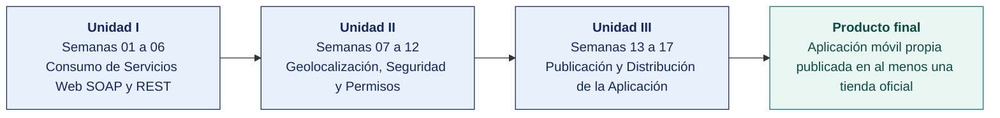

  
  &nbsp;&nbsp;&nbsp;&nbsp;&nbsp;&nbsp;
  

  <strong>Universidad Privada de Tacna</strong> 
  Facultad de Ingeniería · Escuela Profesional de Ingeniería de Sistemas 
  Tacna, Perú

<h1 align="center">SI-988 · Soluciones Móviles II</h1>

---

## Docente del curso

| | |
|---|---|
| **Nombre** | Dr. Oscar Juan Jimenez Flores |
| **Correo institucional** | [oscarjimenezflores@upt.pe](mailto:oscarjimenezflores@upt.pe) |
| **Escuela** | Escuela Profesional de Ingeniería de Sistemas · Facultad de Ingeniería |
| **Perfil profesional** | [LinkedIn](https://www.linkedin.com/in/oscar-jimenez-flores/) |
| **Perfil de investigación** | [CTI Vitae — CONCYTEC](https://ctivitae.concytec.gob.pe/appDirectorioCTI/VerDatosInvestigador.do?id_investigador=33398) |

Escribe al correo institucional para consultas del curso. Indica en el asunto la sigla de la asignatura y el número de semana, para que la respuesta llegue antes.

## Datos generales de la asignatura

| | |
|---|---|
| **Asignatura** | SI-988 · Soluciones Móviles II |
| **Ciclo** | IX |
| **Horas semanales** | 04 horas académicas de 50 min · 2 en aula: teoría 60 + dinámica 35 + cierre 5 · 2 en laboratorio: taller 60 + avance asistido 40 |
| **Créditos** | 04 |
| **Tipo** | Electivo |
| **Prerrequisito** | SI-883 Soluciones Móviles I |
| **Área curricular** | Ingeniería de Software |
| **Duración** | 17 semanas, organizadas en 3 unidades |
| **Unidades** | **I** Consumo de Servicios Web SOAP y REST · **II** Geolocalización, Seguridad y Permisos · **III** Publicación y Distribución de la Aplicación |
| **Producto final** | Aplicación móvil propia publicada en al menos una tienda oficial |

## En este documento

1. [Docente del curso](#docente-del-curso)
2. [Datos generales de la asignatura](#datos-generales-de-la-asignatura)
3. [Competencia de la asignatura](#competencia-de-la-asignatura)
4. [Idea rectora del curso](#idea-rectora-del-curso)
5. [Cómo avanza el curso](#cómo-avanza-el-curso)
6. [Índice de semanas](#índice-de-semanas)
7. [Qué contiene cada semana](#qué-contiene-cada-semana)
8. [Cómo se entregan los trabajos](#cómo-se-entregan-los-trabajos)
9. [Plan de evaluación](#plan-de-evaluación)
10. [Herramientas del curso](#herramientas-del-curso)
11. [Glosario técnico](#glosario-técnico)
12. [Bibliografía y fuentes del curso](#bibliografía-y-fuentes-del-curso)

## Competencia de la asignatura

> Diseña e implementa aplicaciones móviles para resolver un problema de un dominio de aplicación.
>
> **Evidencia.** Proyecto de aplicación móvil.

## Idea rectora del curso

El curso no enseña una tecnología, dirige un producto. Cada equipo propone su **propia aplicación móvil**, elige su stack con criterio técnico documentado y la construye con Scrum real hasta publicarla en Google Play y en la App Store.

En la **Unidad I** quedan definidos el producto, la arquitectura y la capa de datos, y se cierra el primer sprint. En la **Unidad II** se desarrolla el grueso de la aplicación con geolocalización, permisos, datos sensibles, cifrado y autenticación. En la **Unidad III** se cierra el producto, se prueba, se firma y se publica.

El equipo elige las tecnologías. Lo que el curso exige no es un framework concreto, sino que la elección esté justificada, medida y documentada.

## Cómo avanza el curso

## Índice de semanas

Cada semana es una carpeta con cuatro documentos — la portada, la teoría de la sesión de aula, la dinámica de aula evaluada como nota cognitiva y la guía del taller de laboratorio.

### Unidad I — Consumo de Servicios Web SOAP y REST

| Semana | Tema | Teoría | Dinámica | Taller |
|---|---|---|---|---|
| **[01](SEMANA-01/)** | Introducción al desarrollo de aplicaciones móviles | [Teoría](SEMANA-01/1-TEORIA.md) | [Dinámica](SEMANA-01/2-DINAMICA.md) | [Taller](SEMANA-01/3-TALLER.md) |
| **[02](SEMANA-02/)** | Arquitectura de Aplicaciones Móviles | [Teoría](SEMANA-02/1-TEORIA.md) | [Dinámica](SEMANA-02/2-DINAMICA.md) | [Taller](SEMANA-02/3-TALLER.md) |
| **[03](SEMANA-03/)** | Metodologías Ágiles en el Desarrollo Móvil · Scrum y Kanban | [Teoría](SEMANA-03/1-TEORIA.md) | [Dinámica](SEMANA-03/2-DINAMICA.md) | [Taller](SEMANA-03/3-TALLER.md) |
| **[04](SEMANA-04/)** | Consumo de Servicios Web REST | [Teoría](SEMANA-04/1-TEORIA.md) | [Dinámica](SEMANA-04/2-DINAMICA.md) | [Taller](SEMANA-04/3-TALLER.md) |
| **[05](SEMANA-05/)** | Diferencias entre SOAP y REST | [Teoría](SEMANA-05/1-TEORIA.md) | [Dinámica](SEMANA-05/2-DINAMICA.md) | [Taller](SEMANA-05/3-TALLER.md) |
| **[06](SEMANA-06/)** | Manejo de Datos en Formato JSON · Sprint 1 Review y Retrospective · Examen de Unidad I | [Teoría](SEMANA-06/1-TEORIA.md) | [Dinámica](SEMANA-06/2-DINAMICA.md) | [Taller](SEMANA-06/3-TALLER.md) |

### Unidad II — Geolocalización, Seguridad y Permisos

| Semana | Tema | Teoría | Dinámica | Taller |
|---|---|---|---|---|
| **[07](SEMANA-07/)** | Geolocalización en Aplicaciones Móviles | [Teoría](SEMANA-07/1-TEORIA.md) | [Dinámica](SEMANA-07/2-DINAMICA.md) | [Taller](SEMANA-07/3-TALLER.md) |
| **[08](SEMANA-08/)** | Permisos en Aplicaciones Móviles | [Teoría](SEMANA-08/1-TEORIA.md) | [Dinámica](SEMANA-08/2-DINAMICA.md) | [Taller](SEMANA-08/3-TALLER.md) |
| **[09](SEMANA-09/)** | Manejo de Datos Sensibles · Privacidad por Diseño | [Teoría](SEMANA-09/1-TEORIA.md) | [Dinámica](SEMANA-09/2-DINAMICA.md) | [Taller](SEMANA-09/3-TALLER.md) |
| **[10](SEMANA-10/)** | Seguridad en Aplicaciones Móviles · Cifrado y Almacenamiento Seguro | [Teoría](SEMANA-10/1-TEORIA.md) | [Dinámica](SEMANA-10/2-DINAMICA.md) | [Taller](SEMANA-10/3-TALLER.md) |
| **[11](SEMANA-11/)** | Control de Acceso y Autenticación en Apps Móviles | [Teoría](SEMANA-11/1-TEORIA.md) | [Dinámica](SEMANA-11/2-DINAMICA.md) | [Taller](SEMANA-11/3-TALLER.md) |
| **[12](SEMANA-12/)** | Seguridad en Conexiones API · Sprint 4 Review · Examen de Unidad II | [Teoría](SEMANA-12/1-TEORIA.md) | [Dinámica](SEMANA-12/2-DINAMICA.md) | [Taller](SEMANA-12/3-TALLER.md) |

### Unidad III — Publicación y Distribución de la Aplicación

| Semana | Tema | Teoría | Dinámica | Taller |
|---|---|---|---|---|
| **[13](SEMANA-13/)** | Frameworks de Desarrollo Multiplataforma | [Teoría](SEMANA-13/1-TEORIA.md) | [Dinámica](SEMANA-13/2-DINAMICA.md) | [Taller](SEMANA-13/3-TALLER.md) |
| **[14](SEMANA-14/)** | Diseño de Interfaces Adaptativas | [Teoría](SEMANA-14/1-TEORIA.md) | [Dinámica](SEMANA-14/2-DINAMICA.md) | [Taller](SEMANA-14/3-TALLER.md) |
| **[15](SEMANA-15/)** | Testing Multiplataforma | [Teoría](SEMANA-15/1-TEORIA.md) | [Dinámica](SEMANA-15/2-DINAMICA.md) | [Taller](SEMANA-15/3-TALLER.md) |
| **[16](SEMANA-16/)** | Despliegue y Publicación en Google Play y App Store | [Teoría](SEMANA-16/1-TEORIA.md) | [Dinámica](SEMANA-16/2-DINAMICA.md) | [Taller](SEMANA-16/3-TALLER.md) |
| **[17](SEMANA-17/)** | Presentación del Proyecto Final · Examen de Unidad III · Cierre del Curso | [Teoría](SEMANA-17/1-TEORIA.md) | [Dinámica](SEMANA-17/2-DINAMICA.md) | [Taller](SEMANA-17/3-TALLER.md) |

## Qué contiene cada semana

| Documento | Para qué sirve | Cuándo se usa |
|---|---|---|
| `README.md` | Portada de la semana con los datos de la asignatura, la ruta de trabajo, los entregables y la forma de evaluación | Antes de la clase |
| `1-TEORIA.md` | Desarrollo conceptual de la sesión de aula, con el mapa de la sesión y las fuentes citadas | Sesión 1, en aula |
| `2-DINAMICA.md` | Actividad en equipo con su consigna, su producto y su rúbrica, evaluada como nota cognitiva | Sesión 1, dentro de los 100 min |
| `3-TALLER.md` | Guía de laboratorio en formato EPIS, evaluada como nota procedimental | Sesión 2, en laboratorio |

## Qué construye el equipo y cuándo

La app es del equipo de principio a fin. Los talleres no imponen qué construir. Enseñan **la técnica** y el equipo la aplica **a su propio dominio**. Cuando un taller muestra una entidad `Producto` o un endpoint `/items`, es un marcador de posición. El equipo lo sustituye por su entidad y su endpoint.

| Semana | El taller construye | Lo decide |
|---|---|---|
| **01** | Entorno, equipo Scrum, Lean Canvas, repositorio | **El equipo** — qué app, para quién, con qué stack |
| **02** | Esqueleto por capas y ADR | **El equipo**: arquitectura y gestión de estado |
| **03** | Product Goal, Product Backlog y Sprint 1 | **El equipo** — sus 25+ historias, su orden, sus criterios |
| **04** | Capa de datos de su app | **El equipo**: su contrato de API y sus entidades |
| **05** | *Ejercicio sobre un servicio SOAP provisto* | Única semana que no toca la app. Ver el aviso del taller |
| **06** | Serialización y persistencia de su app | **El equipo**: qué se guarda y con qué estrategia |
| **07–12** | Ubicación, permisos, privacidad, cifrado, autenticación, TLS **de su app** | **El equipo** — qué permisos necesita, qué datos trata, cómo los protege |
| **13–16** | Evaluación del stack, interfaz adaptativa, pruebas, publicación **de su app** | **El equipo** — su ficha de tienda, su cobertura, su release |
| **17** | Cierre, documentación y sustentación | **El equipo** |

**Dieciséis de los diecisiete talleres construyen la app del equipo.** Solo la Semana 05 trabaja sobre un servicio provisto, y el taller lo declara al inicio con su razón.

### Dónde entra el trabajo libre del sprint

El taller cubre la parte técnica difícil de cada capa, con el docente presente. Las historias restantes del sprint son trabajo del equipo:

| Momento | Duración | Qué se hace |
|---|---|---|
| Laboratorio · taller guiado | 60 min | La técnica de la semana, aplicada a la app del equipo |
| Laboratorio · avance de sprint | 40 min | **Las historias del backlog propio**, con el docente disponible para consultas |
| Fuera de sesión | Según el equipo | Lo que el sprint requiera. Se registra en GitHub Projects |

Los 40 minutos de avance asistido son el espacio donde el equipo trabaja **su** backlog y puede consultar. El docente no dirige ese tramo. Observa, responde y toma nota de la contribución individual de cada integrante, que se valora en las exposiciones de avance de las Semanas 06 y 12.

## Cómo se elige la app y la tecnología

**La app la propone el equipo.** No se asigna. Pero nadie arranca frente a una hoja en blanco — el [catálogo de dominios](CATALOGO-APPS/README.md) trae **diez ejemplos desarrollados** —problema, segmento, por qué tiene que ser una app, alcance de cinco sprints, datos personales, permisos, contrato de API y un backlog semilla de 25 historias cada uno—. Sirven de referencia de profundidad; entregarlos tal cual, no.

**La tecnología también la elige el equipo**, entre dos stacks. Cada taller tiene su versión para cada una.

| Stack | Guía de arranque |
|---|---|
| **Flutter** | [Guía práctica · Flutter con Google Antigravity](GUIAS/GUIA-ANTIGRAVITY-FLUTTER.md) |
| **Kotlin Multiplatform** | [Guía práctica · KMP con Google Antigravity](GUIAS/GUIA-ANTIGRAVITY-KOTLIN.md) |

Las dos guías llevan de cero a una app corriendo en el emulador, e incluyen cómo **dirigir a un agente de código** y, sobre todo, cómo rechazar lo que produce mal. La elección de la Semana 01 es **provisional**. En la Semana 13 se somete a evaluación con datos medidos del propio proyecto en el `ADR-004`.

> **El tablero es GitHub Projects, obligatorio.** Es donde el docente sigue el avance del equipo y la contribución de cada integrante durante las 17 semanas. Cada historia se asigna a una persona y se vincula a su rama y a su Pull Request.

## Cómo se entregan los trabajos

Todo trabajo del curso se entrega en **PDF**, con la carátula de la UPT y los códigos de todos los integrantes. Las dos plantillas son obligatorias. Se llenan en Word y se exportan a PDF.

| Plantilla | Para qué | Nombre del archivo que entregas |
|---|---|---|
| [Dinámica de aula](PLANTILLAS/SI988-PLANTILLA-DINAMICA.docx) | Lo que el grupo resolvió en la sesión de aula | `SI988-S<NN>-DINAMICA-Grupo<N>.pdf` |
| [Taller de laboratorio](PLANTILLAS/SI988-PLANTILLA-TALLER.docx) | El informe del taller, en formato EPIS | `SI988-S<NN>-TALLER-Grupo<N>.pdf` |

Las reglas completas de entrega están en [`PLANTILLAS/`](PLANTILLAS/).

## Plan de evaluación

| Criterio | Peso en la unidad | De dónde sale |
|---|---|---|
| Cognitivo | 25 % | Dinámica de aula, su producto y la exposición del equipo |
| Procedimental | 35 % | Guía de laboratorio y sus entregables verificables |
| Actitudinal | 15 % | Participación, puntualidad y trabajo en equipo |
| Examen de unidad | 25 % | **Teórico** (40 min en aula, alternativas) y **práctico** (100 min en laboratorio, sobre los productos de los talleres, con IA permitida) |

Peso de cada unidad en la nota del curso. **Unidad I 25 %**, **Unidad II 35 %** y **Unidad III 40 %**.

## Herramientas del curso

Todas son libres, gratuitas o de uso académico sin costo. El requisito base del laboratorio es Docker con permisos de administrador, Git y un navegador actualizado.

| Recurso | Detalle y enlace | Semanas |
|---|---|---|
| **Guía de arquitectura de Android** | https://developer.android.com/topic/architecture | 02 |
| **Apple — App architecture** | https://developer.apple.com/documentation/swiftui/model-data | 02 |
| **Flutter — Architectural overview** | https://docs.flutter.dev/resources/architectural-overview | 02 |
| Herramientas de prueba del stack elegido | JUnit · XCTest · flutter_test · Jest | 02 |
| **Mermaid** o draw.io | Diagrama de arquitectura | 02 |
| **Scrum Guide 2020** | https://scrumguides.org/ · versión en español en https://scrumguides.org/download.html | 03, 06 |
| **GitHub Projects** | Tablero Scrum y backlog del equipo. **Obligatorio** — https://docs.github.com/issues/planning-and-tracking-with-projects | 01–17 |
| **Planning Poker** | Cartas físicas o https://planningpokeronline.com/ | 03 |
| Visión de producto y Lean Canvas | Semana 01 | 03 |
| ADR-001 y ADR-002 | Semana 02 | 03 |
| **Mermaid** | Diagrama del flujo de trabajo | 03, 17 |
| **RFC 9110 · HTTP Semantics** | https://www.rfc-editor.org/rfc/rfc9110.html | 04 |
| **OpenAPI Specification** | https://spec.openapis.org/oas/latest.html | 04 |
| **Swagger Editor** | https://editor.swagger.io/ | 04 |
| Cliente HTTP del stack | Retrofit + OkHttp · Dio · URLSession · Axios | 04 |
| Persistencia local | Room · SwiftData · Drift · WatermelonDB | 04 |
| **json-server** o **WireMock** | Backend simulado y servidor de pruebas | 04 |
| **mitmproxy** | https://docs.mitmproxy.org/ | 04, 05, 09, 12 |
| **Postman** o **Bruno** | Prueba manual de los endpoints | 04 |
| **W3C SOAP 1.2** | https://www.w3.org/TR/soap12-part1/ | 05 |
| **W3C WSDL 2.0** | https://www.w3.org/TR/wsdl20/ | 05 |
| **W3C XML Schema** | https://www.w3.org/TR/xmlschema11-1/ | 05 |
| Servicio SOAP público con WSDL | Servicios de prueba abiertos, o el del caso de la organización | 05 |
| **SoapUI** o **Postman** | Exploración del WSDL y prueba de operaciones | 05 |
| **FastAPI** o **Express** | Implementación del BFF | 05 |
| **zeep** (Python) o equivalente | Cliente SOAP del BFF | 05 |
| **RFC 8259 · JSON** | https://www.rfc-editor.org/rfc/rfc8259.html | 06 |
| **ISO 8601** — formato de fecha y hora | Referencia normativa | 06 |
| Serialización del stack | kotlinx.serialization · Codable · json_serializable · Zod | 06 |
| Persistencia del stack | Room · SwiftData · Drift · WatermelonDB | 06 |
| Interesados invitados | Al menos **dos personas externas al equipo** para la Review | 06 |
| **Android — Location** | https://developer.android.com/develop/sensors-and-location/location | 07 |
| **Apple — Core Location** | https://developer.apple.com/documentation/corelocation | 07 |
| **MapLibre** | https://maplibre.org/ | 07 |
| **OpenStreetMap** y su política de uso de teselas | https://www.openstreetmap.org/ · https://operations.osmfoundation.org/policies/tiles/ | 07 |
| **Nominatim** (geocodificación) y su política de uso | https://nominatim.org/release-docs/latest/api/Overview/ | 07 |
| Emulador con ubicación simulada | Se define en Android Studio limitando RAM y núcleos. Es el patrón de medición del laboratorio | 07, 12, 13 |
| Herramienta de perfilado de batería | Android Studio Energy Profiler · Xcode Instruments | 07 |
| **Android — Permissions overview** | https://developer.android.com/guide/topics/permissions/overview | 08 |
| **Android — Request location permissions** | https://developer.android.com/develop/sensors-and-location/location/permissions | 08 |
| **Apple — Requesting authorization to use location services** | https://developer.apple.com/documentation/corelocation/requesting-authorization-to-use-location-services | 08 |
| **Apple — Protecting the user's privacy** | https://developer.apple.com/documentation/uikit/protecting-the-user-s-privacy | 08 |
| **Google Play — Location permissions policy** | https://support.google.com/googleplay/android-developer/answer/9799150 | 08 |
| Emulador de Android | Entorno del laboratorio. Reproduce cinco de los ocho escenarios de permiso | 08 |
| Biblioteca de permisos del stack | permission_handler · react-native-permissions · Accompanist Permissions | 08 |
| **Ley 29733** y **D. S. 016-2024-JUS** | https://www.gob.pe/institucion/anpd | 09 |
| **RGPD** | https://gdpr-info.eu/ | 09 |
| **OWASP MASVS-PRIVACY** | https://mas.owasp.org/MASVS/ | 09 |
| **Google Play — Data safety** | https://support.google.com/googleplay/android-developer/answer/10787469 | 09 |
| **Apple — App privacy details** | https://developer.apple.com/app-store/app-privacy-details/ | 09 |
| **MobSF** (Docker) | Análisis estático del artefacto: https://mobsf.github.io/docs/ | 09, 10 |
| GitHub Pages o similar | Publicación de la política de privacidad | 09 |
| **OWASP MASVS** | https://mas.owasp.org/MASVS/ | 10 |
| **OWASP MASTG** | https://mas.owasp.org/MASTG/ | 10 |
| **Android Keystore** | https://developer.android.com/privacy-and-security/keystore | 10 |
| **Apple Keychain Services** | https://developer.apple.com/documentation/security/keychain-services | 10 |
| **SQLCipher** o el cifrado nativo del stack | Cifrado de la base local | 10 |
| `adb` / herramientas de dispositivo | Extracción del almacenamiento | 10 |
| Bibliotecas de almacenamiento seguro | EncryptedSharedPreferences · flutter_secure_storage · react-native-keychain | 10 |
| **RFC 6749 · OAuth 2.0** | https://www.rfc-editor.org/rfc/rfc6749.html | 11 |
| **RFC 7636 · PKCE** | https://www.rfc-editor.org/rfc/rfc7636.html | 11 |
| **RFC 8252 · OAuth 2.0 for Native Apps** | https://www.rfc-editor.org/rfc/rfc8252.html | 11 |
| **OpenID Connect Core** | https://openid.net/specs/openid-connect-core-1_0.html | 11 |
| **Android — Biometric authentication** | https://developer.android.com/identity/sign-in/biometric-auth | 11 |
| **Apple — Local Authentication** | https://developer.apple.com/documentation/localauthentication | 11 |
| Proveedor de identidad | **Keycloak** (Docker), Auth0, Supabase Auth o el backend propio | 11 |
| Bibliotecas de OAuth del stack | AppAuth · flutter_appauth · react-native-app-auth | 11 |
| **Android — Network security configuration** | https://developer.android.com/privacy-and-security/security-config | 12 |
| **Apple — Preventing insecure network connections** | https://developer.apple.com/documentation/security/preventing-insecure-network-connections | 12 |
| **OWASP MASVS-NETWORK** | https://mas.owasp.org/MASVS/ | 12 |
| **openssl** | Extracción del resumen de la clave pública | 12 |
| **SSL Labs** o equivalente | Evaluación de la configuración TLS del backend | 12 |
| **Android Studio Profiler** | Memoria, CPU, energía y fluidez | 13 |
| **Xcode Instruments** | Equivalente en iOS | 13 |
| **Google Play Console** | https://play.google.com/console | 13, 14, 16 |
| **Apple Developer Program** | https://developer.apple.com/programs/ | 13 |
| **App testing requirements** (Google Play) | https://support.google.com/googleplay/android-developer/answer/14151465 | 13, 16 |
| Documentación del framework elegido | Guías oficiales de rendimiento | 13 |
| **Android — Adaptive layouts** | https://developer.android.com/develop/ui/compose/layouts/adaptive | 14 |
| **Material Design 3 — Layout** | https://m3.material.io/foundations/layout/understanding-layout | 14 |
| **Apple — Human Interface Guidelines** | https://developer.apple.com/design/human-interface-guidelines/layout | 14 |
| **WCAG 2.2** | https://www.w3.org/TR/WCAG22/ | 14 |
| **Android — Accessibility** | https://developer.android.com/guide/topics/ui/accessibility | 14 |
| **Apple — Accessibility** | https://developer.apple.com/accessibility/ | 14 |
| **Accessibility Scanner** (Android) | Auditoría automatizada | 14 |
| **Accessibility Inspector** (Xcode) | Auditoría en iOS | 14 |
| **Android — Test apps on Android** | https://developer.android.com/training/testing | 15 |
| **Apple — Testing** | https://developer.apple.com/documentation/xcode/testing | 15 |
| **Flutter — Testing** | https://docs.flutter.dev/testing | 15 |
| Marcos de prueba del stack | JUnit · XCTest · flutter_test · Jest | 15 |
| Extremo a extremo | **Maestro** · Detox · Espresso · XCUITest | 15 |
| Cobertura | JaCoCo · `xccov` · `lcov` | 15 |
| Servidor simulado | MockWebServer · WireMock · `http_mock_adapter` | 15 |
| CI | GitHub Actions o GitLab CI | 15 |
| **App Store Connect** | https://appstoreconnect.apple.com | 16 |
| **Target API level requirements** | https://support.google.com/googleplay/android-developer/answer/11926878 | 16 |
| **App Store Review Guidelines** | https://developer.apple.com/app-store/review/guidelines/ | 16 |
| **Play App Signing** | https://support.google.com/googleplay/android-developer/answer/9842756 | 16 |
| Figma o herramienta de diseño | Capturas con texto superpuesto | 16 |
| **Google Play Console** y **App Store Connect** | Estado de la revisión y retroalimentación | 17 |
| **Python 3.11+** con `pandas`, `matplotlib` | Consolidación de métricas | 17 |
| **Markdown** y **Pandoc** | Documentación de traspaso | 17 |

## Glosario técnico

Todo término, sigla y norma que aparece en el curso está definido en el [**glosario técnico**](GLOSARIO.md). Los términos en inglés se conservan cuando así se usan en el trabajo profesional. Es como se encuentran en la documentación y en el código.

## Bibliografía y fuentes del curso

Reunidas de las guías de laboratorio de las 17 semanas. Son normas técnicas, marcos profesionales y bibliografía indexada.

- Anderson, D. J. (2010). *Kanban: Successful Evolutionary Change for Your Technology Business*. Blue Hole Press.
- Apple. *Accessibility on iOS*. https://developer.apple.com/accessibility/
- Apple. *Apple Developer — Xcode*. https://developer.apple.com/xcode/
- Apple. *App privacy details on the App Store*. https://developer.apple.com/app-store/app-privacy-details/
- Apple. *App Store Connect Help*. https://developer.apple.com/help/app-store-connect/
- Apple. *App Store Review Guidelines* — sección de privacidad. https://developer.apple.com/app-store/review/guidelines/
- Apple. *Core Location*. https://developer.apple.com/documentation/corelocation
- Apple. *Distributing your app for beta testing and releases*. https://developer.apple.com/documentation/xcode/distributing-your-app-for-beta-testing-and-releases
- Apple. *Human Interface Guidelines — Layout*. https://developer.apple.com/design/human-interface-guidelines/layout
- Apple. *Identity pinning: How to configura server certificates for your app*. https://developer.apple.com/news/?id=g9ejcf8y
- Apple. *Improving your app's performance*. https://developer.apple.com/documentation/xcode/improving-your-app-s-performance
- Apple. *Keychain services*. https://developer.apple.com/documentation/security/keychain-services
- Apple. *Local Authentication*. https://developer.apple.com/documentation/localauthentication
- Apple. *Managing model data in your app*. https://developer.apple.com/documentation/swiftui/model-data
- Apple. *Monitoring the user's proximity to geographic regions*. https://developer.apple.com/documentation/corelocation/monitoring-the-user-s-proximity-to-geographic-regions
- Apple. *Preventing insecure network connections*. https://developer.apple.com/documentation/security/preventing-insecure-network-connections
- Apple. *Protecting the user's privacy*. https://developer.apple.com/documentation/uikit/protecting-the-user-s-privacy
- Apple. *Requesting authorization to usa location services*. https://developer.apple.com/documentation/corelocation/requesting-authorization-to-usa-location-services
- Apple. *Restricting keychain item accessibility*. https://developer.apple.com/documentation/security/restricting-keychain-item-accessibility
- Apple. *SwiftData*. https://developer.apple.com/documentation/swiftdata
- Apple. *TestFlight*. https://developer.apple.com/testflight/
- Apple. *Testing* y *XCTest*. https://developer.apple.com/documentation/xctest
- Apple. *URLSession*. https://developer.apple.com/documentation/foundation/urlsession
- Autoridad Nacional de Protección de Datos Personales. https://www.gob.pe/institucion/anpd
- AWS. *Diferencia entre SOAP y REST*. https://aws.amazon.com/es/compare/the-difference-between-soap-rest/
- Beck, K. (2002). *Test-Driven Development: By Example*. Addison-Wesley.
- Canosa Ferreiro, A. J. (2024). *SCRUM: Teoría e implementación práctica*. Ra-Ma.
- Capel Tuñón, M. I. (2016). *Desarrollo de software y sistemas basados en componentes y servicios*. Garceta. https://www.alphaeditorialcloud.com/
- Cavoukian, A. *Privacy by Design: The 7 Foundational Principles*. https://iapp.org/resources/article/privacy-by-design-the-7-foundational-principles/
- Chopra, D. D. y Khurana, R. (2023). *Flutter and Dart: Up and Running*. BPB Publications.
- Cohn, M. (2004). *User Stories Applied: For Agile Software Development*. Addison-Wesley. — criterios INVEST.
- Conventional Commits. *Specification v1.0.0*. https://www.conventionalcommits.org/
- Cucumber. *Gherkin Reference*. https://cucumber.io/docs/gherkin/reference/
- Daigneau, R. (2012). *Service Design Patterns: Fundamental Design Solutions for SOAP/WSDL and RESTful Web Services*. Addison-Wesley.
- Decreto Supremo 016-2024-JUS, Reglamento de la Ley 29733, vigente. https://www.gob.pe/institucion/anpd
- Derby, E. y Larsen, D. (2006). *Agile Retrospectives: Making Good Teams Great*. Pragmatic Bookshelf. — directiva primaria.
- ECMA International. *ECMA-404 · The JSON Data Interchange Syntax*. https://ecma-international.org/publications-and-standards/standards/ecma-404/
- Fielding, R. T. (2000). *Architectural Styles and the Design of Network-based Software Architectures* — capítulo 5, REST. https://ics.uci.edu/~fielding/pubs/dissertation/rest_arch_style.htm
- Flutter. *Architectural overview* y *State management*. https://docs.flutter.dev/resources/architectural-overview
- Flutter. *Flutter documentation* y *Performance best practices*. https://docs.flutter.dev/perf
- Flutter. *Testing Flutter apps*. https://docs.flutter.dev/testing
- Fowler, M. *Patterns of Enterprise Application Architecture* — Model-View-Controller y Presentation Model. https://martinfowler.com/eaaCatalog/
- Fowler, M. *Test Double*. https://martinfowler.com/bliki/TestDouble.html
- Fowler, M. *Test Pyramid*. https://martinfowler.com/bliki/TestPyramid.html
- Google. *About Android App Bundles*. https://developer.android.com/guide/app-bundle
- Google. *Android Developers — Get started*. https://developer.android.com/get-started
- Google. *Android Keystore system*. https://developer.android.com/privacy-and-security/keystore
- Google. *Android privacy best practices*. https://developer.android.com/privacy-and-security/best-practices
- Google. *App architecture: UI layer* y *Data layer*. https://developer.android.com/topic/architecture/ui-layer
- Google. *App startup time*. https://developer.android.com/topic/performance/vitals/launch-time
- Google. *Biometric security levels*. https://source.android.com/docs/security/features/biometric
- Google. *Build adaptive layouts*. https://developer.android.com/develop/ui/compose/layouts/adaptive
- Google. *Build an offline-first app*. https://developer.android.com/topic/architecture/data-layer/offline-first
- Google. *Build location-aware apps* y *Location strategies*. https://developer.android.com/develop/sensors-and-location/location
- Google Cloud. *REST API guide*. https://cloud.google.com/service-catalog/docs/rest-api-guide?hl=es-419
- Google. *Create and monitor geofences*. https://developer.android.com/develop/sensors-and-location/location/geofencing
- Google. *Espresso* y *UI Automator*. https://developer.android.com/training/testing/espresso
- Google. *Guide to app architecture*. https://developer.android.com/topic/architecture
- Google. *Learn about foldables*. https://developer.android.com/guide/topics/large-screens/learn-about-foldables
- Google. *Make apps more accessible*. https://developer.android.com/guide/topics/ui/accessibility/apps
- Google. *Network security configuration*. https://developer.android.com/privacy-and-security/security-config
- Google. *Offline-first apps*. https://developer.android.com/topic/architecture/data-layer/offline-first
- Google. *Permissions on Android*. https://developer.android.com/guide/topics/permissions/overview
- Google Play. *App testing requirements for new personal developer accounts*. https://support.google.com/googleplay/android-developer/answer/14151465
- Google Play. *Developer Program Policy*. https://play.google.com/about/developer-content-policy/
- Google Play. *Location permissions policy*. https://support.google.com/googleplay/android-developer/answer/9799150
- Google Play. *Provide information for Google Play's Data safety section*. https://support.google.com/googleplay/android-developer/answer/10787469
- Google Play. *Publish your app*. https://support.google.com/googleplay/android-developer/answer/9859152
- Google Play. *Target API level requirements for Google Play apps*. https://support.google.com/googleplay/android-developer/answer/11926878
- Google Play. *Use Play App Signing*. https://support.google.com/googleplay/android-developer/answer/9842756
- Google. *Request location permissions*. https://developer.android.com/develop/sensors-and-location/location/permissions
- Google. *Request runtime permissions*. https://developer.android.com/training/permissions/requesting
- Google. *Save data in a local database using Room*. https://developer.android.com/training/data-storage/room
- Google. *Security best practices*. https://developer.android.com/privacy-and-security/security-tips
- Google. *Security with HTTPS and SSL*. https://developer.android.com/privacy-and-security/security-ssl
- Google. *Show a biometric authentication dialog*. https://developer.android.com/identity/sign-in/biometric-auth
- Google. *Shrink, obfuscate, and optimize your app*. https://developer.android.com/build/shrink-code
- Google. *Sign your app*. https://developer.android.com/studio/publish/app-signing
- Google. *Slow rendering*. https://developer.android.com/topic/performance/vitals/render
- Google. *Support different screen sizes*. https://developer.android.com/develop/ui/views/layout/screen-compatibility
- Google. *Test apps on Android* y *Fundamentals of testing*. https://developer.android.com/training/testing/fundamentals
- Google. *Test doubles in Android*. https://developer.android.com/training/testing/fundamentals/test-doubles
- IETF. *RFC 3339 · Date and Time on the Internet: Timestamps*. https://www.rfc-editor.org/rfc/rfc3339.html
- IETF. *RFC 6749 · The OAuth 2.0 Authorization Framework*. https://www.rfc-editor.org/rfc/rfc6749.html
- IETF. *RFC 7636 · Proof Key for Code Exchange by OAuth Public Clients*. https://www.rfc-editor.org/rfc/rfc7636.html
- IETF. *RFC 8252 · OAuth 2.0 for Native Apps*. https://www.rfc-editor.org/rfc/rfc8252.html
- IETF. *RFC 8259 · The JavaScript Object Notation (JSON) Data Interchange Format*. https://www.rfc-editor.org/rfc/rfc8259.html
- IETF. *RFC 8446 · The Transport Layer Security (TLS) Protocol Version 1.3*. https://www.rfc-editor.org/rfc/rfc8446.html
- IETF. *RFC 9110 · HTTP Semantics*. https://www.rfc-editor.org/rfc/rfc9110.html
- IETF. *RFC 9111 · HTTP Caching*. https://www.rfc-editor.org/rfc/rfc9111.html
- IETF. *RFC 9700 · Best Current Practice for OAuth 2.0 Security*. https://www.rfc-editor.org/rfc/rfc9700.html
- JetBrains. *Kotlin Multiplatform documentation*. https://kotlinlang.org/docs/multiplatform.html
- Keycloak. *Server Administration Guide*. https://www.keycloak.org/documentation
- Kotlin. *kotlinx.serialization guide*. https://github.com/Kotlin/kotlinx.serialization/blob/master/docs/serialization-guide.md
- Lasa Gómez, C., Álvarez García, A. y De las Heras del Dedo, R. (2017). *Manual imprescindible de métodos ágiles: Scrum, Kanban y Lean*. Anaya Multimedia.
- Lee, G. (2012). *Test-Driven iOS Development*. Addison-Wesley.
- Leiva, A. (2019). *Kotlin for Android Developers*. Leanpub.
- Ley 29733, Ley de Protección de Datos Personales (Perú). https://www.gob.pe/institucion/congreso-de-la-republica/normas-legales/243470-29733
- Ley 30096, Ley de Delitos Informáticos — límites de la auditoría sobre dispositivos ajenos.
- Maestro. *Documentation*. https://maestro.mobile.dev/
- MapLibre. *MapLibre Native documentation*. https://maplibre.org/maplibre-native/
- Martin, R. C. (2017). *Clean Architecture: A Craftsman's Guide to Software Structure and Design*. Prentice Hall.
- Material Design. *Understanding layout*. https://m3.material.io/foundations/layout/understanding-layout
- Maurya, A. (2012). *Running Lean: Iterate from Plan A to a Plan That Works* (2.ª ed.). O'Reilly. — Lean Canvas.
- Meta. *React Native documentation* y *Performance*. https://reactnative.dev/docs/performance
- Microsoft. *Azure REST API reference*. https://learn.microsoft.com/en-us/rest/api/azure/
- Microsoft. *.NET MAUI documentation*. https://learn.microsoft.com/dotnet/maui/
- mitmproxy. *Documentation*. https://docs.mitmproxy.org/
- MobSF. *Documentation*. https://mobsf.github.io/docs/
- MobSF. *Mobile Security Framework documentation*. https://mobsf.github.io/docs/
- Newman, S. (2021). *Building Microservices* (2.ª ed.). O'Reilly. — patrón Backend For Frontend.
- NIST. *SP 800-175B · Guideline for Using Cryptographic Standards*. https://csrc.nist.gov/pubs/sp/800/175/b/r1/final
- Nolasco Valenzuela, J. S. (2019). *Desarrollo de aplicaciones con Android*. Ra-Ma.
- Nominatim. *Usage Policy*. https://operations.osmfoundation.org/policies/nominatim/
- Nygard, M. (2018). *Release It!* (2.ª ed.). Pragmatic Bookshelf. — runbooks y operación.
- Nygard, M. *Documenting Architecture Decisions*. https://cognitect.com/blog/2011/11/15/documenting-architecture-decisions
- OASIS. *Web Services Security: SOAP Message Security*. https://www.oasis-open.org/standards/
- OpenAPI Initiative. *OpenAPI Specification*. https://spec.openapis.org/oas/latest.html
- OpenID Foundation. *OpenID Connect Core 1.0*. https://openid.net/specs/openid-connect-core-1_0.html
- OpenStreetMap. *Copyright and License*. https://www.openstreetmap.org/copyright
- OpenStreetMap Foundation. *Tile Usage Policy*. https://operations.osmfoundation.org/policies/tiles/
- OWASP Foundation. *Authentication Cheat Sheet*. https://cheatsheetseries.owasp.org/cheatsheets/Authentication_Cheat_Sheet.html
- OWASP Foundation. *Certificate and Public Key Pinning*. https://owasp.org/www-community/controls/Certificate_and_Public_Key_Pinning
- OWASP Foundation. *Cryptographic Storage Cheat Sheet*. https://cheatsheetseries.owasp.org/cheatsheets/Cryptographic_Storage_Cheat_Sheet.html
- OWASP Foundation. *MASTG — pruebas de privacidad*. https://mas.owasp.org/MASTG/
- OWASP Foundation. *MASVS-PLATFORM* — interacción con la plataforma. https://mas.owasp.org/MASVS/
- OWASP Foundation. *Mobile Application Security Weakness Enumeration (MASWE)*. https://mas.owasp.org/news/2024/07/30/new-maswe/
- OWASP Foundation. *Transport Layer Security Cheat Sheet*. https://cheatsheetseries.owasp.org/cheatsheets/Transport_Layer_Security_Cheat_Sheet.html
- OWASP Foundation. *XML External Entity (XXE) Prevention Cheat Sheet*. https://cheatsheetseries.owasp.org/cheatsheets/XML_External_Entity_Prevention_Cheat_Sheet.html
- Reglamento General de Protección de Datos (UE) 2016/679. https://gdpr-info.eu/
- Sahar, A. (2023). *iOS 17 Programming for Beginners* (8.ª ed.). Packt Publishing.
- Schwaber, K. y Sutherland, J. (2020). *The Scrum Guide* — Sprint Review y Sprint Retrospective. https://scrumguides.org/
- Scrum.org. *La Guía Scrum 2020 en español*. https://www.scrum.org/resources/blog/la-guia-scrum-2020-scrum-guide-2020
- Smyth, N. (2022). *SwiftUI Essentials*. Payload Media.
- Snider, E. y Ortinau, D. (2020). *Mastering Xamarin.Forms App Architecture Techniques* (3.ª ed.). Packt Publishing.
- GitHub. *About Projects*. https://docs.github.com/issues/planning-and-tracking-with-projects/learning-about-projects/about-projects
- W3C. *Mobile Accessibility: How WCAG 2.x and UAAG 2.0 Apply to Mobile*. https://www.w3.org/TR/mobile-accessibility-mapping/
- W3C. *SOAP Version 1.2 Part 1: Messaging Framework*. https://www.w3.org/TR/soap12-part1/
- W3C. *Web Content Accessibility Guidelines (WCAG) 2.2*. https://www.w3.org/TR/WCAG22/
- W3C. *Web Services Description Language (WSDL) 2.0*. https://www.w3.org/TR/wsdl20/
- W3C. *XML Schema 1.1*. https://www.w3.org/TR/xmlschema11-1/
- Wake, B. *INVEST in Good Stories, and SMART Tasks*. https://xp123.com/articles/invest-in-good-stories-and-smart-tasks/
- Zeep. *Python SOAP client documentation*. https://docs.python-zeep.org/

---

**SI-988 · Soluciones Móviles II** · Escuela Profesional de Ingeniería de Sistemas
Universidad Privada de Tacna · Tacna, Perú

Docente · Dr. Oscar Juan Jimenez Flores · [oscarjimenezflores@upt.pe](mailto:oscarjimenezflores@upt.pe)

Material docente de uso académico. Cita la fuente si lo reutilizas.
