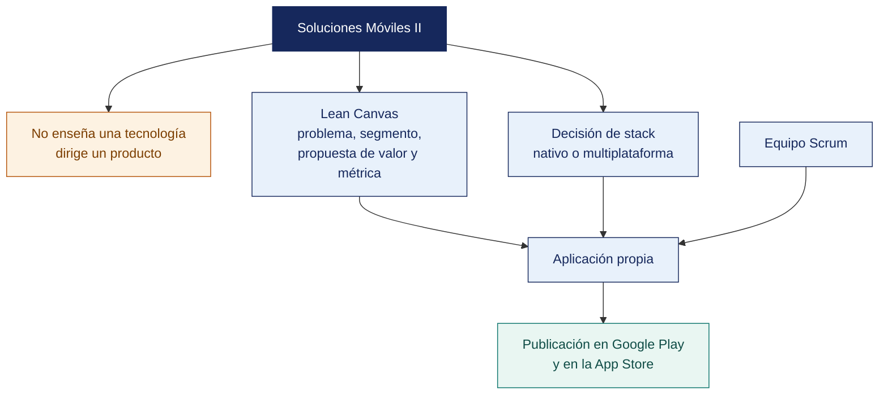

[Semana 01](README.md) · **Teoría** · [Dinámica de aula](2-DINAMICA.md) · [Taller de laboratorio](3-TALLER.md)

# Teoría · Introducción al desarrollo de aplicaciones móviles

**SI-988 · Soluciones Móviles II** · Semana 01 · Sesión 1 en aula · 2 horas académicas, 100 min, con la dinámica incluida

> ¿Un término no le resulta claro? Está definido en el [glosario técnico del curso](../GLOSARIO.md).

---

## La pregunta de esta sesión

Un equipo presenta su idea. Una aplicación para restaurantes, con reservas, reseñas, delivery, cupones, chat y programa de puntos. Está bien pensada y tiene pantallas dibujadas.

Tres preguntas la desarman. Quién la usa exactamente, qué hace hoy esa persona sin la app, y por qué tiene que ser una app y no una página web. La tercera no tiene respuesta.

> **La pregunta que ordena esta sesión.** *¿Qué justifica que una idea sea una aplicación móvil y no una página web?*

## Antes de empezar

| Lo que necesita traer | De dónde sale |
|---|---|
| Programación móvil, una pantalla y su lógica | Soluciones Móviles I |
| Consumo básico de un servicio web | Cursos previos de la carrera |
| Nociones de control de versiones con Git | Cursos previos de la carrera |
| Una idea de producto, aunque esté sin depurar | Trabajo previo del equipo |

> **Exploración (5 min), antes de cualquier definición.** El aula responde antes de la teoría y se anota. *¿Qué le falta a esa idea? ¿Cuántas de las seis funcionalidades caben en cinco sprints? ¿Por qué tendría que ser una app?* No se corrige nada todavía.

## Distribución del tiempo

| Momento | Minutos |
|---|---|
| El caso de la app de restaurantes y la exploración inicial | 8 |
| Prueba de entrada | 8 |
| **Bloque 1.** Qué distingue a Soluciones Móviles II | 8 |
| **Bloque 2.** El panorama técnico y la decisión de stack | 18 |
| **Bloque 3.** La propuesta de valor con el Lean Canvas · con su microaplicación | 10 |
| Encuadre del curso | 8 |
| Cierre, respuesta a la pregunta de la sesión y puente a la dinámica | 5 |
| **Total de la sesión de aula** | **65** |

## Mapa de la sesión

---

## Prueba de entrada

Instrumento diagnóstico de 20 preguntas, sin nota, para calibrar el punto de partida. **Ejes.** Ciclo de vida de una actividad y de un *view controller*, gestión de estado, asincronía y concurrencia, consumo de una API REST, control de versiones con ramas, pruebas unitarias, y firma de una aplicación. El resultado agregado define los refuerzos de las semanas 2 a 4.

## Bloque 1 · Qué distingue a Soluciones Móviles II

> **La pregunta del bloque.** *¿Qué cambia cuando la app tiene que salir a producción?*

**El salto respecto de Soluciones Móviles I.**

| | Soluciones Móviles I | **Soluciones Móviles II** |
|---|---|---|
| Objeto | Aprender a construir una app | **Dirigir un producto hasta la tienda** |
| Alcance | Ejercicios guiados | **App propia, innovadora, con usuarios reales** |
| Tecnología | La que enseña el docente | **La que el equipo elige y justifica** |
| Arquitectura | Suficiente para que funcione | **Decidida, documentada y sostenible** |
| Proceso | Entregas por tema | **5 sprints de Scrum con todos sus artefactos** |
| Calidad | Que compile y corra | **Pruebas automatizadas, seguridad verificada, accesibilidad** |
| Cierre | Un `.apk` que se muestra | **Aplicación publicada en una tienda oficial** |

**Por qué el producto va antes que el código.** La mayoría de las aplicaciones que se abandonan no fallan por su tecnología. Fallan porque **nadie las necesitaba**. Antes de escribir la primera línea, el equipo debe poder responder:

1. ¿**Quién** tiene este problema? Con nombra de segmento, no «la gente».
2. ¿**Qué hace hoy** para resolverlo? Si no hace nada, el problema no le duele.
3. ¿**Por qué una app** y no un formulario web, un mensaje o una llamada?
4. ¿Qué hace que valga la pena **abrirla una segunda vez**?
5. ¿Cómo sabremos que **funcionó**? Con una métrica, no con una impresión.

> **La pregunta 3 elimina la mitad de las propuestas.** Una app se justifica cuando aprovecha algo que solo el móvil ofrece. **Ubicación, cámara, sensores, notificaciones, uso sin conexión, biometría o disponibilidad permanente en el bolsillo**. Si la propuesta no usa ninguna de esas capacidades, probablemente debía ser una página web.

> **El error frecuente del bloque.** Empezar por el código. La mayoría de las aplicaciones que se abandonan no fallan por su tecnología, fallan porque **nadie las necesitaba**. Las cinco preguntas del producto se responden antes de la primera línea, y la tercera elimina la mitad de las propuestas.

## Bloque 2 · El panorama técnico y la decisión de stack

> **La pregunta del bloque.** *¿Qué decide realmente el stack, la tecnología o el equipo?*

**Las cuatro rutas y su decisión real.**

| Ruta | Qué es | Cuándo conviene | Costo real |
|---|---|---|---|
| **Nativo** (Kotlin/Compose + Swift/SwiftUI) | Una base de código por plataforma | Máximo rendimiento; uso intensivo de hardware; interfaz que debe sentirse nativa | **Dos bases de código**. Duplica el esfuerzo de mantenimiento |
| **Multiplataforma con interfaz propia** (Flutter) | Una base de código; el framework dibuja su interfaz | Velocidad de desarrollo, consistencia visual entre plataformas | La interfaz no es nativa; dependencia del ecosistema del framework |
| **Multiplataforma con interfaz nativa** (React Native, .NET MAUI) | Una base de código; se mapea a componentes nativos | Equipos con experiencia web o .NET; interfaz nativa | Complejidad del puente con el código nativo |
| **Lógica compartida, interfaz nativa** (Kotlin Multiplatform) | Se comparte la lógica; cada plataforma tiene su interfaz | Se quiere reutilizar la lógica sin renunciar a la interfaz nativa | Requiere competencia en ambas plataformas |

**Los criterios de decisión** que el equipo debe evaluar y documentar en el ADR (*Architecture Decision Record*, registro de decisión de arquitectura) de la Semana 02:

| Criterio | Pregunta |
|---|---|
| **Competencia del equipo** | ¿Qué sabe hacer hoy? Aprender un stack nuevo consume un sprint completo |
| **Requisitos de hardware** | ¿Necesita cámara avanzada, sensores, Bluetooth, procesamiento intensivo? |
| **Requisitos de interfaz** | ¿La experiencia debe sentirse nativa o basta con que sea consistente? |
| **Ecosistema de bibliotecas** | ¿Existe biblioteca madura para lo que se necesita — mapas, biometría, pagos? |
| **Acceso a macOS** | Sin macOS no hay compilación local para iOS. Determina la ruta de publicación |
| **Mantenibilidad** | ¿Quién mantendrá la app después del curso? |
| **Tamaño del artefacto** | Relevante en mercados con dispositivos de gama baja |

> **La restricción de macOS es la que más condiciona a los equipos.** Sin acceso a un equipo macOS, la compilación y firma para iOS debe hacerse mediante un servicio de compilación en la nube. Se resuelve en la Semana 16, pero la decisión de stack de la Semana 02 debe tomarla en cuenta.

**El entorno de desarrollo.**

| Herramienta | Para qué | Requisito |
|---|---|---|
| **Android Studio** | Desarrollo Android, emulador, perfilado, inspección de la base de datos | Windows, macOS o Linux · 16 GB de RAM recomendados |
| **Xcode** | Desarrollo iOS, simulador, firma, envío a App Store Connect | **Solo macOS** |
| **VS Code** | Editor liviano para Flutter, React Native y edición general | Cualquier sistema |
| **Emuladores y dispositivos** | Prueba. **Al menos un dispositivo físico por equipo**: el emulador no reproduce fielmente rendimiento, batería, sensores ni permisos | |

> **El error frecuente del bloque.** Elegir el stack por preferencia técnica. La decisión la deciden las restricciones —qué sabe el equipo hoy, cuántos sprints puede gastar aprendiendo y **si tiene acceso a un equipo macOS**—, y esa última es la que más condiciona a los equipos de este curso.

## Bloque 3 · La propuesta de valor con el Lean Canvas

> **La pregunta del bloque.** *¿Qué se mide en una app, si no son las descargas?*

El **Lean Canvas** condensa el modelo del producto en nueve bloques. Se completa en el orden numerado, que no es el orden visual:

| # | Bloque | Pregunta | Error frecuente |
|---|---|---|---|
| **1** | **Problema** | Los 3 problemas principales del segmento | Describir la solución en lugar del problema |
| **2** | **Segmento de clientes** | Quiénes exactamente; y quién es el *early adopter* | «Todas las personas» |
| **3** | **Propuesta única de valor** | Una frase clara que diga por qué es distinta y merece atención | Una lista de funcionalidades |
| **4** | **Solución** | Las 3 funcionalidades mínimas que atacan los 3 problemas | Veinte funcionalidades |
| **5** | **Canales** | Cómo llegan los usuarios a la app | «La subimos a la tienda» |
| **6** | **Flujos de ingreso** | Cómo se sostiene, si aplica | Omitirlo por ser un proyecto académico |
| **7** | **Estructura de costos** | **Qué cuesta operarla.** Servidores, APIs, cuentas de tienda | Ignorar el costo recurrente |
| **8** | **Métricas clave** | Los 3 números que dirán si funciona | «Número de descargas» |
| **9** | **Ventaja injusta** | Lo que no puede copiarse fácilmente | Dejarlo vacío |

**Las métricas que importan en una app.** No es la descarga. Es lo que ocurre después.

| Métrica | Qué mide | Por qué importa |
|---|---|---|
| **Activación** | % de quienes instalan y completan la acción de valor por primera vez | Si no se activan, la app no comunicó su valor |
| **Retención D1 / D7 / D30** | % que vuelve al día siguiente, a la semana, al mes | **La métrica que define si la app vive o muere** |
| **Frecuencia de uso** | Sesiones por usuario activo | Indica si resolvió un problema recurrente |
| **Tiempo hasta el valor** | Cuánto tarda el usuario en obtener el primer beneficio | Cada pantalla previa pierde usuarios |
| **Tasa de fallos** | Sesiones sin error, por versión | Un fallo en el primer uso es una desinstalación |

**Ejemplo trabajado — la misma idea, reformulada hasta que sobrevive.** Idea presentada por un equipo. *«Una app para restaurantes»*. Se somete a las cinco preguntas y al Lean Canvas.

| Bloque | Primera versión | Versión que sobrevive |
|---|---|---|
| **1 Problema** | «Los restaurantes no tienen presencia digital» | El comensal que llega a un menú del día quiere saber **qué hay hoy** y si queda; el restaurante lo publica en una historia que caduca en 24 h y nadie encuentra |
| **2 Segmento** | «Restaurantes y clientes» | Trabajadores de oficina del centro de Tacna que almuerzan fuera de lunes a viernes. *Early adopter:* los 40 comensales habituales de 6 menús del cercado |
| **3 Propuesta única** | «La mejor app de restaurantes» | «El menú de hoy de los sitios donde ya almuerzas, con el plato agotado marcado en tiempo real» |
| **4 Solución** | Reservas, delivery, pagos, reseñas, fidelización, chat | **Tres cosas.** Publicar el menú del día en menos de 60 segundos, marcar agotado, y avisar por notificación a quien sigue ese local |
| **5 Canales** | «La subimos a la tienda» | QR impreso en la mesa de los 6 locales piloto; el local reparte la app a su propia clientela |
| **6 Ingresos** | — | Sin ingreso en el piloto; costo asumido. Se declara el modelo posterior. Suscripción mensual por local |
| **7 Costos** | — | Backend gestionado en capa gratuita, cuenta de Play (USD 25 única) y de Apple (USD 99 anuales), notificaciones sin costo en el volumen del piloto |
| **8 Métricas** | «Número de descargas» | **Activación.** % que sigue al menos un local el primer día · **Retención D7** · menús publicados por local y semana |
| **9 Ventaja injusta** | *(vacío)* | El acuerdo con los 6 locales del piloto y la costumbre del comensal de abrir la app a las 12:30 |

**La pregunta 3 aplicada a esta idea.** *¿Por qué una app y no una web?* Porque el valor está en la **notificación** a las 12:15 y en abrirla **sin conexión estable** en la calle. Si el equipo hubiera respondido «para que se vea moderno», la propuesta se reformula.

> **La primera versión no era una idea mala. Era una idea sin dueño.** «Restaurantes y clientes» no es un segmento, «la mejor app» no es una propuesta de valor y seis funcionalidades no caben en cinco sprints. **La versión que sobrevive es más pequeña, y por eso es la única publicable en 17 semanas.**

> **Microaplicación (5 min) · las tres preguntas sobre la idea propia.** Cada equipo responde por escrito tres preguntas sobre su propia idea — **quién la usa exactamente, qué hace hoy esa persona sin ella y qué capacidad del móvil aprovecha**. La tercera decide si la idea sigue en pie.

| Caso | Qué debe contener una buena respuesta |
|---|---|
| ¿Por qué «número de descargas» no sirve como métrica clave? | Porque mide la campaña, no el producto. Una app puede tener 500 descargas y retención D7 del 2 %. Eso significa que 490 personas la probaron y la abandonaron |
| El equipo no cobra nada. ¿Se salta el bloque de ingresos? | No. Se declara que el piloto no cobra y cuál sería el modelo. Un producto sin idea de cómo se sostiene no supera el primer mes fuera del curso |
| ¿Cómo se sabe si el problema duele de verdad? | Por lo que la gente **hace hoy** para resolverlo. Si ya publica historias que caducan, hay conducta; si nadie hace nada, el problema es del equipo, no del segmento |

## Encuadre del curso

Reglas del proyecto, composición de los equipos, roles Scrum y calendario de los 5 sprints. Se explicita el **requisito de la prueba cerrada de Google Play**. 12 testers durante 14 días continuos antes de solicitar producción, razón por la cual la prueba cerrada se inicia en la **Semana 14**.

**Pregunta de cierre.** *¿por qué su idea tiene que ser una app y no una página web?* La propuesta que no responde esta pregunta con una capacidad propia del móvil se reformula esta misma semana.

## Cierre · qué se lleva de aquí

**La respuesta a la pregunta con la que abrimos.** Una capacidad que solo el móvil ofrece — **ubicación, cámara, sensores, notificaciones, uso sin conexión, biometría o estar en el bolsillo a toda hora**. La app de restaurantes se salva si el valor está en la notificación de las 12:15 y en abrirla sin conexión en la calle. Si la respuesta es «para que se vea moderno», la idea se reformula esta misma semana.

**Las tres ideas que deben quedar.**

| Idea | Por qué importa en el ejercicio profesional |
|---|---|
| El producto va antes que el código | Las apps que se abandonan casi nunca fallan por su tecnología |
| El stack lo deciden las restricciones del equipo, no la preferencia técnica | La competencia actual y el acceso a macOS pesan más que cualquier comparativa de rendimiento |
| La descarga no es una métrica | Lo que se mide es la retención, la activación y el uso recurrente |

**Volviendo a la exploración del inicio.** Se releen las respuestas del inicio. Casi todos los equipos proponen recortar funcionalidades, y eso no basta — **la versión que sobrevive es más pequeña y además tiene dueño**, porque «restaurantes y clientes» no es un segmento.

**Lo que sigue.** La [dinámica de esta sesión](2-DINAMICA.md) somete la idea de cada equipo a las cinco preguntas y al Lean Canvas, hasta que quede una propuesta publicable en diecisiete semanas. El taller la convierte en el primer backlog.

---

---

[Semana 01](README.md) · **Teoría** · [Dinámica de aula](2-DINAMICA.md) · [Taller de laboratorio](3-TALLER.md)

---

**Docente** · Dr. Oscar Juan Jimenez Flores
[oscarjimenezflores@upt.pe](mailto:oscarjimenezflores@upt.pe) · [LinkedIn](https://www.linkedin.com/in/oscar-jimenez-flores/) · [CTI Vitae — CONCYTEC](https://ctivitae.concytec.gob.pe/appDirectorioCTI/VerDatosInvestigador.do?id_investigador=33398)

Escuela Profesional de Ingeniería de Sistemas · Universidad Privada de Tacna · Tacna, Perú
