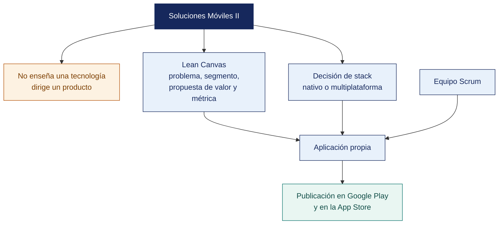

[Semana 01](README.md) · **Teoría** · [Dinámica de aula](2-DINAMICA.md) · [Taller de laboratorio](3-TALLER.md)

# Teoría · Introducción al desarrollo de aplicaciones móviles

**SI-988 · Soluciones Móviles II** · Semana 01 · Sesión 1 en aula · 2 h, con la dinámica incluida

---

## Qué se trabaja en esta sesión

- Qué distingue a Soluciones Móviles II.
- El panorama técnico y la decisión de stack.
- La propuesta de valor con el Lean Canvas.
- Encuadre del curso y cierre.

## Mapa de la sesión

---

## Prueba de entrada (20 min)

Instrumento diagnóstico de 20 preguntas, sin nota, para calibrar el punto de partida. **Ejes.** Ciclo de vida de una actividad y de un *view controller*, gestión de estado, asincronía y concurrencia, consumo de una API REST, control de versiones con ramas, pruebas unitarias, y firma de una aplicación. El resultado agregado define los refuerzos de las semanas 2 a 4.

## Qué distingue a Soluciones Móviles II (25 min)

**El salto respecto de Soluciones Móviles I.**

| | Soluciones Móviles I | **Soluciones Móviles II** |
|---|---|---|
| Objeto | Aprender a construir una app | **Dirigir un producto hasta la tienda** |
| Alcance | Ejercicios guiados | **App propia, innovadora, con usuarios reales** |
| Tecnología | La que enseña el docente | **La que el equipo elige y justifica** |
| Arquitectura | Suficiente para que funcione | **Decidida, documentada y sostenible** |
| Proceso | Entregas por tema | **5 sprints de Scrum con todos sus artefactos** |
| Calidad | Que compile y corra | **Pruebas automatizadas, seguridad verificada, accesibilidad** |
| Cierre | Un `.apk` que se muestra | **Aplicación publicada en Google Play y en la App Store** |

**Por qué el producto va antes que el código.** La mayoría de las aplicaciones que se abandonan no fallan por su tecnología: fallan porque **nadie las necesitaba**. Antes de escribir la primera línea, el equipo debe poder responder:

1. ¿**Quién** tiene este problema? Con nombra de segmento, no «la gente».
2. ¿**Qué hace hoy** para resolverlo? Si no hace nada, el problema no le duele.
3. ¿**Por qué una app** y no un formulario web, un mensaje o una llamada?
4. ¿Qué hace que valga la pena **abrirla una segunda vez**?
5. ¿Cómo sabremos que **funcionó**? Con una métrica, no con una impresión.

> **La pregunta 3 elimina la mitad de las propuestas.** Una app se justifica cuando aprovecha algo que solo el móvil ofrece: **ubicación, cámara, sensores, notificaciones, uso sin conexión, biometría o disponibilidad permanente en el bolsillo**. Si la propuesta no usa ninguna de esas capacidades, probablemente debía ser una página web.

## El panorama técnico y la decisión de stack (35 min)

**Las cuatro rutas y su decisión real.**

| Ruta | Qué es | Cuándo conviene | Costo real |
|---|---|---|---|
| **Nativo** (Kotlin/Compose + Swift/SwiftUI) | Una base de código por plataforma | Máximo rendimiento; uso intensivo de hardware; interfaz que debe sentirse nativa | **Dos bases de código**: duplica el esfuerzo de mantenimiento |
| **Multiplataforma con interfaz propia** (Flutter) | Una base de código; el framework dibuja su interfaz | Velocidad de desarrollo, consistencia visual entre plataformas | La interfaz no es nativa; dependencia del ecosistema del framework |
| **Multiplataforma con interfaz nativa** (React Native, .NET MAUI) | Una base de código; se mapea a componentes nativos | Equipos con experiencia web o .NET; interfaz nativa | Complejidad del puente con el código nativo |
| **Lógica compartida, interfaz nativa** (Kotlin Multiplatform) | Se comparte la lógica; cada plataforma tiene su interfaz | Se quiere reutilizar la lógica sin renunciar a la interfaz nativa | Requiere competencia en ambas plataformas |

**Los criterios de decisión** que el equipo debe evaluar y documentar en el ADR de la Semana 02:

| Criterio | Pregunta |
|---|---|
| **Competencia del equipo** | ¿Qué sabe hacer hoy? Aprender un stack nuevo consume un sprint completo |
| **Requisitos de hardware** | ¿Necesita cámara avanzada, sensores, Bluetooth, procesamiento intensivo? |
| **Requisitos de interfaz** | ¿La experiencia debe sentirse nativa o basta con que sea consistente? |
| **Ecosistema de bibliotecas** | ¿Existe biblioteca madura para lo que se necesita: mapas, biometría, pagos? |
| **Acceso a macOS** | Sin macOS no hay compilación local para iOS. Determina la ruta de publicación |
| **Mantenibilidad** | ¿Quién mantendrá la app después del curso? |
| **Tamaño del artefacto** | Relevante en mercados con dispositivos de gama baja |

> **La restricción de macOS es la que más condiciona a los equipos.** Sin acceso a un equipo macOS, la compilación y firma para iOS debe hacerse mediante un servicio de compilación en la nube. Se resuelve en la Semana 16, pero la decisión de stack de la Semana 02 debe tomarla en cuenta.

**El entorno de desarrollo:**

| Herramienta | Para qué | Requisito |
|---|---|---|
| **Android Studio** | Desarrollo Android, emulador, perfilado, inspección de la base de datos | Windows, macOS o Linux · 16 GB de RAM recomendados |
| **Xcode** | Desarrollo iOS, simulador, firma, envío a App Store Connect | **Solo macOS** |
| **VS Code** | Editor liviano para Flutter, React Native y edición general | Cualquier sistema |
| **Emuladores y dispositivos** | Prueba. **Al menos un dispositivo físico por equipo**: el emulador no reproduce fielmente rendimiento, batería, sensores ni permisos | |

## La propuesta de valor con el Lean Canvas (25 min)

El **Lean Canvas** condensa el modelo del producto en nueve bloques. Se completa en el orden numerado, que no es el orden visual:

| # | Bloque | Pregunta | Error frecuente |
|---|---|---|---|
| **1** | **Problema** | Los 3 problemas principales del segmento | Describir la solución en lugar del problema |
| **2** | **Segmento de clientes** | Quiénes exactamente; y quién es el *early adopter* | «Todas las personas» |
| **3** | **Propuesta única de valor** | Una frase clara que diga por qué es distinta y merece atención | Una lista de funcionalidades |
| **4** | **Solución** | Las 3 funcionalidades mínimas que atacan los 3 problemas | Veinte funcionalidades |
| **5** | **Canales** | Cómo llegan los usuarios a la app | «La subimos a la tienda» |
| **6** | **Flujos de ingreso** | Cómo se sostiene, si aplica | Omitirlo por ser un proyecto académico |
| **7** | **Estructura de costos** | Qué cuesta operarla: servidores, APIs, cuentas de tienda | Ignorar el costo recurrente |
| **8** | **Métricas clave** | Los 3 números que dirán si funciona | «Número de descargas» |
| **9** | **Ventaja injusta** | Lo que no puede copiarse fácilmente | Dejarlo vacío |

**Las métricas que importan en una app.** No es la descarga: es lo que ocurre después.

| Métrica | Qué mide | Por qué importa |
|---|---|---|
| **Activación** | % de quienes instalan y completan la acción de valor por primera vez | Si no se activan, la app no comunicó su valor |
| **Retención D1 / D7 / D30** | % que vuelve al día siguiente, a la semana, al mes | **La métrica que define si la app vive o muere** |
| **Frecuencia de uso** | Sesiones por usuario activo | Indica si resolvió un problema recurrente |
| **Tiempo hasta el valor** | Cuánto tarda el usuario en obtener el primer beneficio | Cada pantalla previa pierde usuarios |
| **Tasa de fallos** | Sesiones sin error, por versión | Un fallo en el primer uso es una desinstalación |

## Encuadre del curso y cierre (15 min)

Reglas del proyecto, composición de los equipos, roles Scrum y calendario de los 5 sprints. Se explicita el **requisito de la prueba cerrada de Google Play**. 12 testers durante 14 días continuos antes de solicitar producción, razón por la cual la prueba cerrada se inicia en la **Semana 14**.

**Pregunta de cierre.** *¿por qué su idea tiene que ser una app y no una página web?* La propuesta que no responde esta pregunta con una capacidad propia del móvil se reformula esta misma semana.

---

---

[Semana 01](README.md) · **Teoría** · [Dinámica de aula](2-DINAMICA.md) · [Taller de laboratorio](3-TALLER.md)

---

**Docente** · Dr. Oscar Juan Jimenez Flores
[oscarjimenezflores@upt.pe](mailto:oscarjimenezflores@upt.pe) · [LinkedIn](https://www.linkedin.com/in/oscar-jimenez-flores/) · [CTI Vitae — CONCYTEC](https://ctivitae.concytec.gob.pe/appDirectorioCTI/VerDatosInvestigador.do?id_investigador=33398)

Escuela Profesional de Ingeniería de Sistemas · Universidad Privada de Tacna · Tacna, Perú
