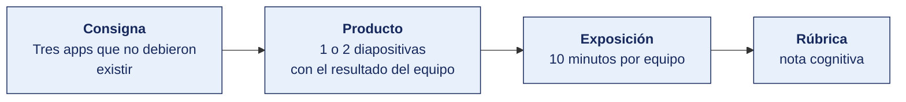

[Semana 01](README.md) · [Teoría](1-TEORIA.md) · **Dinámica de aula** · [Taller de laboratorio](3-TALLER.md)

# Dinámica de aula · Tres apps que no debieron existir

**SI-988 · Soluciones Móviles II** · Semana 01 · Actividad en aula, **dentro de las 2 h de teoría** · calificación **cognitiva**

---

## Cómo funciona la actividad

## Qué entregas

| | |
|---|---|
| **Archivo** | `SI988-S01-DINAMICA-Grupo<N>.pdf` |
| **Plantilla obligatoria** | [SI988-PLANTILLA-DINAMICA.docx](../PLANTILLAS/SI988-PLANTILLA-DINAMICA.docx) |
| **Formato** | PDF exportado desde la plantilla en Word, con la carátula de la UPT y los apellidos, nombres y códigos de todos los integrantes |
| **Qué va dentro** | Lo que el grupo resolvió en aula. Las tablas de la sección **Producto** van completas, con los textos redactados, y cada decisión va justificada |
| **Dónde se sube** | Aula virtual, tarea «Dinámica · Semana 01» |
| **Cuándo vence** | Antes de cerrar la sesión de teoría |
| **Exposición** | 10 minutos por grupo en la sesión de teoría de la Semana 02 |

> No se califica un trabajo entregado en `.docx`, sin carátula, sin los códigos de los integrantes o con las tablas del producto vacías.

---

## Consigna

> **«Tres apps que no debieron existir»**
> Cada equipo analiza **tres aplicaciones reales** publicadas en Google Play o en la App Store —una que considere excelente, una mediocre y una que **no debió ser una app**— y las evalúa con las cinco preguntas de producto y las métricas de la sección 1.4.

## Producto

**Diapositiva 1 — El análisis comparado.**

| | App excelente | App mediocre | App que no debió existir |
|---|---|---|---|
| Nombre y enlace a su ficha de tienda | | | |
| ¿Quién tiene el problema? | | | |
| ¿Qué hacía antes ese usuario? | | | |
| **¿Qué capacidad del móvil aprovecha?** | | | |
| ¿Por qué se abriría una segunda vez? | | | |
| Calificación y volumen de reseñas | | | |
| **Veredicto y por qué** | | | |

**Diapositiva 2 — La lección aplicada.** Las tres decisiones de diseño que el equipo **copiará** de la app excelente y las tres que **evitará** de la mediocre, cada una justificada con evidencia de la ficha de tienda o de las reseñas.

## Ejemplo resuelto

*El caso de este ejemplo es distinto del que le toca a tu grupo. Sirve para que veas el nivel de detalle que se espera, no para copiarlo.*

**Una columna bien resuelta.** La app del ejemplo no es ninguna de las tres que tú analizas.

| Campo | App que no debió existir |
|---|---|
| Nombre y enlace a su ficha de tienda | Aplicación de un gimnasio local que solo muestra el horario de clases. Enlace a su ficha en Google Play |
| ¿Quién tiene el problema? | El socio que quiere saber a qué hora es la clase de spinning del jueves |
| ¿Qué hacía antes ese usuario? | Miraba el horario impreso en la recepción o el estado de la cuenta de la red social del gimnasio, que se actualiza más seguido que la app |
| **¿Qué capacidad del móvil aprovecha?** | **Ninguna.** No usa notificaciones, ni ubicación, ni cámara, ni funciona sin conexión. Es una página web dentro de un contenedor, con el mismo contenido que el sitio |
| ¿Por qué se abriría una segunda vez? | No hay motivo. El horario cambia una vez por trimestre. Una página web guardada en la pantalla de inicio resuelve lo mismo sin ocupar 24 MB |
| Calificación y volumen de reseñas | 2,4 con 87 reseñas. Las tres más votadas dicen que el horario está desactualizado |
| **Veredicto y por qué** | No debió ser una app. El costo de instalarla, mantenerla en dos tiendas y actualizarla no se justifica frente a una página web adaptable. El indicador que lo confirma es la retención: las reseñas mencionan que se instala, se consulta una vez y se desinstala |

*La lección aplicada*

| Decisión que copiaremos de la app excelente | Evidencia que la sustenta |
|---|---|
| Guardar el último estado consultado para que la pantalla principal muestre algo útil sin conexión | Las reseñas de 5 estrellas mencionan repetidamente que «funciona en el subte» |

| Decisión que evitaremos de la app mediocre | Evidencia que la sustenta |
|---|---|
| Pedir el registro de la cuenta antes de mostrar cualquier contenido | Cuatro de las diez reseñas más votadas dicen «te obliga a registrarte para ver los precios». La calificación bajó de 4,1 a 3,2 tras la versión que introdujo el registro obligatorio, según las fechas de las reseñas |

**La regla que decide la nota.** «¿Qué capacidad del móvil aprovecha?» es la pregunta que separa una app de una página web con icono. Si la respuesta es «ninguna», el veredicto ya está dado.

**La diferencia entre aprobar y no aprobar.**

| Así no | Así sí |
|---|---|
| «Es una app mal diseñada.» | «No usa notificaciones, ni ubicación, ni cámara, ni funciona sin conexión. Es una web dentro de un contenedor.» |
| «Tiene malas reseñas.» | «2,4 con 87 reseñas. Las tres más votadas dicen que el horario está desactualizado.» |
| «Copiaremos su buen diseño.» | «Guardar el último estado consultado, porque las reseñas de 5 estrellas dicen que funciona sin conexión.» |

## Reglas

- 35 min en aula. Entrega como `S01_<equipo>_analisis_apps.pdf`.
- Las tres aplicaciones deben estar **publicadas y ser verificables**. Se cita el enlace a su ficha.
- La evidencia debe provenir de la **ficha de tienda y de las reseñas**, no de la opinión del equipo.
- **Obligatorio** identificar qué capacidad propia del móvil aprovecha cada una, o declarar que ninguna.
- Exposición de 10 min en la Semana 02.

## Rúbrica cognitiva (20 puntos)

| Criterio | 5 | 3 | 1 |
|---|---|---|---|
| **Evidencia verificable** | Enlaces, calificaciones y citas de reseñas en las tres | Evidencia en dos | Opinión del equipo |
| **Capacidad del móvil** | Identifica con precisión qué capacidad aprovecha cada una | Lo hace en dos | No lo aborda |
| **Análisis del problema** | Distingue el problema del usuario de la solución técnica | Distinción parcial | Describe funcionalidades |
| **Lección aplicada** | Seis decisiones concretas y accionables para su propio producto | Decisiones generales | «Hacerlo mejor» |

---

---

[Semana 01](README.md) · [Teoría](1-TEORIA.md) · **Dinámica de aula** · [Taller de laboratorio](3-TALLER.md)

---

**Docente** · Dr. Oscar Juan Jimenez Flores
[oscarjimenezflores@upt.pe](mailto:oscarjimenezflores@upt.pe) · [LinkedIn](https://www.linkedin.com/in/oscar-jimenez-flores/) · [CTI Vitae — CONCYTEC](https://ctivitae.concytec.gob.pe/appDirectorioCTI/VerDatosInvestigador.do?id_investigador=33398)

Escuela Profesional de Ingeniería de Sistemas · Universidad Privada de Tacna · Tacna, Perú
