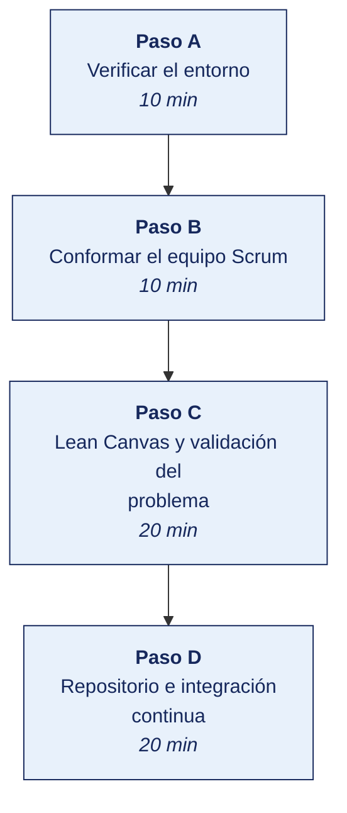

[Semana 01](README.md) · [Teoría](1-TEORIA.md) · [Dinámica de aula](2-DINAMICA.md) · **Taller de laboratorio**

# Taller de laboratorio 01 · Entornos, equipo Scrum, Lean Canvas y repositorio con integración continua

**SI-988 · Soluciones Móviles II** · Semana 01 · Sesión 2 en laboratorio · 100 min · calificación **procedimental**

> ¿Un término no le resulta claro? Está definido en el [glosario técnico del curso](../GLOSARIO.md).

---

## Secuencia del taller



## Qué entregas

| | |
|---|---|
| **Archivo** | `SI988-S01-TALLER-Grupo<N>.pdf` |
| **Plantilla obligatoria** | [SI988-PLANTILLA-TALLER.docx](../PLANTILLAS/SI988-PLANTILLA-TALLER.docx) |
| **Formato** | PDF exportado desde la plantilla en Word, con la carátula de la UPT, el índice actualizado y las capturas numeradas |
| **Qué va dentro** | Las secciones de la plantilla. La **5. Resultados y evidencias** se califica contra la tabla de resultados esperados de esta guía, y **cada resultado necesita la evidencia que lo demuestre**. No se copian de aquí los objetivos, la duración ni los resultados de aprendizaje |
| **Dónde se sube** | Aula virtual, tarea «Taller · Semana 01» |
| **Cuándo vence** | 48 horas después de la sesión de laboratorio |

> No se califica un informe entregado en `.docx`, sin carátula, sin los códigos de los integrantes o con resultados declarados sin evidencia.

---

**La sesión de laboratorio dura 100 minutos.** El avance del proyecto lo ejecuta el equipo fuera de la sesión.

## 1. Información sobre el evento práctico

### 1.1. Título del evento práctico

Preparación del entorno de desarrollo móvil, conformación del equipo Scrum, formulación de la visión del producto mediante Lean Canvas y establecimiento del repositorio con integración continua desde el primer día.

### 1.2. Objetivos

- Verificar el **entorno de desarrollo** en el equipo de cada integrante, con evidencia de ejecución.
- Conformar el **equipo Scrum** con roles y acuerdos de trabajo.
- Formular la **visión del producto** y el **Lean Canvas** de la app innovadora.
- **Validar el problema** con al menos cinco usuarios potenciales reales.
- Establecer el **repositorio** con estructura, ramas protegidas y convenciones.
- Configurar la **integración continua mínima** que verifique cada cambio desde la Semana 01.

### 1.3. Tiempo de duración

**100 minutos.**

### 1.4. Resultados de Aprendizaje (RA)

- **RA1** Analiza e interpreta los conceptos avanzados de desarrollo móvil.
- **RA2** Propone el plan de desarrollo de su app con metodologías ágiles.

### 1.5. Recursos (equipos, materiales, programas y otros)

**Equipos y sistema operativo**

| Recurso | Requisito mínimo |
|---|---|
| Computadora | 16 GB de RAM recomendados, 30 GB libres en disco, virtualización habilitada |
| Sistema operativo | El del laboratorio. La compilación y firma para iOS requiere macOS y se resuelve en la Unidad III |
| Emulador de Android (AVD) | Se crea en Android Studio. Es el entorno de trabajo del laboratorio |
| Conexión | Necesaria para descargar los SDK y las dependencias |

**Herramientas y enlaces de descarga.** Todas son libres o gratuitas. Se instalan **antes** de la sesión.

| Herramienta | Para qué se usa en este laboratorio | Descarga |
|---|---|---|
| **Android Studio** | SDK, emulador y compilación para Android. *Gratuito, Apache 2.0* | https://developer.android.com/studio |
| **Xcode** *(solo macOS)* | SDK, simulador y firma para iOS. *Gratuito* | https://developer.apple.com/xcode/ |
| **Visual Studio Code** | Editor principal del proyecto. *MIT* | https://code.visualstudio.com/download |
| **Git** | Control de versiones del proyecto. *GPL-2.0* | https://git-scm.com/downloads |
| **GitHub** | Repositorio remoto, revisión por pares e integración continua. *Nivel gratuito* | https://github.com/signup |
| **GitHub Actions** | Tubería de integración continua del equipo. *Incluido en el nivel gratuito* | https://docs.github.com/actions |
| **Flutter SDK** *(según la ruta elegida)* | Base de código única para ambas plataformas. *BSD-3-Clause* | https://docs.flutter.dev/get-started/install |
| **Kotlin / JDK 17** *(nativo Android)* | Compilación de la aplicación Android. *Apache 2.0 / GPL-2.0 con excepción* | https://adoptium.net/temurin/releases/ |
| **Node.js LTS** *(React Native)* | Entorno de ejecución de las herramientas. *MIT* | https://nodejs.org/en/download |
| **Figma** | Bocetos de la interfaz y prototipo navegable. *Nivel gratuito* | https://www.figma.com/downloads/ |
| **GitHub Projects** | Tablero Scrum del equipo. **Obligatorio**: es donde queda el seguimiento del avance. *AGPL / MIT* | https://taiga.io/ · https://wekan.github.io/ |

**Cuentas de tienda que el proyecto necesitará** (no se pagan esta semana; se presupuestan desde ahora)

| Cuenta | Costo | Enlace oficial |
|---|---|---|
| **Google Play Console** | Pago único de registro | https://play.google.com/console/signup |
| **Apple Developer Program** | Suscripción anual | https://developer.apple.com/programs/ |

> **Verificación previa.** Ejecuta `git --version`, `java -version` y, según la ruta elegida, `flutter doctor` o `node --version`. Quien llegue sin el entorno instalado pierde la mitad de la sesión.

### 1.6. Seguridad

> **Dónde se trabaja.** El taller se hace en el **laboratorio de la universidad, sobre el emulador**. Cuando un escenario no se reproduce fielmente en el emulador, la verificación en un teléfono real la hace el equipo **fuera de la sesión** y adjunta el video como anexo. Ningún resultado del taller depende de tener un teléfono en clase.

1. **Ningún secreto en el repositorio** — claves de API, credenciales, archivos de firma ni tokens. Se usa `.gitignore` desde el primer *commit* y variables de entorno.
2. La validación del problema con usuarios reales requiere **consentimiento informado**; no se recogen datos personales innecesarios. Aplica la Ley 29733 y su Reglamento D. S. 016-2024-JUS.
3. Las cuentas de desarrollador se protegen con **segundo factor de autenticación**.
4. El repositorio del equipo es **privado** mientras contenga trabajo no publicado, con el docente como colaborador.

---

## 2. Procedimiento o Metodología

### Paso A — Verificar el entorno

> **Guías de instalación paso a paso.** El entorno se instala **antes** de esta sesión, no durante. Están en [`GUIAS/`](../GUIAS/):
>
> | Stack | Guía |
> |---|---|
> | **Flutter** | [Guía práctica · Flutter con Google Antigravity](../GUIAS/GUIA-ANTIGRAVITY-FLUTTER.md) |
> | **Kotlin Multiplatform** | [Guía práctica · KMP con Google Antigravity](../GUIAS/GUIA-ANTIGRAVITY-KOTLIN.md) |
>
> Cada guía lleva de cero a una app corriendo en el emulador — instalación de Antigravity, del SDK, de Android Studio, creación del emulador y el primer artefacto dirigiendo al agente. **La elección de stack es provisional** y se somete a evaluación con datos medidos en el `ADR-004` de la Semana 13.


```bash
# --- Android ---
java -version                  # JDK 17 o superior
adb --version                  # Android Debug Bridge
emulator -list-avds            # debe existir al menos un emulador creado
adb devices                    # el emulador debe aparecer como «device»
sdkmanager --list_installed 2>/dev/null | head

# --- Flutter (si el equipo lo evalúa) ---
flutter --version && flutter doctor -v

# --- React Native (si el equipo lo evalúa) ---
node --version && npm --version && npx react-native --version

# --- macOS ---
xcodebuild -version
xcrun simctl list devices available | head

# --- Git ---
git --version && git config --global user.name && git config --global user.email
```

**Evidencia obligatoria.** Captura de una aplicación de ejemplo **ejecutándose en el emulador**, con la ventana del emulador y la consola de compilación visibles en la misma imagen. Se registra en `docs/entorno/` el sistema operativo, la versión de cada herramienta y el nombre y perfil del emulador creado por integrante.

Crear el emulador es parte del paso. En Android Studio, **Device Manager → Create Device**, se elige un perfil de gama media —Pixel 6 o equivalente, 4 GB de RAM— y una imagen de sistema reciente. Se arranca y se comprueba con `adb devices` que aparece como `device`.

> Si algún integrante trae su propio teléfono y quiere usarlo, puede hacerlo, pero **no es requisito ni sustituye la evidencia en el emulador**. Conectar un teléfono por USB, habilitar la depuración y autorizar el equipo consume tiempo de sesión y no siempre funciona en las máquinas del laboratorio.

### Paso B — Conformar el equipo Scrum

`docs/equipo/EQUIPO.md`:

| Campo | Contenido |
|---|---|
| Nombre del equipo | |
| **Product Owner** | Responsable del valor y del Product Backlog. **Decide qué se construye** |
| **Scrum Master** | Responsable de la eficacia del equipo y del proceso. **Rota cada dos sprints** |
| **Developers** | Todos los demás, incluido el PO si programa |
| Competencias del equipo | Qué sabe hacer cada integrante hoy, por tecnología y por área |
| **Brechas de competencia** | Qué falta y quién lo aprenderá |
| Acceso a macOS | Sí / No · quién y con qué frecuencia |
| Dispositivos disponibles | Modelo, versión de sistema operativo, por integrante |

**Acuerdos de trabajo** (`docs/equipo/ACUERDOS.md`), redactados por el equipo:

- Horario y canal de la **Daily** de 15 minutos.
- Canal de comunicación y **tiempo máximo de respuesta**.
- Qué se hace cuando alguien se bloquea más de 4 horas.
- Cómo se resuelve un desacuerdo técnico.
- **Qué significa «terminado»** — borrador de la Definition of Done, que se formaliza en la Semana 02.
- Cómo se reparte el trabajo. Por capa, por funcionalidad o por parejas.
- Qué ocurre si un integrante no cumple un compromiso.

> **Acuerdos de trabajo del equipo.** La mayoría de los equipos que fracasan no lo hacen por incompetencia técnica. Lo hacen porque nunca acordaron cómo trabajar juntos.

### Paso C — Lean Canvas y validación del problema

> **Antes de inventar desde cero, mire el [catálogo de dominios](../CATALOGO-APPS/README.md).** Hay **diez ejemplos desarrollados** hasta el nivel que el curso exige — problema, segmento, por qué tiene que ser una app, alcance de cinco sprints, datos personales, permisos, contrato de API y un backlog semilla de 25 historias.
>
> La elección sigue siendo **libre**. Su equipo puede proponer su propia app. El catálogo está para que sepa **qué profundidad se espera** y para que quien nunca construyó una app no arranque frente a una hoja en blanco. Lo que no puede hacer es entregar uno de los ejemplos tal como está.
>
> **Dos equipos no pueden tomar el mismo dominio.** Se registra en la Semana 01, por orden de propuesta aprobada.


**C.1 — Lean Canvas** (`docs/producto/LEAN_CANVAS.md`), completado en el orden 1 → 9.

**C.2 — Validación del problema.** El paso que separa un producto de una ocurrencia. Cada equipo entrevista **al menos a cinco personas del segmento objetivo**, con este guion:

| # | Pregunta | Qué se busca |
|---|---|---|
| 1 | Cuénteme la última vez que enfrentó <el problema>. | Un hecho concreto, no una opinión |
| 2 | ¿Qué hizo exactamente? | La solución actual |
| 3 | ¿Cuánto tiempo o dinero le costó? | La magnitud del dolor |
| 4 | ¿Qué fue lo más molesto de ese proceso? | El punto de dolor real |
| 5 | ¿Ha buscado alguna herramienta para eso? ¿Cuál? ¿Por qué la dejó? | Competencia y razones de abandono |
| 6 | Si existiera algo que <propuesta de valor>, ¿lo usaría? ¿Cuándo fue la última vez que lo habría necesitado? | Intención contrastada con un hecho |

> **Regla de la entrevista.** **No se describe la solución antes de la pregunta 6.** Describirla antes contamina las respuestas. La gente es amable y dirá que le gusta.

`docs/producto/VALIDACION.md`:

| Entrevistado (perfil, sin nombre) | Problema confirmado | Qué hace hoy | Costo declarado | ¿Usaría la solución? | **Cita textual relevante** |
|---|---|---|---|---|---|

**Veredicto de validación.** De las cinco entrevistas, **¿cuántas confirmaron el problema con un hecho concreto y no con una opinión?** Si son menos de tres, el equipo **reformula la propuesta esta misma semana**.

**C.3 — Visión del producto** (`docs/producto/VISION.md`):

> *«Para <segmento de clientes> que <necesidad o problema>, <nombre de la app> es una <categoría> que <beneficio clave>. A diferencia de <alternativa actual>, nuestro producto <diferencia principal>.»*

### Paso D — Repositorio e integración continua

```bash
mkdir -p <nombre-app> && cd <nombre-app> && git init

mkdir -p docs/{producto,equipo,arquitectura,decisiones,sprints,entorno} \
         app src test .github/workflows

cat > .gitignore <<'FIN'
# Secretos — NUNCA versionar
*.jks
*.keystore
*.p12
*.mobileprovision
.env
.env.*
google-services.json
GoogleService-Info.plist
secrets.properties
local.properties

# Compilación
build/
.gradle/
DerivedData/
*.xcuserstate
node_modules/
.dart_tool/
Pods/

# Entorno
.idea/
.vscode/
.DS_Store
FIN

cat > docs/decisiones/ADR-000-plantilla.md <<'FIN'
# ADR-000 · <Título de la decisión>

- **Estado:** propuesta | aceptada | reemplazada por ADR-xxx
- **Fecha:** aaaa-mm-dd
- **Decidido por:** <equipo>

## Contexto
Qué situación obliga a decidir. Restricciones, requisitos y supuestos.

## Alternativas consideradas
| Alternativa | Ventajas | Desventajas | Costo estimado |

## Decisión
Qué se decidió y **por qué se descartaron las otras**.

## Consecuencias
Positivas, negativas y **qué costaría revertir esta decisión**.
FIN

cat > CONTRIBUTING.md <<'FIN'
# Convenciones del equipo

## Ramas
- `main` — protegida; solo se integra mediante Pull Request aprobado
- `develop` — integración
- `feature/<US-xx>-descripcion` · `fix/<descripcion>` · `chore/<descripcion>`

## Commits — Conventional Commits
`<tipo>(<alcance>): <descripción>  [US-xx]`
Tipos: feat · fix · docs · style · refactor · test · chore

Ejemplo: `feat(auth): agregar inicio de sesión con PKCE  [US-07]`

## Pull Request
- Vinculado a una historia de usuario del backlog
- CI en verde
- Revisado por al menos **un integrante distinto del autor**
- Cumple la Definition of Done
FIN

git add . && git commit -m "chore: estructura inicial del proyecto y convenciones"
git branch -M main && git remote add origin <url> && git push -u origin main
```

**Integración continua mínima desde la Semana 01** (`.github/workflows/ci.yml`) — se adapta al stack elegido:

```yaml
name: CI
on:
  push: { branches: [main, develop] }
  pull_request: { branches: [main, develop] }

jobs:
  calidad:
    runs-on: ubuntu-latest
    steps:
      - uses: actions/checkout@v4

      # --- Verificación de secretos: se ejecuta SIEMPRE, sea cual sea el stack ---
      - name: Detectar secretos en el repositorio
        run: |
          docker run --rm -v "$PWD":/src aquasec/trivy fs --scanners secret --exit-code 1 /src

      # --- Android / Kotlin ---
      # - uses: actions/setup-java@v4
      #   with: { distribution: temurin, java-version: '17' }
      # - run: ./gradlew ktlintCheck detekt testDebugUnitTest

      # --- Flutter ---
      # - uses: subosito/flutter-action@v2
      # - run: flutter pub get && flutter analyze && flutter test --coverage

      # --- React Native ---
      # - uses: actions/setup-node@v4
      #   with: { node-version: '20' }
      # - run: npm ci && npm run lint && npm test -- --coverage
```

> **Por qué CI desde el primer día.** Un equipo que agrega integración continua en el sprint 4 descubre 40 problemas acumulados de golpe. Un equipo que la tiene desde el día 1 los corrige de a uno. **La verificación de secretos es obligatoria desde el inicio**. Es el error de seguridad más frecuente y el más costoso de revertir en Git.

### Trabajo del equipo fuera de la sesión — Avance de proyecto

> Lo que no alcance a completarse en la sesión lo ejecuta el equipo durante la semana, y llega al siguiente taller con el incremento listo. El docente lo revisa en el repositorio y en el tablero, no en clase.

| Actividad | Producto |
|---|---|
| Completar las entrevistas de validación pendientes | `VALIDACION.md` con 5 entrevistas |
| Bocetar en Figma las **3 pantallas principales** | Bocetos de baja fidelidad |
| Listar las **capacidades del móvil** que la app usará | Justificación de por qué es una app |
| Investigar el **backend**: propio o de terceros | Decisión preliminar |
| Investigar los **stacks candidatos** para el ADR (*Architecture Decision Record*, registro de decisión de arquitectura) de la Semana 02 | Tabla comparativa preliminar |
| Verificar el acceso a macOS y a cuentas de desarrollador | Plan de publicación preliminar |

---


## 3. Resultados

> **Evidencia obligatoria en GitHub.** Todo resultado de este taller se versiona en el repositorio del equipo. El informe **no consigna capturas sueltas**. Consigna la **URL** del artefacto en GitHub. Una captura no permite verificar autoría, fecha ni contenido; un enlace sí.
>
> | Qué se entrega | Dónde vive | Qué se escribe en el informe |
> |---|---|---|
> | Código y archivos de configuración | Rama del taller, fusionada a `develop` vía Pull Request | URL del Pull Request |
> | Documentos y matrices | `docs/`, en formato de texto versionable | URL del archivo en la rama |
> | Capturas y videos que el taller exija | `docs/evidencias/S01/` | URL del archivo |
> | Salida de comandos | `docs/evidencias/S01/salidas/*.txt` | URL del archivo |
>
> **Etiqueta del taller.** Al cerrar el taller se crea la etiqueta `taller-01` sobre el commit entregado:
>
> ```bash
> git tag -a taller-01 -m "Taller 01 · SI988"
> git push origin taller-01
> ```
>
> La URL que se consigna en el informe apunta a esa etiqueta:
> `https://github.com/<organizacion>/<repositorio>/tree/taller-01`
>
> **El informe es lo que se califica; el repositorio es lo que lo prueba.** Cada resultado de la sección 3 del informe lleva la URL con la que se verifica, y **un resultado sin su URL se califica como no logrado**, por bien redactado que esté. Lo que no se puede abrir no se puede dar por hecho.

### 3.1. Tabla de resultados


| # | Resultado esperado | Verificación |
|---|---|---|
| 1 | Entorno verificado por integrante, con versiones registradas | `docs/entorno/` |
| 2 | **App de ejemplo ejecutándose en el emulador**, con la consola de compilación visible | Captura o video |
| 3 | Equipo Scrum conformado con los tres roles asignados | `EQUIPO.md` |
| 4 | Brechas de competencia identificadas, con responsable de cerrarlas | `EQUIPO.md` |
| 5 | Acuerdos de trabajo con los siete puntos | `ACUERDOS.md` |
| 6 | Lean Canvas con los **nueve bloques** completos | `LEAN_CANVAS.md` |
| 7 | **Cinco entrevistas de validación** con cita textual por entrevistado | `VALIDACION.md` |
| 8 | **Veredicto de validación**: ≥ 3 de 5 confirmaron el problema con un hecho | `VALIDACION.md` |
| 9 | Visión de producto con la estructura completa | `VISION.md` |
| 10 | Repositorio con la estructura, `.gitignore` y `CONTRIBUTING.md` | URL del repositorio |
| 11 | Rama `main` protegida, con Pull Request obligatorio | Configuración del repositorio |
| 12 | **CI en verde**, con la verificación de secretos activa | Captura de la ejecución |
| 13 | Tres pantallas bocetadas y capacidades del móvil justificadas | Figma y documento |
| 14 | Tablero del equipo creado | Captura |


## Rúbrica procedimental (20 puntos)

Se aplica sobre el informe entregado y la evidencia enlazada en el repositorio. **Cada criterio se califica de forma independiente.**

| Criterio | 4 — Logrado | 2 — En proceso | 0 — Insuficiente |
|---|---|---|---|
| **Lean Canvas y validación del problema** | Completo y correcto, con la evidencia que lo respalda | Completo con errores menores, o correcto pero sin toda la evidencia | Incompleto, o entregado sin ejecutar |
| **Repositorio e integración continua** | Completo y correcto, con la evidencia que lo respalda | Completo con errores menores, o correcto pero sin toda la evidencia | Incompleto, o entregado sin ejecutar |
| **Evidencia verificable en el repositorio** | Cada resultado tiene su URL sobre la etiqueta `taller-NN`, y el enlace abre lo que dice | La mayoría tiene URL; alguna evidencia es una captura suelta | Se declaran resultados sin enlace, o el enlace no corresponde |
| **Rigor técnico de la implementación** | El código compila, las pruebas pasan y el análisis estático sale limpio | Compila y funciona, con avisos del análisis sin resolver | No compila, o se entregó sin ejecutar |
| **La evidencia entregada** | Las secciones de la plantilla completas; los resultados se sustentan con la evidencia enlazada | Secciones completas con sustento parcial | Faltan secciones o los resultados se afirman sin evidencia |

| Puntaje | Equivalencia |
|---|---|
| 18 – 20 | Destacado |
| 14 – 17 | Logrado |
| 6 – 13 | En proceso |
| 0 – 5 | Insuficiente |

> **Un resultado declarado sin evidencia enlazada no se califica**, aunque el trabajo se haya hecho. La tabla de la sección 3.1 es la lista de cotejo; esta rúbrica es lo que determina la nota.

## 4. Conclusiones

Mínimo tres. Líneas argumentales esperadas:

1. Validar el problema con usuarios reales antes de escribir código evita construir durante cinco sprints una solución que nadie necesitaba; la evidencia de la validación es un hecho concreto del entrevistado, no su opinión sobre la idea.
2. La justificación de por qué el producto debe ser una aplicación móvil —y no una web— se sostiene en una capacidad propia del dispositivo; sin ella, la decisión de plataforma es arbitraria.
3. La integración continua y la verificación de secretos desde el primer día convierten los problemas acumulables en problemas atendibles uno a uno, y evitan el error de seguridad más costoso de revertir en un repositorio Git.

## 5. Referencias Bibliográficas

- Schwaber, K. y Sutherland, J. (2020). *The Scrum Guide*. https://scrumguides.org/
- Maurya, A. (2012). *Running Lean: Iterate from Plan A to a Plan That Works* (2.ª ed.). O'Reilly. — Lean Canvas.
- Google. *Android Developers — Get started*. https://developer.android.com/get-started
- Apple. *Apple Developer — Xcode*. https://developer.apple.com/xcode/
- Flutter. *Flutter documentation*. https://docs.flutter.dev/
- Meta. *React Native documentation*. https://reactnative.dev/docs/getting-started
- JetBrains. *Kotlin Multiplatform documentation*. https://kotlinlang.org/docs/multiplatform.html
- Microsoft. *.NET MAUI documentation*. https://learn.microsoft.com/dotnet/maui/
- Conventional Commits. *Specification v1.0.0*. https://www.conventionalcommits.org/
- OWASP (*Open Worldwide Application Security Project*) Foundation. *Mobile Application Security*. https://mas.owasp.org/
- Ley 29733 y D. S. 016-2024-JUS — tratamiento de datos en entrevistas de validación. https://www.gob.pe/institucion/anpd
- Nolasco Valenzuela, J. S. (2019). *Desarrollo de aplicaciones con Android*. Ra-Ma.

## 6. Anexos

- `anexo_A_entorno.pdf` — capturas de verificación por integrante
- `anexo_B_lean_canvas.pdf`
- `anexo_C_validacion.pdf` — cinco entrevistas con su consentimiento
- `anexo_D_bocetos.pdf`
- `anexo_E_ci_verde.png`

---

---

[Semana 01](README.md) · [Teoría](1-TEORIA.md) · [Dinámica de aula](2-DINAMICA.md) · **Taller de laboratorio**

---

**Docente** · Dr. Oscar Juan Jimenez Flores
[oscarjimenezflores@upt.pe](mailto:oscarjimenezflores@upt.pe) · [LinkedIn](https://www.linkedin.com/in/oscar-jimenez-flores/) · [CTI Vitae — CONCYTEC](https://ctivitae.concytec.gob.pe/appDirectorioCTI/VerDatosInvestigador.do?id_investigador=33398)

Escuela Profesional de Ingeniería de Sistemas · Universidad Privada de Tacna · Tacna, Perú
