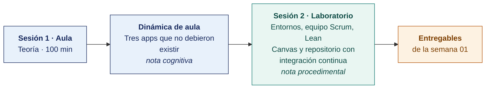

  
  &nbsp;&nbsp;&nbsp;&nbsp;&nbsp;&nbsp;
  

  <strong>Universidad Privada de Tacna</strong> 
  Facultad de Ingeniería · Escuela Profesional de Ingeniería de Sistemas

<h1 align="center">Semana 01 · Introducción al desarrollo de aplicaciones móviles</h1>

  <strong>SI-988 · Soluciones Móviles II</strong> 
  4 horas académicas de 50 min · aula: teoría 60 + dinámica 35 + cierre 5 · laboratorio: taller 60 + avance asistido 40

---

## Datos de la asignatura

| | |
|---|---|
| **Asignatura** | SI-988 · Soluciones Móviles II |
| **Escuela** | Escuela Profesional de Ingeniería de Sistemas |
| **Ciclo** | IX · 04 horas semanales · 04 créditos · Electivo |
| **Prerrequisito** | SI-883 Soluciones Móviles I |
| **Unidad** | I — Consumo de servicios web SOAP y REST |
| **Semana** | 01 de 17 |
| **Duración** | 4 horas académicas de 50 min · aula: teoría 60 + dinámica 35 + cierre 5 · laboratorio: taller 60 + avance asistido 40 |
| **Resultados de aprendizaje** | **RA1** Analiza e interpreta los conceptos avanzados de desarrollo móvil · **RA2** Propone el plan de desarrollo de su app con metodologías ágiles |
| **Artefacto del proyecto** | Equipo Scrum conformado · **Visión de producto** y Lean Canvas · Repositorio con CI |

### Lo que indica el sílabo

**Contenido conceptual.** Introducción al desarrollo de aplicaciones móviles.

**Contenido procedimental.** Desarrolla su prueba de entrada al curso. Familiarización con entornos de desarrollo móvil (VS Code, Android Studio, Xcode).

## Materiales de esta semana

| | Documento | Qué encontrarás | Dónde y cuánto dura |
|---|---|---|---|
| 1 | **[Teoría](1-TEORIA.md)** | Qué distingue a Soluciones Móviles II · El panorama técnico y la decisión de stack · La propuesta de valor con el Lean Canvas | Aula · 100 min |
| 2 | **[Dinámica de aula](2-DINAMICA.md)** | Tres apps que no debieron existir, con su material, su ejemplo resuelto y su rúbrica | Aula · dentro de los 100 min de la sesión de teoría |
| 3 | **[Taller de laboratorio](3-TALLER.md)** | Entornos, equipo Scrum, Lean Canvas y repositorio con integración continua | Laboratorio · 100 min |

## Ruta de la semana

## Entregables

| Entregable | Formato y nombre del archivo | Vence |
|---|---|---|
| **Dinámica de aula** · Tres apps que no debieron existir | PDF desde la [plantilla de dinámica](../PLANTILLAS/SI988-PLANTILLA-DINAMICA.docx) · `SI988-S01-DINAMICA-Grupo<N>.pdf` | Antes de cerrar la sesión de teoría |
| **Informe del taller de laboratorio N.º 01** | PDF en formato EPIS desde la [plantilla de taller](../PLANTILLAS/SI988-PLANTILLA-TALLER.docx) · `SI988-S01-TALLER-Grupo<N>.pdf` | 48 h después del taller |
| Repositorio con CI en verde | URL, con el docente como colaborador | Fin del taller |
| Lean Canvas, validación y visión del producto | Commit en el repositorio | 48 h después del taller |

> Ambos se entregan en **PDF**, con la carátula de la UPT y los códigos de todos los integrantes. Las plantillas obligatorias están en [`PLANTILLAS/`](../PLANTILLAS/).

## Cómo se evalúa

| Criterio | Instrumento | Peso |
|---|---|---|
| Cognitivo | Rúbrica del análisis de apps + exposición de 10 min en la Semana 02 | 25 % |
| Procedimental | Lista de cotejo de los 14 resultados del laboratorio | 35 % |
| Actitudinal | Cumplimiento de los acuerdos de trabajo y consentimiento informado en las entrevistas | 15 % |

## Preparación para la Semana 02

- **Leer.** Documentación oficial de arquitectura del stack candidato — [Guía de arquitectura de Android](https://developer.android.com/topic/architecture) o la equivalente de su framework.
- **Leer.** Clean Architecture aplicada a móviles y el patrón MVVM.
- Traer la **tabla comparativa preliminar de stacks** con al menos tres candidatos evaluados.
- Traer los **bocetos de las tres pantallas principales**.

---

**Docente** · Dr. Oscar Juan Jimenez Flores
[oscarjimenezflores@upt.pe](mailto:oscarjimenezflores@upt.pe) · [LinkedIn](https://www.linkedin.com/in/oscar-jimenez-flores/) · [CTI Vitae — CONCYTEC](https://ctivitae.concytec.gob.pe/appDirectorioCTI/VerDatosInvestigador.do?id_investigador=33398)

Escuela Profesional de Ingeniería de Sistemas · Universidad Privada de Tacna · Tacna, Perú
