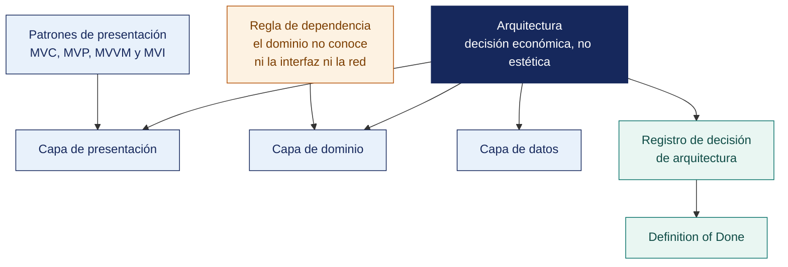

[Semana 02](README.md) · **Teoría** · [Dinámica de aula](2-DINAMICA.md) · [Taller de laboratorio](3-TALLER.md)

# Teoría · Arquitectura de Aplicaciones Móviles

**SI-988 · Soluciones Móviles II** · Semana 02 · Sesión 1 en aula · 2 horas académicas, 100 min, con la dinámica incluida

> ¿Un término no le resulta claro? Está definido en el [glosario técnico del curso](../GLOSARIO.md).

---

## La pregunta de esta sesión

Un equipo entrega el sprint 1 en cuatro días. La app funciona, las pantallas están bien y el cliente queda satisfecho.

En el sprint 4, cambiar el origen de un dato obliga a tocar once archivos, y ninguna prueba puede escribirse sin arrancar un emulador. El equipo entrega tarde por primera vez, y a partir de ahí siempre.

> **La pregunta que ordena esta sesión.** *¿Por qué una app sin arquitectura funciona igual de bien al principio y cuesta el triple después?*

## Antes de empezar

| Lo que necesita traer | De dónde sale |
|---|---|
| La idea de producto depurada y su Lean Canvas | Semana 01 |
| La decisión preliminar de stack y sus restricciones | Semana 01 |
| Programación orientada a objetos e interfaces | Cursos previos de la carrera |
| Nociones de pruebas unitarias | Cursos previos de la carrera |

> **Exploración (5 min), antes de cualquier definición.** El aula responde antes de la teoría y se anota. *¿Qué le pasó a ese equipo? ¿Se podía haber evitado en el sprint 1? ¿Cuánta arquitectura necesita una app de cuatro pantallas?* No se corrige nada todavía.

## Distribución del tiempo

| Momento | Minutos |
|---|---|
| El caso del sprint 4 y la exploración inicial | 8 |
| **Bloque 1.** Por qué la arquitectura es una decisión económica | 8 |
| **Bloque 2.** Los patrones de presentación MVC, MVP, MVVM y MVI | 18 |
| **Bloque 3.** Clean Architecture aplicada a móviles | 18 |
| **Bloque 4.** La Definition of Done y el ADR · con su microaplicación | 8 |
| Cierre, respuesta a la pregunta de la sesión y puente a la dinámica | 5 |
| **Total de la sesión de aula** | **65** |

## Mapa de la sesión



---

## Bloque 1 · Por qué la arquitectura es una decisión económica

> **La pregunta del bloque.** *¿Cuánto cuesta el próximo cambio?*

**El costo de no decidir.** Una app sin arquitectura definida funciona igual de bien en el sprint 1 y cuesta el triple en el sprint 4. Los síntomas son predecibles:

| Síntoma | Causa arquitectónica | Costo |
|---|---|---|
| «Cambiar el color del botón rompió el guardado» | Lógica de negocio dentro de la vista | Cada cambio requiere probar toda la app |
| «No podemos probar esto sin ejecutar la app» | Dependencias concretas, sin abstracción | Sin pruebas automatizadas viables |
| «Hay tres formas de pedir el mismo dato» | Sin capa de datos única | Comportamiento inconsistente |
| «Si cambiamos de proveedor de backend hay que reescribir todo» | El detalle de infraestructura filtrado a toda la app | Bloqueo tecnológico |
| «Nadie entiende esta pantalla salvo quien la hizo» | Sin patrón consistente | Factor bus = 1 por pantalla |

> **La arquitectura no se juzga por su elegancia sino por el costo del próximo cambio.** La pregunta que la valida es *¿cuánto cuesta agregar una pantalla nueva? ¿Y cambiar el origen de un dato?*

> **El error frecuente del bloque.** Juzgar una arquitectura por su elegancia. La pregunta que la valida es económica y se responde con un cronómetro — **cuánto cuesta agregar una pantalla nueva y cuánto cambiar el origen de un dato**. Si la respuesta crece sprint a sprint, la arquitectura ya está fallando aunque todo funcione.

## Bloque 2 · Los patrones de presentación MVC, MVP, MVVM y MVI

> **La pregunta del bloque.** *¿Cómo se comprueba que la separación existe de verdad?*

Todos separan **datos**, **presentación** y **vista**. Difieren en quién habla con quién.

| Patrón | Flujo | Quién conoce a quién | Prueba unitaria | Cuándo se usa hoy |
|---|---|---|---|---|
| **MVC** | Vista → Controlador → Modelo → Vista | El controlador conoce la vista | **Difícil.** El controlador depende de la vista | Base histórica; el «MVC» de iOS clásico degenera en controladores enormes |
| **MVP** | Vista ↔ Presentador → Modelo | El presentador conoce una **interfaz** de la vista | **Buena.** Se sustituye la vista por un doble | Android pre-2018; aún vigente en código legado |
| **MVVM** | Vista **observa** al ViewModel → Modelo | **El ViewModel no conoce la vista** | **Muy buena.** Se prueba el ViewModel sin interfaz | **Estándar actual** en Android, SwiftUI y Flutter |
| **MVI** | Intención → Estado inmutable único → Vista | Flujo unidireccional | **Excelente.** Estado predecible y reproducible | Pantallas con estado complejo; equipos con experiencia |

**MVVM en detalle** —el patrón que este curso exige como mínimo:

```
   ┌──────────┐   observa el estado   ┌───────────────┐   solicita   ┌────────────┐
   │  VISTA   │ ◄──────────────────── │   VIEWMODEL   │ ───────────► │ REPOSITORIO│
   │(Composable│                      │               │              │            │
   │ /SwiftUI/ │ ──── eventos ──────► │ · estado      │ ◄─── datos ──│ · red      │
   │  Widget)  │   del usuario        │ · lógica de   │              │ · local    │
   └──────────┘                       │   presentación│              └────────────┘
                                      └───────────────┘
   La vista NO tiene lógica.          El ViewModel NO importa nada de la interfaz.
   Solo dibuja el estado y            Es una clase que se prueba sin emulador.
   emite eventos.
```

**La prueba de que el MVVM está bien implementado.** *¿Puedo escribir una prueba unitaria del ViewModel sin arrancar un emulador ni instanciar una vista?* Si la respuesta es no, la separación no existe.

> **El error frecuente del bloque.** Declarar que se usa MVVM porque hay una clase llamada ViewModel. La prueba es una sola y no admite discusión — **escribir una prueba unitaria del ViewModel sin arrancar un emulador ni instanciar una vista**. Si no se puede, la separación no existe.

## Bloque 3 · Clean Architecture aplicada a móviles

> **La pregunta del bloque.** *¿Cuánta arquitectura es proporcional al tamaño de esta app?*

MVVM organiza la **presentación**; Clean Architecture organiza **toda la aplicación**.

```
  ┌───────────────────────────────────────────────────────────┐
  │  PRESENTACIÓN                                             │
  │  Vistas · ViewModels · Estados de interfaz · Navegación    │
  │  Conoce: dominio                                          │
  ├───────────────────────────────────────────────────────────┤
  │  DOMINIO           ← el corazón, sin dependencias externas │
  │  Entidades · Casos de uso · Interfaces de repositorio      │
  │  Conoce: NADA. Ni Android, ni iOS, ni HTTP, ni base de datos│
  ├───────────────────────────────────────────────────────────┤
  │  DATOS                                                     │
  │  Implementación de repositorios · Fuentes remota y local    │
  │  Modelos de transporte (DTO) · Mapeadores                  │
  │  Conoce: dominio                                          │
  └───────────────────────────────────────────────────────────┘

  REGLA DE DEPENDENCIA: las dependencias apuntan SIEMPRE hacia adentro.
  El dominio no importa nada de las capas externas. Se logra con
  inversión de dependencias: el dominio DEFINE la interfaz; datos la IMPLEMENTA.
```

**Qué vive en cada capa.**

| Capa | Elementos | Ejemplo |
|---|---|---|
| **Dominio** | Entidades del negocio · Casos de uso · Interfaces de repositorio · Errores de dominio | `Pedido`, `RegistrarPedido`, `PedidoRepository` (interfaz), `PedidoNoDisponible` |
| **Datos** | Implementación de repositorios · Cliente HTTP · Base de datos local · DTO · Mapeadores | `PedidoRepositoryImpl`, `PedidoApi`, `PedidoDao`, `PedidoDto`, `PedidoMapper` |
| **Presentación** | Vistas · ViewModels · Estados · Eventos · Navegación | `PedidoScreen`, `PedidoViewModel`, `PedidoUiState` |

**Por qué el modelo de dominio y el DTO deben ser distintos.** El DTO refleja lo que el backend envía; la entidad refleja lo que el negocio significa. Si son el mismo objeto, **cada cambio del backend obliga a tocar toda la aplicación**. El mapeador es el punto único donde se absorbe ese cambio.

**Proporcionalidad.** Clean Architecture completa en una app de 4 pantallas produce más carpetas que código útil. La regla del curso:

| Tamaño de la app | Arquitectura apropiada |
|---|---|
| ≤ 5 pantallas, sin lógica compleja | MVVM + repositorio, **sin capa de casos de uso** |
| 6 a 15 pantallas | MVVM + repositorio + casos de uso donde haya lógica de negocio real |
| > 15 pantallas o varios equipos | Clean completa, con modularización por funcionalidad |

> **El error frecuente del bloque.** Usar la misma entidad para el dominio y para lo que envía el servicio. El objeto de transferencia refleja el backend y la entidad refleja el negocio, y si son el mismo **cada cambio del backend obliga a tocar toda la aplicación**. El mapeador es el punto único donde se absorbe ese cambio.

## Bloque 4 · La Definition of Done y el ADR

> **La pregunta del bloque.** *¿Qué hace que un acuerdo de equipo sea verificable?*

**Definition of Done (DoD).** El acuerdo del equipo sobre qué significa que algo está terminado. Sin ella, «terminado» significa cosas distintas para cada integrante y el incremento del sprint no es utilizable.

**La DoD debe ser verificable.** «Código de calidad» no es verificable; «pasa el linter sin advertencias» sí lo es. Ejemplo de DoD del curso:

| # | Criterio | Cómo se verifica |
|---|---|---|
| 1 | El código compila en Android **y** en iOS | CI en verde en ambos objetivos |
| 2 | Sin advertencias del analizador estático ni del linter | CI |
| 3 | Pruebas unitarias de la lógica nueva, con la CI en verde | CI |
| 4 | Cobertura de la capa de dominio ≥ 70 % | Reporte de cobertura |
| 5 | Revisado por un integrante distinto del autor | Pull Request aprobado |
| 6 | Sin secretos en el código | Verificación de la CI |
| 7 | Funciona en un **dispositivo físico**, no solo en emulador | Evidencia adjunta al PR |
| 8 | Estados de carga, error y vacío implementados | Revisión del PR |
| 9 | Textos externalizados, sin cadenas embebidas | Revisión del PR |
| 10 | **Accesible.** Etiquetas de contenido y contraste suficiente | Revisión del PR |
| 11 | Documentado en el README si cambia el arranque o la configuración | Revisión del PR |
| 12 | Demostrable en la Review sin explicación previa | Ensayo del equipo |

**El ADR — Architecture Decision Record.** Registro breve de una decisión arquitectónica, su contexto, las alternativas evaluadas y sus consecuencias. **Su valor está en el futuro**. Cuando dentro de un año alguien pregunte «¿por qué se eligió esto?», el ADR responde sin depender de la memoria de quien decidió.

**Ejemplo trabajado — un ADR completo, el que cada equipo entrega esta semana.**

> **ADR-001 · Elección del stack de desarrollo**
> **Estado.** Aceptada · **Fecha.** Sprint 0 · **Deciden.** Los 4 integrantes del equipo
>
> **Contexto.** La app publica el menú del día de 6 locales y notifica a sus seguidores. Debe salir a Google Play y a la App Store en 17 semanas. El equipo sabe Kotlin (2 integrantes), algo de JavaScript (2) y nadie sabe Swift. Hay **un solo equipo macOS**, prestado, disponible por horas.
>
> **Alternativas evaluadas.**
>
> | | Nativo Kotlin + Swift | **Flutter** | React Native |
> |---|---|---|---|
> | Competencia actual del equipo | Media en Android, **nula en iOS** | Nula, pero Dart se aprende sobre base Kotlin | Media |
> | Sprints estimados de aprendizaje | **2** | 1 | 1 |
> | Bases de código a mantener | **2** | 1 | 1 |
> | Necesidad de macOS en desarrollo diario | **Alta** | Solo para compilar y firmar | Solo para compilar y firmar |
> | Bibliotecas para notificaciones y uso sin conexión | Maduras | Maduras | Maduras |
> | Interfaz percibida como nativa | Sí | No, se aproxima | Sí |
>
> **Decisión.** **Flutter.** El factor determinante no es técnico. Es la disponibilidad de un solo macOS prestado y la ausencia de competencia en Swift. Mantener dos bases de código consumiría los sprints 1 y 2 en aprendizaje, dejando tres para construir el producto.
>
> **Consecuencias.**
> · **Positivas.** Una base de código; el sprint 1 puede entregar pantallas reales; el macOS se necesita solo en la Semana 16, para firmar y enviar.
> · **Negativas.** La interfaz no será nativa —aceptable para este producto, cuyo valor está en el contenido, no en la interacción—; se asume dependencia del ecosistema Flutter.
> · **Qué invalidaría esta decisión.** Que el producto requiera un widget de pantalla de inicio en iOS o procesamiento intensivo de cámara. Ninguno está en el alcance del MVP.

> **El ADR se escribe en una página y se juzga por su sección de consecuencias negativas.** Un ADR que solo enumera ventajas no registró una decisión. Escribió una justificación. **Lo que hace útil al documento dentro de un año es la última línea. Bajo qué condición la decisión dejaría de ser correcta.**

> **Microaplicación (5 min) · la decisión que hay que poder defender en un año.** Cada equipo escribe **una línea de su Definition of Done que sea verificable** y una que no lo sea, y explica la diferencia. «Código de calidad» y «pasa el linter sin advertencias» son el ejemplo canónico.

| Caso | Qué debe contener una buena respuesta |
|---|---|
| ¿Se puede cambiar de stack en el sprint 3 si el ADR-001 dijo Flutter? | Sí, escribiendo el **ADR-002** que supersede al 001, con el contexto nuevo. Lo que no se hace es cambiar sin registrar por qué. Eso deja al equipo sin memoria de sus decisiones |
| ¿Por qué la DoD exige probar en dispositivo físico? | Porque el emulador no reproduce rendimiento real, batería, sensores ni el diálogo de permisos. Un fallo que solo aparece en un equipo de gama baja no se detecta antes de la tienda |
| La app tiene 4 pantallas. ¿Se implementa Clean completa? | No. MVVM más repositorio, sin capa de casos de uso. Más carpetas que código es un costo sin contrapartida, y la propia regla de proporcionalidad lo dice |

## Cierre · qué se lleva de aquí

**La respuesta a la pregunta con la que abrimos.** Porque el costo de no decidir no se paga en el sprint 1, se paga en el 4. Los síntomas son predecibles —lógica dentro de la pantalla, imposibilidad de probar sin emulador, un cambio del backend que se propaga— y todos empiezan el día que el equipo decide «esto lo ordenamos después». **La arquitectura se juzga por el costo del próximo cambio**, no por su elegancia.

**Las tres ideas que deben quedar.**

| Idea | Por qué importa en el ejercicio profesional |
|---|---|
| La pregunta que valida una arquitectura es económica | Cuánto cuesta agregar una pantalla y cuánto cambiar el origen de un dato |
| La prueba del MVVM es escribir una prueba unitaria sin emulador | Es objetiva, se hace en cinco minutos y no admite interpretación |
| Clean Architecture completa en una app de cuatro pantallas produce más carpetas que código | La proporcionalidad también es una decisión de arquitectura, y se registra en el ADR |

**Volviendo a la exploración del inicio.** Se releen las respuestas del inicio. La tercera pregunta —cuánta arquitectura necesita una app de cuatro pantallas— casi siempre se responde «toda la que se pueda». La respuesta profesional es **la proporcional**, y se justifica por escrito.

**Lo que sigue.** La [dinámica de esta sesión](2-DINAMICA.md) escribe el ADR-001 del equipo, con su contexto, sus alternativas evaluadas y sus consecuencias. El taller aplica después la estructura de capas sobre el código real.

---

---

[Semana 02](README.md) · **Teoría** · [Dinámica de aula](2-DINAMICA.md) · [Taller de laboratorio](3-TALLER.md)

---

**Docente** · Dr. Oscar Juan Jimenez Flores
[oscarjimenezflores@upt.pe](mailto:oscarjimenezflores@upt.pe) · [LinkedIn](https://www.linkedin.com/in/oscar-jimenez-flores/) · [CTI Vitae — CONCYTEC](https://ctivitae.concytec.gob.pe/appDirectorioCTI/VerDatosInvestigador.do?id_investigador=33398)

Escuela Profesional de Ingeniería de Sistemas · Universidad Privada de Tacna · Tacna, Perú
