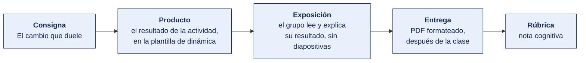

[Semana 02](README.md) · [Teoría](1-TEORIA.md) · **Dinámica de aula** · [Taller de laboratorio](3-TALLER.md)

# Dinámica de aula · El cambio que duele

**SI-988 · Soluciones Móviles II** · Semana 02 · Actividad en aula, **dentro de los 100 min de la sesión de teoría** · calificación **cognitiva**

> ¿Un término no le resulta claro? Está definido en el [glosario técnico del curso](../GLOSARIO.md).

---

## Cómo funciona la actividad



## Qué entregas

| | |
|---|---|
| **Archivo** | `SI988-S02-DINAMICA-Grupo<N>.pdf` |
| **Plantilla obligatoria** | [SI988-PLANTILLA-DINAMICA.docx](../PLANTILLAS/SI988-PLANTILLA-DINAMICA.docx) |
| **Formato** | PDF exportado desde la plantilla en Word, con la carátula de la UPT y los apellidos, nombres y códigos de todos los integrantes |
| **Qué va dentro** | Lo que el grupo resolvió en aula. Las tablas de la sección **Producto** van completas, con los textos redactados, y cada decisión va justificada |
| **Dónde se sube** | Aula virtual, tarea «Dinámica · Semana 02» |
| **Cuándo vence** | Hasta 24 h después de la sesión de teoría. La tabla se resuelve en aula; el PDF se formatea y se sube después |
| **Exposición** | En la ronda de cierre de **esta misma sesión**. El grupo **lee y explica su resultado** ante el aula, con el documento a la vista. No se usan diapositivas |

> No se califica un trabajo entregado en `.docx`, sin carátula, sin los códigos de los integrantes o con las tablas del producto vacías.

---

## Consigna

> **«El cambio que duele»**
> Cada equipo recibe **el código de una pantalla real mal arquitecturada**, que está en **Material de trabajo** —lógica de negocio, llamada HTTP y formato de fecha dentro de la vista— y debe. **Identificar los problemas**, **rediseñarla en MVVM** y **estimar el costo de tres cambios** en la versión actual frente a la rediseñada.

| | |
|---|---|
| **Su papel** | **Desarrollador que hereda la pantalla** y tiene tres cambios que entregar esta semana |
| **Misión** | Rediseñarla en MVVM y estimar el costo de los tres cambios en las dos versiones |
| **Restricción** | **La estimación va en horas** y hay que decir qué parte del código obliga a tocar cada una. Sin eso es una opinión |

## Cómo se desarrolla · 35 minutos

| | Bloque | Quién | Minutos |
|---|---|---|---|
| **1** | **Diagnóstico.** Cada problema con su línea, el principio que viola y dónde debería vivir | Equipo | 10 |
| **2** | **El rediseño.** El diagrama en MVVM, con las tres piezas y la responsabilidad de cada una | Equipo | 10 |
| **3** | **El costo del cambio.** Archivos a tocar hoy contra archivos a tocar con MVVM, y si se puede probar sin emulador | Equipo | 8 |
| **4** | **Ronda en aula.** El problema que más caro sale de arreglar, de tres equipos | Todos | 7 |

## Material de trabajo

Trabaja sobre este código. Es la pantalla de listado de pedidos de una aplicación real, con la arquitectura tal como se encontró.

El lenguaje es intencionalmente neutro. Traduce los nombres a tu propio stack, pero **no corrijas nada al transcribirlo**. La dinámica consiste en diagnosticar lo que está aquí.

```
clase PantallaListadoPedidos extiende Vista {

    lista pedidos = []
    booleano cargando = falso
    texto mensajeError = ""

    // Se ejecuta cuando la pantalla aparece
    funcion alAparecer() {
        cargando = verdadero
        redibujar()

        intentar {
            respuesta = ClienteHTTP.get(
                "https://api.miempresa.pe/v1/pedidos?estado=activo",
                cabeceras: { "Authorization": "Bearer " + Sesion.token }
            )

            json = AnalizadorJSON.analizar(respuesta.cuerpo)

            para cada elemento en json["data"] {
                // Se calcula el descuento aqui mismo
                decimal subtotal = elemento["subtotal"]
                decimal descuento = 0

                si (elemento["cliente"]["categoria"] == "PREFERENTE") {
                    descuento = subtotal * 0.15
                } sino si (elemento["cliente"]["categoria"] == "MAYORISTA") {
                    descuento = subtotal * 0.22
                    si (subtotal > 5000) {
                        descuento = descuento + (subtotal * 0.03)
                    }
                }

                decimal total = subtotal - descuento

                // Se formatea la fecha con la region fija del programador
                texto fechaTexto = Fecha.formatear(
                    elemento["fecha_creacion"], "dd/MM/yyyy", region: "es_PE"
                )

                pedidos.agregar({
                    "id": elemento["id"],
                    "cliente": elemento["cliente"]["nombre"],
                    "fecha": fechaTexto,
                    "total": "S/ " + total
                })
            }

        } capturar (excepcion e) {
            mensajeError = e.mensaje
        }

        cargando = falso
        redibujar()
    }

    funcion dibujar() {
        si (cargando) { devolver Indicador() }
        si (mensajeError != "") { devolver Texto(mensajeError) }
        devolver ListaDesplazable(pedidos, funcion(p) {
            devolver Fila([ Texto(p["cliente"]), Texto(p["fecha"]), Texto(p["total"]) ])
        })
    }
}
```

**Contexto que necesitas para estimar el costo del cambio**

| Dato | Valor |
|---|---|
| Pantallas que muestran pedidos hoy | 1, esta |
| Pantallas que los mostrarán en el Sprint siguiente | 2: esta y el resumen del cliente |
| ¿Existen pruebas automáticas de esta pantalla? | Ninguna |
| ¿Se puede ejecutar `alAparecer()` sin emulador? | No: depende de `Vista` y de `redibujar()` |
| Regla de descuento | Definida por Comercial. Cambió dos veces en el último año |

## Producto

**Producto 1 — Diagnóstico y rediseño.**

| Problema identificado | Línea o bloque | Qué principio viola | Dónde debería vivir |
|---|---|---|---|

Más el **diagrama del rediseño** en MVVM (*Model-View-ViewModel*), con las tres piezas y sus responsabilidades.

**Producto 2 — El costo del cambio.**

| Cambio solicitado | Archivos a tocar hoy | Archivos a tocar con MVVM | ¿Se puede probar sin emulador? |
|---|---|---|---|
| Cambiar el formato de la fecha mostrada | | | Hoy: No · MVVM: |
| Cambiar el endpoint del backend | | | |
| Mostrar los mismos datos en otra pantalla | | | |

> **Dónde va.** Este producto se presenta en la **sección 2 de la [plantilla de dinámica](../PLANTILLAS/SI988-PLANTILLA-DINAMICA.docx)**, «El producto». No se copia la consigna ni la teoría. Solo el resultado y lo que lo sostiene.

## Ejemplo resuelto

*El caso de este ejemplo es distinto del que le toca a tu grupo. Sirve para que veas el nivel de detalle que se espera, no para copiarlo.*

**Un diagnóstico bien resuelto.** El ejemplo analiza una **pantalla de inicio de sesión**, no la de listado que te toca. El método es el mismo; los problemas, no.

*El código que se diagnostica*

```
clase PantallaInicioSesion extiende Vista {
    funcion alTocarIngresar(texto correo, texto clave) {
        si (correo.longitud < 5 o no correo.contiene("@")) {
            mostrarAlerta("Correo inválido"); devolver
        }
        claveHash = MD5.calcular(clave)
        r = ClienteHTTP.post("https://api.miempresa.pe/login",
                             cuerpo: { "u": correo, "p": claveHash })
        si (r.codigo == 200) {
            Preferencias.guardar("token", r.cuerpo["token"])
            Navegador.ir("/inicio")
        } sino {
            mostrarAlerta("Error " + r.codigo)
        }
    }
}
```

*Diagnóstico*

| Problema identificado | Línea o bloque | Qué principio viola | Dónde debería vivir |
|---|---|---|---|
| La vista valida el formato del correo | Primer `si` del manejador | Regla de validación en la capa de presentación. No se puede probar sin levantar la interfaz, y se duplicará en la pantalla de registro | En un objeto de valor `Correo` del dominio, que se prueba solo |
| La vista decide el algoritmo de resumen de la contraseña | Llamada a `MD5.calcular` | La presentación toma una decisión criptográfica. Además **MD5 está roto** y la contraseña no debería resumirse en el cliente | En el servidor. El cliente envía la contraseña por el canal cifrado; el servidor la almacena con un algoritmo de derivación de claves |
| La vista construye la petición y conoce la dirección del servidor | Llamada a `ClienteHTTP.post` | Dependencia directa de la infraestructura. Un cambio de entorno obliga a tocar la interfaz | En el origen de datos remoto, detrás de un repositorio de autenticación |
| El token se guarda en preferencias sin cifrar, desde la vista | `Preferencias.guardar` | La vista persiste una credencial, y lo hace en el almacenamiento menos protegido del sistema | En el repositorio de sesión, sobre el almacén de claves del sistema |
| El error se muestra como el código HTTP crudo | Bloque `sino` | El usuario lee «Error 401». La app no distingue credencial incorrecta de servidor caído | Los fallos se traducen a tipos de dominio en el repositorio y a mensajes en el modelo de vista |

*El rediseño en MVVM*

| Pieza | Responsabilidad |
|---|---|
| **Vista** | Muestra dos campos y un botón. Observa un estado —inactivo, validando, error de credencial, error de red, autenticado— y lo pinta. No valida, no cifra, no conoce la red |
| **Modelo de vista** | Recibe el correo y la contraseña, invoca el caso de uso `IniciarSesion` y traduce el resultado a estado de pantalla y a mensaje para el usuario |
| **Dominio** | El objeto de valor `Correo` valida el formato. El caso de uso `IniciarSesion` orquesta y devuelve un resultado tipado |
| **Datos** | El repositorio de autenticación habla con el servidor y guarda la sesión en el almacén de claves del sistema |

*El costo del cambio*

| Cambio solicitado | Archivos a tocar hoy | Archivos a tocar con MVVM | ¿Se puede probar sin emulador? |
|---|---|---|---|
| Aceptar también el ingreso con número de documento | 1, la vista, tocando la validación mezclada con la llamada de red | 1, el objeto de valor del dominio | Hoy: **No**. MVVM: **Sí** |
| Mostrar un mensaje distinto si el servidor no responde | 1, la vista | 1, el modelo de vista. El dominio y los datos no se tocan | Hoy: **No**. MVVM: **Sí** |
| Reutilizar la validación del correo en la pantalla de registro | Se copia y pega la validación, que queda duplicada | 0. El objeto de valor ya existe y se reutiliza | Hoy: **No**. MVVM: **Sí** |

**El argumento que sostiene la nota.** La arquitectura no se justifica por elegancia, sino por el costo del tercer cambio. Aquí la validación del correo queda duplicada en dos pantallas. La próxima modificación se hará dos veces, o se hará una sola y aparecerá un defecto en la otra.

**La diferencia entre aprobar y no aprobar.**

| Así no | Así sí |
|---|---|
| «El código está desordenado y no sigue buenas prácticas.» | «La vista valida el formato del correo, elige el algoritmo de resumen, construye la petición y persiste el token.» |
| «MVVM mejora la mantenibilidad.» | «Reutilizar la validación en la pantalla de registro pasa de copiar y pegar a no tocar ningún archivo.» |
| «Se separan las responsabilidades.» | «La validación queda duplicada en dos pantallas. La próxima modificación se hará dos veces o aparecerá un defecto.» |

## Reglas

- 35 min en aula, dentro de la sesión de teoría.
- El diagnóstico debe señalar **líneas concretas**, no problemas generales.
- La estimación del costo debe contar **archivos y responsabilidades**, no dar una impresión.
- **Obligatorio** responder si el ViewModel resultante se puede probar sin emulador.
- La exposición es la ronda de cierre de esta misma sesión. El grupo **lee y explica su resultado**. No se usan diapositivas.

## Rúbrica cognitiva (20 puntos)

| Criterio | 5 | 3 | 1 |
|---|---|---|---|
| **Precisión del diagnóstico** | Señala líneas concretas y el principio violado en cada una | Identifica los problemas principales | Diagnóstico general |
| **Calidad del rediseño** | Responsabilidades correctamente separadas; el ViewModel no conoce la vista | Separación correcta con alguna fuga | Renombra clases sin separar |
| **Costo del cambio** | Cuantificado en archivos y responsabilidades para los tres cambios | Cuantificado en dos | Impresión cualitativa |
| **Testabilidad** | Explica por qué el rediseño permite probar sin emulador, con el mecanismo | Afirma que se puede sin explicar | No lo aborda |

---

---

[Semana 02](README.md) · [Teoría](1-TEORIA.md) · **Dinámica de aula** · [Taller de laboratorio](3-TALLER.md)

---

**Docente** · Dr. Oscar Juan Jimenez Flores
[oscarjimenezflores@upt.pe](mailto:oscarjimenezflores@upt.pe) · [LinkedIn](https://www.linkedin.com/in/oscar-jimenez-flores/) · [CTI Vitae — CONCYTEC](https://ctivitae.concytec.gob.pe/appDirectorioCTI/VerDatosInvestigador.do?id_investigador=33398)

Escuela Profesional de Ingeniería de Sistemas · Universidad Privada de Tacna · Tacna, Perú
