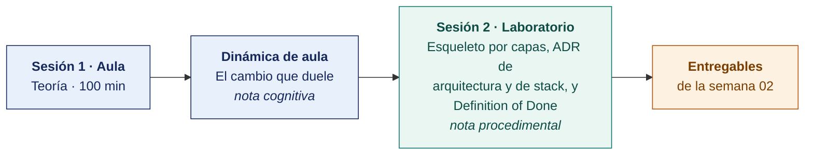

  
  &nbsp;&nbsp;&nbsp;&nbsp;&nbsp;&nbsp;
  

  <strong>Universidad Privada de Tacna</strong> 
  Facultad de Ingeniería · Escuela Profesional de Ingeniería de Sistemas

<h1 align="center">Semana 02 · Arquitectura de Aplicaciones Móviles</h1>

  <strong>SI-988 · Soluciones Móviles II</strong> 
  4 horas académicas de 50 min · aula: teoría 60 + dinámica 35 + cierre 5 · laboratorio: taller 60 + avance asistido 40

---

## Datos de la asignatura

| | |
|---|---|
| **Asignatura** | SI-988 · Soluciones Móviles II |
| **Escuela** | Escuela Profesional de Ingeniería de Sistemas |
| **Ciclo** | IX · 04 horas semanales · 04 créditos · Electivo |
| **Prerrequisito** | SI-883 Soluciones Móviles I |
| **Unidad** | I — Consumo de servicios web SOAP y REST |
| **Semana** | 02 de 17 |
| **Duración** | 4 horas académicas de 50 min · aula: teoría 60 + dinámica 35 + cierre 5 · laboratorio: taller 60 + avance asistido 40 |
| **Resultados de aprendizaje** | **RA1** Analiza e interpreta los conceptos avanzados de desarrollo móvil · **RA2** Propone el plan de desarrollo de su app con metodologías ágiles |
| **Artefacto del proyecto** | **ADR-001** arquitectura · **ADR-002** stack tecnológico · **Definition of Done** · Esqueleto por capas |

### Lo que indica el sílabo

**Contenido conceptual.** Arquitectura de aplicaciones móviles.

**Contenido procedimental.** Implementación de una arquitectura básica para una aplicación móvil (MVC, MVVM (*Model-View-ViewModel*)).

## Materiales de esta semana

| | Documento | Qué encontrarás | Dónde y cuánto dura |
|---|---|---|---|
| 1 | **[Teoría](1-TEORIA.md)** | Por qué la arquitectura es una decisión económica · Los patrones de presentación MVC, MVP, MVVM y MVI · Clean Architecture aplicada a móviles | Aula · 100 min |
| 2 | **[Dinámica de aula](2-DINAMICA.md)** | El cambio que duele, con su material, su ejemplo resuelto y su rúbrica | Aula · dentro de los 100 min de la sesión de teoría |
| 3 | **[Taller de laboratorio](3-TALLER.md)** | Esqueleto por capas, decisiones de arquitectura y Definition of Done | Laboratorio · 100 min |

## Ruta de la semana

## Entregables

| Entregable | Formato y nombre del archivo | Vence |
|---|---|---|
| **Dinámica de aula** · El cambio que duele | PDF desde la [plantilla de dinámica](../PLANTILLAS/SI988-PLANTILLA-DINAMICA.docx) · `SI988-S02-DINAMICA-Grupo<N>.pdf` | Antes de cerrar la sesión de teoría |
| **Informe del taller de laboratorio N.º 02** | PDF en formato EPIS desde la [plantilla de taller](../PLANTILLAS/SI988-PLANTILLA-TALLER.docx) · `SI988-S02-TALLER-Grupo<N>.pdf` | 48 h después del taller |
| ADR-001, ADR-002, DoD y funcionalidad vertical | Commit en el repositorio, CI en verde | 48 h después del taller |

> Ambos se entregan en **PDF**, con la carátula de la UPT y los códigos de todos los integrantes. Las plantillas obligatorias están en [`PLANTILLAS/`](../PLANTILLAS/).

## Cómo se evalúa

| Criterio | Instrumento | Peso |
|---|---|---|
| Cognitivo | Rúbrica de «El cambio que duele» + exposición de 10 min en la Semana 03 | 25 % |
| Procedimental | Lista de cotejo de los 14 resultados del laboratorio | 35 % |
| Actitudinal | Decisión de stack basada en evidencia y no en preferencia; cumplimiento de las convenciones del repositorio | 15 % |

## Preparación para la Semana 03

- Leer **completa** la [Scrum Guide 2020](https://scrumguides.org/) — son 13 páginas y se exigirá su dominio.
- **Leer.** Lasa Gómez et al., *Manual imprescindible de métodos ágiles* — capítulos de Scrum y Kanban.
- Traer el **borrador del Product Backlog**. Al menos 20 historias candidatas de la aplicación.
- Traer la decisión sobre el **backend** y la lista de endpoints previstos.

---

**Docente** · Dr. Oscar Juan Jimenez Flores
[oscarjimenezflores@upt.pe](mailto:oscarjimenezflores@upt.pe) · [LinkedIn](https://www.linkedin.com/in/oscar-jimenez-flores/) · [CTI Vitae — CONCYTEC](https://ctivitae.concytec.gob.pe/appDirectorioCTI/VerDatosInvestigador.do?id_investigador=33398)

Escuela Profesional de Ingeniería de Sistemas · Universidad Privada de Tacna · Tacna, Perú
