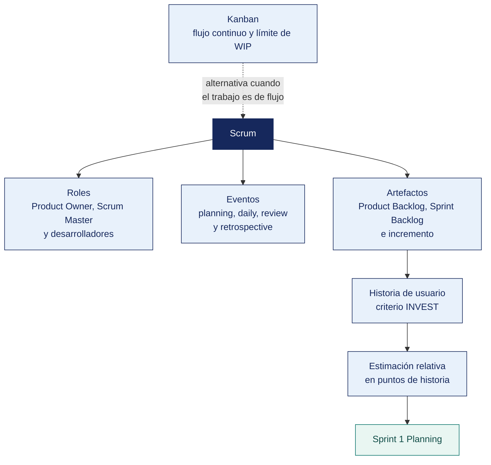

[Semana 03](README.md) · **Teoría** · [Dinámica de aula](2-DINAMICA.md) · [Taller de laboratorio](3-TALLER.md)

# Teoría · Metodologías Ágiles en el Desarrollo Móvil · Scrum y Kanban

**SI-988 · Soluciones Móviles II** · Semana 03 · Sesión 1 en aula · 2 horas académicas, 100 min, con la dinámica incluida

> ¿Un término no le resulta claro? Está definido en el [glosario técnico del curso](../GLOSARIO.md).

---

## La pregunta de esta sesión

Un equipo se declara Scrum. Tiene sprints de dos semanas, tablero, Daily de quince minutos y una Review al final.

El Product Owner son tres personas que no se ponen de acuerdo, el Sprint Backlog lo llena el jefe de proyecto y en el día 8 nadie sabe qué se puede recortar sin perder el sentido del sprint. Las ceremonias están todas y el marco no está.

> **La pregunta que ordena esta sesión.** *¿Qué es lo que hace que un equipo esté haciendo Scrum de verdad?*

## Antes de empezar

| Lo que necesita traer | De dónde sale |
|---|---|
| La arquitectura decidida y el ADR-001 del equipo | Semana 02 |
| La propuesta de valor y el alcance del producto | Semana 01 |
| Nociones de gestión de proyectos | Cursos previos de la carrera |
| La composición y las competencias del propio equipo | Trabajo del equipo |

> **Exploración (5 min), antes de cualquier definición.** El aula responde antes de la teoría y se anota. *¿Ese equipo hace Scrum? ¿Qué le sobra y qué le falta? ¿Quién decide qué entra en el sprint?* No se corrige nada todavía.

## Distribución del tiempo

| Momento | Minutos |
|---|---|
| El caso del equipo con todas las ceremonias y la exploración inicial | 8 |
| **Bloque 1.** Scrum según la guía y sus desviaciones habituales | 20 |
| **Bloque 2.** Refinamiento y estimación del Product Backlog · con su microaplicación | 20 |
| **Bloque 3.** Kanban y cuándo conviene | 12 |
| Cierre, respuesta a la pregunta de la sesión y puente a la dinámica | 5 |
| **Total de la sesión de aula** | **65** |

## Mapa de la sesión



---

## Bloque 1 · Scrum según la guía y sus desviaciones habituales

> **La pregunta del bloque.** *¿Qué exige la guía y qué le añadió la industria encima?*

**Scrum es un marco, no una metodología.** La *Scrum Guide 2020* lo define como un marco liviano que ayuda a generar valor mediante soluciones adaptativas para problemas complejos. Es **deliberadamente incompleto** — define solo lo indispensable y deja el resto a la inteligencia del equipo.

**Los tres pilares del control empírico.**

| Pilar | Qué significa | Sin él |
|---|---|---|
| **Transparencia** | El proceso y el trabajo son visibles para quienes ejecutan y reciben | Las decisiones se toman con información incompleta |
| **Inspección** | Los artefactos y el avance se inspeccionan con frecuencia | Los problemas se descubren tarde |
| **Adaptación** | Si algo se desvía, se ajusta cuanto antes | Se repite lo que no funciona |

**Los cinco valores.** Compromiso, foco, apertura, respeto y coraje. **El coraje es el que más falta**. Es el que permite decir «esto no va a estar listo» en la Daily y no en la Review.

**El equipo Scrum — un solo equipo, sin subequipos.**

| Rendición de cuentas | Responsabilidad | Deformación frecuente |
|---|---|---|
| **Product Owner** | Maximizar el valor del producto. **Gestiona el Product Backlog y decide qué se construye** | Se convierte en un tomador de pedidos que traslada todo lo que le piden |
| **Scrum Master** | La eficacia del equipo. Remueve impedimentos, guía la adopción de Scrum | Se convierte en un jefe de proyecto que asigna tareas |
| **Developers** | Crear un incremento **utilizable** cada sprint. **Se autogestionan** | Esperan que alguien les asigne el trabajo |

> **La regla que casi todos rompen.** El Product Owner es **una persona**, no un comité. Y **nadie puede obligar a los Developers a trabajar sobre requisitos distintos de los del Sprint Backlog**, que ellos mismos definieron.

**Los cinco eventos.**

| Evento | Duración máxima (sprint de 2 semanas) | Propósito | Deformación frecuente |
|---|---|---|---|
| **El Sprint** | 2 semanas | Contenedor de los demás eventos; produce un incremento utilizable | Se extiende «una semanita más» — **prohibido** |
| **Sprint Planning** | 4 h | **Responder.** *¿Por qué es valioso este sprint? ¿qué se puede hacer? ¿cómo se hará?* | Se reduce a repartir tareas sin definir el Sprint Goal |
| **Daily Scrum** | **15 min**, misma hora y lugar | Inspeccionar el avance hacia el Sprint Goal y adaptar el plan del día | Se convierte en un reporte de estado al Scrum Master |
| **Sprint Review** | 2 h | Inspeccionar el incremento **con los interesados** y adaptar el backlog | Se convierte en una demostración de diapositivas sin software funcionando |
| **Sprint Retrospective** | 1.5 h | Inspeccionar **cómo trabajó el equipo** y comprometer una mejora | Se omite «porque no hay tiempo» — **es la que hace mejorar** |

**Los tres artefactos y su compromiso** —la aportación central de la edición 2020:

| Artefacto | Qué es | **Compromiso** | Función del compromiso |
|---|---|---|---|
| **Product Backlog** | Lista ordenada y emergente de lo que se necesita | **Product Goal** | Da dirección de largo plazo al equipo |
| **Sprint Backlog** | Sprint Goal + elementos seleccionados + plan para entregarlos | **Sprint Goal** | Da foco y coherencia al sprint |
| **Incremento** | Paso concreto hacia el Product Goal | **Definition of Done** | Define qué significa «utilizable» |

> **El Sprint Goal es el artefacto más ignorado y el más útil.** No es la lista de historias. Es **el objetivo único que da sentido al sprint** y permite negociar el alcance sin perder el rumbo. Si a mitad del sprint una historia resulta más costosa de lo previsto, el equipo puede reducir su alcance **siempre que el Sprint Goal siga siendo alcanzable**.

**Lo que este curso usa y no está en la Scrum Guide.** La guía es deliberadamente incompleta, y por eso la industria le agregó prácticas encima. Son útiles, se van a usar en el curso y hay que saberlas — pero **no son Scrum**, y conviene tenerlo claro antes de que un colega o un cliente se lo discuta.

| Lo que usa este curso | ¿Está en la *Scrum Guide 2020*? | De dónde viene |
|---|---|---|
| Product Backlog · Sprint Backlog · Incremento | **Sí** | *Scrum Guide* |
| Product Goal · Sprint Goal · Definition of Done | **Sí** | *Scrum Guide* |
| Elemento del Product Backlog y su refinamiento | **Sí** | *Scrum Guide* |
| **Historia de usuario** | **No** | Extreme Programming |
| **Épica** | **No** | Práctica de la industria; se difundió con *User Stories Applied* (Mike Cohn, 2004) y con las herramientas de gestión |
| **INVEST** | **No** | Bill Wake, 2003 |
| **Puntos de historia** y **Planning Poker** | **No** | Extreme Programming |
| **Velocidad** | **No** | Práctica ágil general |
| **Gherkin**, *Dado / Cuando / Entonces* | **No** | Desarrollo guiado por comportamiento; el lenguaje viene de Cucumber |

> **Por qué importa.** La *Scrum Guide* **no dice cómo se escribe un elemento del Product Backlog.** Solo exige que el backlog sea una lista **ordenada** y **emergente**, y que sus elementos estén lo bastante refinados para caber en un sprint. La historia de usuario y la épica son **una forma** de cumplirlo, no la única. Un equipo que ordena su backlog con casos de uso o con especificaciones también hace Scrum. En este curso se usan historias y épicas porque son las que va a encontrar en cualquier equipo y en cualquier herramienta.

> **El error frecuente del bloque.** Tener un Product Owner que en realidad es un comité. La guía es explícita — es **una persona**, y nadie puede obligar a los Developers a trabajar sobre requisitos distintos de los del Sprint Backlog que ellos mismos definieron. Un comité de tres que no se pone de acuerdo produce un backlog sin orden y un sprint sin objetivo.

## Bloque 2 · Refinamiento y estimación del Product Backlog

> **La pregunta del bloque.** *¿Para qué sirve estimar, si el número nunca acierta?*

**La historia de usuario** —formato y calidad:

```
Como <rol de usuario>
quiero <capacidad>
para <beneficio>

Criterios de aceptación (Gherkin):
  Dado <contexto>
  Cuando <acción>
  Entonces <resultado observable>
```

**Los criterios INVEST** para evaluar una historia:

| Letra | Criterio | Prueba |
|---|---|---|
| **I** | Independiente | ¿Puede desarrollarse sin esperar a otra? |
| **N** | Negociable | ¿Describe el qué y el porqué, dejando el cómo al equipo? |
| **V** | Valiosa | ¿Un usuario notaría su ausencia? |
| **E** | Estimable | ¿El equipo puede estimarla, o falta información? |
| **S** | Pequeña | ¿Cabe holgadamente en un sprint? |
| **T** | Verificable | ¿Los criterios de aceptación permiten decir sí o no sin discusión? |

**Historias que no cumplen INVEST y cómo se corrigen.**

| Historia defectuosa | Defecto | Corrección |
|---|---|---|
| «Como usuario quiero una base de datos» | Sin valor de usuario | Es una tarea técnica dentro de una historia con valor |
| «Como usuario quiero gestionar mi perfil» | Demasiado grande | **Dividir.** Ver perfil · editar nombre · cambiar foto · eliminar cuenta |
| «Como usuario quiero que la app sea rápida» | No verificable | «La lista de pedidos carga en menos de 1,5 s con 100 elementos, en un dispositivo de gama media» |
| «Como desarrollador quiero refactorizar» | No es historia de usuario | Es deuda técnica entra al backlog como tal, con su justificación de valor |

**Estimación relativa con puntos de historia.** No se estima en horas — se estima en **tamaño relativo**, que integra complejidad, esfuerzo e incertidumbre.

| Puntos | Referencia |
|---|---|
| 1 | Trivial; el equipo lo ha hecho muchas veces |
| 2 | Sencillo, sin incertidumbre |
| 3 | Requiere pensar; sin sorpresas previstas |
| 5 | Complejo o con alguna incertidumbre |
| 8 | Complejo **e** incierto |
| 13 | **Demasiado grande: se divide antes de entrar al sprint** |
| ? | **Falta información.** Requiere una investigación acotada (*spike*) |

**Planning Poker.** Se estima en conjunto; **la discusión importa más que el número**. Cuando dos integrantes dan estimaciones muy distintas, es porque entienden la historia de forma distinta. **Esa conversación es el valor del ejercicio**.

**Velocidad.** Puntos completados por sprint. **No se compara entre equipos** —los puntos no son una unidad universal— y no se usa como indicador de productividad individual. Su único uso legítimo es **proyectar cuánto cabe en el próximo sprint**.

**Ejemplo trabajado — de una historia inservible a un sprint con foco.** Historia tal como la trajo el equipo al refinamiento. *«Como usuario quiero ver los menús»*.

**Paso 1 — se somete a INVEST.**

| Letra | ¿Cumple? | Por qué |
|---|---|---|
| I Independiente | Sí | — |
| N Negociable | Sí | — |
| V Valiosa | **Dudoso** | «Ver los menús» ¿de qué local, ordenados cómo, con o sin conexión? |
| E Estimable | **No** | El equipo estima 3, 8 y 13. No están hablando de lo mismo |
| S Pequeña | **No** | Incluye lista, detalle, imágenes, caché y estado agotado |
| T Verificable | **No** | No hay criterio que permita decir sí o no |

**Paso 2 — se divide en historias que sí cumplen.**

| Historia | Puntos | Criterio de aceptación (extracto) |
|---|---|---|
| **H-01** Ver la lista de menús de hoy de los locales que sigo | 3 | *Dado* que sigo 3 locales y hay conexión, *cuando* abro la app, *entonces* veo los 3 menús de hoy ordenados por cercanía, en menos de 1,5 s en gama media |
| **H-02** Ver el detalle de un menú con sus platos y precio | 2 | *Dado* un menú publicado, *cuando* lo toco, *entonces* veo platos, precio y hora de publicación |
| **H-03** Ver el último menú conocido sin conexión | 5 | *Dado* que no hay red, *cuando* abro la app, *entonces* veo el último menú guardado con la marca «actualizado a las HH:MM» |
| **H-04** Distinguir los platos agotados | 3 | *Dado* un plato marcado agotado por el local, *cuando* veo el detalle, *entonces* aparece tachado y con etiqueta «agotado» |
| **H-05** Subir foto del menú desde la cámara *(local)* | **13** | **No entra**: se divide o se convierte en *spike* |

**Paso 3 — el Sprint Goal, que es lo que da sentido al conjunto.**

> *«Que un comensal pueda decidir dónde almuerza hoy abriendo la app una sola vez, incluso sin conexión.»*

> **El Sprint Goal es lo que permite negociar en el día 8.** Si H-03 resulta el doble de costosa, el equipo puede reducirla a «guardar solo el menú del local favorito» y **el objetivo sigue siendo alcanzable**. Si en cambio se decidiera sacrificar H-01, el sprint pierde sentido aunque se completen las demás historias. **Sin Sprint Goal, todas las historias parecen igual de importantes y se recorta la que sea más difícil**, que suele ser la que sostenía el valor.

> **Microaplicación (6 min) · el Sprint Goal del sprint que viene.** Cada equipo escribe **el Sprint Goal de su sprint 1 en una sola frase** y comprueba que permita recortar alguna historia sin perder el sentido. El que no permita recortar nada todavía no es un objetivo, es una lista.

| Caso | Qué debe contener una buena respuesta |
|---|---|
| Tres personas estiman 3, 8 y 13. ¿Se promedia? | **No. Se conversa.** La diferencia significa que entienden cosas distintas por la historia. El valor del Planning Poker es esa conversación, no el número final |
| ¿Por qué H-05 con 13 puntos no entra al sprint? | Porque 13 señala que la historia es demasiado grande o demasiado incierta. Se divide, o se hace primero un *spike* acotado para reducir la incertidumbre |
| El PO pide agregar una historia el día 6. ¿Se puede? | Solo si no compromete el Sprint Goal y el equipo lo acepta. Lo que no puede hacerse es imponerla. Los Developers definieron el Sprint Backlog |

> **El error frecuente del bloque.** Promediar las estimaciones dispares. Cuando dos integrantes estiman 3 y 13 es porque entienden la historia de forma distinta, y **esa conversación es el valor del ejercicio**. El promedio la cancela y deja al equipo con un número que nadie sostiene.

## Bloque 3 · Kanban y cuándo conviene

> **La pregunta del bloque.** *¿Por qué un tablero lleno puede significar que no se avanza?*

| | **Scrum** | **Kanban** |
|---|---|---|
| Cadencia | Iteraciones de duración fija | Flujo continuo |
| Compromiso | Sprint Goal por iteración | Sin compromiso por iteración |
| Métrica central | Velocidad | **Tiempo de ciclo** y **trabajo en curso** |
| Cambio de alcance | No durante el sprint, salvo que no afecte al Sprint Goal | En cualquier momento |
| Roles | PO, SM, Developers | No los define |
| Cuándo conviene | Desarrollo de producto con objetivos por iteración | Soporte, mantenimiento, trabajo de llegada impredecible |

**Las prácticas de Kanban que este curso adopta dentro de Scrum.**

| Práctica | Aplicación |
|---|---|
| **Visualizar el flujo** | Tablero con columnas que reflejan el proceso real, no el ideal |
| **Limitar el trabajo en curso (WIP)** | **Máximo 1 historia en curso por Developer.** Es la práctica que más acelera un equipo |
| **Gestionar el flujo** | Medir el tiempo de ciclo de cada historia y atacar los cuellos de botella |
| **Hacer explícitas las políticas** | La Definition of Done y los criterios de paso entre columnas, escritos en el tablero |

> **Por qué limitar el trabajo en curso.** Un equipo con seis historias «en progreso» y ninguna terminada no avanza. **Acumula trabajo sin entregar**. El límite de WIP fuerza a terminar antes de empezar, y es lo que convierte un tablero lleno en un incremento entregable.

**Columnas del tablero del curso.**

```
 Product   │ Sprint   │ En       │ En       │ En        │ Listo
 Backlog   │ Backlog  │ progreso │ revisión │ pruebas   │ (DoD ✔)
           │          │ WIP ≤ 1  │ WIP ≤ 2  │ WIP ≤ 2   │
           │          │ por dev  │          │           │
```

## Cierre · qué se lleva de aquí

**La respuesta a la pregunta con la que abrimos.** Los tres pilares del control empírico y los compromisos de los artefactos, no las ceremonias. El equipo del caso tiene todos los eventos y no tiene ninguno de los dos — su Product Owner es un comité, su Sprint Backlog lo llena alguien de fuera y **no tiene Sprint Goal**, que es justo lo que permite decidir qué se recorta en el día 8.

**Las tres ideas que deben quedar.**

| Idea | Por qué importa en el ejercicio profesional |
|---|---|
| Scrum es deliberadamente incompleto y define solo lo indispensable | Historias, épicas y Planning Poker son útiles y no son Scrum; conviene saberlo antes de discutirlo con un cliente |
| El Sprint Goal es el artefacto más ignorado y el más útil | Sin él todas las historias parecen igual de importantes y se recorta la que sostenía el valor |
| El límite de trabajo en curso es lo que convierte un tablero lleno en un incremento | Seis historias en progreso y ninguna terminada es acumulación, no avance |

**Volviendo a la exploración del inicio.** Se releen las respuestas del inicio. La mayoría responde que ese equipo sí hace Scrum porque tiene las ceremonias. Tener los eventos y no tener el objetivo del sprint es exactamente lo que la guía llama **Scrum de apariencia**.

**Lo que sigue.** La [dinámica de esta sesión](2-DINAMICA.md) refina historias reales del backlog propio con INVEST y formula el Sprint Goal del sprint 1. El taller monta después el tablero con su límite de trabajo en curso.


**Pregunta de cierre.** *si al día 8 del sprint una historia resulta el doble de costosa, ¿qué se sacrifica?* La respuesta correcta —reducir el alcance de esa historia manteniendo el Sprint Goal— solo es posible si el Sprint Goal existe y está bien formulado.
---

---

[Semana 03](README.md) · **Teoría** · [Dinámica de aula](2-DINAMICA.md) · [Taller de laboratorio](3-TALLER.md)

---

**Docente** · Dr. Oscar Juan Jimenez Flores
[oscarjimenezflores@upt.pe](mailto:oscarjimenezflores@upt.pe) · [LinkedIn](https://www.linkedin.com/in/oscar-jimenez-flores/) · [CTI Vitae — CONCYTEC](https://ctivitae.concytec.gob.pe/appDirectorioCTI/VerDatosInvestigador.do?id_investigador=33398)

Escuela Profesional de Ingeniería de Sistemas · Universidad Privada de Tacna · Tacna, Perú
