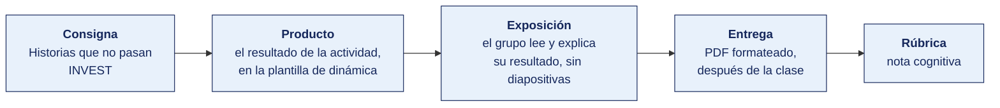

[Semana 03](README.md) · [Teoría](1-TEORIA.md) · **Dinámica de aula** · [Taller de laboratorio](3-TALLER.md)

# Dinámica de aula · Historias que no pasan INVEST

**SI-988 · Soluciones Móviles II** · Semana 03 · Actividad en aula, **dentro de los 100 min de la sesión de teoría** · calificación **cognitiva**

> ¿Un término no le resulta claro? Está definido en el [glosario técnico del curso](../GLOSARIO.md).

---

## Cómo funciona la actividad



## Qué entregas

| | |
|---|---|
| **Archivo** | `SI988-S03-DINAMICA-Grupo<N>.pdf` |
| **Plantilla obligatoria** | [SI988-PLANTILLA-DINAMICA.docx](../PLANTILLAS/SI988-PLANTILLA-DINAMICA.docx) |
| **Formato** | PDF exportado desde la plantilla en Word, con la carátula de la UPT y los apellidos, nombres y códigos de todos los integrantes |
| **Qué va dentro** | Lo que el grupo resolvió en aula. Las tablas de la sección **Producto** van completas, con los textos redactados, y cada decisión va justificada |
| **Dónde se sube** | Aula virtual, tarea «Dinámica · Semana 03» |
| **Cuándo vence** | Hasta 24 h después de la sesión de teoría. La tabla se resuelve en aula; el PDF se formatea y se sube después |
| **Exposición** | En la ronda de cierre de **esta misma sesión**. El grupo **lee y explica su resultado** ante el aula, con el documento a la vista. No se usan diapositivas |

> No se califica un trabajo entregado en `.docx`, sin carátula, sin los códigos de los integrantes o con las tablas del producto vacías.

---

## Consigna

> **«Historias que no pasan INVEST»**
> Cada equipo recibe **doce historias de usuario reales de proyectos móviles**, que están en **Material de trabajo**, y debe — **evaluarlas con INVEST**, **corregir las que fallan**, **dividir las que son demasiado grandes** y **estimarlas con Planning Poker** en vivo.

| | |
|---|---|
| **Su papel** | **Product Owner en el refinamiento**, con el sprint empezando mañana |
| **Misión** | Dejar las doce historias listas para entrar al sprint, corregidas, divididas y estimadas |
| **Restricción** | **Ninguna historia sale del refinamiento con más de 8 puntos.** Lo que no se pueda dividir se declara como riesgo |

## Cómo se desarrolla · 35 minutos

| | Bloque | Quién | Minutos |
|---|---|---|---|
| **1** | **Las doce.** Evaluadas con las seis letras, marcando el defecto principal de cada una | Equipo | 10 |
| **2** | **Corrección.** Reescritas las que fallan, conservando el valor de usuario | Equipo | 9 |
| **3** | **División y estimación.** Las dos más grandes, divididas, con criterios en Gherkin y su estimación | Equipo | 8 |
| **4** | **Ronda en aula.** Una estimación en la que el equipo discrepó, y por qué discrepaban | Todos | 8 |

## Material de trabajo

Trabaja sobre estas doce historias. Están tomadas de tableros reales de proyectos móviles, con su redacción original.

| # | Historia original |
|---|---|
| 1 | Como usuario quiero que la app tenga un buen rendimiento. |
| 2 | Como comprador quiero ver el detalle de un producto para decidir si lo compro. |
| 3 | Implementar la base de datos local. |
| 4 | Como usuario quiero registrarme, iniciar sesión, recuperar mi contraseña, editar mi perfil y cerrar sesión. |
| 5 | Como administrador quiero un panel de control. |
| 6 | Como comprador quiero buscar productos por nombre para encontrarlos rápido. |
| 7 | Como usuario quiero que la app sea bonita y moderna. |
| 8 | Como repartidor quiero ver mi ruta del día para saber a dónde ir primero. |
| 9 | Refactorizar el módulo de pagos. |
| 10 | Como comprador quiero pagar con tarjeta, con billetera digital, contra entrega y con transferencia. |
| 11 | Como usuario quiero recibir una notificación cuando mi pedido cambie de estado. |
| 12 | Como comprador quiero que el carrito se conserve si cierro la app, para no armarlo de nuevo. |

**El criterio INVEST**

| Letra | Significa | Cómo se comprueba |
|---|---|---|
| **I** · Independiente | Se puede construir sin esperar a otra | ¿Se puede poner en cualquier sprint sin bloquearse? |
| **N** · Negociable | Describe el qué, no el cómo | ¿Deja margen para decidir la solución técnica? |
| **V** · Valiosa | El beneficio es para el usuario, no para el equipo | ¿Puedo explicarle a un usuario qué gana? |
| **E** · Estimable | El equipo sabe lo suficiente para dimensionarla | ¿Alguien puede poner un número sin adivinar? |
| **S** · Pequeña | Cabe holgadamente en un sprint | ¿Se termina en menos de la mitad del sprint? |
| **T** · Verificable | Tiene criterio de aceptación comprobable | ¿Puedo escribir un escenario que pase o falle? |

**Formato de criterio de aceptación exigido**

```gherkin
Escenario: <nombre del escenario>
  Dado <estado inicial>
    Y <condición adicional>
  Cuando <acción del usuario>
  Entonces <resultado observable>
    Y <resultado adicional>
```

**Escala de estimación.** Serie de Fibonacci — 1, 2, 3, 5, 8, 13, 21. Una historia estimada en 13 o más se divide antes de entrar al sprint.

## Producto

**Producto 1 — Diagnóstico y corrección.**

| # | Historia original | I | N | V | E | S | T | Defecto principal | **Historia corregida** |
|---|---|---|---|---|---|---|---|---|---|

**Producto 2 — División y estimación.** Para las **dos historias más grandes** — su división en historias que cumplen INVEST, con criterios de aceptación en Gherkin y la estimación de cada una, más el registro de **una discrepancia de estimación** y qué reveló la discusión.

> **Dónde va.** Este producto se presenta en la **sección 2 de la [plantilla de dinámica](../PLANTILLAS/SI988-PLANTILLA-DINAMICA.docx)**, «El producto». No se copia la consigna ni la teoría. Solo el resultado y lo que lo sostiene.

## Ejemplo resuelto

*El caso de este ejemplo es distinto del que le toca a tu grupo. Sirve para que veas el nivel de detalle que se espera, no para copiarlo.*

**Una historia bien diagnosticada y corregida.** Es una decimotercera historia, que no está entre las doce de tu material.

*Diagnóstico y corrección*

| Campo | Contenido |
|---|---|
| Historia original | «Como usuario quiero que la app sea segura.» |
| I — Independiente | **Falla.** La seguridad atraviesa autenticación, almacenamiento y red. No se construye por separado |
| N — Negociable | **Falla.** No hay nada que negociar porque no se sabe qué se pide |
| V — Valiosa | **Pasa.** Al usuario le importa que sus datos no se expongan |
| E — Estimable | **Falla.** Nadie puede estimar «segura» |
| S — Pequeña | **Falla.** Es un atributo del sistema completo |
| T — Verificable | **Falla.** No hay criterio que permita decir si se cumplió |
| Defecto principal | Es un atributo de calidad sin umbral ni alcance, escrito con forma de historia |
| **Historia corregida** | «Como usuario que perdió su teléfono, quiero que mi sesión se cierre sola tras 15 minutos sin uso, para que quien encuentre el equipo no pueda ver mis datos.» |

*Criterios de aceptación en Gherkin*

```gherkin
Escenario: La sesión expira por inactividad
  Dado que el usuario tiene una sesión activa
    Y que han pasado 15 minutos sin ninguna interacción
  Cuando el usuario vuelve a la aplicación
  Entonces se muestra la pantalla de inicio de sesión
    Y no se muestra ningún dato de la sesión anterior

Escenario: La actividad del usuario reinicia el contador
  Dado que el usuario tiene una sesión activa
    Y que han pasado 14 minutos sin interacción
  Cuando el usuario toca cualquier elemento de la pantalla
  Entonces el contador de inactividad vuelve a cero
    Y la sesión permanece activa
```

*Registro de una discrepancia de estimación*

| Campo | Contenido |
|---|---|
| Historia | «Cerrar la sesión sola tras 15 minutos sin uso» |
| Estimaciones | Dos integrantes estimaron 3; uno estimó 13 |
| Qué reveló la discusión | Quien estimó 13 asumía que había que detectar la inactividad en toda la app, pantalla por pantalla. Los otros dos daban por hecho que el marco ofrecía un evento global de interacción. **Sí lo ofrecía**, pero nadie lo había verificado. Se comprobó en la discusión |
| Qué se hizo | Se verificó el evento global durante la sesión de estimación y se reestimó por unanimidad en 3. La historia no se dividió. El desacuerdo era de información, no de tamaño |

**Para qué sirve Planning Poker.** No para acertar el número, sino para que aparezcan estas discrepancias. Una estimación unánime a la primera suele significar que nadie preguntó nada.

**La diferencia entre aprobar y no aprobar.**

| Así no | Así sí |
|---|---|
| «Como usuario quiero una app segura.» | «Como usuario que perdió su teléfono, quiero que mi sesión se cierre sola tras 15 minutos sin uso, para que quien encuentre el equipo no vea mis datos.» |
| «Defecto: es muy general.» | «Defecto: es un atributo de calidad sin umbral ni alcance. Falla I, N, E, S y T.» |
| «Hubo diferencias en la estimación.» | «13 frente a 3, porque uno asumía detectar la inactividad pantalla por pantalla y los otros daban por hecho un evento global del marco. Se verificó en la discusión.» |

## Reglas

- 35 min en aula, dentro de la sesión de teoría.
- Las historias corregidas deben tener **criterios de aceptación verificables en Gherkin**.
- Ninguna historia dividida puede superar los **5 puntos**.
- Es **obligatorio** documentar una discrepancia de estimación y lo que reveló. Es el valor del Planning Poker.
- La exposición es la ronda de cierre de esta misma sesión. El grupo **lee y explica su resultado**. No se usan diapositivas.

## Rúbrica cognitiva (20 puntos)

| Criterio | 5 | 3 | 1 |
|---|---|---|---|
| **Evaluación INVEST** | Las seis letras evaluadas correctamente en las doce historias | En ocho o más | Evaluación superficial |
| **Calidad de la corrección** | Corregidas conservando el valor de usuario, con criterios verificables | Corregidas con criterios ambiguos | Reescritas sin corregir el defecto |
| **División** | División vertical, cada parte entrega valor por sí sola | División por capas técnicas | División arbitraria |
| **Estimación** | Discrepancia documentada con lo que reveló la discusión | Estimaciones consensuadas sin registrar la discusión | Estimación por promedio |

---

---

[Semana 03](README.md) · [Teoría](1-TEORIA.md) · **Dinámica de aula** · [Taller de laboratorio](3-TALLER.md)

---

**Docente** · Dr. Oscar Juan Jimenez Flores
[oscarjimenezflores@upt.pe](mailto:oscarjimenezflores@upt.pe) · [LinkedIn](https://www.linkedin.com/in/oscar-jimenez-flores/) · [CTI Vitae — CONCYTEC](https://ctivitae.concytec.gob.pe/appDirectorioCTI/VerDatosInvestigador.do?id_investigador=33398)

Escuela Profesional de Ingeniería de Sistemas · Universidad Privada de Tacna · Tacna, Perú
