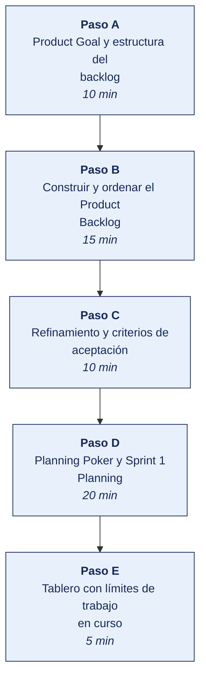

[Semana 03](README.md) · [Teoría](1-TEORIA.md) · [Dinámica de aula](2-DINAMICA.md) · **Taller de laboratorio**

# Taller de laboratorio 03 · Product Goal, Product Backlog, estimación y Sprint 1 Planning

**SI-988 · Soluciones Móviles II** · Semana 03 · Sesión 2 en laboratorio · 60 min de taller + 40 de avance · calificación **procedimental**

> ¿Un término no le resulta claro? Está definido en el [glosario técnico del curso](../GLOSARIO.md).

---

## Secuencia del taller



## Qué entregas

| | |
|---|---|
| **Archivo** | `SI988-S03-TALLER-Grupo<N>.pdf` |
| **Plantilla obligatoria** | [SI988-PLANTILLA-TALLER.docx](../PLANTILLAS/SI988-PLANTILLA-TALLER.docx) |
| **Formato** | PDF exportado desde la plantilla en Word, con la carátula de la UPT, el índice actualizado y las capturas numeradas |
| **Qué va dentro** | Las siete secciones del formato EPIS. La sección **3. Resultados** se califica contra la tabla de resultados esperados de esta guía, y cada resultado necesita su evidencia |
| **Dónde se sube** | Aula virtual, tarea «Taller · Semana 03» |
| **Cuándo vence** | 48 horas después de la sesión de laboratorio |

> No se califica un informe entregado en `.docx`, sin carátula, sin los códigos de los integrantes o con resultados declarados sin evidencia.

---

**La sesión de laboratorio dura 100 minutos: 60 de taller guiado y 40 de avance asistido.** El avance de Sprint 1 lo ejecuta el equipo fuera de la sesión.

## 1. Información sobre el evento práctico

### 1.1. Título del evento práctico

Construcción de los artefactos de Scrum del proyecto — formulación del Product Goal, elaboración y refinamiento del Product Backlog, estimación relativa por Planning Poker, y ejecución del Sprint 1 Planning con definición del Sprint Goal y del Sprint Backlog.

### 1.2. Objetivos

- Formular el **Product Goal** derivado de la visión de producto.
- Construir el **Product Backlog** con al menos 25 elementos, ordenado por valor.
- **Refinar** las historias de los dos primeros sprints hasta cumplir INVEST.
- Redactar **criterios de aceptación en Gherkin** para las historias refinadas.
- **Estimar** con Planning Poker y registrar las discrepancias.
- Ejecutar el **Sprint 1 Planning**. Sprint Goal, selección y plan de entrega.
- Configurar el **tablero con límites de trabajo en curso**.
- **Iniciar el Sprint 1**.

### 1.3. Tiempo de duración

**100 minutos de laboratorio:** 60 min de taller guiado y 40 min de avance asistido del producto del curso.

### 1.4. Resultados de Aprendizaje (RA)

- **RA1** Analiza e interpreta los conceptos avanzados de desarrollo móvil.
- **RA2** Propone el plan de desarrollo de su app con metodologías ágiles.

### 1.5. Recursos

| Recurso | Detalle |
|---|---|
| **Scrum Guide 2020** | https://scrumguides.org/ · versión en español en https://scrumguides.org/download.html |
| **GitHub Projects** | Tablero y backlog. **Obligatorio** |
| **Planning Poker** | Cartas físicas o https://planningpokeronline.com/ |
| Visión de producto y Lean Canvas | Semana 01 |
| ADR-001 y ADR-002 | Semana 02 |
| **Mermaid** | Diagrama del flujo de trabajo |

### 1.6. Seguridad

> **Dónde se trabaja.** El taller se hace en el **laboratorio de la universidad, sobre el emulador**. Cuando un escenario no se reproduce fielmente en el emulador, la verificación en un teléfono real la hace el equipo **fuera de la sesión** y adjunta el video como anexo. Ningún resultado del taller depende de tener un teléfono en clase.

1. Si el backlog contiene requisitos sobre datos de usuarios, cada historia debe declarar **qué dato personal trata**; ese inventario se retoma en la Semana 09.
2. Las historias de autenticación, pago o datos sensibles se marcan desde ahora como **historias con requisitos de seguridad**, y su Definition of Done incluye la verificación MASVS de la Semana 10.
3. El tablero no debe contener credenciales ni URL de producción.
4. Si se usa una herramienta en la nube para el tablero, se verifica que el proyecto sea privado.

---

## 2. Procedimiento o Metodología

### Paso A — Product Goal y estructura del backlog

**Product Goal** (`docs/producto/PRODUCT_GOAL.md`). Es el objetivo de largo plazo del producto, **uno solo a la vez**, alcanzable en varios sprints:

> *«Al término del semestre, <nombre de la app> permitirá a <segmento> <acción de valor> desde su teléfono, sin <la fricción actual>, y estará publicada en Google Play y en la App Store.»*

**Estructura del backlog en tres niveles:**

```
PRODUCT GOAL
   └── ÉPICA 1 · <bloque de valor>
         ├── HISTORIA 1.1  (estimada, refinada)
         ├── HISTORIA 1.2
         └── HISTORIA 1.3
   └── ÉPICA 2 · <bloque de valor>
         └── ...
   └── DEUDA TÉCNICA Y HABILITADORES
         └── <con su justificación de valor>
```

### Paso B — Construir y ordenar el Product Backlog

`docs/sprints/PRODUCT_BACKLOG.csv` — **mínimo 25 elementos**:

| id | Épica | Tipo | **Historia de usuario** | Criterios de aceptación | Valor (1–5) | Riesgo (1–5) | Puntos | Prioridad | **¿Trata datos personales?** | ¿Requisitos de seguridad? | Sprint previsto |
|---|---|---|---|---|---|---|---|---|---|---|---|
| US-01 | Acceso | Historia | Como usuario nuevo quiero registrarme con mi correo para acceder a la app | Ver Gherkin | 5 | 3 | 5 | 1 | **Sí: correo** | **Sí** | 1 |
| US-02 | Catálogo | Historia | Como usuario quiero ver la lista de <elementos> para elegir uno | Ver Gherkin | 5 | 2 | 3 | 2 | No | No | 1 |
| TD-01 | — | Deuda técnica | Configurar la inyección de dependencias para permitir pruebas con dobles | Ver criterios | — | 4 | 3 | 3 | No | No | 1 |
| SP-01 | Integración | Spike | Investigar cómo consumir el servicio SOAP de <proveedor> desde el stack elegido, con límite de 4 horas | Documento de conclusión | — | 5 | 3 | 4 | No | No | 1 |

**Ordenamiento por valor y riesgo.** No se ordena solo por valor: **el riesgo alto se aborda temprano**, cuando aún hay sprints para reaccionar.

```python
# scripts/priorizar_backlog.py
import pandas as pd
b = pd.read_csv("docs/sprints/PRODUCT_BACKLOG.csv")
b["valor"] = pd.to_numeric(b["Valor (1–5)"], errors="coerce").fillna(3)
b["riesgo"] = pd.to_numeric(b["Riesgo (1–5)"], errors="coerce").fillna(3)
b["puntos"] = pd.to_numeric(b["Puntos"], errors="coerce")

# El riesgo alto se aborda temprano: suma, no resta
b["indice"] = (b.valor * 0.6 + b.riesgo * 0.4).round(2)
b = b.sort_values("indice", ascending=False)
print(b[["id","Historia de usuario","valor","riesgo","puntos","indice"]].head(15).to_string(index=False))

print(f"\nElementos en el backlog: {len(b)}")
print(f"Puntos totales estimados: {b.puntos.sum():.0f}")
print(f"Historias sin estimar   : {b.puntos.isna().sum()}")
print(f"Historias de 13 puntos o más: {(b.puntos >= 13).sum()}  ← deben dividirse")
print(f"\nHistorias que tratan datos personales: {(b['¿Trata datos personales?']=='Sí').sum()}")
print("→ Este conteo alimenta el inventario de datos de la Semana 09.")
```

### Paso C — Refinamiento y criterios de aceptación

Se refinan las **historias de los sprints 1 y 2** hasta cumplir INVEST. Cada una recibe sus criterios en Gherkin:

```gherkin
# docs/sprints/criterios/US-02.feature
Característica: Ver la lista de <elementos>

  Escenario: La lista tiene elementos
    Dado que el usuario ha iniciado sesión
    Y existen al menos 3 <elementos> disponibles
    Cuando abre la pantalla de catálogo
    Entonces ve la lista de <elementos> con su nombre, imagen y <atributo clave>
    Y la lista carga en menos de 1,5 segundos con 100 elementos

  Escenario: La lista está vacía
    Dado que el usuario ha iniciado sesión
    Y no existen <elementos> disponibles
    Cuando abre la pantalla de catálogo
    Entonces ve un mensaje que explica que no hay <elementos>
    Y ve una acción sugerida para continuar

  Escenario: Falla la conexión
    Dado que el dispositivo no tiene conexión a internet
    Cuando abre la pantalla de catálogo
    Entonces ve los <elementos> guardados en la última sesión
    Y ve un aviso de que los datos podrían estar desactualizados
    Y ve un botón para reintentar

  Escenario: Error del servidor
    Dado que el servicio responde con un error 500
    Cuando abre la pantalla de catálogo
    Entonces ve un mensaje de error comprensible, sin detalles técnicos
    Y ve un botón para reintentar
```

> **Regla del curso.** Toda historia que muestre datos debe tener, como mínimo, los **cuatro escenarios**: con datos, vacío, sin conexión y error del servidor. Son los cuatro estados de interfaz de la Semana 02, expresados como criterios de aceptación.

### Paso D — Planning Poker y Sprint 1 Planning

**D.1 — Estimación.** Se estiman las historias del sprint 1 y 2 con Planning Poker. Se registra en `docs/sprints/ESTIMACION.md`:

| Historia | Estimaciones individuales | Consenso | **Discrepancia** | Qué reveló la discusión |
|---|---|---|---|---|
| US-01 | 3, 3, 8, 5 | 5 | 3 vs. 8 | Un integrante asumía que el backend ya validaba el correo; otro contaba la verificación por enlace. **La historia no estaba clara**: se agregó un criterio de aceptación |

**D.2 — Capacidad del sprint.** Antes de seleccionar, el equipo calcula cuánto puede comprometer:

```
Capacidad = N.º de Developers × días hábiles del sprint × horas dedicadas por día
Sprint 1: 3 developers × 10 días × 3 h = 90 horas
Descuentos: eventos de Scrum (~8 h) + imprevistos (15 %) → ≈ 70 horas efectivas
Sin velocidad histórica, se compromete de forma CONSERVADORA: el sprint 1 siempre
se sobreestima. Regla del curso: comprometer entre 8 y 13 puntos en el sprint 1.
```

**D.3 — El Sprint Goal.** Se formula **antes** de seleccionar las historias, no después:

> *«Al final del Sprint 1, un usuario podrá <acción de valor> consumiendo datos reales del servicio, con la app funcionando en el emulador y verificada además en un teléfono real.»*

**Prueba del Sprint Goal:** ¿si se elimina una historia del sprint, el objetivo sigue siendo alcanzable? Si la respuesta es no para todas, el objetivo es solo la suma de las historias y no cumple su función.

**D.4 — Sprint Backlog** (`docs/sprints/sprint-01/SPRINT_BACKLOG.md`):

| Campo | Contenido |
|---|---|
| **Sprint Goal** | |
| Fechas | Inicio · fin · Review · Retrospective |
| Capacidad estimada | Horas efectivas |
| Historias seleccionadas | Con sus puntos y su total |
| **Plan de entrega** | Tareas por historia, con responsable inicial |
| Riesgos del sprint | |
| **Acuerdo de la Daily** | Hora, lugar o canal, y duración |

### Paso E — Tablero con límites de trabajo en curso

El tablero es **GitHub Projects**, en el mismo repositorio del equipo. No es una preferencia. Es donde el docente sigue el avance y las contribuciones de cada integrante durante todo el semestre.

**Creación del tablero:**

1. En el repositorio del equipo pestaña **Projects → New project → Board**.
2. Nómbrelo `Sprint Board — <nombre de la app>`.
3. Cree las columnas de la sección 1.4 con sus límites de WIP en el nombre, por ejemplo `En progreso (WIP 3)`.
4. **Settings → Manage access**. Agregue al docente como colaborador con permiso de lectura.

**Volcado del backlog.** Cada elemento del `PRODUCT_BACKLOG.csv` se crea como *issue* del repositorio y se agrega al tablero. Se crean los campos personalizados **Sprint**, **Puntos**, **Riesgo** y **Dato personal**, que son las columnas del CSV.

```bash
# Volcado del backlog con GitHub CLI — requiere: gh auth login
while IFS=, read -r id sprint epica historia puntos riesgo dp resto; do
  [ "$id" = "id" ] && continue
  gh issue create --title "$id · $historia"                   --body "Épica: $epica · Sprint: $sprint · Puntos: $puntos · Riesgo: $riesgo · Dato personal: $dp"                   --label "sprint-$sprint"
done < docs/sprints/PRODUCT_BACKLOG.csv
```

> **Cada historia se asigna a un integrante y se vincula a su rama y a su Pull Request.** Es lo que permite ver quién construyó qué, y es la evidencia del atributo **AG-I03 Trabajo Individual y en Equipo** que se mide en las Semanas 06 y 12. Un tablero movido siempre por la misma persona indica un reparto de trabajo desigual.

Se configuran las columnas de la sección 1.4 con sus límites de WIP, y las **políticas explícitas de paso entre columnas** escritas en el tablero:

| Paso | Política explícita |
|---|---|
| Sprint Backlog → En progreso | El Developer no tiene otra historia en progreso |
| En progreso → En revisión | Pull Request abierto, CI en verde, autoprueba en el emulador |
| En revisión → En pruebas | Aprobado por un integrante distinto del autor |
| En pruebas → Listo | **Todos los criterios de aceptación verificados** y la DoD cumplida |

### Trabajo del equipo fuera de la sesión — Sprint 1

> Este avance excede los 40 min de avance asistido. Lo que no alcance a completarse en laboratorio lo ejecuta el equipo durante la semana, y llega al siguiente taller con el incremento listo. El docente lo revisa en el repositorio y en el tablero, no en clase.

Se inicia el desarrollo. El docente actúa como **Scrum Master en formación**, observando y devolviendo:

| Observación del docente | Qué se corrige |
|---|---|
| Un Developer con tres historias en progreso | Se aplica el límite de WIP |
| Una historia sin criterios verificados que ya está en «Listo» | Se devuelve a «En pruebas» |
| El Sprint Goal no se menciona en la conversación del equipo | Se retoma: es el foco del sprint |
| Un impedimento no registrado | Se anota en el tablero: lo que no está visible no se resuelve |

---


### Avance asistido · Avance de sprint asistido

Los últimos 40 minutos del laboratorio son del equipo. **El docente no dirige.** Queda disponible para consultas y observa el reparto real del trabajo.

| | |
|---|---|
| **Qué se trabaja** | las historias del Sprint en curso, según el Sprint Backlog de la semana |
| **Quién decide qué hacer** | El equipo. El docente no asigna tareas en este tramo |
| **Dónde se registra** | GitHub Projects, con cada elemento asignado a una persona |
| **Para qué sirve la presencia del docente** | Resolver bloqueos en el momento, no revisar entregables |

> **Se registra la contribución individual.** Lo trabajado en este tramo queda en el repositorio con su autoría. Es la evidencia del atributo **AG-I03 Trabajo Individual y en Equipo** que se mide en las semanas de cierre de unidad.

## 3. Resultados

> **Evidencia obligatoria en GitHub.** Todo resultado de este taller se versiona en el repositorio del equipo. El informe **no consigna capturas sueltas**: consigna la **URL** del artefacto en GitHub. Una captura no permite verificar autoría, fecha ni contenido; un enlace sí.
>
> | Qué se entrega | Dónde vive | Qué se escribe en el informe |
> |---|---|---|
> | Código y archivos de configuración | Rama del taller, fusionada a `develop` vía Pull Request | URL del Pull Request |
> | Documentos y matrices | `docs/`, en formato de texto versionable | URL del archivo en la rama |
> | Capturas y videos que el taller exija | `docs/evidencias/S03/` | URL del archivo |
> | Salida de comandos | `docs/evidencias/S03/salidas/*.txt` | URL del archivo |
>
> **Etiqueta del taller.** Al cerrar el taller se crea la etiqueta `taller-03` sobre el commit entregado:
>
> ```bash
> git tag -a taller-03 -m "Taller 03 · SI988"
> git push origin taller-03
> ```
>
> La URL que se consigna en el informe apunta a esa etiqueta:
> `https://github.com/<organizacion>/<repositorio>/tree/taller-03`
>
> **Sin la URL, el resultado no se califica.** El docente evalúa sobre el repositorio, no sobre el PDF.

### 3.1. Tabla de resultados


| # | Resultado esperado | Verificación |
|---|---|---|
| 1 | **Product Goal** formulado, derivado de la visión de producto | `PRODUCT_GOAL.md` |
| 2 | Product Backlog con **≥ 25 elementos**, organizado en épicas | `PRODUCT_BACKLOG.csv` |
| 3 | Backlog ordenado por valor **y riesgo**, con el índice calculado | Salida del script |
| 4 | **Cero historias de 13 puntos o más** sin dividir | Salida del script |
| 5 | Historias de los sprints 1 y 2 refinadas, cumpliendo **INVEST** | Revisión del backlog |
| 6 | Criterios de aceptación en **Gherkin**, con los cuatro escenarios en las historias con datos | `docs/sprints/criterios/` |
| 7 | **Inventario de historias que tratan datos personales** | Columna del backlog |
| 8 | Estimación por Planning Poker con **al menos una discrepancia documentada** y su hallazgo | `ESTIMACION.md` |
| 9 | Capacidad del sprint calculada con sus descuentos | `SPRINT_BACKLOG.md` |
| 10 | **Sprint Goal formulado antes de seleccionar historias**, y que supera su prueba | `SPRINT_BACKLOG.md` |
| 11 | Sprint Backlog completo con el plan de entrega y el acuerdo de la Daily | `SPRINT_BACKLOG.md` |
| 12 | Tablero configurado con **límites de WIP** y políticas explícitas de paso | Captura |
| 13 | **Sprint 1 iniciado** con al menos una historia en progreso y su rama creada | Tablero y repositorio |


## Rúbrica procedimental (20 puntos)

Se aplica sobre el informe entregado y la evidencia enlazada en el repositorio. **Cada criterio se califica de forma independiente.**

| Criterio | 4 — Logrado | 2 — En proceso | 0 — Insuficiente |
|---|---|---|---|
| **Construir y ordenar el Product Backlog** | Completo y correcto, con la evidencia que lo respalda | Completo con errores menores, o correcto pero sin toda la evidencia | Incompleto, o entregado sin ejecutar |
| **Planning Poker y Sprint 1 Planning** | Completo y correcto, con la evidencia que lo respalda | Completo con errores menores, o correcto pero sin toda la evidencia | Incompleto, o entregado sin ejecutar |
| **Evidencia verificable en el repositorio** | Cada resultado tiene su URL sobre la etiqueta `taller-NN`, y el enlace abre lo que dice | La mayoría tiene URL; alguna evidencia es una captura suelta | Se declaran resultados sin enlace, o el enlace no corresponde |
| **Rigor técnico de la implementación** | El código compila, las pruebas pasan y el análisis estático sale limpio | Compila y funciona, con avisos del análisis sin resolver | No compila, o se entregó sin ejecutar |
| **Informe en formato EPIS** | Las seis secciones completas; los resultados se sustentan con la evidencia enlazada | Secciones completas con sustento parcial | Faltan secciones o los resultados se afirman sin evidencia |

| Puntaje | Equivalencia |
|---|---|
| 18 – 20 | Destacado |
| 14 – 17 | Logrado |
| 6 – 13 | En proceso |
| 0 – 5 | Insuficiente |

> **Un resultado declarado sin evidencia enlazada no puntúa**, aunque el trabajo se haya hecho. La tabla de la sección 3.1 es la lista de cotejo; esta rúbrica es lo que determina la nota.

## 4. Conclusiones

Mínimo tres. Líneas argumentales esperadas:

1. El Sprint Goal formulado antes de seleccionar las historias es lo que permite negociar el alcance a mitad del sprint sin perder el rumbo; formulado después, es solo un resumen de la lista.
2. El valor del Planning Poker no está en el número acordado sino en la discrepancia. Cuando dos integrantes estiman muy distinto es porque entienden la historia de forma distinta, y esa conversación evita el retrabajo.
3. El límite de trabajo en curso es la práctica que más acelera a un equipo, porque fuerza a terminar antes de empezar; un tablero con seis historias en progreso y ninguna terminada acumula trabajo sin entregar.

## 5. Referencias Bibliográficas

- Schwaber, K. y Sutherland, J. (2020). *The Scrum Guide*. https://scrumguides.org/
- Scrum.org. *La Guía Scrum 2020 en español*. https://www.scrum.org/resources/blog/la-guia-scrum-2020-scrum-guide-2020
- Canosa Ferreiro, A. J. (2024). *SCRUM: Teoría e implementación práctica*. Ra-Ma.
- Lasa Gómez, C., Álvarez García, A. y De las Heras del Dedo, R. (2017). *Manual imprescindible de métodos ágiles: Scrum, Kanban y Lean*. Anaya Multimedia.
- Cohn, M. (2004). *User Stories Applied: For Agile Software Development*. Addison-Wesley. — criterios INVEST.
- Wake, B. *INVEST in Good Stories, and SMART Tasks*. https://xp123.com/articles/invest-in-good-stories-and-smart-tasks/
- Anderson, D. J. (2010). *Kanban: Successful Evolutionary Change for Your Technology Business*. Blue Hole Press.
- Cucumber. *Gherkin Reference*. https://cucumber.io/docs/gherkin/reference/
- GitHub. *About Projects*. https://docs.github.com/issues/planning-and-tracking-with-projects/learning-about-projects/about-projects
- GitHub. *GitHub CLI manual*. https://cli.github.com/manual/

## 6. Anexos

- `anexo_A_product_backlog.xlsx`
- `anexo_B_criterios_gherkin.pdf`
- `anexo_C_estimacion.pdf` — con la discrepancia documentada
- `anexo_D_sprint_backlog.pdf`
- `anexo_E_tablero.png` — con los límites de WIP visibles

---

---

[Semana 03](README.md) · [Teoría](1-TEORIA.md) · [Dinámica de aula](2-DINAMICA.md) · **Taller de laboratorio**

---

**Docente** · Dr. Oscar Juan Jimenez Flores
[oscarjimenezflores@upt.pe](mailto:oscarjimenezflores@upt.pe) · [LinkedIn](https://www.linkedin.com/in/oscar-jimenez-flores/) · [CTI Vitae — CONCYTEC](https://ctivitae.concytec.gob.pe/appDirectorioCTI/VerDatosInvestigador.do?id_investigador=33398)

Escuela Profesional de Ingeniería de Sistemas · Universidad Privada de Tacna · Tacna, Perú
