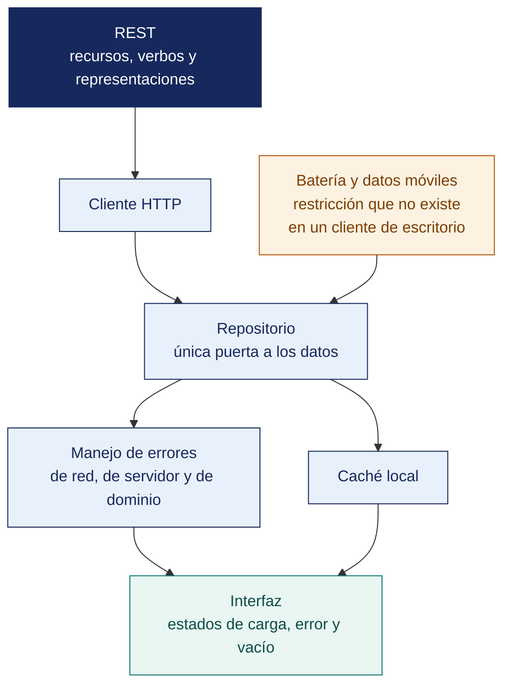

[Semana 04](README.md) · **Teoría** · [Dinámica de aula](2-DINAMICA.md) · [Taller de laboratorio](3-TALLER.md)

# Teoría · Consumo de Servicios Web REST

**SI-988 · Soluciones Móviles II** · Semana 04 · Sesión 1 en aula · 2 horas académicas, 100 min, con la dinámica incluida

> ¿Un término no le resulta claro? Está definido en el [glosario técnico del curso](../GLOSARIO.md).

---

## La pregunta de esta sesión

Un usuario pulsa «confirmar pedido» en el metro. La señal cae, la app no recibe respuesta y muestra un error. El usuario vuelve a pulsar.

Se crean dos pedidos. El servidor recibió las dos peticiones y las dos eran válidas. Nadie escribió el código que falla, y el defecto está igual en producción.

> **La pregunta que ordena esta sesión.** *¿Qué tiene que hacer una app cuando no sabe si su petición llegó?*

## Antes de empezar

| Lo que necesita traer | De dónde sale |
|---|---|
| La arquitectura por capas y el mapeo entre DTO y entidad | Semana 02 |
| El backlog refinado y el Sprint Goal del sprint | Semana 03 |
| Consumo básico de servicios web | Cursos previos de la carrera |
| Nociones de HTTP y de JSON | Cursos previos de la carrera |

> **Exploración (5 min), antes de cualquier definición.** El aula responde antes de la teoría y se anota. *¿De quién es la culpa de los dos pedidos? ¿Cómo se evita? ¿Debe la app reintentar sola?* No se corrige nada todavía.

## Distribución del tiempo

| Momento | Minutos |
|---|---|
| El caso de los dos pedidos y la exploración inicial | 8 |
| **Bloque 1.** Qué es REST y qué se implementa en la práctica | 17 |
| **Bloque 2.** La capa de datos de una app móvil · con su microaplicación | 22 |
| **Bloque 3.** Rendimiento, batería y consumo de datos en el móvil | 13 |
| Cierre, respuesta a la pregunta de la sesión y puente a la dinámica | 5 |
| **Total de la sesión de aula** | **65** |

## Mapa de la sesión



---

## Bloque 1 · Qué es REST y qué se implementa en la práctica

> **La pregunta del bloque.** *¿Qué parte de REST se cumple de verdad en los servicios que va a consumir?*

**REST es un estilo arquitectónico**, no un protocolo. Definido por Roy Fielding, se apoya en seis restricciones. La mayoría de las APIs llamadas «REST» cumplen tres o cuatro.

| Restricción | Qué exige | Consecuencia para el cliente móvil |
|---|---|---|
| **Cliente-servidor** | Separación de responsabilidades | La app evoluciona independientemente del backend |
| **Sin estado** | Cada petición contiene todo lo necesario; el servidor no guarda contexto de sesión | El cliente **debe enviar el token en cada petición** |
| **Cacheable** | Las respuestas se marcan como cacheables o no | **Permite `ETag` y `Cache-Control`.** Menos datos, más batería |
| **Interfaz uniforme** | Recursos identificados por URI, manipulados por representaciones, mensajes autodescriptivos, HATEOAS | Un cliente que asume URI en lugar de seguir enlaces se rompe con cada cambio |
| **Sistema en capas** | El cliente no sabe si habla con el servidor final o con un intermediario | Balanceadores y CDN son transparentes |
| **Código bajo demanda** *(opcional)* | El servidor puede enviar código ejecutable | Rara vez aplica en móviles |

> **HATEOAS es la restricción que casi ninguna API implementa**, y por eso la mayoría son «APIs HTTP con verbos», no REST completo. Para el cliente móvil la consecuencia práctica es que **debe conocer las URI**, y por tanto **versionar la API es indispensable**.

**Métodos HTTP y su semántica** (RFC 9110):

| Método | Propósito | **Seguro** | **Idempotente** | Consecuencia móvil |
|---|---|---|---|---|
| `GET` | Obtener una representación | Sí | Sí | Reintentable sin riesgo; cacheable |
| `POST` | Crear o procesar | No | **No** | **Un reintento puede duplicar el recurso**. Exige clave de idempotencia |
| `PUT` | Reemplazar por completo | No | Sí | Reintentable |
| `PATCH` | Modificar parcialmente | No | No necesariamente | Reintentar con cuidado |
| `DELETE` | Eliminar | No | Sí | Reintentable; el segundo intento devuelve 404 y eso es correcto |

> **El problema del `POST` en móviles.** La conectividad móvil es intermitente. Si el usuario envía un pedido, pierde la señal antes de recibir la respuesta y la app reintenta, **se crean dos pedidos**. La solución profesional es la **clave de idempotencia** — el cliente genera un identificador único por operación y lo envía en una cabecera; el servidor, si ya procesó esa clave, devuelve el resultado anterior sin duplicar.

**Códigos de estado que el cliente debe distinguir.**

| Rango | Significado | Qué hace la app |
|---|---|---|
| **2xx** | Éxito | Procesar. `201` incluye `Location`; `204` no tiene cuerpo |
| **3xx** | Redirección | Seguir, con límite de saltos |
| **400** | Petición inválida | **No reintentar.** Corregir la entrada del usuario |
| **401** | No autenticado | Renovar el token; si falla, cerrar sesión |
| **403** | Sin permiso | **No reintentar.** Mensaje claro al usuario |
| **404** | No existe | Estado vacío, no error |
| **409** | Conflicto | **Resolver.** El recurso cambió desde la última lectura |
| **422** | Entidad no procesable | Mostrar los errores de validación por campo |
| **429** | Demasiadas peticiones | **Esperar según `Retry-After`** y reintentar con retroceso |
| **5xx** | Error del servidor | Reintentar con retroceso exponencial y límite |

> **El error frecuente del bloque.** Tratar el código de estado como un detalle del servidor. Cada código tiene un significado para el cliente, y **un 409 no se le muestra al usuario igual que un 500** — uno se corrige cambiando el dato y el otro solo se puede reintentar. Un cliente que trata todo error igual convierte problemas distintos en el mismo mensaje inútil.

## Bloque 2 · La capa de datos de una app móvil

> **La pregunta del bloque.** *¿De quién es la responsabilidad de que una operación no se duplique?*

**El principio de fuente única de verdad.** La interfaz nunca consulta la red directamente. Consulta al **repositorio**, que decide de dónde vienen los datos.

```
   ViewModel ──► Repositorio ──┬──► Fuente remota (API)
                               │
                               └──► Fuente local (base de datos / caché)
                                        │
                                   Fuente única de verdad:
                                   la interfaz observa la base local,
                                   la red la actualiza.
```

**Las tres estrategias de sincronización.**

| Estrategia | Cómo funciona | Cuándo conviene | Costo |
|---|---|---|---|
| **Solo red** | Cada consulta va al servidor | Datos que cambian constantemente y no sirven desactualizados | Sin conexión, la app no funciona |
| **Caché primero** | Se muestra lo local; se actualiza en segundo plano | La mayoría de los casos | **Puede mostrar datos desactualizados.** Hay que advertirlo |
| **Sin conexión primero** | Se escribe local, se sincroniza cuando hay red | Apps de campo, formularios, captura de datos | Requiere resolver conflictos |

> **La estrategia se decide por historia, no para toda la app.** El catálogo puede ser caché primero; el saldo de una cuenta debe ser solo red; el registro de una visita en campo debe ser sin conexión primero.

**El manejo de errores. Del `Exception` al mensaje del usuario.** El error técnico nunca llega a la pantalla:

```
   Excepción de red / HTTP        ← capa de datos
        │  mapeo
        ▼
   Failure de dominio             ← capa de dominio, sin detalle técnico
   (SinConexion · NoAutorizado · NoEncontrado ·
    ErrorServidor · TiempoAgotado · ErrorValidacion)
        │  traducción
        ▼
   Mensaje comprensible + acción  ← capa de presentación
```

| Failure | Mensaje al usuario | Acción ofrecida |
|---|---|---|
| `SinConexion` | «Sin conexión. Estos son los datos de tu última visita.» | Reintentar |
| `TiempoAgotado` | «La conexión está lenta.» | Reintentar |
| `NoAutorizado` | «Tu sesión expiró.» | Iniciar sesión |
| `NoEncontrado` | «No encontramos lo que buscas.» | Volver / buscar |
| `ErrorValidacion` | El mensaje del campo específico | Corregir el campo |
| `ErrorServidor` | «Tuvimos un problema. Ya lo estamos revisando.» | Reintentar más tarde |

**Prohibido.** Mostrar `SocketTimeoutException`, códigos HTTP crudos o trazas de pila al usuario. Eso va al registro de errores, no a la pantalla.

**Reintentos con retroceso exponencial.** Reintentar de inmediato ante un `5xx` empeora la situación del servidor:

```
intento 1 → falla → esperar 1 s  (+ variación aleatoria)
intento 2 → falla → esperar 2 s
intento 3 → falla → esperar 4 s
intento 4 → falla → rendirse y mostrar error con acción

Solo se reintenta ante: 408, 429, 500, 502, 503, 504 y errores de red.
NUNCA ante 4xx distintos de 408 y 429: el problema es la petición, no el servidor.
La variación aleatoria evita que miles de clientes reintenten simultáneamente.
```

**Ejemplo trabajado — el pedido en el ascensor, paso a paso.** El usuario pulsa «enviar pedido» y pierde la señal antes de recibir respuesta. Se comparan las dos implementaciones sobre la misma secuencia de eventos.

| t | Lo que ocurre | **Sin clave de idempotencia** | **Con clave de idempotencia** |
|---|---|---|---|
| 0 s | La app envía `POST /pedidos` | El servidor recibe, crea **pedido #4471** | La app genera `Idempotency-Key: 7f3c…a1` y la envía. El servidor crea **#4471** y guarda la clave |
| 1 s | Se pierde la señal; la respuesta `201` no llega | La app no sabe si se creó | La app no sabe si se creó |
| 3 s | Vuelve la señal; la app reintenta | El servidor recibe un `POST` idéntico y crea **pedido #4472** | El servidor reconoce la clave `7f3c…a1` y **devuelve el `201` de #4471 sin crear nada** |
| 4 s | La app muestra el resultado | «Pedido enviado» — y hay **dos pedidos** en cocina | «Pedido enviado» — hay **uno** |

**El código de estado también decide si se reintenta.** La misma operación, con tres respuestas distintas:

| Respuesta | ¿Se reintenta? | Qué hace la app |
|---|---|---|
| `503 Service Unavailable` | **Sí**, con retroceso 1 s → 2 s → 4 s y variación aleatoria | Mantiene el pedido en la cola de pendientes |
| `429 Too Many Requests` | **Sí**, esperando lo que indique `Retry-After` | Nunca antes de ese plazo |
| `422 Unprocessable Entity` | **No** | El plato ya no está disponible. Se muestra el error del campo y se ofrece elegir otro |
| `409 Conflict` | **No automáticamente** | El menú cambió desde que se cargó. Se recarga y se pide confirmar |

> **Reintentar un `422` es el error más caro de esta semana**, porque no falla. Reintenta indefinidamente una petición que **nunca** va a tener éxito, consumiendo batería y datos del usuario mientras la pantalla muestra un girador eterno. **La regla es de una línea. Solo se reintenta 408, 429 y 5xx.**

> **Microaplicación (6 min) · la operación que no puede repetirse.** Cada equipo identifica **la operación de su app que no puede ejecutarse dos veces** y escribe cómo la haría idempotente. Casi siempre es un pago, un registro o un envío.

| Caso | Qué debe contener una buena respuesta |
|---|---|
| ¿Por qué la clave la genera el cliente y no el servidor? | Porque el servidor no puede distinguir un reintento de una segunda operación legítima. Solo el cliente sabe que es **la misma** intención del usuario |
| ¿Por qué la variación aleatoria en el retroceso? | Porque si mil clientes fallan a la vez y todos reintentan al segundo exacto, el servidor recibe mil peticiones simultáneas y vuelve a caer |
| El `404` aparece en la lista de errores y en la de estados vacíos. ¿Cuál es? | Depende de la intención: buscar algo que no existe es un **estado vacío** con su propia pantalla; pedir un recurso que debería existir es un error. Nunca se muestra «404» al usuario |

> **El error frecuente del bloque.** Reintentar sin clave de idempotencia. Es el caso de hoy y no lo resuelve el servidor solo — **la clave la genera el cliente antes del primer intento**, porque es el único que sabe que los dos envíos son el mismo pedido.

## Bloque 3 · Rendimiento, batería y consumo de datos en el móvil

> **La pregunta del bloque.** *¿Qué gasta más en un móvil, los datos o la radio encendida?*

| Preocupación | Por qué importa en móvil | Práctica |
|---|---|---|
| **Consumo de datos** | El usuario paga por megabyte | Compresión, paginación, campos parciales, imágenes según densidad de pantalla |
| **Batería** | La radio del móvil consume mucho al activarse | **Agrupar peticiones**; evitar sondeo periódico; usar notificaciones push |
| **Latencia** | Redes móviles con latencia alta y variable | Peticiones en paralelo cuando son independientes; caché agresiva |
| **Conectividad intermitente** | Ascensores, subsuelos, zonas rurales | Cola de operaciones pendientes; idempotencia |
| **Arranque en frío** | El usuario juzga la app en los primeros 2 segundos | Mostrar datos en caché de inmediato; actualizar después |

**Paginación.** Cargar 5 000 elementos de una vez agota la memoria y el plan de datos.

| Técnica | Cómo funciona | Cuándo |
|---|---|---|
| **Por desplazamiento** (`?page=2&size=20`) | Simple | Datos estables |
| **Por cursor** (`?after=<id>&limit=20`) | El servidor devuelve el cursor del siguiente bloque | **Datos que cambian**. Evita elementos duplicados o saltados |

## Cierre · qué se lleva de aquí

**La respuesta a la pregunta con la que abrimos.** Reintentar, y hacerlo con **una clave de idempotencia que genera el cliente antes del primer envío**. El servidor no puede distinguir dos pedidos idénticos de un reintento, porque desde su lado son indistinguibles. Solo la app sabe que es la misma intención del usuario, y esa clave es la manera de decírselo.

**Las tres ideas que deben quedar.**

| Idea | Por qué importa en el ejercicio profesional |
|---|---|
| El código de estado es información para el cliente, no un detalle del servidor | Determina si se corrige el dato, se reintenta o se cierra la sesión |
| La idempotencia es responsabilidad del cliente y del contrato, no solo del servidor | Sin clave generada antes del primer intento, todo reintento es un pedido nuevo |
| En el móvil la radio gasta más que los bytes | Agrupar peticiones y respetar la caché ahorra más batería que comprimir la respuesta |

**Volviendo a la exploración del inicio.** Se releen las respuestas del inicio. La respuesta más común a la primera pregunta culpa al usuario por pulsar dos veces. El usuario hizo lo único razonable — **el defecto es del contrato**, que no previó el reintento.

**Lo que sigue.** La [dinámica de esta sesión](2-DINAMICA.md) diseña el contrato de un endpoint real de la app propia, con su idempotencia y su mapeo de errores. El taller lo implementa después en la capa de datos.


**Pregunta de cierre.** *si el usuario presiona «enviar pedido» dentro de un ascensor, ¿cuántos pedidos se crean?* La respuesta correcta —uno— requiere una clave de idempotencia, y casi ninguna app de estudiante la implementa.
---

---

[Semana 04](README.md) · **Teoría** · [Dinámica de aula](2-DINAMICA.md) · [Taller de laboratorio](3-TALLER.md)

---

**Docente** · Dr. Oscar Juan Jimenez Flores
[oscarjimenezflores@upt.pe](mailto:oscarjimenezflores@upt.pe) · [LinkedIn](https://www.linkedin.com/in/oscar-jimenez-flores/) · [CTI Vitae — CONCYTEC](https://ctivitae.concytec.gob.pe/appDirectorioCTI/VerDatosInvestigador.do?id_investigador=33398)

Escuela Profesional de Ingeniería de Sistemas · Universidad Privada de Tacna · Tacna, Perú
