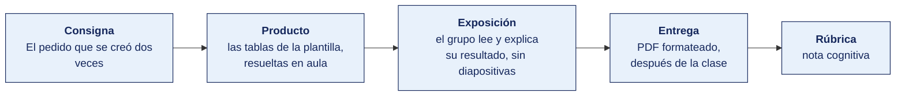

[Semana 04](README.md) · [Teoría](1-TEORIA.md) · **Dinámica de aula** · [Taller de laboratorio](3-TALLER.md)

# Dinámica de aula · El pedido que se creó dos veces

**SI-988 · Soluciones Móviles II** · Semana 04 · Actividad en aula, **dentro de los 100 min de la sesión de teoría** · calificación **cognitiva**

> ¿Un término no le resulta claro? Está definido en el [glosario técnico del curso](../GLOSARIO.md).

---

## Cómo funciona la actividad

## Qué entregas

| | |
|---|---|
| **Archivo** | `SI988-S04-DINAMICA-Grupo<N>.pdf` |
| **Plantilla obligatoria** | [SI988-PLANTILLA-DINAMICA.docx](../PLANTILLAS/SI988-PLANTILLA-DINAMICA.docx) |
| **Formato** | PDF exportado desde la plantilla en Word, con la carátula de la UPT y los apellidos, nombres y códigos de todos los integrantes |
| **Qué va dentro** | Lo que el grupo resolvió en aula. Las tablas de la sección **Producto** van completas, con los textos redactados, y cada decisión va justificada |
| **Dónde se sube** | Aula virtual, tarea «Dinámica · Semana 04» |
| **Cuándo vence** | Hasta 24 h después de la sesión de teoría. La tabla se resuelve en aula; el PDF se formatea y se sube después |
| **Exposición** | En la ronda de cierre de **esta misma sesión**. El grupo **lee y explica su resultado** ante el aula, con el documento a la vista. No se usan diapositivas |

> No se califica un trabajo entregado en `.docx`, sin carátula, sin los códigos de los integrantes o con las tablas del producto vacías.

---

## Consigna

> **«El pedido que se creó dos veces»**
> Su equipo toma **un solo endpoint de escritura** de su aplicación y lo deja bien contratado — método, código de éxito, **idempotencia**, tres errores traducidos a mensaje de usuario, y el `GET` que lo acompaña con su paginación y su caché.

| | |
|---|---|
| **Su papel** | **Desarrollador que responde por el endpoint** cuando el cliente reclama que le cobraron dos veces |
| **Misión** | Dejar el endpoint contratado con idempotencia y tres errores traducidos a mensaje que el usuario entienda |
| **Restricción** | **La clave de idempotencia se genera antes del primer intento.** Reintentar con una clave nueva no es reintentar, es pedir otra vez |

Es el problema que la teoría señala como el propio del móvil. *El usuario envía, pierde la señal antes de la respuesta, la app reintenta y se crean dos pedidos.* Todo lo demás de hoy sirve para que eso no ocurra.

## Cómo se desarrolla · 35 minutos

| | Bloque | Quién | Minutos |
|---|---|---|---|
| **1** | **El endpoint.** Método, ruta, código de éxito y la cabecera que lo acompaña | Equipo | 9 |
| **2** | **Idempotencia y errores.** Cómo se evita el duplicado, y tres errores con su `Failure`, su mensaje y si se reintenta | Equipo | 10 |
| **3** | **El `GET` que lo acompaña.** Paginación por cursor y valor de `Cache-Control`, con la razón | Equipo | 8 |
| **4** | **Ronda en aula.** Tres equipos leen su mensaje de error del `422`. El aula juzga si un usuario lo entendería | Todos | 8 |

## Material de trabajo

**Se trabaja sobre la aplicación propia del equipo.** Elija **el endpoint de escritura más importante de su app** — el que crea la cosa que da sentido a la aplicación —el pedido, la reserva, el reporte, la visita, la publicación—. Uno solo.

**Si su equipo todavía no tiene la API definida**, tome una de estas seis y dígalo al empezar. No baja la nota.

| # | Aplicación | El endpoint de escritura |
|---|---|---|
| 1 | Reserva de canchas deportivas | Crear una reserva de cancha para una fecha y una hora |
| 2 | Registro de visitas de campo | Cerrar una visita con sus fotos y la firma del cliente |
| 3 | Pedido a bodega | Enviar el pedido con sus líneas de producto |
| 4 | Reporte ciudadano de incidencias | Enviar un reporte con foto y ubicación |
| 5 | Control de asistencia con QR | Registrar la marca de entrada de un trabajador |
| 6 | Venta de pasajes interprovinciales | Confirmar la compra de un asiento |

**Los seis `Failure` de dominio de la teoría**, que son los únicos que se usan hoy:

`SinConexion` · `NoAutorizado` · `NoEncontrado` · `ErrorServidor` · `TiempoAgotado` · `ErrorValidacion`

## Producto

**Una sola tabla**, más la tabla de los tres errores. Van en la sección 2 de la plantilla, «El producto».

| | Contenido |
|---|---|
| **El endpoint de escritura** | Método, ruta, código de éxito y la cabecera que acompaña al éxito |
| **Idempotencia** | Si el método lo es por naturaleza. Si no, la cabecera que lo resuelve y **qué hace el servidor** cuando llega repetida |
| **El `GET` que lo acompaña** | Paginación por cursor y valor de `Cache-Control`, cada uno con su razón en una línea |

| Código | `Failure` de dominio | Mensaje al usuario | ¿Se reintenta? |
|---|---|---|---|

> **Dónde va.** Este producto se presenta en la **sección 2 de la [plantilla de dinámica](../PLANTILLAS/SI988-PLANTILLA-DINAMICA.docx)**, «El producto». No se copia la consigna ni la teoría. Solo el resultado y lo que lo sostiene.

## Ejemplo resuelto

*El caso de este ejemplo es distinto del que le toca a tu grupo. Sirve para que veas el nivel de detalle que se espera, no para copiarlo.*

**La app del ejemplo es la de reserva de canchas.** Un solo endpoint, resuelto entero.

| | Contenido |
|---|---|
| **El endpoint de escritura** | `POST /reservas` · éxito **`201 Created`** · acompañado de la cabecera `Location: /reservas/8417` |
| **Idempotencia** | `POST` **no es idempotente**. Se resuelve con la cabecera `Idempotency-Key`, un identificador único que la app genera **una vez por reserva** y reenvía en cada reintento. Si el servidor ya procesó esa clave, devuelve **el mismo `201` y la misma reserva**, sin crear una segunda |
| **El `GET` que lo acompaña** | `GET /reservas?cursor=&limit=20`, paginación **por cursor** porque la lista crece por arriba y el desplazamiento por número de página se salta o repite filas. `Cache-Control: private, max-age=60` con `ETag`. La lista del usuario cambia poco, y servirla de la caché ahorra datos y batería |

*Los tres errores*

| Código | `Failure` de dominio | Mensaje al usuario | ¿Se reintenta? |
|---|---|---|---|
| `401` | `NoAutorizado` | «Tu sesión venció. Ingresa de nuevo.» | No. Se renueva el token una vez; si vuelve a fallar, se cierra sesión |
| `422` | `ErrorValidacion` | «Esa cancha ya está reservada a las 7 p. m. Elige otra hora.» | No. El reintento daría el mismo resultado |
| `503` | `ErrorServidor` | «No pudimos conectar. Lo intentamos de nuevo en un momento.» | Sí, con retroceso exponencial y hasta tres intentos |

**Por qué la clave de idempotencia y no otra cosa.** El usuario toca «Reservar» en el estadio, con una barra de señal. La petición sale, el servidor crea la reserva y la respuesta se pierde en el camino. La app no puede distinguir «no llegó» de «llegó y no me enteré». Si reintenta sin clave, hay **dos reservas y dos cobros**. Con clave, el reintento devuelve la primera.

**La diferencia entre aprobar y no aprobar**

| Así no | Así sí |
|---|---|
| «`POST /reservas` devuelve `200` si todo va bien.» | «`201 Created` con `Location: /reservas/8417`.» |
| «Se maneja la idempotencia.» | «`Idempotency-Key` generado una vez por reserva; si se repite, el servidor devuelve el mismo `201` y la misma reserva.» |
| «Error 422: datos inválidos.» | «"Esa cancha ya está reservada a las 7 p. m. Elige otra hora." No se reintenta.» |
| «Se usa caché.» | «`private, max-age=60` con `ETag`, porque la lista cambia poco y ahorra batería.» |

## Reglas

- 35 min en aula, dentro de la sesión de teoría.
- **Un solo endpoint de escritura.** No tres.
- El `Failure` debe ser uno de los **seis de la teoría**. No se inventan nombres nuevos.
- El mensaje al usuario no lleva **ninguna** palabra técnica. Ni el código, ni el nombre del campo, ni «servidor».
- Cada decisión de caché y de paginación va con **una línea de razón**. «Porque es mejor» no se califica.
- No se pide documentar en OpenAPI. Eso es del taller de laboratorio de esta semana.
- La exposición es la ronda de cierre de esta misma sesión. El grupo **lee y explica su resultado**. No se usan diapositivas.

## Rúbrica cognitiva (20 puntos)

| Criterio | 5 | 3 | 1 |
|---|---|---|---|
| **Semántica HTTP** | Método, código de éxito y cabecera correctos y justificados | Correctos sin justificar | Devuelve `200` para todo |
| **Idempotencia** | Nombra la cabecera y describe **qué hace el servidor** ante la clave repetida | Menciona el problema sin decir qué hace el servidor | No lo aborda |
| **Los tres errores** | Los tres con `Failure` de la teoría, mensaje sin lenguaje técnico y decisión de reintento coherente | Dos así resueltos | Muestra el código HTTP al usuario |
| **Caché y paginación** | Ambas decididas y con su razón en una línea | Una de las dos con razón | Declaradas sin razón |

---

---

[Semana 04](README.md) · [Teoría](1-TEORIA.md) · **Dinámica de aula** · [Taller de laboratorio](3-TALLER.md)

---

**Docente** · Dr. Oscar Juan Jimenez Flores
[oscarjimenezflores@upt.pe](mailto:oscarjimenezflores@upt.pe) · [LinkedIn](https://www.linkedin.com/in/oscar-jimenez-flores/) · [CTI Vitae — CONCYTEC](https://ctivitae.concytec.gob.pe/appDirectorioCTI/VerDatosInvestigador.do?id_investigador=33398)

Escuela Profesional de Ingeniería de Sistemas · Universidad Privada de Tacna · Tacna, Perú
