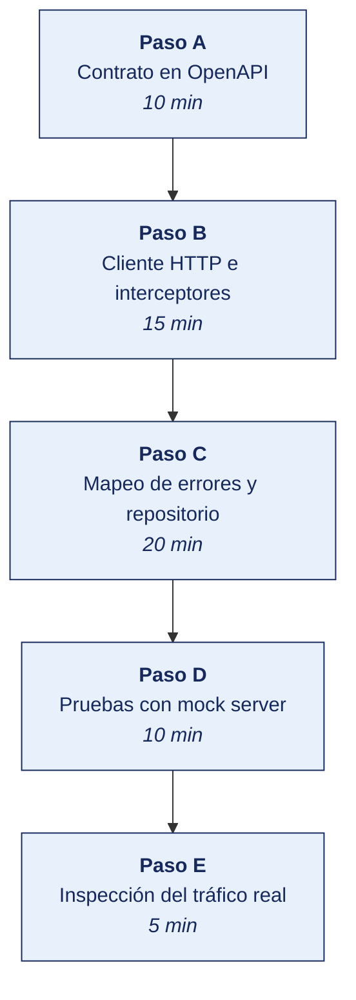

[Semana 04](README.md) · [Teoría](1-TEORIA.md) · [Dinámica de aula](2-DINAMICA.md) · **Taller de laboratorio**

# Taller de laboratorio 04 · Capa de datos con cliente HTTP, repositorio, caché y manejo de errores

**SI-988 · Soluciones Móviles II** · Semana 04 · Sesión 2 en laboratorio · 60 min de taller + 40 de avance · calificación **procedimental**

> ¿Un término no le resulta claro? Está definido en el [glosario técnico del curso](../GLOSARIO.md).

---

## Secuencia del taller



## Qué entregas

| | |
|---|---|
| **Archivo** | `SI988-S04-TALLER-Grupo<N>.pdf` |
| **Plantilla obligatoria** | [SI988-PLANTILLA-TALLER.docx](../PLANTILLAS/SI988-PLANTILLA-TALLER.docx) |
| **Formato** | PDF exportado desde la plantilla en Word, con la carátula de la UPT, el índice actualizado y las capturas numeradas |
| **Qué va dentro** | Las siete secciones del formato EPIS. La sección **3. Resultados** se califica contra la tabla de resultados esperados de esta guía, y cada resultado necesita su evidencia |
| **Dónde se sube** | Aula virtual, tarea «Taller · Semana 04» |
| **Cuándo vence** | 48 horas después de la sesión de laboratorio |

> No se califica un informe entregado en `.docx`, sin carátula, sin los códigos de los integrantes o con resultados declarados sin evidencia.

---

**La sesión de laboratorio dura 100 minutos: 60 de taller guiado y 40 de avance asistido.** El avance de Sprint 1 lo ejecuta el equipo fuera de la sesión.

## 1. Información sobre el evento práctico

### 1.1. Título del evento práctico

Implementación de la capa de datos de la aplicación con consumo de servicios REST reales — cliente HTTP con interceptores, mapeo de errores a fallos de dominio, repositorio con estrategia de caché, paginación e idempotencia.

### 1.2. Objetivos

- Documentar el **contrato de la API** en OpenAPI y generar el cliente o los modelos.
- Implementar el **cliente HTTP** con tiempo de espera, interceptores y registro de peticiones.
- Mapear las excepciones técnicas a **fallos de dominio**.
- Implementar el **repositorio** con su estrategia de sincronización.
- Implementar la **caché local** y demostrar el funcionamiento sin conexión.
- Implementar **paginación** e **idempotencia** del `POST`.
- Implementar **reintento con retroceso exponencial** solo para los códigos que lo admiten.
- Escribir las **pruebas del repositorio** con mock server.

### 1.3. Tiempo de duración

**100 minutos de laboratorio:** 60 min de taller guiado y 40 min de avance asistido del producto del curso.

### 1.4. Resultados de Aprendizaje (RA)

- **RA1** Analiza e interpreta los conceptos avanzados de desarrollo móvil.
- **RA2** Propone el plan de desarrollo de su app con metodologías ágiles.

### 1.5. Recursos

| Recurso | Detalle |
|---|---|
| **RFC 9110 · HTTP Semantics** | https://www.rfc-editor.org/rfc/rfc9110.html |
| **OpenAPI Specification** | https://spec.openapis.org/oas/latest.html |
| **Swagger Editor** | https://editor.swagger.io/ |
| Cliente HTTP del stack | Retrofit + OkHttp · Dio · URLSession · Axios |
| Persistencia local | Room · SwiftData · Drift · WatermelonDB |
| **json-server** o **WireMock** | Backend simulado y servidor de pruebas |
| **mitmproxy** | Inspección del tráfico real |
| **Postman** o **Bruno** | Prueba manual de los endpoints |

### 1.6. Seguridad

> **Dónde se trabaja.** El taller se hace en el **laboratorio de la universidad, sobre el emulador**. Cuando un escenario no se reproduce fielmente en el emulador, la verificación en un teléfono real la hace el equipo **fuera de la sesión** y adjunta el video como anexo. Ningún resultado del taller depende de tener un teléfono en clase.

1. **Todo el tráfico por HTTPS.** El tráfico en texto claro se prohíbe incluso en desarrollo; se usa un certificado local si es necesario.
2. Las claves de API **no se embeben en el código**. Se inyectan por configuración no versionada. Recordar que un artefacto móvil es **descompilable**. Un secreto en el cliente es un secreto público.
3. El registro de peticiones **no debe imprimir tokens, contraseñas ni datos personales**. Se enmascaran las cabeceras sensibles y solo se registra en compilaciones de depuración.
4. Los tokens se guardan en el **almacenamiento seguro de la plataforma** —Keystore o Keychain—, nunca en preferencias en texto claro. Se implementa completo en la Semana 10.

---

## 2. Procedimiento o Metodología

### Paso A — Contrato en OpenAPI

`docs/api/openapi.yaml`:

```yaml
openapi: 3.1.0
info:
  title: API de <nombre de la app>
  version: 1.0.0
servers:
  - url: https://api.ejemplo.pe/v1

components:
  schemas:
    Error:                      # formato ÚNICO de error para toda la API
      type: object
      required: [codigo, mensaje]
      properties:
        codigo:  { type: string, example: VALIDACION_FALLIDA }
        mensaje: { type: string, example: "Los datos enviados no son válidos" }
        detalles:
          type: array
          items:
            type: object
            properties:
              campo:  { type: string, example: correo }
              motivo: { type: string, example: "Formato de correo inválido" }
        traceId: { type: string, description: "Identificador para soporte" }

    Recurso:
      type: object
      required: [id, nombre]
      properties:
        id:              { type: string, format: uuid }
        nombre:          { type: string }
        creadoEn:        { type: string, format: date-time }

    PaginaRecursos:
      type: object
      properties:
        datos:            { type: array, items: { $ref: '#/components/schemas/Recurso' } }
        siguienteCursor:  { type: string, nullable: true }
        total:            { type: integer }

  securitySchemes:
    bearerAuth: { type: http, scheme: bearer, bearerFormat: JWT }

security: [{ bearerAuth: [] }]

paths:
  /recursos:
    get:
      summary: Listar recursos con paginación por cursor
      parameters:
        - { name: after, in: query, schema: { type: string }, description: Cursor del bloque siguiente }
        - { name: limit, in: query, schema: { type: integer, default: 20, maximum: 100 } }
      responses:
        '200':
          description: Lista de recursos
          headers:
            ETag:          { schema: { type: string } }
            Cache-Control: { schema: { type: string, example: "max-age=300" } }
          content:
            application/json:
              schema: { $ref: '#/components/schemas/PaginaRecursos' }
        '304': { description: No modificado }
        '401': { description: No autenticado, content: { application/json: { schema: { $ref: '#/components/schemas/Error' } } } }
        '429':
          description: Demasiadas peticiones
          headers:
            Retry-After: { schema: { type: integer } }

    post:
      summary: Crear un recurso — requiere clave de idempotencia
      parameters:
        - name: Idempotency-Key
          in: header
          required: true
          schema: { type: string, format: uuid }
          description: >
            Clave única generada por el cliente. Si el servidor ya procesó esta clave,
            devuelve el resultado anterior sin crear un recurso nuevo.
      requestBody:
        required: true
        content:
          application/json:
            schema: { $ref: '#/components/schemas/Recurso' }
      responses:
        '201':
          description: Creado
          headers:
            Location: { schema: { type: string } }
        '409': { description: Conflicto — la clave de idempotencia ya se usó con otro cuerpo }
        '422': { description: Entidad no procesable, content: { application/json: { schema: { $ref: '#/components/schemas/Error' } } } }
```

Se valida en Swagger Editor y se genera el cliente o los modelos con el generador del stack.

### Paso B — Cliente HTTP e interceptores

```
// Configuración del cliente — el mismo principio en cualquier stack

cliente = HttpClient(
  baseUrl: CONFIG.apiBaseUrl,              // desde configuración, NO embebida
  connectTimeout: 10 s,
  receiveTimeout: 15 s,
  headers: { 'Accept': 'application/json', 'Content-Type': 'application/json' },
)

// --- Interceptor 1: autenticación ---
onRequest: (peticion) {
  token = almacenSeguro.leerToken()        // Keystore/Keychain, nunca texto claro
  if (token != null) peticion.headers['Authorization'] = 'Bearer $token'
  peticion.headers['X-App-Version'] = appVersion       // trazabilidad de errores
}

// --- Interceptor 2: renovación de token ante 401 ---
onError: (error) {
  if (error.status == 401 && !error.peticion.esReintentoDeAutenticacion) {
    nuevoToken = await autenticacion.renovar()
    if (nuevoToken != null) return reintentar(error.peticion, marcandoComoReintento: true)
    autenticacion.cerrarSesion()
  }
  return error
}

// --- Interceptor 3: reintento con retroceso exponencial ---
REINTENTABLES = { 408, 429, 500, 502, 503, 504 }
onError: (error) {
  if (!(error.status in REINTENTABLES || error.esErrorDeRed)) return error   // 4xx: NO reintentar
  if (error.peticion.intentos >= 3) return error

  espera = (error.status == 429 && error.headers['Retry-After'] != null)
      ? segundos(error.headers['Retry-After'])
      : pow(2, error.peticion.intentos) segundos + aleatorio(0, 1000 ms)   // variación
  await esperar(espera)
  return reintentar(error.peticion)
}

// --- Interceptor 4: registro, SOLO en depuración y con enmascaramiento ---
if (esCompilacionDeDepuracion) {
  onRequest:  registrar(metodo, url, enmascarar(headers, ['Authorization','Cookie']))
  onResponse: registrar(status, duracionMs, tamanoBytes)     // NO el cuerpo si tiene datos personales
}
```

### Paso C — Mapeo de errores y repositorio

```
// --- Dominio: los fallos NO conocen HTTP ---
sealed class Failure {
  object SinConexion       : Failure()
  object TiempoAgotado     : Failure()
  object NoAutorizado      : Failure()
  object SinPermiso        : Failure()
  object NoEncontrado      : Failure()
  object Conflicto         : Failure()
  data class ErrorValidacion(val porCampo: Map<String,String>) : Failure()
  data class ErrorServidor(val traceId: String?)               : Failure()
  object DemasiadasPeticiones : Failure()
}

// --- Datos: el mapeador es el ÚNICO punto que conoce HTTP ---
fun mapearError(e: Exception): Failure = when {
  e.esErrorDeRed        -> Failure.SinConexion
  e.esTiempoAgotado     -> Failure.TiempoAgotado
  e.status == 401       -> Failure.NoAutorizado
  e.status == 403       -> Failure.SinPermiso
  e.status == 404       -> Failure.NoEncontrado
  e.status == 409       -> Failure.Conflicto
  e.status == 422       -> Failure.ErrorValidacion(extraerErroresPorCampo(e.cuerpo))
  e.status == 429       -> Failure.DemasiadasPeticiones
  e.status in 500..599  -> Failure.ErrorServidor(e.cuerpo?.traceId)
  else                  -> Failure.ErrorServidor(null)
}

// --- Repositorio: estrategia CACHÉ PRIMERO con fuente única de verdad ---
class RecursoRepositoryImpl(
  private val remoto: RecursoRemoteDataSource,
  private val local:  RecursoLocalDataSource,
  private val red:    ConectividadService,
) : RecursoRepository {

  override fun observarRecursos(): Flow<List<Recurso>> =
      local.observarTodos().map { it.map(EntidadLocal::aDominio) }   // ← fuente única de verdad

  override suspend fun refrescar(cursor: String?): Result<Unit> {
    if (!red.hayConexion()) return Result.failure(Failure.SinConexion)
    return try {
      val pagina = remoto.listar(after = cursor, limit = 20)
      local.guardar(pagina.datos.map(Dto::aEntidadLocal))            // se escribe local
      local.guardarCursor(pagina.siguienteCursor)
      Result.success(Unit)                                           // la UI se actualiza por el Flow
    } catch (e: Exception) {
      Result.failure(mapearError(e))
    }
  }

  override suspend fun crear(recurso: Recurso): Result<Recurso> {
    // IDEMPOTENCIA: la clave se genera UNA VEZ y se reutiliza en cada reintento
    val clave = recurso.claveIdempotencia ?: uuid()
    return try {
      val creado = remoto.crear(recurso.aDto(), idempotencyKey = clave)
      local.guardar(creado.aEntidadLocal())
      Result.success(creado.aDominio())
    } catch (e: Exception) {
      // Si falla por red, se encola con la MISMA clave para reintentar después
      if (mapearError(e) is Failure.SinConexion) colaPendientes.encolar(recurso.copy(claveIdempotencia = clave))
      Result.failure(mapearError(e))
    }
  }
}
```

> **El punto clave de la idempotencia:** la clave se genera **una sola vez por operación del usuario**, no por intento. Si se regenera en cada reintento, se pierde toda la protección.

### Paso D — Pruebas con mock server

```
// Se prueba el repositorio con un servidor HTTP simulado: sin red real, reproducible.

test('devuelve los datos y los guarda localmente cuando el servidor responde 200') {
  servidor.encolar(status = 200, cuerpo = jsonDePagina(3 elementos))
  val r = repositorio.refrescar(null)
  assert(r.esExito)
  assert(local.contar() == 3)
}

test('devuelve SinConexion sin llamar al servidor cuando no hay red') {
  red.simularSinConexion()
  val r = repositorio.refrescar(null)
  assert(r.error is Failure.SinConexion)
  assert(servidor.peticionesRecibidas == 0)      // no se intentó siquiera
}

test('reintenta tres veces ante 503 y luego devuelve ErrorServidor') {
  repeat(4) { servidor.encolar(status = 503) }
  val r = repositorio.refrescar(null)
  assert(r.error is Failure.ErrorServidor)
  assert(servidor.peticionesRecibidas == 4)      // original + 3 reintentos
}

test('NO reintenta ante 400') {
  servidor.encolar(status = 400, cuerpo = jsonDeError())
  repositorio.refrescar(null)
  assert(servidor.peticionesRecibidas == 1)      // ← el reintento sería inútil
}

test('respeta Retry-After ante 429') {
  servidor.encolar(status = 429, headers = mapOf("Retry-After" to "2"))
  servidor.encolar(status = 200, cuerpo = jsonDePagina(1))
  val inicio = ahora()
  repositorio.refrescar(null)
  assert(ahora() - inicio >= 2 s)
}

test('reutiliza la misma clave de idempotencia al reintentar una creación') {
  servidor.encolar(status = 503); servidor.encolar(status = 201, cuerpo = jsonDeRecurso())
  repositorio.crear(recursoDePrueba)
  assert(servidor.peticion(0).header("Idempotency-Key") ==
         servidor.peticion(1).header("Idempotency-Key"))
}

test('mapea 422 a ErrorValidacion con los errores por campo') {
  servidor.encolar(status = 422, cuerpo = """{"codigo":"VALIDACION_FALLIDA",
      "detalles":[{"campo":"correo","motivo":"Formato inválido"}]}""")
  val r = repositorio.crear(recursoInvalido)
  assert((r.error as Failure.ErrorValidacion).porCampo["correo"] != null)
}
```

**Demostración del funcionamiento sin conexión:** se carga la lista con red, se activa el modo avión, se cierra y reabre la app, y **la lista sigue visible con el aviso de datos desactualizados**. Se graba el video como evidencia.

### Paso E — Inspección del tráfico real

```bash
mitmproxy --listen-port 8080
# Se configura el proxy del dispositivo y se instala el certificado de mitmproxy
```

Se verifica en el tráfico real:

| Verificación | Qué se busca |
|---|---|
| Todo el tráfico es **HTTPS** | Ninguna petición en texto claro |
| La cabecera `Authorization` viaja | Y **no aparece en el registro de la app** |
| La `Idempotency-Key` es la misma en los reintentos | |
| Se envía `If-None-Match` cuando hay `ETag` | Y el servidor responde `304` |
| No se envían datos personales innecesarios | Principio de minimización |
| El tamaño de las respuestas es razonable | Sin campos que la app no usa |

### Trabajo del equipo fuera de la sesión — Sprint 1

> Este avance excede los 40 min de avance asistido. Lo que no alcance a completarse en laboratorio lo ejecuta el equipo durante la semana, y llega al siguiente taller con el incremento listo. El docente lo revisa en el repositorio y en el tablero, no en clase.

Avance de las historias del Sprint 1. El equipo sostiene su **Daily de 15 minutos** durante la semana y registra los impedimentos en el tablero. El docente devuelve sobre el foco en el Sprint Goal, los impedimentos registrados y el respeto del límite de trabajo en curso, a partir de lo que ve en el tablero y en el repositorio.

---


### Avance asistido · Avance de sprint asistido

Los últimos 40 minutos del laboratorio son del equipo. **El docente no dirige.** Queda disponible para consultas y observa el reparto real del trabajo.

| | |
|---|---|
| **Qué se trabaja** | las historias del Sprint en curso, según el Sprint Backlog de la semana |
| **Quién decide qué hacer** | El equipo. El docente no asigna tareas en este tramo |
| **Dónde se registra** | GitHub Projects, con cada elemento asignado a una persona |
| **Para qué sirve la presencia del docente** | Resolver bloqueos en el momento, no revisar entregables |

> **Se registra la contribución individual.** Lo trabajado en este tramo queda en el repositorio con su autoría. Es la evidencia del atributo **AG-I03 Trabajo Individual y en Equipo** que se mide en las semanas de cierre de unidad.

## 3. Resultados

> **Evidencia obligatoria en GitHub.** Todo resultado de este taller se versiona en el repositorio del equipo. El informe **no consigna capturas sueltas**: consigna la **URL** del artefacto en GitHub. Una captura no permite verificar autoría, fecha ni contenido; un enlace sí.
>
> | Qué se entrega | Dónde vive | Qué se escribe en el informe |
> |---|---|---|
> | Código y archivos de configuración | Rama del taller, fusionada a `develop` vía Pull Request | URL del Pull Request |
> | Documentos y matrices | `docs/`, en formato de texto versionable | URL del archivo en la rama |
> | Capturas y videos que el taller exija | `docs/evidencias/S04/` | URL del archivo |
> | Salida de comandos | `docs/evidencias/S04/salidas/*.txt` | URL del archivo |
>
> **Etiqueta del taller.** Al cerrar el taller se crea la etiqueta `taller-04` sobre el commit entregado:
>
> ```bash
> git tag -a taller-04 -m "Taller 04 · SI988"
> git push origin taller-04
> ```
>
> La URL que se consigna en el informe apunta a esa etiqueta:
> `https://github.com/<organizacion>/<repositorio>/tree/taller-04`
>
> **Sin la URL, el resultado no se califica.** El docente evalúa sobre el repositorio, no sobre el PDF.

### 3.1. Tabla de resultados


| # | Resultado esperado | Verificación |
|---|---|---|
| 1 | `openapi.yaml` válido con **≥ 3 endpoints** y el **formato único de error** | Swagger Editor |
| 2 | Cliente HTTP con tiempos de espera y los cuatro interceptores | Código |
| 3 | **Ningún secreto embebido**; configuración inyectada | CI en verde |
| 4 | Registro de peticiones **con cabeceras sensibles enmascaradas** y solo en depuración | Código y salida del registro |
| 5 | Mapeo completo de excepciones a **fallos de dominio** | Código |
| 6 | Repositorio con estrategia de sincronización **declarada y justificada** por historia | Código y documentación |
| 7 | **Fuente única de verdad**: la interfaz observa la base local | Código |
| 8 | Paginación implementada, por cursor o por desplazamiento | Demostración |
| 9 | **Idempotencia**: la clave se genera una vez y se reutiliza en los reintentos | Prueba en verde |
| 10 | Reintento con retroceso exponencial **solo** para los códigos admitidos | Pruebas en verde |
| 11 | **Siete pruebas del repositorio en verde** con mock server | Salida de la CI |
| 12 | **Demostración del funcionamiento sin conexión**, en video | Evidencia |
| 13 | Inspección del tráfico con las seis verificaciones | Capturas de mitmproxy |
| 14 | Historias del Sprint 1 avanzando, con la Daily realizada | Tablero |


## Rúbrica procedimental (20 puntos)

Se aplica sobre el informe entregado y la evidencia enlazada en el repositorio. **Cada criterio se califica de forma independiente.**

| Criterio | 4 — Logrado | 2 — En proceso | 0 — Insuficiente |
|---|---|---|---|
| **Cliente HTTP e interceptores** | Completo y correcto, con la evidencia que lo respalda | Completo con errores menores, o correcto pero sin toda la evidencia | Incompleto, o entregado sin ejecutar |
| **Mapeo de errores y repositorio** | Completo y correcto, con la evidencia que lo respalda | Completo con errores menores, o correcto pero sin toda la evidencia | Incompleto, o entregado sin ejecutar |
| **Evidencia verificable en el repositorio** | Cada resultado tiene su URL sobre la etiqueta `taller-NN`, y el enlace abre lo que dice | La mayoría tiene URL; alguna evidencia es una captura suelta | Se declaran resultados sin enlace, o el enlace no corresponde |
| **Rigor técnico de la implementación** | El código compila, las pruebas pasan y el análisis estático sale limpio | Compila y funciona, con avisos del análisis sin resolver | No compila, o se entregó sin ejecutar |
| **Informe en formato EPIS** | Las seis secciones completas; los resultados se sustentan con la evidencia enlazada | Secciones completas con sustento parcial | Faltan secciones o los resultados se afirman sin evidencia |

| Puntaje | Equivalencia |
|---|---|
| 18 – 20 | Destacado |
| 14 – 17 | Logrado |
| 6 – 13 | En proceso |
| 0 – 5 | Insuficiente |

> **Un resultado declarado sin evidencia enlazada no puntúa**, aunque el trabajo se haya hecho. La tabla de la sección 3.1 es la lista de cotejo; esta rúbrica es lo que determina la nota.

## 4. Conclusiones

Mínimo tres. Líneas argumentales esperadas:

1. La conectividad intermitente convierte al `POST` en la operación más peligrosa de una app móvil. Sin clave de idempotencia, un reintento silencioso crea recursos duplicados que el usuario descubre después.
2. Mapear las excepciones técnicas a fallos de dominio es lo que permite que la capa de presentación traduzca cada error a un mensaje comprensible con una acción; sin ese mapeo, el usuario ve un código HTTP.
3. La fuente única de verdad —la interfaz observa la base local y la red la actualiza— es lo que hace que la app funcione sin conexión sin escribir lógica especial para ese caso.

## 5. Referencias Bibliográficas

- IETF. *RFC 9110 · HTTP Semantics*. https://www.rfc-editor.org/rfc/rfc9110.html
- IETF. *RFC 9111 · HTTP Caching*. https://www.rfc-editor.org/rfc/rfc9111.html
- Fielding, R. T. (2000). *Architectural Styles and the Design of Network-based Software Architectures* — capítulo 5, REST. https://ics.uci.edu/~fielding/pubs/dissertation/rest_arch_style.htm
- OpenAPI Initiative. *OpenAPI Specification*. https://spec.openapis.org/oas/latest.html
- Google. *App architecture: Data layer*. https://developer.android.com/topic/architecture/data-layer
- Google. *Offline-first apps*. https://developer.android.com/topic/architecture/data-layer/offline-first
- Apple. *URLSession*. https://developer.apple.com/documentation/foundation/urlsession
- AWS. *Diferencia entre SOAP y REST*. https://aws.amazon.com/es/compare/the-difference-between-soap-rest/
- Microsoft. *Azure REST API reference*. https://learn.microsoft.com/en-us/rest/api/azure/
- Google Cloud. *REST API guide*. https://cloud.google.com/service-catalog/docs/rest-api-guide?hl=es-419
- Daigneau, R. (2012). *Service Design Patterns*. Addison-Wesley. — patrones de idempotencia y de contrato.
- mitmproxy. *Documentation*. https://docs.mitmproxy.org/

## 6. Anexos

- `anexo_A_openapi.yaml` y su vista en Swagger
- `anexo_B_pruebas_repositorio.png` — CI en verde
- `anexo_C_offline.mp4` — demostración sin conexión
- `anexo_D_mitmproxy.pdf` — las seis verificaciones del tráfico
- `anexo_E_tablero_sprint1.png`

---

---

[Semana 04](README.md) · [Teoría](1-TEORIA.md) · [Dinámica de aula](2-DINAMICA.md) · **Taller de laboratorio**

---

**Docente** · Dr. Oscar Juan Jimenez Flores
[oscarjimenezflores@upt.pe](mailto:oscarjimenezflores@upt.pe) · [LinkedIn](https://www.linkedin.com/in/oscar-jimenez-flores/) · [CTI Vitae — CONCYTEC](https://ctivitae.concytec.gob.pe/appDirectorioCTI/VerDatosInvestigador.do?id_investigador=33398)

Escuela Profesional de Ingeniería de Sistemas · Universidad Privada de Tacna · Tacna, Perú
