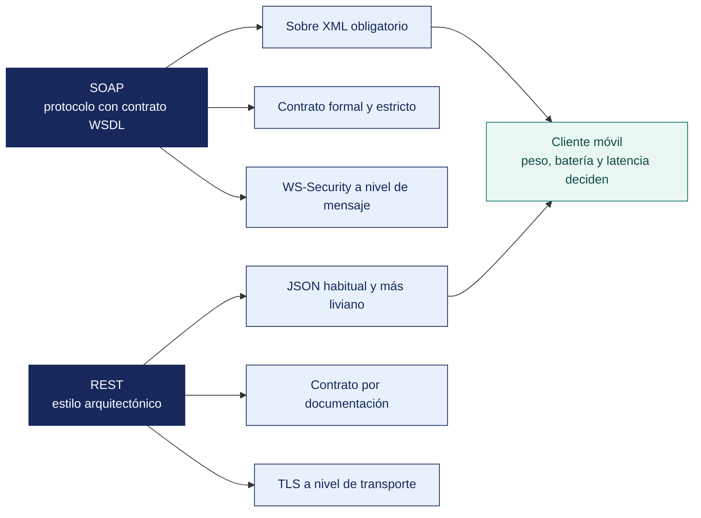

[Semana 05](README.md) · **Teoría** · [Dinámica de aula](2-DINAMICA.md) · [Taller de laboratorio](3-TALLER.md)

# Teoría · Diferencias entre SOAP y REST

**SI-988 · Soluciones Móviles II** · Semana 05 · Sesión 1 en aula · 2 horas académicas, 100 min, con la dinámica incluida

> ¿Un término no le resulta claro? Está definido en el [glosario técnico del curso](../GLOSARIO.md).

---

## La pregunta de esta sesión

Una app consume el servicio de una entidad pública. El servicio responde HTTP 200 y la app da la operación por buena.

Dentro del cuerpo de la respuesta viene un `Fault` que dice que el contribuyente no existe. La app guardó el trámite como aceptado, el usuario recibió su confirmación y el trámite no se hizo.

> **La pregunta que ordena esta sesión.** *¿Por qué un servicio puede responder «todo bien» y haber fallado?*

## Antes de empezar

| Lo que necesita traer | De dónde sale |
|---|---|
| El consumo de servicios REST y el mapeo de códigos de estado | Semana 04 |
| La capa de datos y el manejo de errores de la app | Semana 04 |
| La arquitectura por capas del proyecto | Semana 02 |
| Nociones de XML | Cursos previos de la carrera |

> **Exploración (5 min), antes de cualquier definición.** El aula responde antes de la teoría y se anota. *¿Dónde falló esa app? ¿Es un error del servicio o del cliente? ¿Por qué un curso de móviles enseña SOAP en 2026?* No se corrige nada todavía.

## Distribución del tiempo

| Momento | Minutos |
|---|---|
| El caso del trámite que no se hizo y la exploración inicial | 8 |
| **Bloque 1.** Por qué un curso de móviles enseña SOAP | 12 |
| **Bloque 2.** El protocolo SOAP y su estructura | 22 |
| **Bloque 3.** Comparación operativa para un cliente móvil · con su microaplicación | 18 |
| Cierre, respuesta a la pregunta de la sesión y puente a la dinámica | 5 |
| **Total de la sesión de aula** | **65** |

## Mapa de la sesión



---

## Bloque 1 · Por qué un curso de móviles enseña SOAP

> **La pregunta del bloque.** *¿Dónde se va a encontrar SOAP en el ejercicio profesional?*

**La razón práctica.** SOAP no es una tecnología del pasado. Es la que sostiene la integración con **bancos, aseguradoras, entidades del Estado, ERP corporativos y sistemas de facturación**. Un desarrollador móvil que solo sabe consumir REST **no puede integrar la app con el sistema de la empresa que lo contrata**.

**Dónde se encuentra SOAP en el Perú.**

| Ámbito | Ejemplo de integración |
|---|---|
| Facturación electrónica | Servicios de recepción y consulta de comprobantes |
| Entidades del Estado | Servicios de consulta de la Plataforma de Interoperabilidad del Estado |
| Sistema financiero | Servicios de consulta y transacción de core bancarios |
| ERP corporativos | Servicios de integración de plataformas empresariales establecidas |
| Logística y aduanas | Servicios de trazabilidad y declaración |

> **La regla profesional.** No se elige entre SOAP y REST. **Se consume lo que el proveedor expone**. La decisión de estilo solo existe cuando el equipo diseña su propio servicio.

> **El error frecuente del bloque.** Dar por hecho que SOAP es historia. La banca, los seguros, la administración pública y los sistemas de gestión empresarial lo siguen exponiendo, y **el integrador no elige el protocolo del servicio que consume**. Se elige cómo aislarlo detrás de la capa de datos, y eso sí es una decisión del equipo.

## Bloque 2 · El protocolo SOAP y su estructura

> **La pregunta del bloque.** *¿Dónde vive el error en una respuesta SOAP?*

**SOAP** es un protocolo de intercambio de mensajes basado en XML, definido por el W3C. A diferencia de REST, **es un protocolo con reglas estrictas**, no un estilo.

**La estructura del mensaje.**

```xml
<?xml version="1.0" encoding="UTF-8"?>
<soap:Envelope xmlns:soap="http://www.w3.org/2003/05/soap-envelope"
               xmlns:srv="http://servicios.ejemplo.pe/consulta">

  <soap:Header>
    <!-- Metadatos: seguridad, transacción, enrutamiento, correlación.
         Aquí vive WS-Security cuando se usa. -->
    <srv:Autenticacion>
      <srv:Usuario>...</srv:Usuario>
      <srv:Token>...</srv:Token>
    </srv:Autenticacion>
  </soap:Header>

  <soap:Body>
    <!-- La operación y sus parámetros -->
    <srv:ConsultarEstado>
      <srv:numeroDocumento>12345678</srv:numeroDocumento>
    </srv:ConsultarEstado>
  </soap:Body>

</soap:Envelope>
```

**La respuesta de error — el `Fault`**, que sustituye a los códigos HTTP:

```xml
<soap:Body>
  <soap:Fault>
    <soap:Code><soap:Value>soap:Sender</soap:Value></soap:Code>
    <soap:Reason><soap:Text xml:lang="es">Documento no encontrado</soap:Text></soap:Reason>
    <soap:Detail>
      <srv:CodigoNegocio>DOC_404</srv:CodigoNegocio>
    </soap:Detail>
  </soap:Fault>
</soap:Body>
```

> **La trampa que sorprende a todo desarrollador que viene de REST.** Un servicio SOAP puede devolver **HTTP 200 con un `Fault` dentro**. El cliente que solo mira el código HTTP concluye que la operación tuvo éxito. **Siempre hay que inspeccionar el cuerpo.**

**El WSDL — el contrato formal.** Describe el servicio de forma legible por máquina — qué operaciones expone, qué tipos de datos usa, qué mensajes intercambia y en qué dirección está.

| Elemento del WSDL | Qué describe |
|---|---|
| `types` | Los tipos de datos, en XML Schema |
| `message` | Los mensajes de entrada y salida |
| `portType` / `interface` | Las operaciones disponibles |
| `binding` | El protocolo de transporte y el estilo de codificación |
| `service` / `port` | La dirección concreta del servicio |

**La ventaja real del WSDL.** Permite **generar el cliente automáticamente**. Con REST se logra algo equivalente solo si el proveedor publica un OpenAPI, cosa que no siempre ocurre.

**La familia WS-\*.** SOAP viene acompañado de estándares que resuelven problemas que REST deja al implementador:

| Estándar | Qué resuelve | Equivalente en el mundo REST |
|---|---|---|
| **WS-Security** | Firma y cifrado a nivel de mensaje, no solo de transporte | TLS + JWT firmado (protege el transporte, no el mensaje) |
| **WS-ReliableMessaging** | Entrega garantizada y ordenada | Se implementa a mano. Idempotencia y reintentos |
| **WS-AtomicTransaction** | Transacciones distribuidas | Patrón Saga, compensaciones |
| **WS-Addressing** | Enrutamiento y correlación | Cabeceras propias |

> **La diferencia esencial.** WS-Security protege **el mensaje**, que sigue firmado y cifrado aunque atraviese varios intermediarios. TLS protege **el canal**, y el mensaje queda en claro en cada extremo. Por eso el sector financiero sigue exigiendo WS-Security en integraciones con múltiples saltos.

> **El error frecuente del bloque.** Verificar únicamente el código de estado. Es el caso de hoy — SOAP transporta sus errores **dentro del cuerpo**, en el elemento `Fault`, y una respuesta fallida viaja con HTTP 200 con toda normalidad. La comprobación correcta abre el sobre antes de dar nada por bueno.

## Bloque 3 · Comparación operativa para un cliente móvil

> **La pregunta del bloque.** *¿Qué cuesta SOAP en un dispositivo con batería y datos limitados?*

| Dimensión | **SOAP** | **REST** | Consecuencia en móvil |
|---|---|---|---|
| **Naturaleza** | Protocolo con reglas estrictas | Estilo arquitectónico | SOAP es predecible; REST varía entre proveedores |
| **Formato** | XML obligatorio | JSON habitualmente; también XML u otros | **XML pesa 3 a 8 veces más que el JSON equivalente** |
| **Contrato** | WSDL formal, obligatorio | OpenAPI opcional | SOAP permite generar el cliente; con REST depende del proveedor |
| **Transporte** | HTTP, SMTP, JMS, TCP | HTTP exclusivamente | Irrelevante en móvil: siempre HTTP |
| **Operaciones** | Definidas por el servicio, sin semántica uniforme | Métodos HTTP con semántica definida | En SOAP no se sabe si una operación es idempotente sin leer la documentación |
| **Errores** | `Fault` en el cuerpo, a menudo con HTTP 200 | Códigos de estado HTTP | **El manejo de errores SOAP es más propenso a fallos del cliente** |
| **Caché** | **Prácticamente inviable.** Todo es `POST` | Nativa con `GET`, `ETag`, `Cache-Control` | **REST ahorra datos y batería; SOAP no** |
| **Tamaño del mensaje** | **Alto.** Sobre de XML, espacios de nombres, tipos | Bajo | Impacto directo en el plan de datos del usuario |
| **Análisis en el cliente** | **Analizador XML.** Más CPU y memoria | **JSON.** Mucho más liviano | **En dispositivos de gama baja la diferencia es perceptible** |
| **Seguridad** | WS-Security a nivel de mensaje | TLS + OAuth 2.0 a nivel de transporte | REST es más simple; SOAP más robusto ante intermediarios |
| **Transacciones** | WS-AtomicTransaction | No definido | SOAP en operaciones financieras multi-sistema |
| **Curva de adopción** | Alta | Baja | El ecosistema móvil está orientado a REST |

**Medición real.** El mismo dato en ambos formatos:

```
Consulta de un registro con 8 campos:
  Respuesta SOAP  : ~1 850 bytes  (sobre + espacios de nombres + tipos)
  Respuesta JSON  : ~   240 bytes
  Relación        : 7,7 ×

Sobre 1 000 consultas diarias durante 30 días:
  SOAP : ~ 55,5 MB del plan de datos del usuario
  JSON : ~  7,2 MB
```

**La estrategia profesional cuando hay que consumir SOAP desde móvil.**

```
   App móvil ──REST/JSON──► Backend propio (BFF) ──SOAP/XML──► Servicio legado
                             (Backend For Frontend)

   El BFF:
    · traduce SOAP a JSON
    · reduce el mensaje a los campos que la app necesita
    · centraliza WS-Security: el certificado NO va en el dispositivo
    · permite cachear lo que SOAP no cachea
    · aísla a la app de los cambios del servicio legado
```

> **Por qué el BFF es la respuesta correcta.** Consumir SOAP directamente desde el móvil es técnicamente posible y profesionalmente desaconsejable. Obliga a distribuir credenciales o certificados en un artefacto descompilable, multiplica el consumo de datos y acopla la app a un contrato que no controla. **Se hace directo solo cuando no hay alternativa, y se documenta como deuda técnica.**

**Ejemplo trabajado — la misma consulta, en directo y a través de un BFF.** El local del piloto emite comprobante y la app debe mostrar el estado del documento. El servicio del proveedor expone **solo SOAP con WS-Security** y un certificado por emisor.

| | **A. La app consume SOAP directo** | **B. La app consume el BFF** |
|---|---|---|
| Dónde vive el certificado | **En el dispositivo**, dentro de un artefacto descompilable | En el servidor, nunca sale de él |
| Bytes por consulta | ~1 850 (sobre XML completo) | ~120 (solo `numero`, `estado`, `fecha`) |
| Datos del usuario en 30 días, a 20 consultas diarias | ~1,1 MB | ~0,07 MB |
| Caché | **Imposible.** Todo es `POST` | `GET` con `ETag`; el estado «aceptado» no vuelve a consultarse |
| Análisis en el cliente | Analizador XML en gama baja | JSON |
| Si el proveedor cambia el WSDL | **Hay que publicar una versión nueva en las tiendas y esperar la actualización de cada usuario** | Se corrige el BFF y se despliega el mismo día |
| Manejo del `Fault` | Cada cliente debe recordar inspeccionar el cuerpo pese al HTTP 200 | El BFF traduce el `Fault` a `422` con el código de negocio |

**La traducción del error, que es donde se pierde la mayoría de los equipos.**

| Lo que devuelve el servicio SOAP | Lo que expone el BFF | Lo que ve el usuario |
|---|---|---|
| `HTTP 200` + `Fault` con `DOC_404` | `404` | «No encontramos ese comprobante» |
| `HTTP 200` + `Fault` con `AUTH_EXPIRED` | `401` | El BFF renueva el token; el usuario no se entera |
| `HTTP 200` + `Fault` con `LIMITE_EXCEDIDO` | `429` + `Retry-After` | La app espera y reintenta sola |
| `HTTP 500` del servicio | `503` | «Tuvimos un problema. Ya lo estamos revisando» |

> **La fila decisiva no es la del tamaño. Es la del cambio de WSDL.** Con la opción A, cada cambio del proveedor obliga a **una publicación en dos tiendas y a esperar que el usuario actualice** —días o semanas en los que la app está rota para quien no actualizó—. Con la opción B, el arreglo se despliega en horas y ningún usuario se entera. **El BFF no se justifica por los bytes. Se justifica porque la app móvil es lo único del sistema que no se puede corregir en caliente.**

> **Microaplicación (6 min) · el servicio heredado que le toca consumir.** Cada equipo escribe **la comprobación que su app haría sobre una respuesta SOAP**, en el orden correcto, y dice en qué capa vive. La respuesta no debería tocar la pantalla en ningún momento.

| Caso | Qué debe contener una buena respuesta |
|---|---|
| ¿Por qué un `Fault` con HTTP 200 es peligroso en móvil? | Porque el cliente que solo mira el código concluye éxito y guarda un estado falso. En la app eso se traduce en un comprobante que figura aceptado y no lo está |
| ¿Cuándo se acepta consumir SOAP directo desde la app? | Cuando no hay backend propio ni posibilidad de tenerlo, el servicio no exige certificado cliente y el volumen es bajo. Y se registra como deuda técnica con su ADR (*Architecture Decision Record*, registro de decisión de arquitectura) |
| ¿El BFF no agrega un punto de falla más? | Sí, y a cambio quita el peor. La imposibilidad de corregir la app instalada. Se mitiga con un BFF simple, sin estado y con la misma disponibilidad que el servicio de origen |

## Cierre · qué se lleva de aquí

**La respuesta a la pregunta con la que abrimos.** Porque el código de estado describe el transporte y no la operación. SOAP lleva su error **dentro del sobre**, y un `Fault` viaja con HTTP 200 sin que nada lo delate desde fuera. Un cliente que solo mira el código da por hecho un trámite que no ocurrió, y el usuario se entera semanas después.

**Las tres ideas que deben quedar.**

| Idea | Por qué importa en el ejercicio profesional |
|---|---|
| El integrador no elige el protocolo del servicio que consume | Lo que sí elige es aislarlo detrás de la capa de datos para que no contamine el dominio |
| En SOAP el error vive en el cuerpo, no en el código de estado | Verificar solo el código es el error que produce trámites fantasma |
| El sobre XML pesa y el análisis consume batería | En un cliente móvil eso es un criterio de diseño, no un detalle de implementación |

**Volviendo a la exploración del inicio.** Se releen las respuestas del inicio. La tercera pregunta se responde casi siempre con extrañeza, y la respuesta es que **la mitad de los servicios del Estado peruano y de la banca todavía se exponen así**.

**Lo que sigue.** La [dinámica de esta sesión](2-DINAMICA.md) consume un servicio SOAP real y obliga a detectar el `Fault` escondido tras un 200. El taller lo encapsula después detrás de la capa de datos de la app.


**Pregunta de cierre.** *si mañana la empresa les pide integrar la app con su sistema de facturación, que solo expone SOAP con WS-Security, ¿qué construyen primero?* La respuesta —un BFF— es la que separa una decisión de arquitectura de una improvisación.
---

---

[Semana 05](README.md) · **Teoría** · [Dinámica de aula](2-DINAMICA.md) · [Taller de laboratorio](3-TALLER.md)

---

**Docente** · Dr. Oscar Juan Jimenez Flores
[oscarjimenezflores@upt.pe](mailto:oscarjimenezflores@upt.pe) · [LinkedIn](https://www.linkedin.com/in/oscar-jimenez-flores/) · [CTI Vitae — CONCYTEC](https://ctivitae.concytec.gob.pe/appDirectorioCTI/VerDatosInvestigador.do?id_investigador=33398)

Escuela Profesional de Ingeniería de Sistemas · Universidad Privada de Tacna · Tacna, Perú
