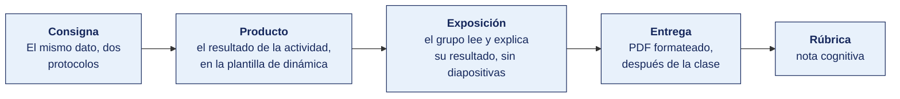

[Semana 05](README.md) · [Teoría](1-TEORIA.md) · **Dinámica de aula** · [Taller de laboratorio](3-TALLER.md)

# Dinámica de aula · El mismo dato, dos protocolos

**SI-988 · Soluciones Móviles II** · Semana 05 · Actividad en aula, **dentro de los 100 min de la sesión de teoría** · calificación **cognitiva**

> ¿Un término no le resulta claro? Está definido en el [glosario técnico del curso](../GLOSARIO.md).

---

## Cómo funciona la actividad



## Qué entregas

| | |
|---|---|
| **Archivo** | `SI988-S05-DINAMICA-Grupo<N>.pdf` |
| **Plantilla obligatoria** | [SI988-PLANTILLA-DINAMICA.docx](../PLANTILLAS/SI988-PLANTILLA-DINAMICA.docx) |
| **Formato** | PDF exportado desde la plantilla en Word, con la carátula de la UPT y los apellidos, nombres y códigos de todos los integrantes |
| **Qué va dentro** | Lo que el grupo resolvió en aula. Las tablas de la sección **Producto** van completas, con los textos redactados, y cada decisión va justificada |
| **Dónde se sube** | Aula virtual, tarea «Dinámica · Semana 05» |
| **Cuándo vence** | Hasta 24 h después de la sesión de teoría. La tabla se resuelve en aula; el PDF se formatea y se sube después |
| **Exposición** | En la ronda de cierre de **esta misma sesión**. El grupo **lee y explica su resultado** ante el aula, con el documento a la vista. No se usan diapositivas |

> No se califica un trabajo entregado en `.docx`, sin carátula, sin los códigos de los integrantes o con las tablas del producto vacías.

---

## Consigna

> **«El mismo dato, dos protocolos»**
> Cada equipo toma **una operación real de su aplicación** y la modela **en ambos estilos**. Como operación SOAP con su WSDL y como recurso REST con su OpenAPI. Luego **mide y compara** ambos mensajes.

| | |
|---|---|
| **Su papel** | **Arquitecto** que decide si la app habla directo con el sistema legado o a través de un intermediario |
| **Misión** | Modelar la misma operación en ambos estilos y comparar los dos mensajes con una medición |
| **Restricción** | **La comparación se hace con bytes medidos**, no con lo que se supone que pesa cada formato |

## Cómo se desarrolla · 35 minutos

| | Bloque | Quién | Minutos |
|---|---|---|---|
| **1** | **La operación en SOAP.** La operación elegida de la app propia, con su WSDL y su sobre | Equipo | 9 |
| **2** | **La misma operación en REST.** Como recurso, con su ruta, su método y su cuerpo | Equipo | 9 |
| **3** | **Medir y comparar.** El tamaño en bytes **medido**, y la comparación en manejo de errores, caché y esfuerzo | Equipo | 9 |
| **4** | **Ronda en aula.** Cuántos bytes de diferencia y qué significa eso en el plan de datos de un usuario | Todos | 8 |

## Producto

**Producto 1 — Los dos mensajes.** El mensaje de petición y de respuesta en ambos formatos, lado a lado, con su **tamaño en bytes medido**, no estimado.

**Producto 2 — La comparación y la decisión.**

| Dimensión | SOAP | REST | ¿Cuál conviene aquí y por qué? |
|---|---|---|---|
| Tamaño del mensaje | ___ bytes | ___ bytes | |
| Manejo de errores | | | |
| Posibilidad de caché | | | |
| Esfuerzo de implementación en el stack elegido | | | |
| Seguridad requerida por la operación | | | |
| **Decisión y su justificación** | | | |

Más — **si el proveedor solo expone SOAP, ¿construyen un BFF?** Con su justificación.

> **Dónde va.** Este producto se presenta en la **sección 2 de la [plantilla de dinámica](../PLANTILLAS/SI988-PLANTILLA-DINAMICA.docx)**, «El producto». No se copia la consigna ni la teoría. Solo el resultado y lo que lo sostiene.

## Ejemplo resuelto

*El caso de este ejemplo es distinto del que le toca a tu grupo. Sirve para que veas el nivel de detalle que se espera, no para copiarlo.*

**Una comparación bien medida.** La operación del ejemplo es «consultar el saldo de un cliente».

*Los dos mensajes*

```xml
<!-- SOAP · petición · 412 bytes medidos -->
<soap:Envelope xmlns:soap="http://schemas.xmlsoap.org/soap/envelope/">
  <soap:Header>
    <wsse:Security xmlns:wsse="http://docs.oasis-open.org/wss/2004/01/oasis-200401-wss-wssecurity-secext-1.0.xsd">
      <wsse:UsernameToken><wsse:Username>app</wsse:Username></wsse:UsernameToken>
    </wsse:Security>
  </soap:Header>
  <soap:Body>
    <con:ConsultarSaldo xmlns:con="http://servicios.empresa.pe/clientes">
      <con:idCliente>10045</con:idCliente>
    </con:ConsultarSaldo>
  </soap:Body>
</soap:Envelope>
```

```json
// REST · petición · GET /clientes/10045/saldo · 0 bytes de cuerpo
// REST · respuesta · 68 bytes medidos
{ "idCliente": 10045, "saldo": 1284.50, "moneda": "PEN" }
```

*Cómo se midió.* Con `curl -w '%{size_request} %{size_download}'` sobre ambos servicios, tres ejecuciones, y se tomó la mediana. La medición está en el papel de trabajo, no estimada.

*La comparación y la decisión*

| Dimensión | SOAP | REST | ¿Cuál conviene aquí y por qué? |
|---|---|---|---|
| Tamaño del mensaje | 412 bytes de petición, 738 de respuesta | 0 de petición, 68 de respuesta | **REST.** Sobre una consulta que se hace en cada apertura de la app, la diferencia de 11 veces se nota en el plan de datos del usuario |
| Manejo de errores | `soap:Fault` con estructura fija, siempre con HTTP 500 | Código HTTP semántico más cuerpo de error propio | **REST.** El cliente puede decidir si reintenta mirando solo el código |
| Posibilidad de caché | **Ninguna.** Todo es POST | `ETag` y `max-age` sobre GET | **REST.** El saldo tolera 60 segundos de antigüedad |
| Esfuerzo de implementación | Requiere generar o escribir a mano el sobre XML y analizarlo | Nativo en cualquier cliente HTTP del stack elegido | **REST** |
| Seguridad requerida | WS-Security firma el mensaje, que sobrevive a los intermediarios | TLS protege el canal, no el mensaje | **SOAP**, si hubiera intermediarios que reenvían el mensaje. Aquí no los hay. El cliente habla directo con el servidor |
| **Decisión** | | | **REST**, porque la operación es de solo lectura, tolera caché, no atraviesa intermediarios y se invoca en cada apertura |

*¿Y si el proveedor solo expone SOAP?*

> **Sí, se construye un BFF.** Un servicio intermedio propio consume el servicio SOAP del proveedor y expone REST a la app. Tres razones. La primera es el tamaño. El cliente móvil recibe 68 bytes en lugar de 738. La segunda es que el BFF puede aplicar caché, que sobre SOAP no es posible. La tercera es la minimización — si el servicio del proveedor devuelve el nombre, el documento de identidad y la dirección del cliente, y la app solo necesita el saldo, el BFF devuelve el saldo. Los datos personales no salen del servidor.

**La diferencia entre aprobar y no aprobar.**

| Así no | Así sí |
|---|---|
| «SOAP es más pesado que REST.» | «412 bytes de petición y 738 de respuesta frente a 0 y 68, medidos con `curl -w`, mediana de tres ejecuciones.» |
| «REST es más fácil de implementar.» | «Nativo en el cliente HTTP del stack; SOAP exige generar o escribir el sobre XML y analizarlo.» |
| «Se recomienda usar REST.» | «REST, porque es solo lectura, tolera caché de 60 s, no atraviesa intermediarios y se invoca en cada apertura.» |

## Reglas

- 35 min en aula, dentro de la sesión de teoría.
- Los tamaños deben ser **medidos** sobre el mensaje real, no estimados.
- La operación debe ser **de la aplicación propia**.
- **Obligatorio** responder si construirían un BFF y con qué fundamento.
- La exposición es la ronda de cierre de esta misma sesión. El grupo **lee y explica su resultado**. No se usan diapositivas.

## Rúbrica cognitiva (20 puntos)

| Criterio | 5 | 3 | 1 |
|---|---|---|---|
| **Corrección de ambos modelos** | SOAP con Envelope y WSDL correctos; REST con método y códigos correctos | Uno de los dos correcto | Errores estructurales en ambos |
| **Medición** | Tamaños medidos con la herramienta declarada | Tamaños aproximados | Sin medición |
| **Análisis comparado** | Las cinco dimensiones evaluadas con criterio técnico | Tres o cuatro | Repite la tabla de la clase |
| **Decisión del BFF** | Decisión fundamentada en seguridad, datos y acoplamiento | Decisión sin fundamento completo | No la aborda |

---

---

[Semana 05](README.md) · [Teoría](1-TEORIA.md) · **Dinámica de aula** · [Taller de laboratorio](3-TALLER.md)

---

**Docente** · Dr. Oscar Juan Jimenez Flores
[oscarjimenezflores@upt.pe](mailto:oscarjimenezflores@upt.pe) · [LinkedIn](https://www.linkedin.com/in/oscar-jimenez-flores/) · [CTI Vitae — CONCYTEC](https://ctivitae.concytec.gob.pe/appDirectorioCTI/VerDatosInvestigador.do?id_investigador=33398)

Escuela Profesional de Ingeniería de Sistemas · Universidad Privada de Tacna · Tacna, Perú
