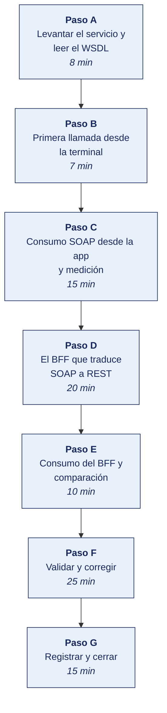

[Semana 05](README.md) · [Teoría](1-TEORIA.md) · [Dinámica de aula](2-DINAMICA.md) · **Taller de laboratorio**

# Taller de laboratorio 05 · Consumo comparado de un servicio SOAP y uno REST

**SI-988 · Soluciones Móviles II** · Semana 05 · Sesión 2 en laboratorio · 100 min · calificación **procedimental**

> ¿Un término no le resulta claro? Está definido en el [glosario técnico del curso](../GLOSARIO.md).

---

## Secuencia del taller



## Qué entregas

| | |
|---|---|
| **Archivo** | `SI988-S05-TALLER-Grupo<N>.pdf` |
| **Plantilla obligatoria** | [SI988-PLANTILLA-TALLER.docx](../PLANTILLAS/SI988-PLANTILLA-TALLER.docx) |
| **Formato** | PDF exportado desde la plantilla en Word, con la carátula de la UPT, el índice actualizado y las capturas numeradas |
| **Qué va dentro** | Las secciones de la plantilla. La **5. Resultados y evidencias** se califica contra la tabla de resultados esperados de esta guía, y **cada resultado necesita la evidencia que lo demuestre**. No se copian de aquí los objetivos, la duración ni los resultados de aprendizaje |
| **Dónde se sube** | Aula virtual, tarea «Taller · Semana 05» |
| **Cuándo vence** | 48 horas después de la sesión de laboratorio |

> No se califica un informe entregado en `.docx`, sin carátula, sin los códigos de los integrantes o con resultados declarados sin evidencia.

---

**La sesión de laboratorio dura 100 minutos.** El avance de Sprint 1 lo ejecuta el equipo fuera de la sesión.

## El reto

| | |
|---|---|
| **Situación** | El servicio legado habla SOAP y la app no debería enterarse. La pregunta es si conviene traducir en el servidor o cargar con XML en el móvil. |
| **Misión** | Consumir el servicio de las dos formas, medir seis métricas en ambas y decidir con la medición, no con la intuición. |
| **Criterio de éxito** | El ADR-003 se sostiene en las mediciones propias, y las credenciales del servicio legado nunca salen del servidor. |

## 1. Información sobre el evento práctico

### 1.1. Título del evento práctico

Consumo de un servicio SOAP real desde la aplicación móvil, comparación medida contra el consumo REST equivalente, e implementación de un Backend For Frontend que traduce y reduce el mensaje.

### 1.2. Objetivos

- Analizar un **WSDL real** e identificar sus operaciones, tipos y dirección del servicio.
- **Consumir el servicio SOAP directamente** desde la app y medir el resultado.
- Implementar un **BFF** que traduzca SOAP a JSON y reduzca el mensaje.
- Consumir el BFF desde la app y **medir la diferencia** en bytes, tiempo y memoria.
- Manejar correctamente el **`Fault`** de SOAP, incluido el caso de HTTP 200 con error.
- Documentar la decisión de integración en un **ADR (*Architecture Decision Record*, registro de decisión de arquitectura)**.

### 1.3. Tiempo de duración

**100 minutos.**

### 1.4. Resultados de Aprendizaje (RA)

- **RA1** Analiza e interpreta los conceptos avanzados de desarrollo móvil.
- **RA2** Propone el plan de desarrollo de su app con metodologías ágiles.

### 1.5. Recursos

| Recurso | Detalle |
|---|---|
| **W3C SOAP 1.2** | https://www.w3.org/TR/soap12-part1/ |
| **W3C WSDL 2.0** | https://www.w3.org/TR/wsdl20/ |
| **W3C XML Schema** | https://www.w3.org/TR/xmlschema11-1/ |
| Servicio SOAP público con WSDL | Servicios de prueba abiertos, o el del caso de la organización |
| **SoapUI** o **Postman** | Exploración del WSDL y prueba de operaciones |
| **FastAPI** o **Express** | Implementación del BFF |
| **zeep** (Python) o equivalente | Cliente SOAP del BFF |
| **mitmproxy** | Medición del tráfico real |

### 1.6. Seguridad

> **Dónde se trabaja.** El taller se hace en el **laboratorio de la universidad, sobre el emulador**. Cuando un escenario no se reproduce fielmente en el emulador, la verificación en un teléfono real la hace el equipo **fuera de la sesión** y adjunta el video como anexo. Ningún resultado del taller depende de tener un teléfono en clase.

1. **No se distribuyen credenciales ni certificados de WS-Security en el artefacto móvil.** Un `.apk` o un `.ipa` es descompilable. Cualquier secreto embebido es público. Esta es la razón técnica principal del BFF.
2. El BFF guarda las credenciales del servicio legado en variables de entorno del servidor, nunca en el repositorio.
3. Si el servicio SOAP procesa datos personales, el BFF aplica **minimización**. Devuelve a la app solo los campos que necesita.
4. **Se deshabilita la resolución de entidades externas** en el analizador XML. Evita el ataque de entidad externa XML (XXE), una vulnerabilidad clásica del procesamiento de XML.

---

## Sobre qué se trabaja esta semana

**Esta es la única semana del curso en que no se construye sobre la app del equipo.**

SOAP está en el sílabo y hay que aprenderlo, pero ningún proyecto de estudiante va a tener un backend SOAP — nadie construye uno nuevo desde hace años. Se aprende porque en la industria se encuentran sistemas heredados —banca, seguros, ERP, entidades del Estado— que solo exponen SOAP, y el ingeniero tiene que integrarse con ellos.

Por eso el taller entrega un servicio SOAP de prueba y el equipo se integra con él, como se integraría con el sistema heredado de un cliente real.

| | |
|---|---|
| **Qué se trabaja** | Un servicio SOAP provisto por el curso, en [`servicio-soap/`](servicio-soap/) |
| **Qué NO se toca** | La app del equipo. Su dominio, sus entidades y sus pantallas quedan intactos |
| **Dónde vive el código** | **Un módulo aparte.** `Lib/experimentos/soap/` en Flutter, `commonMain/experimentos/soap/` en KMP |
| **Qué queda en el proyecto** | Solo el documento `docs/api/MEDICIONES.md` con la comparación y su conclusión |
| **Semana siguiente** | La S06 retoma la app del equipo |

El código SOAP **no se integra a la app**. Es un experimento medido que produce un documento de decisión.

## 2. Procedimiento o Metodología

> **Se empieza de cero.** No hace falta haber visto SOAP antes. Los pasos A y B se hacen sin tocar la app. Primero se levanta el servicio, se lee su contrato y se hace una llamada desde la terminal. Recién en el paso C entra la app.

### Paso A — Levantar el servicio y leer el WSDL

**A.1 — Arrancar el servicio.** El servicio de prueba está en [`servicio-soap/`](servicio-soap/). Solo necesita Python 3.8 o superior. No instala dependencias y funciona sin internet.

```bash
cd SEMANA-05/servicio-soap
python3 servidor.py
```

Debe imprimir:

```
Servicio SOAP del Taller 05 escuchando en http://0.0.0.0:8080/servicio
WSDL: http://localhost:8080/servicio?wsdl
Desde el emulador de Android use  http://10.0.2.2:8080/servicio
```

Deje esa terminal abierta. Todo el taller corre contra ese servicio.

**A.2 — Obtener el WSDL.** En otra terminal:

```bash
curl -s "http://localhost:8080/servicio?wsdl" -o docs/api/catalogo.wsdl
wc -l docs/api/catalogo.wsdl
```

**A.3 — Leer el contrato.** El WSDL declara el servicio. Ubique en el archivo, y anote en dónde está cada cosa:

| Elemento del WSDL | Qué declara | Qué buscar en el archivo |
|---|---|---|
| `targetNamespace` | El namespace del servicio | Atributo de `<definitions>` |
| `<types>` | Los tipos de datos, en XML Schema | Cada `<xsd:element>` de request y response |
| `<message>` | Los mensajes de entrada y salida | Un par por operación |
| `<portType>` | Las **operaciones** disponibles | `<operation name="...">` |
| `<binding>` | **Cómo viajan.** Protocolo y `soapAction` | `<soap:operation soapAction="...">` |
| `<service>` | La dirección del endpoint | `<soap:address location="...">` |

Complete `docs/api/ANALISIS_WSDL.md`:

| Operación | Parámetros de entrada | Campos de la respuesta | `soapAction` |
|---|---|---|---|
| `ListarProductos` | ninguno | | |
| `ObtenerProducto` | | | |
| `ConsultarStock` | | | |

> **Por qué esto importa.** En REST el contrato suele ser un documento aparte que puede estar desactualizado. En SOAP el WSDL **es** el contrato y el servidor lo publica. Es más rígido y más verboso, pero no miente. Es una ventaja del WSDL frente a un contrato REST desactualizado.

### Paso B — Primera llamada desde la terminal

Antes de escribir una línea en la app, haga la llamada a mano. Si falla aquí, falla en la app y costará el triple depurarlo.

**B.1 — Listar productos.**

```bash
curl -s -X POST http://localhost:8080/servicio \
  -H 'Content-Type: text/xml; charset=utf-8' \
  -H 'SOAPAction: "http://si988.upt.pe/servicio/ListarProductos"' \
  -d '<?xml version="1.0" encoding="UTF-8"?>
<soap:Envelope xmlns:soap="http://schemas.xmlsoap.org/soap/envelope/">
  <soap:Body>
    <ListarProductosRequest xmlns="http://si988.upt.pe/servicio"/>
  </soap:Body>
</soap:Envelope>'
```

Ese bloque XML es el **envelope**. `Envelope` contiene `Body`, y `Body` contiene la operación. Es la estructura obligatoria de SOAP 1.1.

**B.2 — Obtener un producto que existe.**

```bash
curl -s -X POST http://localhost:8080/servicio \
  -H 'Content-Type: text/xml; charset=utf-8' \
  -d '<?xml version="1.0"?><soap:Envelope xmlns:soap="http://schemas.xmlsoap.org/soap/envelope/"><soap:Body><ObtenerProductoRequest xmlns="http://si988.upt.pe/servicio"><codigo>P-002</codigo></ObtenerProductoRequest></soap:Body></soap:Envelope>'
```

**B.3 — Los dos casos de error.** Fíjese en el código HTTP:

```bash
# Caso 1 · Fault con HTTP 500 — el comportamiento esperado
curl -s -o /tmp/f1.xml -w 'HTTP %{http_code}\n' -X POST http://localhost:8080/servicio \
  -H 'Content-Type: text/xml' \
  -d '<?xml version="1.0"?><soap:Envelope xmlns:soap="http://schemas.xmlsoap.org/soap/envelope/"><soap:Body><ObtenerProductoRequest xmlns="http://si988.upt.pe/servicio"><codigo>ERR-404</codigo></ObtenerProductoRequest></soap:Body></soap:Envelope>'
cat /tmp/f1.xml

# Caso 2 · Fault con HTTP 200 — el que rompe a quien confía en el código HTTP
curl -s -o /tmp/f2.xml -w 'HTTP %{http_code}\n' -X POST http://localhost:8080/servicio \
  -H 'Content-Type: text/xml' \
  -d '<?xml version="1.0"?><soap:Envelope xmlns:soap="http://schemas.xmlsoap.org/soap/envelope/"><soap:Body><ObtenerProductoRequest xmlns="http://si988.upt.pe/servicio"><codigo>ERR-200</codigo></ObtenerProductoRequest></soap:Body></soap:Envelope>'
cat /tmp/f2.xml
```

> **Anote el resultado del caso 2.** Devuelve **HTTP 200** con un `<soap:Fault>` dentro. Un cliente que asuma «200 es éxito» va a procesar ese cuerpo como si fuera un producto y va a fallar en otro punto, lejos de la causa. **En SOAP siempre hay que inspeccionar el cuerpo**, sin importar el código HTTP. Es la diferencia operativa principal frente a REST.

**B.4 — Medir.** Tres ejecuciones de `ConsultarStock`, se registra la mediana:

```bash
for i in 1 2 3; do
  curl -s -o /dev/null -w 'HTTP %{http_code} · %{size_download} bytes · %{time_total}s\n' \
    -X POST http://localhost:8080/servicio -H 'Content-Type: text/xml' \
    -d '<?xml version="1.0"?><soap:Envelope xmlns:soap="http://schemas.xmlsoap.org/soap/envelope/"><soap:Body><ConsultarStockRequest xmlns="http://si988.upt.pe/servicio"><codigo>P-002</codigo></ConsultarStockRequest></soap:Body></soap:Envelope>'
done
```

### Paso C — Consumo SOAP desde la app y medición

**El código de este paso está en la guía de su stack.** El enunciado es el mismo para las dos:

1. Construir el envelope con una plantilla, **nunca concatenando cadenas** con datos del usuario. Eso abre la puerta a inyección de XML.
2. Enviar la petición con `Content-Type: text/xml; charset=utf-8` y la cabecera `SOAPAction`.
3. **Detectar el `Fault` antes de asumir éxito**, tanto con HTTP 500 como con HTTP 200.
4. Configurar el parser XML contra XXE — se explica en C.4 de cada guía.
5. Medir tamaño de request, tamaño de response y tiempo total.

| Stack | Guía |
|---|---|
| **Flutter** | [Taller 05 · Implementación en Flutter](3-TALLER-FLUTTER.md) |
| **Kotlin Multiplatform** | [Taller 05 · Implementación en KMP](3-TALLER-KOTLIN.md) |

### Paso D — El BFF que traduce SOAP a REST

El **BFF** (*Backend For Frontend*) es un servicio intermedio. Habla SOAP con el sistema heredado y REST/JSON con la app. Es la solución profesional cuando el móvil no puede o no debe hablar SOAP.

Está en [`servicio-soap/bff.py`](servicio-soap/bff.py) y también es Python estándar:

```bash
python3 bff.py          # escucha en 8081, consume el SOAP de 8080
curl -s http://localhost:8081/api/productos | head -c 300
```

Compare el mismo dato en los dos formatos:

```bash
curl -s -o /dev/null -w 'SOAP: %{size_download} bytes\n' -X POST http://localhost:8080/servicio \
  -H 'Content-Type: text/xml' \
  -d '<?xml version="1.0"?><soap:Envelope xmlns:soap="http://schemas.xmlsoap.org/soap/envelope/"><soap:Body><ListarProductosRequest xmlns="http://si988.upt.pe/servicio"/></soap:Body></soap:Envelope>'
curl -s -o /dev/null -w 'REST: %{size_download} bytes\n' http://localhost:8081/api/productos
```

### Paso E — Consumo del BFF y comparación

La app consume el BFF con **el mismo repositorio de la Semana 04**, cambiando solo la URL base. Ni una línea de XML entra a la app.

Complete `docs/api/MEDICIONES.md` con datos medidos, no estimados:

| Métrica | SOAP directo | REST vía BFF | Diferencia |
|---|---|---|---|
| Bytes del request | | | |
| Bytes de la response | | | |
| Tiempo total, mediana de 3 (ms) | | | |
| Líneas de código en la app | | | |
| Dependencias añadidas a la app | | | |
| ¿El error llega con código HTTP correcto? | **No** | | |

### Paso F — Validar y corregir (25 min)

El resultado no vale por estar hecho, sino por resistir una comprobación. Se ejecutan estas tres y **se corrige lo que falle antes de cerrar la sesión**.

1. Comprobar que el analizador XML tiene las cinco opciones contra XXE, probándolo con una entidad externa.
2. Verificar que las credenciales del servicio legado **no** aparecen en el repositorio ni en la configuración de la app.
3. Revisar que las seis métricas son la **mediana de tres ejecuciones**, no una sola medición.

> Lo que no se pueda corregir hoy se anota en la sección **Problemas y mejoras** de la evidencia, con lo que faltó y por qué. Un resultado parcial documentado con honestidad vale más que uno declarado sin prueba.

### Paso G — Registrar la evidencia y cerrar (15 min)

Se versiona lo producido, se anota la URL de cada resultado y se responde en dos frases la pregunta de transferencia — **qué riesgo correría una organización real si esto se hiciera mal**.

---

## 3. Resultados

> **Evidencia obligatoria en GitHub.** Todo resultado de este taller se versiona en el repositorio del equipo. El informe **no consigna capturas sueltas**. Consigna la **URL** del artefacto en GitHub. Una captura no permite verificar autoría, fecha ni contenido; un enlace sí.
>
> | Qué se entrega | Dónde vive | Qué se escribe en el informe |
> |---|---|---|
> | Código y archivos de configuración | Rama del taller, fusionada a `develop` vía Pull Request | URL del Pull Request |
> | Documentos y matrices | `docs/`, en formato de texto versionable | URL del archivo en la rama |
> | Capturas y videos que el taller exija | `docs/evidencias/S05/` | URL del archivo |
> | Salida de comandos | `docs/evidencias/S05/salidas/*.txt` | URL del archivo |
>
> **Etiqueta del taller.** Al cerrar el taller se crea la etiqueta `taller-05` sobre el commit entregado:
>
> ```bash
> git tag -a taller-05 -m "Taller 05 · SI988"
> git push origin taller-05
> ```
>
> La URL que se consigna en el informe apunta a esa etiqueta:
> `https://github.com/<organizacion>/<repositorio>/tree/taller-05`
>
> **El informe es lo que se califica; el repositorio es lo que lo prueba.** Cada resultado de la sección 3 del informe lleva la URL con la que se verifica, y **un resultado sin su URL se califica como no logrado**, por bien redactado que esté. Lo que no se puede abrir no se puede dar por hecho.

### 3.1. Los tres resultados que se califican

Son los que la rúbrica evalúa. El resto de la lista tiene que existir, pero no se califica fila por fila.

| Resultado | Qué demuestra | Dónde está |
|---|---|---|
| **El manejo del Fault** | Verificado, incluido el caso del error devuelto con HTTP 200 | Prueba |
| **Las mediciones comparadas** | Las seis métricas en ambas rutas, con mediana de tres ejecuciones | `MEDICIONES.md` |
| **El ADR-003** | Tres alternativas y la medición propia que sustenta la decisión | `ADR-003` |

### 3.2. Lista de comprobación del taller

Todo esto debe existir al cerrar la sesión.

| # | Resultado esperado | Verificación |
|---|---|---|
| 1 | WSDL descargado y analizado, con las operaciones identificadas | `ANALISIS_WSDL.md` |
| 2 | Consumo SOAP directo funcionando desde la app | Demostración |
| 3 | **Manejo del `Fault` verificado**, incluido el caso HTTP 200 con error | Prueba |
| 4 | **Analizador XML configurado contra XXE**, con las cinco opciones | Código |
| 5 | BFF desplegado y funcionando | URL o `docker compose` |
| 6 | **Minimización aplicada**: el BFF devuelve solo los campos que la app usa | Modelo del BFF |
| 7 | **Credenciales del servicio legado solo en el servidor** | Revisión del repositorio y de la CI |
| 8 | Caché del BFF operativa, con su TTL declarado | Código y medición |
| 9 | `Fault` traducido a códigos HTTP semánticos | Código |
| 10 | **Mediciones completas** de las seis métricas, con la mediana de tres ejecuciones | `MEDICIONES.md` |
| 11 | **ADR-003** con las tres alternativas y la medición que sustenta la decisión | `ADR-003` |
| 12 | Historias del Sprint 1 avanzando; incremento demostrable en el emulador | Tablero y demostración |

## Rúbrica procedimental (20 puntos)

Se aplica sobre el informe entregado y la evidencia enlazada en el repositorio. **Cada criterio se califica de forma independiente.**

| Criterio | 4 — Logrado | 2 — En proceso | 0 — Insuficiente |
|---|---|---|---|
| **Consumo SOAP desde la app y medición** | Completo y correcto, con la evidencia que lo respalda | Completo con errores menores, o correcto pero sin toda la evidencia | Incompleto, o entregado sin ejecutar |
| **El BFF que traduce SOAP a REST** | Completo y correcto, con la evidencia que lo respalda | Completo con errores menores, o correcto pero sin toda la evidencia | Incompleto, o entregado sin ejecutar |
| **Evidencia verificable en el repositorio** | Cada resultado tiene su URL sobre la etiqueta `taller-NN`, y el enlace abre lo que dice | La mayoría tiene URL; alguna evidencia es una captura suelta | Se declaran resultados sin enlace, o el enlace no corresponde |
| **Rigor técnico de la implementación** | El código compila, las pruebas pasan y el análisis estático sale limpio | Compila y funciona, con avisos del análisis sin resolver | No compila, o se entregó sin ejecutar |
| **La evidencia entregada** | Las secciones de la plantilla completas; los resultados se sustentan con la evidencia enlazada | Secciones completas con sustento parcial | Faltan secciones o los resultados se afirman sin evidencia |

| Puntaje | Equivalencia |
|---|---|
| 18 – 20 | Destacado |
| 14 – 17 | Logrado |
| 6 – 13 | En proceso |
| 0 – 5 | Insuficiente |

> **Un resultado declarado sin evidencia enlazada no se califica**, aunque el trabajo se haya hecho. La tabla de la sección 3.1 es la lista de cotejo; esta rúbrica es lo que determina la nota.

## 4. Conclusiones

Mínimo tres. Líneas argumentales esperadas:

1. Un servicio SOAP puede devolver HTTP 200 con un error en el cuerpo; el cliente que solo inspecciona el código de estado concluye que la operación tuvo éxito, y ese es el error de integración más frecuente al venir de REST.
2. La razón principal para no consumir SOAP directamente desde el móvil no es el tamaño del mensaje sino la seguridad. Distribuir credenciales o certificados en un artefacto descompilable los convierte en públicos.
3. El Backend For Frontend no es una capa adicional gratuita — aporta minimización, caché, aislamiento del cambio y protección de credenciales, y su costo es un componente más que desplegar y monitorear.

## 5. Referencias Bibliográficas

- W3C. *SOAP Version 1.2 Part 1: Messaging Framework*. https://www.w3.org/TR/soap12-part1/
- W3C. *Web Services Description Language (WSDL) 2.0*. https://www.w3.org/TR/wsdl20/
- W3C. *XML Schema 1.1*. https://www.w3.org/TR/xmlschema11-1/
- OASIS. *Web Services Security: SOAP Message Security*. https://www.oasis-open.org/standards/
- AWS. *Diferencia entre SOAP y REST*. https://aws.amazon.com/es/compare/the-difference-between-soap-rest/
- Daigneau, R. (2012). *Service Design Patterns: Fundamental Design Solutions for SOAP/WSDL and RESTful Web Services*. Addison-Wesley.
- Capel Tuñón, M. I. (2016). *Desarrollo de software y sistemas basados en componentes y servicios*. Garceta. https://www.alphaeditorialcloud.com/
- OWASP (*Open Worldwide Application Security Project*) Foundation. *XML External Entity (XXE) Prevention Cheat Sheet*. https://cheatsheetseries.owasp.org/cheatsheets/XML_External_Entity_Prevention_Cheat_Sheet.html
- Newman, S. (2021). *Building Microservices* (2.ª ed.). O'Reilly. — patrón Backend For Frontend.
- Zeep. *Python SOAP client documentation*. https://docs.python-zeep.org/

## 6. Anexos

- `anexo_A_analisis_wsdl.pdf`
- `anexo_B_mediciones.xlsx` — las seis métricas con sus tres ejecuciones
- `anexo_C_bff.py` y su `docker-compose.yml`
- `anexo_D_ADR-003.pdf`
- `anexo_E_fault_handling.png` — evidencia del HTTP 200 con `Fault`

---

---

[Semana 05](README.md) · [Teoría](1-TEORIA.md) · [Dinámica de aula](2-DINAMICA.md) · **Taller de laboratorio**

---

**Docente** · Dr. Oscar Juan Jimenez Flores
[oscarjimenezflores@upt.pe](mailto:oscarjimenezflores@upt.pe) · [LinkedIn](https://www.linkedin.com/in/oscar-jimenez-flores/) · [CTI Vitae — CONCYTEC](https://ctivitae.concytec.gob.pe/appDirectorioCTI/VerDatosInvestigador.do?id_investigador=33398)

Escuela Profesional de Ingeniería de Sistemas · Universidad Privada de Tacna · Tacna, Perú
