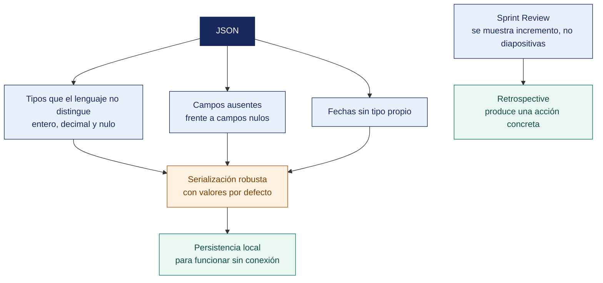

[Semana 06](README.md) · **Teoría** · [Dinámica de aula](2-DINAMICA.md) · [Taller de laboratorio](3-TALLER.md)

# Teoría · Manejo de Datos en Formato JSON · Sprint 1 Review y Retrospective · Examen de Unidad I

**SI-988 · Soluciones Móviles II** · Semana 06 · Sesión 1 en aula · 2 horas académicas, 100 min, con la dinámica incluida

> ¿Un término no le resulta claro? Está definido en el [glosario técnico del curso](../GLOSARIO.md).

---

## La pregunta de esta sesión

Una app de pedidos muestra al usuario un total de S/ 24.90 y el backend le cobra S/ 24.89. La diferencia es de un céntimo y aparece en uno de cada treinta pedidos.

El código está bien escrito, las pruebas pasan y el equipo no reproduce el defecto en el emulador. El total viaja en el JSON como número decimal, y ni el móvil ni el servidor lo redondean igual.

> **La pregunta que ordena el material de esta unidad.** *¿Por qué un formato tan simple como JSON rompe aplicaciones en producción?*

## Antes de empezar

| Lo que necesita traer | De dónde sale |
|---|---|
| El consumo de servicios REST y el contrato del endpoint | Semana 04 |
| SOAP y el error que viaja dentro del cuerpo | Semana 05 |
| La capa de datos y el mapeo entre DTO y entidad | Semana 02 |
| Los eventos de Scrum y el compromiso de cada artefacto | Semana 03 |

> **Autocomprobación, antes de leer el material.** Antes de leer, anote su respuesta a tres preguntas. *¿Dónde se pierde ese céntimo? ¿Qué tipo debería tener el dinero en un JSON? ¿Por qué el defecto no aparece en el emulador?* Al terminar el material, vuelva a sus respuestas.

## Distribución del tiempo

| Momento | Minutos |
|---|---|
| Exposición de avance de la Unidad I | 60 |
| Examen teórico de Unidad I | 40 |
| **Total de la sesión de aula** | **100** |

## Mapa de la sesión



---

## Material de estudio de la unidad

> **No se dicta en clase.** Los 100 minutos de aula de esta semana se reparten entre la exposición de avance y el examen teórico. Este material —55 minutos de desarrollo— **se estudia por cuenta propia antes de la sesión y entra en el examen teórico de la Unidad I**. Está aquí completo, no resumido. Es el mismo desarrollo que tendría en aula.

### JSON · lo que parece simple y no lo es

**JSON** está definido por el RFC 8259 y por el estándar ECMA-404. Su aparente simplicidad esconde decisiones que rompen aplicaciones en producción.

**Los seis problemas reales del JSON en móviles.**

| # | Problema | Qué ocurre | Solución |
|---|---|---|---|
| **1** | **Números grandes** | JSON no distingue entero de decimal. Un identificador de 19 dígitos se convierte en `double` y **pierde precisión** | Transportar los identificadores **como cadena** |
| **2** | **Decimales de dinero** | `0.1 + 0.2 != 0.3` en coma flotante. Un total puede mostrar `S/ 29.999999996` | Transportar el monto en **céntimos como entero**, o como cadena y usar tipo decimal |
| **3** | **Fechas** | JSON no tiene tipo fecha. Cada backend inventa su formato | Exigir **ISO 8601 con zona horaria**: `aaaa-mm-ddThh:mm:ss-05:00` |
| **4** | **Valores nulos vs. ausentes** | `{"nombre": null}` y `{}` no significan lo mismo | **Distinguirlos en el modelo.** Opcional presente y opcional ausente |
| **5** | **Campos nuevos del backend** | Un campo agregado rompe el analizador estricto | **Ignorar campos desconocidos** por configuración |
| **6** | **Codificación** | Caracteres del español mal codificados | UTF-8 en todo el trayecto; verificar la cabecera `Content-Type` |

> **El problema de los decimales de dinero es el que más daño causa.** Una app que muestra un total distinto del que cobra el backend pierde la confianza del usuario de forma irreversible. **En dinero nunca se usa coma flotante.**

**Zonas horarias.** El Perú está en UTC−5 y **no aplica horario de verano**, lo que simplifica el caso local pero no el general.

| Regla | Por qué |
|---|---|
| El backend transporta **UTC con desplazamiento explícito** | Elimina la ambigüedad |
| El cliente **convierte a la zona del dispositivo solo para mostrar** | El usuario ve su hora local |
| El cliente **almacena en UTC** | Comparaciones y ordenamientos correctos |
| Nunca se transporta una fecha **sin zona horaria** | `aaaa-mm-dd hh:mm` es ambiguo: ¿de dónde? |

**Serialización. Generada frente a manual.**

| Enfoque | Ventajas | Desventajas | Cuándo |
|---|---|---|---|
| **Generada** (anotaciones y generador de código) | Menos código, menos errores, verificación en compilación | Aumenta el tiempo de compilación | **Preferida** |
| **Reflexiva** (en tiempo de ejecución) | Sin generación | Más lenta; puede romperse con la ofuscación del artefacto | Evitar en producción |
| **Manual** | Control total | Verbosa y propensa a errores | Solo para estructuras irregulares |

> **Advertencia sobre la ofuscación.** Al generar el artefacto de producción con ofuscación, los nombres de las clases y de los campos cambian. **Una serialización reflexiva deja de funcionar en la versión publicada aunque funcione en depuración.** Se resuelve con reglas de conservación o usando serialización generada. Es un error que aparece justo en la Semana 16.

**Persistencia local.**

| Opción | Cuándo conviene | Cuándo no |
|---|---|---|
| **Preferencias clave-valor** | **Ajustes simples.** Tema, idioma, primer arranque | **Nunca** para tokens, datos personales ni listas |
| **Base de datos relacional embebida** | Datos estructurados, consultas, relaciones, uso sin conexión | Estructuras muy irregulares |
| **Base de datos de documentos** | Estructuras irregulares o anidadas | Consultas relacionales complejas |
| **Archivos** | Contenido grande: imágenes, documentos | Datos que se consultan |
| **Almacenamiento seguro** (Keystore / Keychain) | **Tokens, claves, credenciales** | Datos voluminosos |

**Ejemplo trabajado — la misma respuesta, y los cinco errores que produce si se toma tal cual.** El backend del piloto devuelve el pedido así:

```json
{
  "id": 9007199254740993,
  "total": 29.90,
  "creado": "2026-03-14 19:05",
  "propina": null,
  "canal": "app",
  "puntos_fidelidad": 12
}
```

| Campo | Lo que parece | Lo que ocurre en el dispositivo | Corrección en el contrato |
|---|---|---|---|
| `id` | Un entero | Excede el entero seguro de coma flotante. Se lee **9007199254740992**. El pedido consultado es otro | `"id": "9007199254740993"` — identificador **como cadena** |
| `total` | S/ 29.90 | `29.90 * 3` da `89.69999999999999`; la app muestra un total distinto del que cobra el backend | `"total_centimos": 2990` — **entero en céntimos** |
| `creado` | Una fecha | Sin zona horaria la app la interpreta en la del dispositivo. Un pedido de las 19:05 en Tacna aparece a las 00:05 del día siguiente para un usuario con el teléfono en UTC | `"creado": "2026-03-14T19:05:00-05:00"` — **ISO 8601 con desplazamiento** |
| `propina` | Sin propina | `null` presente y campo ausente se modelan igual: la app no distingue «no dejó propina» de «el backend aún no lo calcula» | Modelar opcional presente frente a opcional ausente |
| `puntos_fidelidad` | Un campo más | El backend lo agregó esta semana; el analizador estricto **lanza excepción y la pantalla queda en error** | Configurar **ignorar campos desconocidos** |

**Y un sexto error que no está en el JSON.** Si la serialización es reflexiva, todo lo anterior funciona en depuración y **falla en el artefacto ofuscado de la Semana 16**, porque los nombres de los campos ya no son los mismos.

> **Ninguno de los cinco falla en el emulador del equipo que lo escribió.** Aparecen con un identificador grande, con un usuario en otra zona horaria, con un total de tres cifras o el día que el backend agrega un campo — es decir, **en producción y con usuarios reales**. Por eso el contrato del dato se acuerda con el backend antes del sprint, no después del primer reporte.

> **Autoevaluación (6 min) · los cinco campos de riesgo de su propio contrato.** Abra la respuesta real de un endpoint de su app y marque **qué campos son dinero, cuáles son fechas con zona horaria y cuáles son identificadores**. Esos tres tipos concentran los defectos que no aparecen en el emulador.

| Caso | Qué debe contener una buena respuesta |
|---|---|
| ¿Por qué el dinero en céntimos como entero y no como decimal en JSON? | Porque JSON no distingue tipos numéricos y casi todo analizador lo convertirá a coma flotante. El entero de céntimos atraviesa la cadena sin pérdida, y se formatea solo al mostrar |
| ¿Por qué el token no va en preferencias clave-valor? | Porque no están cifradas y son legibles en un dispositivo con acceso root o desde un respaldo. Los tokens van en Keystore o Keychain |
| El backend agregará campos con frecuencia. ¿Cómo se protege la app? | Ignorando campos desconocidos por configuración, y tratando los campos nuevos como opcionales. Un analizador estricto convierte cualquier despliegue del backend en una caída de la app instalada |

> **El error frecuente.** Representar el dinero como número decimal. Es el defecto del caso y no se reproduce en el emulador porque necesita un total de tres cifras o una plataforma que redondee distinto. **En dinero nunca se usa coma flotante** — viaja en céntimos como entero, y la conversión ocurre en un solo punto de la app.

### Sprint Review y Retrospective · cómo se hacen bien

**Sprint Review — es una inspección, no una presentación.**

| Se hace | No se hace |
|---|---|
| Mostrar **software funcionando** en un dispositivo | Mostrar diapositivas o capturas |
| Invitar a los **interesados** y recoger su reacción | Reunión interna del equipo |
| Recorrer el **Sprint Goal**: ¿se alcanzó? | Enumerar tareas realizadas |
| **Adaptar el Product Backlog** con lo aprendido | Cerrar el sprint y pasar al siguiente |
| Mostrar también **lo que no se terminó**, con honestidad | Ocultar lo incompleto |

**Sprint Retrospective — es sobre el proceso, no sobre las personas.**

La **directiva primaria** que se lee en voz alta al iniciar cada retrospectiva:

> *«Independientemente de lo que descubramos, entendemos y creemos sinceramente que todos hicieron el mejor trabajo posible, dados sus conocimientos, sus habilidades, los recursos disponibles y la situación del momento.»*

Formato **«Empezar · Dejar de · Continuar»**, y la regla que la hace útil:

| Regla | Por qué |
|---|---|
| **Una sola acción de mejora comprometida por sprint** | Cinco acciones equivalen a ninguna |
| La acción entra al **Sprint Backlog siguiente** | Lo que no está en el backlog no se hace |
| Tiene **responsable y criterio de verificación** | «Comunicarnos mejor» no es verificable |
| La primera actividad del próximo sprint es **revisar la acción anterior** | Cierra el ciclo de mejora |

**Ejemplo trabajado — dos retrospectivas del mismo sprint.** El equipo cerró el sprint 1 con 3 de 5 historias terminadas.

| | **Retrospectiva que no sirve** | **Retrospectiva que sirve** |
|---|---|---|
| Cómo empieza | «¿Qué salió mal?» | Se lee la directiva primaria en voz alta |
| Lo que se dice | «Nos faltó comunicación» · «Fulano no subió su rama» | «Las dos historias sin terminar dependían de la API, y el contrato se acordó recién el día 6» |
| Sobre quién se habla | Sobre personas | Sobre el proceso |
| Qué se acuerda | «Comunicarnos mejor», «esforzarnos más», «hacer más pruebas», «revisar antes», «no dejar todo al final» | **Una sola acción:** el contrato de la API se acuerda y se congela en el Planning, con un doble de prueba disponible desde el día 1 |
| Responsable | Nadie | El PO, con apoyo del Scrum Master |
| Cómo se verifica | No se verifica | La acción entra como **elemento del Sprint Backlog 2**; la primera actividad del sprint 3 es revisarla |
| Resultado en el sprint siguiente | Se repite el mismo problema | El sprint 2 cierra 5 de 5 |

> **Cinco acciones de mejora equivalen a ninguna**, porque ninguna tiene dueño ni cabe en el sprint. **Una sola acción, en el backlog, con responsable y criterio de verificación, es lo que convierte la retrospectiva en el evento que hace mejorar al equipo** — y es también el primero que se sacrifica «porque no hay tiempo», justo cuando más falta hace.

> **Autoevaluación (6 min) · la única acción de mejora del sprint.** Escriba **una sola acción de mejora** para su sprint 1, con responsable y criterio de verificación, y colóquela en el backlog. Cinco acciones sin dueño equivalen a ninguna.

| Caso | Qué debe contener una buena respuesta |
|---|---|
| ¿Por qué se lee la directiva primaria si el equipo se conoce? | **Porque fija el marco.** Se habla del proceso, no de culpables. Sin ese marco la retrospectiva se convierte en reparto de responsabilidades y la gente deja de decir lo que ve |
| En la Review no terminamos dos historias. ¿Se muestran igual? | Se declara qué no se terminó y por qué, y se muestra lo que sí funciona en dispositivo. **Ocultarlo cuesta más.** El interesado lo descubre en la siguiente Review |
| ¿Qué distingue una Review de una demostración comercial? | Que se recoge la reacción de los interesados y **se adapta el Product Backlog** con lo aprendido. Una Review de la que no sale ningún cambio en el backlog no fue una inspección |

---

> **El error frecuente.** Convertir la Sprint Review en una presentación. Es una inspección del incremento, con el producto funcionando delante, y la Retrospective que la sigue trata sobre el proceso y no sobre las personas. **El evento que hace mejorar al equipo es el primero que se sacrifica «porque no hay tiempo»**, justo cuando más falta hace.

## Exposición de avance de la Unidad I

Cada equipo expone el avance de su producto ante el aula y el docente. **6 minutos por equipo**, 10 equipos, sin margen. Se corta al minuto seis.

| Momento | Duración | Qué se muestra |
|---|---|---|
| Qué se propuso el equipo para esta unidad | 1 min | El objetivo declarado al inicio de la unidad |
| **Lo construido, funcionando** | 3 min | Producto real, no diapositivas de lo que se piensa hacer |
| Lo que no se logró y por qué | 1 min | Con honestidad. Ocultarlo cuesta más que declararlo |
| Preguntas | 1 min | Del docente |

> **Se evalúa el avance verificable, no la presentación.** Un equipo que muestra poco pero real puntúa por encima de uno que muestra mucho y no lo tiene.

## Examen de Unidad I

El Examen de Unidad se rinde en dos partes, y juntas valen el 25 % de la nota de la unidad.

| Parte | Dónde y cuándo | Duración | Qué evalúa | Materiales |
|---|---|---|---|---|
| **Teórico** | Aula, al cierre de esta sesión | 40 min | Preguntas de alternativas sobre las Semanas 01 a 06, incluido el material de estudio de esta semana | Apuntes propios. **Sin** internet ni asistentes de inteligencia artificial |
| **Práctico** | Laboratorio | 100 min | Detectar el código que **parece** correcto, que es lo que la inteligencia artificial no distingue por el alumno | Laboratorio de cómputo, **con inteligencia artificial permitida** y declarada |


## Cierre · qué se lleva de esta unidad

**La respuesta a la pregunta del material.** Porque JSON no tiene tipos para lo que las aplicaciones necesitan. No distingue entero de decimal, no define zona horaria y no acota la precisión de un número, de modo que **el contrato del dato hay que acordarlo fuera del formato**. El céntimo del caso se pierde entre dos redondeos legítimos, y ninguno de los dos está mal.

**Las tres ideas que deben quedar.**

| Idea | Por qué importa en el ejercicio profesional |
|---|---|
| Los defectos de JSON aparecen con datos reales, no en el emulador | Un identificador grande, un usuario en otra zona horaria o un total de tres cifras bastan para destaparlos |
| El contrato del dato se acuerda con el backend antes del sprint | Después del primer reporte ya hay usuarios afectados y versiones publicadas que corregir |
| La serialización reflexiva sobrevive a la depuración y muere en el artefacto ofuscado | Es el defecto que aparece en la Semana 16, cuando ya no hay margen |

**Lo que sigue.** Con esto cierra la Unidad I. La Unidad II entra en ubicación, permisos, datos personales y seguridad, donde el descuido ya no cuesta un céntimo — **cuesta una sanción de la autoridad de protección de datos o el rechazo de la tienda**.

---

---

[Semana 06](README.md) · **Teoría** · [Dinámica de aula](2-DINAMICA.md) · [Taller de laboratorio](3-TALLER.md)

---

**Docente** · Dr. Oscar Juan Jimenez Flores
[oscarjimenezflores@upt.pe](mailto:oscarjimenezflores@upt.pe) · [LinkedIn](https://www.linkedin.com/in/oscar-jimenez-flores/) · [CTI Vitae — CONCYTEC](https://ctivitae.concytec.gob.pe/appDirectorioCTI/VerDatosInvestigador.do?id_investigador=33398)

Escuela Profesional de Ingeniería de Sistemas · Universidad Privada de Tacna · Tacna, Perú
