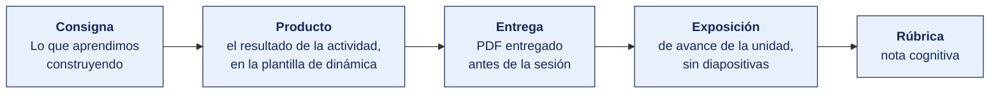
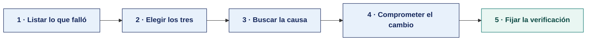

[Semana 06](README.md) · [Teoría](1-TEORIA.md) · **Dinámica de aula** · [Taller de laboratorio](3-TALLER.md)

# Dinámica de aula · Lo que aprendimos construyendo

**SI-988 · Soluciones Móviles II** · Semana 06 · **Trabajo previo a la sesión** · calificación **cognitiva**

> ¿Un término no le resulta claro? Está definido en el [glosario técnico del curso](../GLOSARIO.md).

---

> **Esta actividad no se resuelve en aula.** La semana de cierre de unidad dedica sus 100 minutos de aula a la **exposición de avance (60 min)** y al **examen teórico (40 min)**. La dinámica se prepara durante la semana y **se entrega antes de la sesión**. Es el insumo con el que el equipo arma su exposición.

## Cómo funciona la actividad

## Qué entregas

| | |
|---|---|
| **Archivo** | `SI988-S06-DINAMICA-Grupo<N>.pdf` |
| **Plantilla obligatoria** | [SI988-PLANTILLA-DINAMICA.docx](../PLANTILLAS/SI988-PLANTILLA-DINAMICA.docx) |
| **Formato** | PDF exportado desde la plantilla en Word, con la carátula de la UPT y los apellidos, nombres y códigos de todos los integrantes |
| **Qué va dentro** | El producto de cierre de unidad que se describe más abajo, desarrollado por el grupo con la evidencia acumulada en la unidad |
| **Dónde se sube** | Aula virtual, tarea «Dinámica · Semana 06» |
| **Cuándo vence** | Al cierre de la unidad, antes del examen |
| **Exposición** | En la **exposición de avance de la unidad**, dentro de esta misma sesión. El grupo lee y explica su resultado ante el aula. No se usan diapositivas |

> No se califica un trabajo entregado en `.docx`, sin carátula, sin los códigos de los integrantes o con las tablas del producto vacías.

---

| Componente | Peso |
|---|---|
| Exposición de la Semana 05 | 30 % |
| **Examen de Unidad I** | 70 % |

---

## Consigna

> **«Lo que aprendimos construyendo»**
> Un producto por equipo con **los tres errores técnicos** que cometieron en el Sprint 1, qué los causó y qué cambiarán en el Sprint 2.

| | |
|---|---|
| **Su papel** | **El propio equipo en su retrospectiva**, con el Sprint 2 empezando la semana que viene |
| **Misión** | Nombrar tres errores técnicos con su causa real y comprometer un cambio verificable para cada uno |
| **Restricción** | **Prohibido mencionar personas.** Se habla de decisiones y de procesos. «Juan no terminó a tiempo» no es una retrospectiva, es una acusación |

Que el equipo convierta lo que le salió mal en una regla que impida que vuelva a pasar. Un error sin cambio comprometido es una anécdota; con cambio comprometido es aprendizaje.

## Cómo se prepara

**Paso 1 · Listar lo que falló.** Todo lo del Sprint 1 que costó tiempo o quedó sin terminar, con la fecha en que ocurrió. Se listan más de tres para poder elegir.

**Paso 2 · Elegir los tres.** Por el tiempo que costaron, no por lo vergonzosos que resulten. Un error incómodo de poco costo no entra.

**Paso 3 · Buscar la causa.** Se pregunta por qué hasta llegar a una **decisión del equipo**, no a una circunstancia. «Se acabó el tiempo» no es una causa; «ordenamos el sprint por capas» sí lo es.

**Paso 4 · Comprometer el cambio.** Qué se hará distinto en el Sprint 2, redactado como una regla que se pueda incumplir. Una regla que nadie puede incumplir no es una regla.

**Paso 5 · Fijar la verificación.** Cómo se sabrá, al cerrar el Sprint 2, si el cambio se aplicó. Es lo que se revisará en la Semana 12.

## Material de trabajo

**Este producto no se resuelve en aula y no necesita material nuevo.** Se construye con lo que el equipo ya produjo en las Semanas 01 a 05 sobre su propio proyecto.

| Para qué | De dónde sale |
|---|---|
| Lo que falló y cuándo | Tablero del sprint, historial de la integración continua y registro de la Daily |
| El costo en tiempo | `SPRINT_BACKLOG.md` y la velocidad calculada al cierre del sprint |
| Las decisiones que lo causaron | Los ADR y los acuerdos de trabajo de la Semana 01 |

## Producto

**Un solo producto**, que va en la sección 2 de la plantilla, «El producto».

| Campo | Contenido |
|---|---|
| Qué pasó | El hecho con su fecha y su costo en tiempo, sin nombrar a nadie |
| Qué lo causó | La decisión del equipo que lo produjo, no la circunstancia |
| Qué cambiamos | La regla adoptada para el Sprint 2, redactada de modo que se pueda incumplir |
| Cómo lo verificaremos | El dato que dirá, al cerrar el Sprint 2, si la regla se aplicó |

**Tres filas. Ni una más.**

> **Dónde va.** Este producto se presenta en la **sección 2 de la [plantilla de dinámica](../PLANTILLAS/SI988-PLANTILLA-DINAMICA.docx)**, «El producto». No se copia la consigna ni la teoría. Solo el resultado y lo que lo sostiene.

## Ejemplo resuelto

*El caso de este ejemplo es distinto del que le toca a tu grupo. Sirve para que veas el nivel de detalle que se espera, no para copiarlo.*

**Una diapositiva de retrospectiva bien resuelta.** El sprint del ejemplo es de un ciclo anterior.

> **Los tres errores técnicos del Sprint 1**

| # | Qué pasó | Qué lo causó | Qué cambiamos |
|---|---|---|---|
| 1 | La capa de datos se terminó el día 8 de 10. Las tres historias que dependían de ella entraron a pruebas el último día y dos quedaron sin terminar | Ordenamos el sprint por capas —primero todo el modelo, luego todo el repositorio, luego la interfaz— en lugar de por historias completas. Nada estuvo terminado hasta el final | En el Sprint 2 cada historia atraviesa las tres capas y se termina antes de empezar la siguiente. Límite de trabajo en progreso: 2 |
| 2 | El contrato de la interfaz de programación cambió el día 6 y hubo que rehacer el mapeo de tres respuestas | Escribimos el cliente HTTP contra un contrato acordado de palabra en una reunión, sin documento | El contrato se define en un archivo OpenAPI versionado en el repositorio antes de escribir el cliente. Un cambio exige actualizar el archivo primero |
| 3 | La integración continua estuvo en rojo cuatro días seguidos y nadie la atendió porque «no bloqueaba» | No había acuerdo sobre quién repara la integración ni en cuánto tiempo | **Regla adoptada.** La integración en rojo es lo primero que se atiende, y la repara quien hizo el último cambio. Si no se puede en 30 minutos, se revierte |

**La regla de la retrospectiva.** Se habla de decisiones y de procesos, nunca de personas. «Ordenamos el sprint por capas» describe una decisión del equipo. «Juan no terminó a tiempo» no es una retrospectiva. Es una acusación, y además no produce ninguna mejora.

**La diferencia entre aprobar y no aprobar.**

| Así no | Así sí |
|---|---|
| «Nos faltó tiempo para terminar las historias.» | «Ordenamos el sprint por capas en lugar de por historias. Nada estuvo terminado hasta el final.» |
| «Hubo problemas de comunicación con el backend.» | «Escribimos el cliente contra un contrato acordado de palabra, sin documento. Cambió el día 6.» |
| «Vamos a organizarnos mejor.» | «Cada historia atraviesa las tres capas y se termina antes de empezar la siguiente. Límite de trabajo en progreso: 2.» |

## Reglas

- No se resuelve en aula. Se prepara durante la semana y **se entrega antes de la sesión**.
- **Ninguna persona nombrada.** Se habla de decisiones y de procesos.
- Cada causa termina en una decisión del equipo, no en una circunstancia externa.
- Cada cambio comprometido lleva su forma de verificación, que se revisa en la Semana 12.
- La exposición es la ronda de avance de la unidad. El grupo **lee y explica su resultado**. No se usan diapositivas.

## Rúbrica cognitiva (20 puntos)

Se aplica sobre el producto de cierre de unidad y sobre la exposición de avance.

| Criterio | 5 | 3 | 1 |
|---|---|---|---|
| **Lo que se construyó** | El incremento del Sprint 1 funciona y se demuestra sobre el dispositivo, no en diapositiva | Funciona con fallas que el equipo reconoce | No hay incremento demostrable |
| **La lección técnica** | Se identifica el error más caro del sprint, con la evidencia de cuánto costó | Se identifica sin cuantificar | Una lección genérica sobre trabajo en equipo |
| **La corrección adoptada** | La acción de mejora queda comprometida, con responsable y sprint en el que se verifica | Comprometida sin responsable | Una intención sin acción |
| **La exposición de avance** | Todo el equipo domina el producto y responde sin buscar quién sabe | Responde siempre el mismo integrante | El equipo no puede explicar su propio incremento |

---

[Semana 06](README.md) · [Teoría](1-TEORIA.md) · **Dinámica de aula** · [Taller de laboratorio](3-TALLER.md)

---

**Docente** · Dr. Oscar Juan Jimenez Flores
[oscarjimenezflores@upt.pe](mailto:oscarjimenezflores@upt.pe) · [LinkedIn](https://www.linkedin.com/in/oscar-jimenez-flores/) · [CTI Vitae — CONCYTEC](https://ctivitae.concytec.gob.pe/appDirectorioCTI/VerDatosInvestigador.do?id_investigador=33398)

Escuela Profesional de Ingeniería de Sistemas · Universidad Privada de Tacna · Tacna, Perú
