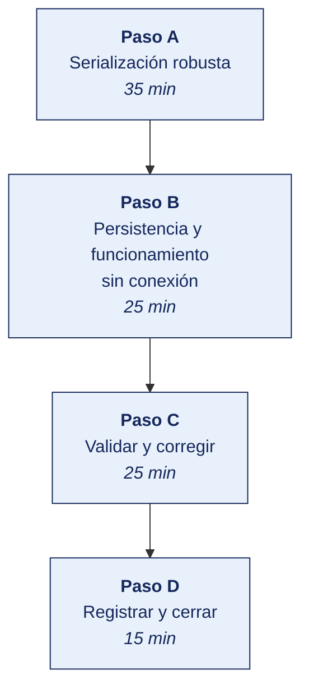

[Semana 06](README.md) · [Teoría](1-TEORIA.md) · [Dinámica de aula](2-DINAMICA.md) · **Taller de laboratorio**

# Taller de laboratorio 06 · JSON robusto, persistencia offline y cierre del Sprint 1

**SI-988 · Soluciones Móviles II** · Semana 06 · Sesión 2 en laboratorio · 100 min · calificación **procedimental**

> ¿Un término no le resulta claro? Está definido en el [glosario técnico del curso](../GLOSARIO.md).

---

## Secuencia del taller



## Qué entregas

| | |
|---|---|
| **Archivo** | `SI988-S06-TALLER-Grupo<N>.pdf` |
| **Plantilla obligatoria** | [SI988-PLANTILLA-TALLER.docx](../PLANTILLAS/SI988-PLANTILLA-TALLER.docx) |
| **Formato** | PDF exportado desde la plantilla en Word, con la carátula de la UPT, el índice actualizado y las capturas numeradas |
| **Qué va dentro** | Las secciones de la plantilla. La **5. Resultados y evidencias** se califica contra la tabla de resultados esperados de esta guía, y **cada resultado necesita la evidencia que lo demuestre**. No se copian de aquí los objetivos, la duración ni los resultados de aprendizaje |
| **Dónde se sube** | Aula virtual, tarea «Taller · Semana 06» |
| **Cuándo vence** | 48 horas después de la sesión de laboratorio de la semana, se desarrolle el taller dentro de ella o fuera de ella |

> No se califica un informe entregado en `.docx`, sin carátula, sin los códigos de los integrantes o con resultados declarados sin evidencia.

---

**La sesión de laboratorio dura 100 minutos.** El avance de Sprint 1 Review y Retrospective lo ejecuta el equipo fuera de la sesión.

## El reto

| | |
|---|---|
| **Situación** | El servidor cambia un campo y la app deja de funcionar en producción. O peor redondea un céntimo y la cuenta no cuadra. |
| **Misión** | Hacer la serialización robusta ante lo inesperado, guardar el dinero en céntimos con aritmética exacta y verificar que todo sigue funcionando con el artefacto ofuscado. |
| **Criterio de éxito** | Las siete pruebas de serialización pasan **y** la serialización funciona en el artefacto de release, donde la ofuscación suele romperla. |

## 1. Información sobre el evento práctico

### 1.1. Título del evento práctico

Implementación de serialización JSON robusta frente a los seis problemas característicos, persistencia local con funcionamiento sin conexión verificado, y cierre formal del Sprint 1 con su Review y Retrospective.

### 1.2. Objetivos

- Implementar **serialización generada** y verificar su comportamiento con ofuscación.
- Resolver los **seis problemas del JSON** — identificadores, dinero, fechas, nulos, campos nuevos y codificación.
- Implementar **persistencia local** con la base de datos del stack.
- Verificar el **funcionamiento sin conexión** de extremo a extremo.
- Escribir **pruebas de serialización** que cubran los casos límite.
- Ejecutar la **Sprint 1 Review** con software funcionando ante interesados.
- Ejecutar la **Sprint 1 Retrospective** y comprometer **una** acción de mejora.
- Calcular la **velocidad** del equipo y planificar el Sprint 2.

### 1.3. Tiempo de duración

**100 minutos.**

### 1.4. Resultados de Aprendizaje (RA)

- **RA1** Analiza e interpreta los conceptos avanzados de desarrollo móvil.
- **RA2** Propone el plan de desarrollo de su app con metodologías ágiles.

### 1.5. Recursos

| Recurso | Detalle |
|---|---|
| **RFC 8259 · JSON** | https://www.rfc-editor.org/rfc/rfc8259.html |
| **ISO 8601** — formato de fecha y hora | Referencia normativa |
| Serialización del stack | kotlinx.serialization · Codable · json_serializable · Zod |
| Persistencia del stack | Room · SwiftData · Drift · WatermelonDB |
| **Scrum Guide 2020** | https://scrumguides.org/ |
| Interesados invitados | Al menos **dos personas externas al equipo** para la Review |

### 1.6. Seguridad

> **Dónde se trabaja.** El taller se hace en el **laboratorio de la universidad, sobre el emulador**. Cuando un escenario no se reproduce fielmente en el emulador, la verificación en un teléfono real la hace el equipo **fuera de la sesión** y adjunta el video como anexo. Ningún resultado del taller depende de tener un teléfono en clase.

1. **Ningún dato personal ni token en preferencias clave-valor.** Los tokens van al almacenamiento seguro de la plataforma; se completa en la Semana 10.
2. La base de datos local puede contener datos personales. Se inventaría desde ahora para el trabajo de la Semana 09.
3. Las pruebas usan **datos sintéticos**, nunca datos reales de personas.
4. Al probar con ofuscación, se verifica que la serialización siga funcionando — **es un fallo que solo aparece en la versión de producción**.

---

## 2. Procedimiento o Metodología

### Paso A — Serialización robusta

```
// Modelo de transporte (DTO) — resuelve los seis problemas
@Serializable
data class RecursoDto(

  // PROBLEMA 1: identificador como CADENA, no como número.
  // Un id de 19 dígitos como número pierde precisión al convertirse a double.
  @SerialName("id") val id: String,

  @SerialName("nombre") val nombre: String,

  // PROBLEMA 2: dinero en CÉNTIMOS como entero.
  // Nunca coma flotante para dinero.
  @SerialName("monto_centimos") val montoCentimos: Long,
  @SerialName("moneda") val moneda: String = "PEN",

  // PROBLEMA 3: fecha en ISO 8601 CON zona horaria.
  @SerialName("creado_en") val creadoEn: String,     // "aaaa-mm-ddThh:mm:ss-05:00"

  // PROBLEMA 4: distinguir null de ausente.
  // Con valor por defecto: si el backend no lo envía, queda null sin fallar.
  @SerialName("descripcion") val descripcion: String? = null,

  // Colección con valor por defecto: nunca null al llegar al dominio.
  @SerialName("etiquetas") val etiquetas: List<String> = emptyList(),
)

// PROBLEMA 5: ignorar campos desconocidos.
// Sin esto, un campo nuevo del backend rompe la app publicada.
val json = Json {
  ignoreUnknownKeys = true      // ← INDISPENSABLE
  isLenient = false             // se mantiene estricto en lo demás
  encodeDefaults = true
  explicitNulls = false
}

// PROBLEMA 6: codificación — se verifica la cabecera y se fuerza UTF-8 al leer.

// --- Mapeo DTO → dominio: aquí se resuelven los tipos ---
fun RecursoDto.aDominio() = Recurso(
  id = id,
  nombre = nombre,
  monto = Dinero.deCentimos(montoCentimos, moneda),      // tipo con aritmética exacta
  creadoEn = OffsetDateTime.parse(creadoEn),             // falla ruidosamente si no es ISO 8601
  descripcion = descripcion,
  etiquetas = etiquetas,
)
```

**El tipo `Dinero`** —la pieza que evita el error más costoso:

```
class Dinero private constructor(val centimos: Long, val moneda: String) {
  companion object {
    fun deCentimos(c: Long, m: String) = Dinero(c, m)
    fun deTexto(s: String, m: String) = Dinero(BigDecimal(s).movePointRight(2).toLong(), m)
  }
  operator fun plus(o: Dinero): Dinero {
    require(moneda == o.moneda) { "No se pueden sumar monedas distintas" }
    return Dinero(centimos + o.centimos, moneda)
  }
  fun formatear(locale: Locale = Locale("es","PE")): String =
      NumberFormat.getCurrencyInstance(locale).format(centimos / 100.0)
  // Se muestra con división por 100 SOLO al formatear.
  // Toda la aritmética ocurre en enteros.
}
```

**Pruebas de serialización — los casos límite.**

```
test('deserializa un identificador de 19 dígitos sin perder precisión') {
  val j = """{"id":"9007199254740993","nombre":"X","monto_centimos":100,"creado_en":"aaaa-mm-ddThh:mm:ss-05:00"}"""
  assert(json.decodeFromString<RecursoDto>(j).id == "9007199254740993")
}

test('la aritmética de dinero es exacta') {
  val a = Dinero.deCentimos(10, "PEN")   // S/ 0.10
  val b = Dinero.deCentimos(20, "PEN")   // S/ 0.20
  assert((a + b).centimos == 30L)        // exacto; con double daría 0.30000000000000004
}

test('ignora campos desconocidos del backend') {
  val j = """{"id":"1","nombre":"X","monto_centimos":100,"creado_en":"aaaa-mm-ddThh:mm:ss-05:00","campo_nuevo":"valor"}"""
  assert(json.decodeFromString<RecursoDto>(j).id == "1")   // no lanza excepción
}

test('distingue campo nulo de campo ausente') {
  val conNulo    = json.decodeFromString<RecursoDto>("""{"id":"1","nombre":"X","monto_centimos":1,"creado_en":"...","descripcion":null}""")
  val sinCampo   = json.decodeFromString<RecursoDto>("""{"id":"1","nombre":"X","monto_centimos":1,"creado_en":"..."}""")
  assert(conNulo.descripcion == null && sinCampo.descripcion == null)   // ambos manejados sin fallar
}

test('falla ruidosamente ante una fecha sin zona horaria') {
  val dto = RecursoDto(id="1", nombre="X", montoCentimos=1, creadoEn="aaaa-mm-dd hh:mm")
  assertThrows<DateTimeParseException> { dto.aDominio() }
  // Preferible fallar en la prueba que mostrar una hora equivocada al usuario.
}

test('convierte a la zona del dispositivo solo al mostrar') {
  val utc = OffsetDateTime.parse("aaaa-mm-ddThh:mm:ssZ")
  assert(utc.atZoneSameInstant(ZoneId.of("America/Lima")).hour == 14)
}

test('maneja caracteres del español correctamente') {
  val j = """{"id":"1","nombre":"Camión de Ñuñoa","monto_centimos":1,"creado_en":"aaaa-mm-ddThh:mm:ss-05:00"}"""
  assert(json.decodeFromString<RecursoDto>(j).nombre == "Camión de Ñuñoa")
}
```

**Verificación con ofuscación** —el paso que evita el fallo de la Semana 16:

```bash
# Se genera el artefacto de RELEASE con ofuscación y se prueba la serialización
<comando de compilación release del stack>
# Se instala en un dispositivo y se verifica que la lista carga correctamente.
# Si falla solo en release, la serialización es reflexiva · se agregan reglas de
# conservación o se migra a serialización generada.
```

### Paso B — Persistencia y funcionamiento sin conexión

```
// Entidad local — refleja la tabla, no el DTO ni el dominio
@Entity(tableName = "recursos")
data class RecursoEntidad(
  @PrimaryKey val id: String,
  val nombre: String,
  val montoCentimos: Long,
  val moneda: String,
  val creadoEnUtc: String,          // ← se almacena SIEMPRE en UTC
  val descripcion: String?,
  val etiquetasJson: String,        // lista serializada
  val sincronizadoEn: Long,         // marca temporal de la última sincronización
)

@Dao
interface RecursoDao {
  @Query("SELECT * FROM recursos ORDER BY creadoEnUtc DESC")
  fun observarTodos(): Flow<List<RecursoEntidad>>          // fuente única de verdad

  @Upsert suspend fun guardar(items: List<RecursoEntidad>)

  @Query("SELECT MAX(sincronizadoEn) FROM recursos")
  suspend fun ultimaSincronizacion(): Long?

  @Query("DELETE FROM recursos WHERE sincronizadoEn < :limite")
  suspend fun purgar(limite: Long)                          // política de retención
}
```

**Verificación del funcionamiento sin conexión** —protocolo de prueba, grabado en video:

| # | Paso | Resultado esperado |
|---|---|---|
| 1 | Con red abrir la app y cargar la lista | Datos visibles |
| 2 | Activar modo avión | — |
| 3 | Cerrar la app por completo (no solo minimizar) | — |
| 4 | Reabrir la app | **La lista sigue visible** |
| 5 | Observar el indicador de datos desactualizados | **Visible, con la fecha de la última sincronización** |
| 6 | Intentar una acción que requiere red | Mensaje claro y acción de reintento |
| 7 | Desactivar el modo avión y reintentar | Se actualiza y desaparece el aviso |

### Trabajo del equipo fuera de la sesión — Sprint 1 Review y Retrospective

> Lo que no alcance a completarse en la sesión lo ejecuta el equipo durante la semana, y llega al siguiente taller con el incremento listo. El docente lo revisa en el repositorio y en el tablero, no en clase.

**B.1 — Sprint 1 Review (50 min).** Con **al menos dos interesados externos** al equipo:

| Momento | Duración | Contenido |
|---|---|---|
| El Sprint Goal | 3 min | Se enuncia y se responde si se alcanzó |
| **Demostración** | 20 min | **Software funcionando**, en el emulador del laboratorio o en un teléfono real si el equipo lo trae. Un integrante usa la app; otro narra |
| Lo no terminado | 5 min | Con honestidad qué falta y por qué |
| Reacción de los interesados | 15 min | Se registra literalmente lo que dicen |
| Adaptación del backlog | 7 min | Qué cambia en el Product Backlog con lo aprendido |

`docs/sprints/sprint-01/REVIEW.md`:

| Campo | Contenido |
|---|---|
| Sprint Goal | ¿Se alcanzó? Sí / Parcialmente / No |
| Historias completadas | Con sus puntos |
| Historias no completadas | Con la razón y su destino |
| **Velocidad del sprint** | Puntos completados |
| Interesados presentes | Cargo o perfil |
| **Reacciones registradas** | Citas literales |
| Cambios al Product Backlog | Historias agregadas, modificadas o retiradas |

**B.2 — Sprint 1 Retrospective (50 min).**

1. **Directiva primaria** leída en voz alta (2 min).
2. **Recolección** (15 min). Cada integrante escribe en silencio bajo «Empezar · Dejar de · Continuar». En silencio para que las primeras opiniones no condicionen a las demás.
3. **Agrupación y votación** (10 min). Se agrupan los temas afines y cada integrante vota tres.
4. **Análisis del tema más votado** (15 min). Cinco porqués hasta la causa raíz.
5. **Compromiso** (8 min) — **una sola acción**, con responsable y criterio de verificación.

`docs/sprints/sprint-01/RETROSPECTIVE.md`:

| Campo | Contenido |
|---|---|
| Empezar | |
| Dejar de | |
| Continuar | |
| Tema más votado | |
| **Causa raíz** (cinco porqués) | |
| **Acción de mejora comprometida** | Una sola |
| Responsable | |
| **Criterio de verificación** | Cómo sabremos en el Sprint 2 que funcionó |
| Elemento del Sprint Backlog 2 | La acción entra como elemento del backlog |

**B.3 — Cálculo de velocidad y planificación del Sprint 2 (20 min).**

```python
# scripts/velocidad.py
import pandas as pd
s = pd.read_csv("docs/sprints/HISTORIAL_SPRINTS.csv")   # sprint, comprometidos, completados
s["cumplimiento"] = (s.completados / s.comprometidos * 100).round(1)
print(s.to_string(index=False))
print(f"\nVelocidad del Sprint 1: {s.completados.iloc[-1]:.0f} puntos")
print(f"Cumplimiento del compromiso: {s.cumplimiento.iloc[-1]:.0f} %")
print("\nProyección para el Sprint 2:")
print(f"  Conservadora  : {s.completados.iloc[-1]:.0f} puntos")
print(f"  Optimista     : {s.completados.iloc[-1] * 1.15:.0f} puntos")
print("\n→ Con un solo sprint la velocidad NO es predictiva. Se usa como referencia,")
print("  no como compromiso. A partir del Sprint 3 se promedian los tres últimos.")
```

```bash
git add . && git commit -m "S06: serializacion robusta, persistencia offline y cierre del Sprint 1"
git tag -a sprint-1 -m "Sprint 1 completado - incremento entregable"
```

---

### Paso C — Validar y corregir (25 min)

El resultado no vale por estar hecho, sino por resistir una comprobación. Se ejecutan estas tres y **se corrige lo que falle antes de cerrar la sesión**.

1. Instalar el artefacto de **release** en el dispositivo y comprobar que la serialización sigue funcionando con la ofuscación activa.
2. Verificar que el dinero se guarda como entero en céntimos y que ninguna operación usa coma flotante.
3. Comprobar que las fechas viajan en ISO 8601 con zona horaria y se almacenan en UTC, no en hora local del dispositivo.

> Lo que no se pueda corregir hoy se anota en la sección **Problemas y mejoras** de la evidencia, con lo que faltó y por qué. Un resultado parcial documentado con honestidad vale más que uno declarado sin prueba.

### Paso D — Registrar la evidencia y cerrar (15 min)

Se versiona lo producido, se anota la URL de cada resultado y se responde en dos frases la pregunta de transferencia — **qué riesgo correría una organización real si esto se hiciera mal**.

---

## 3. Resultados

> **Evidencia obligatoria en GitHub.** Todo resultado de este taller se versiona en el repositorio del equipo. El informe **no consigna capturas sueltas**. Consigna la **URL** del artefacto en GitHub. Una captura no permite verificar autoría, fecha ni contenido; un enlace sí.
>
> | Qué se entrega | Dónde vive | Qué se escribe en el informe |
> |---|---|---|
> | Código y archivos de configuración | Rama del taller, fusionada a `develop` vía Pull Request | URL del Pull Request |
> | Documentos y matrices | `docs/`, en formato de texto versionable | URL del archivo en la rama |
> | Capturas y videos que el taller exija | `docs/evidencias/S06/` | URL del archivo |
> | Salida de comandos | `docs/evidencias/S06/salidas/*.txt` | URL del archivo |
>
> **Etiqueta del taller.** Al cerrar el taller se crea la etiqueta `taller-06` sobre el commit entregado:
>
> ```bash
> git tag -a taller-06 -m "Taller 06 · SI988"
> git push origin taller-06
> ```
>
> La URL que se consigna en el informe apunta a esa etiqueta:
> `https://github.com/<organizacion>/<repositorio>/tree/taller-06`
>
> **El informe es lo que se califica; el repositorio es lo que lo prueba.** Cada resultado de la sección 3 del informe lleva la URL con la que se verifica, y **un resultado sin su URL se califica como no logrado**, por bien redactado que esté. Lo que no se puede abrir no se puede dar por hecho.

### 3.1. Los tres resultados que se califican

Son los que la rúbrica evalúa. El resto de la lista tiene que existir, pero no se califica fila por fila.

| Resultado | Qué demuestra | Dónde está |
|---|---|---|
| **La serialización robusta** | Campos desconocidos ignorados, nulos y ausentes manejados, siete pruebas en verde | Salida de la integración continua |
| **La verificación con ofuscación** | La serialización funcionando en el artefacto de release | Evidencia en dispositivo |
| **El protocolo sin conexión** | Los siete pasos verificados en video, con el indicador de datos desactualizados | Evidencia |

### 3.2. Lista de comprobación del taller

Todo esto debe existir al cerrar la sesión.

| # | Resultado esperado | Verificación |
|---|---|---|
| 1 | Serialización **generada** configurada, con `ignoreUnknownKeys` activo | Código |
| 2 | **Identificadores transportados como cadena** | DTO |
| 3 | **Dinero en céntimos como entero**, con tipo de aritmética exacta | Código y prueba |
| 4 | **Fechas en ISO 8601 con zona horaria**; almacenadas en UTC | DTO y entidad local |
| 5 | Nulos y campos ausentes manejados sin fallo | Prueba en verde |
| 6 | **Siete pruebas de serialización en verde**, incluidos los casos límite | Salida de la CI |
| 7 | **Verificación con ofuscación**. La serialización funciona en el artefacto de release | Evidencia en dispositivo |
| 8 | Persistencia local implementada, con la fuente única de verdad | Código |
| 9 | **Protocolo de siete pasos sin conexión verificado**, en video | Evidencia |
| 10 | Indicador de datos desactualizados con la fecha de última sincronización | Demostración |
| 11 | **Sprint 1 Review con al menos dos interesados externos** y demostración funcionando | `REVIEW.md` |
| 12 | Reacciones de los interesados registradas literalmente | `REVIEW.md` |
| 13 | Retrospective con causa raíz y **una sola acción comprometida**, con criterio de verificación | `RETROSPECTIVE.md` |
| 14 | La acción de mejora incorporada al **Sprint Backlog 2** | Tablero |
| 15 | Velocidad calculada y etiqueta `sprint-1` en Git | Salida del script, `git tag` |

## Rúbrica procedimental (20 puntos)

Se aplica sobre el informe entregado y la evidencia enlazada en el repositorio. **Cada criterio se califica de forma independiente.**

| Criterio | 4 — Logrado | 2 — En proceso | 0 — Insuficiente |
|---|---|---|---|
| **Serialización robusta** | Completo y correcto, con la evidencia que lo respalda | Completo con errores menores, o correcto pero sin toda la evidencia | Incompleto, o entregado sin ejecutar |
| **Persistencia y funcionamiento sin conexión** | Completo y correcto, con la evidencia que lo respalda | Completo con errores menores, o correcto pero sin toda la evidencia | Incompleto, o entregado sin ejecutar |
| **Evidencia verificable en el repositorio** | Cada resultado tiene su URL sobre la etiqueta `taller-NN`, y el enlace abre lo que dice | La mayoría tiene URL; alguna evidencia es una captura suelta | Se declaran resultados sin enlace, o el enlace no corresponde |
| **Rigor técnico de la implementación** | El código compila, las pruebas pasan y el análisis estático sale limpio | Compila y funciona, con avisos del análisis sin resolver | No compila, o se entregó sin ejecutar |
| **La evidencia entregada** | Las secciones de la plantilla completas; los resultados se sustentan con la evidencia enlazada | Secciones completas con sustento parcial | Faltan secciones o los resultados se afirman sin evidencia |

| Puntaje | Equivalencia |
|---|---|
| 18 – 20 | Destacado |
| 14 – 17 | Logrado |
| 6 – 13 | En proceso |
| 0 – 5 | Insuficiente |

> **Un resultado declarado sin evidencia enlazada no se califica**, aunque el trabajo se haya hecho. La tabla de la sección 3.1 es la lista de cotejo; esta rúbrica es lo que determina la nota.

## 4. Conclusiones

Mínimo tres. Líneas argumentales esperadas:

1. La coma flotante nunca debe usarse para dinero. La aritmética en céntimos enteros es la única que garantiza que el total que muestra la app sea el que cobra el backend.
2. Una serialización reflexiva puede funcionar en depuración y fallar en el artefacto publicado por efecto de la ofuscación; verificarlo en la Unidad I evita descubrirlo el día del envío a la tienda.
3. Una retrospectiva con cinco acciones de mejora equivale a ninguna — comprometer una sola, con responsable y criterio de verificación, e incorporarla al backlog del sprint siguiente, es lo que convierte la reflexión en cambio.

## 5. Referencias Bibliográficas

- IETF. *RFC 8259 · The JavaScript Object Notation (JSON) Data Interchange Format*. https://www.rfc-editor.org/rfc/rfc8259.html
- ECMA International. *ECMA-404 · The JSON Data Interchange Syntax*. https://ecma-international.org/publications-and-standards/standards/ecma-404/
- IETF. *RFC 3339 · Date and Time on the Internet: Timestamps*. https://www.rfc-editor.org/rfc/rfc3339.html
- Schwaber, K. y Sutherland, J. (2020). *The Scrum Guide* — Sprint Review y Sprint Retrospective. https://scrumguides.org/
- Derby, E. y Larsen, D. (2006). *Agile Retrospectives: Making Good Teams Great*. Pragmatic Bookshelf. — directiva primaria.
- Google. *Save data in a local database using Room*. https://developer.android.com/training/data-storage/room
- Apple. *SwiftData*. https://developer.apple.com/documentation/swiftdata
- Google. *Build an offline-first app*. https://developer.android.com/topic/architecture/data-layer/offline-first
- Kotlin. *kotlinx.serialization guide*. https://github.com/Kotlin/kotlinx.serialization/blob/master/docs/serialization-guide.md
- Nolasco Valenzuela, J. S. (2019). *Desarrollo de aplicaciones con Android*. Ra-Ma.

## 6. Anexos

- `anexo_A_pruebas_serializacion.png` — CI en verde
- `anexo_B_offline.mp4` — protocolo de siete pasos
- `anexo_C_release_ofuscado.png` — verificación con ofuscación
- `anexo_D_review.pdf` — con las reacciones de los interesados
- `anexo_E_retrospective.pdf`
- `anexo_F_velocidad.png`

---

---

[Semana 06](README.md) · [Teoría](1-TEORIA.md) · [Dinámica de aula](2-DINAMICA.md) · **Taller de laboratorio**

---

**Docente** · Dr. Oscar Juan Jimenez Flores
[oscarjimenezflores@upt.pe](mailto:oscarjimenezflores@upt.pe) · [LinkedIn](https://www.linkedin.com/in/oscar-jimenez-flores/) · [CTI Vitae — CONCYTEC](https://ctivitae.concytec.gob.pe/appDirectorioCTI/VerDatosInvestigador.do?id_investigador=33398)

Escuela Profesional de Ingeniería de Sistemas · Universidad Privada de Tacna · Tacna, Perú
