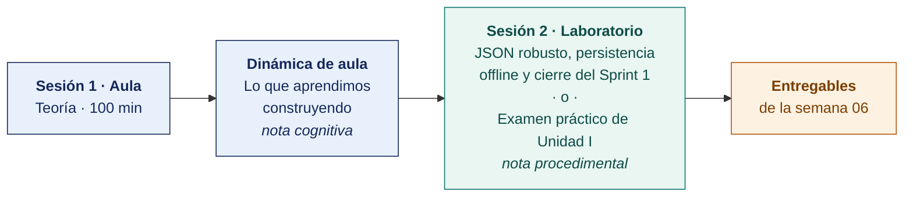

  
  &nbsp;&nbsp;&nbsp;&nbsp;&nbsp;&nbsp;
  

  <strong>Universidad Privada de Tacna</strong> 
  Facultad de Ingeniería · Escuela Profesional de Ingeniería de Sistemas

<h1 align="center">Semana 06 · Manejo de Datos en Formato JSON · Sprint 1 Review y Retrospective · Examen de Unidad I</h1>

  <strong>SI-988 · Soluciones Móviles II</strong> 
  4 horas académicas de 50 min · 100 min de exposiciones y examen de unidad en aula · 100 min de taller en laboratorio

---

## Datos de la asignatura

| | |
|---|---|
| **Asignatura** | SI-988 · Soluciones Móviles II |
| **Escuela** | Escuela Profesional de Ingeniería de Sistemas |
| **Ciclo** | IX · 04 horas semanales · 04 créditos · Electivo |
| **Prerrequisito** | SI-883 Soluciones Móviles I |
| **Unidad** | I — Consumo de servicios web SOAP y REST (cierre) |
| **Semana** | 06 de 17 |
| **Duración** | 4 horas académicas de 50 min · 100 min de exposiciones y examen de unidad en aula · 100 min en laboratorio, compartidos entre el taller y el examen práctico |
| **Resultados de aprendizaje** | **RA1** Analiza e interpreta los conceptos avanzados de desarrollo móvil · **RA2** Propone el plan de desarrollo de su app con metodologías ágiles |
| **Artefacto del proyecto** | **Incremento del Sprint 1 entregable** · Review y Retrospective con acciones de mejora |

### Lo que indica el sílabo

**Contenido conceptual.** Manejo de datos en formato JSON. Examen de Unidad.

**Contenido procedimental.** Procesamiento de respuestas en JSON en una app móvil. Resuelve su examen de unidad.

## Materiales de esta semana

| | Documento | Qué encontrarás | Dónde y cuánto dura |
|---|---|---|---|
| 1 | **[Teoría](1-TEORIA.md)** | El formato JSON y sus casos difíciles · Cómo se conducen el Sprint Review y la Retrospective · Examen de Unidad I | Aula · 100 min |
| 2 | **[Dinámica de aula](2-DINAMICA.md)** | Lo que aprendimos construyendo, con su material, su ejemplo resuelto y su rúbrica | **Trabajo previo**, se entrega antes de la sesión |
| 3 | **[Taller de laboratorio](3-TALLER.md)** | JSON robusto, persistencia offline y cierre del Sprint 1 | Laboratorio · 100 min · **comparte sesión con el examen práctico** |

> **El laboratorio de esta semana lo reclaman dos documentos y solo caben los 100 minutos de una sesión.** El **examen práctico** y el **[taller](3-TALLER.md)** están escritos completos y son independientes entre sí. El docente publica en el aula virtual el que ocupará la sesión y deja el otro como trabajo fuera de ella, y lo comunica al inicio de la semana. **El plazo no cambia con esa decisión** — ambos vencen contando desde la sesión de laboratorio, que se dicta igual en cualquiera de los dos casos.

## Ruta de la semana

## Entregables

| Entregable | Formato y nombre del archivo | Vence |
|---|---|---|
| **Dinámica de aula** · Lo que aprendimos construyendo | PDF desde la [plantilla de dinámica](../PLANTILLAS/SI988-PLANTILLA-DINAMICA.docx) · `SI988-S06-DINAMICA-Grupo<N>.pdf` | Antes de iniciar la sesión de aula |
| **Informe del taller de laboratorio N.º 06** | PDF en formato EPIS desde la [plantilla de taller](../PLANTILLAS/SI988-PLANTILLA-TALLER.docx) · `SI988-S06-TALLER-Grupo<N>.pdf` | 48 h después de la sesión de laboratorio |
| **Examen teórico de Unidad I** | Presencial, 40 min, Preguntas de alternativas | Sesión de aula |
| **Examen práctico de Unidad I** | 100 min, individual, con inteligencia artificial permitida y declarada | Sesión de laboratorio, si el docente le asigna la sesión |
| **Incremento del Sprint 1**, Review y Retrospective | Repositorio con la etiqueta `sprint-1` | 48 h después de la sesión de laboratorio |

> Ambos se entregan en **PDF**, con la carátula de la UPT y los códigos de todos los integrantes. Las plantillas obligatorias están en [`PLANTILLAS/`](../PLANTILLAS/).

## Cómo se evalúa

| Criterio | Instrumento | Peso en la unidad |
|---|---|---|
| Actitudinal | Participación, cumplimiento de los acuerdos del equipo, asistencia a las Dailies y respeto de las convenciones del repositorio en las semanas 01–06 | 15 % |
| Cognitivo | Promedio de las rúbricas de las dinámicas S01–S05 + «Lo que aprendimos construyendo» | 25 % |
| Procedimental | Promedio de las listas de cotejo de los laboratorios 01–06 + **calidad del incremento del Sprint 1** | 35 % |
| Examen de Unidad | **Teórico** en aula, 40 min, Preguntas de alternativas · **Práctico** en laboratorio, 100 min, con inteligencia artificial permitida | 25 % |
| | **La Unidad I aporta el 25 % de la nota final del curso** | |

## Preparación para la Unidad II

La Unidad II es **desarrollo intensivo** — tres sprints con geolocalización, permisos, datos sensibles, cifrado, autenticación y seguridad de las conexiones.

- **Planificar el Sprint 2** antes de la Semana 07, incorporando la acción de mejora de la retrospectiva.
- **Leer.** Documentación oficial de servicios de ubicación de [Android](https://developer.android.com/develop/sensors-and-location/location) y de [Apple](https://developer.apple.com/documentation/corelocation).
- Decidir el **proveedor de mapas** y verificar sus condiciones de uso y sus límites gratuitos.
- **Revisar la [OWASP MASVS](https://mas.owasp.org/MASVS/).** Se aplicará desde la Semana 09.

---

**Docente** · Dr. Oscar Juan Jimenez Flores
[oscarjimenezflores@upt.pe](mailto:oscarjimenezflores@upt.pe) · [LinkedIn](https://www.linkedin.com/in/oscar-jimenez-flores/) · [CTI Vitae — CONCYTEC](https://ctivitae.concytec.gob.pe/appDirectorioCTI/VerDatosInvestigador.do?id_investigador=33398)

Escuela Profesional de Ingeniería de Sistemas · Universidad Privada de Tacna · Tacna, Perú
