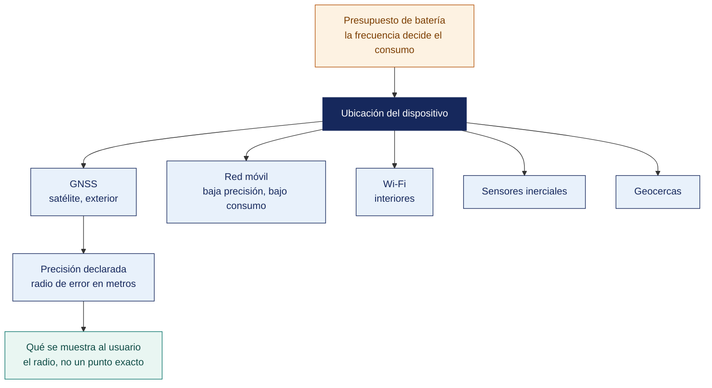

[Semana 07](README.md) · **Teoría** · [Dinámica de aula](2-DINAMICA.md) · [Taller de laboratorio](3-TALLER.md)

# Teoría · Geolocalización en Aplicaciones Móviles

**SI-988 · Soluciones Móviles II** · Semana 07 · Sesión 1 en aula · 2 horas académicas, 100 min, con la dinámica incluida

> ¿Un término no le resulta claro? Está definido en el [glosario técnico del curso](../GLOSARIO.md).

---

## La pregunta de esta sesión

Una app de delivery pide ubicación de máxima precisión cada cinco segundos, «por si acaso». Funciona perfecto y el mapa muestra el punto exacto del usuario.

Los usuarios la desinstalan a la semana. En las reseñas no dicen por qué — dicen que el teléfono se calienta. La app consume más batería que todo el resto del sistema junto.

> **La pregunta que ordena esta sesión.** *¿Cuánta precisión de ubicación necesita realmente esta funcionalidad?*

## Antes de empezar

| Lo que necesita traer | De dónde sale |
|---|---|
| El contrato del dato y el manejo de errores de la capa de datos | Semanas 04 y 06 |
| La arquitectura por capas del proyecto | Semana 02 |
| El incremento del sprint 1 y su Definition of Done | Semanas 03 y 06 |
| Nociones de coordenadas geográficas | Conocimiento general |

> **Exploración (5 min), antes de cualquier definición.** El aula responde antes de la teoría y se anota. *¿Qué hizo mal ese equipo? ¿Cómo se decide cada cuánto pedir la ubicación? ¿Qué debería mostrar el mapa?* No se corrige nada todavía.

## Distribución del tiempo

| Momento | Minutos |
|---|---|
| El caso del teléfono que se calienta y la exploración inicial | 8 |
| Retroalimentación del cierre de la Unidad I | 7 |
| **Bloque 1.** Cómo sabe un teléfono dónde está | 15 |
| **Bloque 2.** Precisión, error y lo que hay que mostrar al usuario · con su microaplicación | 18 |
| **Bloque 3.** Mapas y geocercas | 12 |
| Cierre, respuesta a la pregunta de la sesión y puente a la dinámica | 5 |
| **Total de la sesión de aula** | **65** |

## Mapa de la sesión

---

## Retroalimentación del cierre de la Unidad I

Devolución del examen y de las diapositivas «Lo que aprendimos construyendo». Cierre — **el error técnico más caro del Sprint 1 en casi todos los equipos fue el mismo. Descubrir en la Review que algo funcionaba en el emulador y no en el dispositivo.**

Se revisa que cada equipo haya incorporado su **acción de mejora** al Sprint Backlog 2.

## Bloque 1 · Cómo sabe un teléfono dónde está

> **La pregunta del bloque.** *¿Elige el desarrollador la fuente de ubicación?*

**Las cuatro fuentes de ubicación**, y por qué el sistema las combina:

| Fuente | Precisión típica | Consumo de batería | Tiempo hasta la primera lectura | Funciona en interiores |
|---|---|---|---|---|
| **GNSS** (GPS, GLONASS, Galileo, BeiDou) | 3 a 10 m | **Alto** | 5 a 60 s en frío | **No** |
| **Red móvil** (triangulación de antenas) | 100 a 3 000 m | Muy bajo | Inmediato | Sí |
| **Wi-Fi** (base de datos de puntos de acceso) | 20 a 50 m | Bajo | 1 a 5 s | **Sí** |
| **Sensores inerciales** | Relativa; deriva con el tiempo | Bajo | Inmediato | Sí |

**Ubicación fusionada.** Tanto Android como iOS exponen un servicio que **combina las cuatro fuentes** y entrega la mejor estimación según la precisión solicitada. **El desarrollador no elige la fuente. Declara la precisión que necesita**, y el sistema decide cómo obtenerla con el menor costo energético.

**Las prioridades de precisión y su costo real.**

| Prioridad | Precisión aproximada | Uso de batería | Cuándo usarla |
|---|---|---|---|
| Máxima precisión | 3–10 m | **Muy alto** | Navegación paso a paso, deporte, registro de recorrido |
| Alta precisión equilibrada | 10–100 m | Medio | **La mayoría de los casos**. Mostrar lo cercano, geocercas amplias |
| Bajo consumo | 100–1 000 m | Bajo | Contenido por ciudad, publicidad regional |
| Sin consumo adicional | Variable | Nulo | Usar solo lo que otras apps ya solicitaron |

> **El error de diseño más común.** Solicitar máxima precisión «por si acaso». Una app que pide ubicación de alta precisión cada 5 segundos puede consumir más batería que todo el resto del sistema, y el usuario la desinstala sin saber por qué su teléfono se descarga.

**Los cuatro parámetros de la solicitud de ubicación.**

| Parámetro | Qué controla | Regla |
|---|---|---|
| **Prioridad** | Qué fuentes se activan | La mínima que resuelva el caso de uso |
| **Intervalo** | Cada cuánto se desea una actualización | El mayor que sirva |
| **Intervalo mínimo** | El más rápido que se aceptará | Protege de recibir más de lo necesario |
| **Desplazamiento mínimo** | Distancia mínima antes de notificar | Evita actualizaciones cuando el usuario está quieto |

> **El error frecuente del bloque.** Solicitar máxima precisión «por si acaso». Es el caso de hoy. **El desarrollador no elige la fuente, declara la precisión que necesita**, y el sistema decide cómo obtenerla al menor costo energético. Pedir de más no mejora la funcionalidad y vacía la batería.

## Bloque 2 · Precisión, error y lo que hay que mostrar al usuario

> **La pregunta del bloque.** *¿Qué se le debe mostrar al usuario sobre una estimación con error?*

**Toda lectura de ubicación es una estimación con incertidumbre.** El objeto de ubicación incluye siempre un **radio de precisión**. El sistema afirma que el usuario está dentro de ese círculo con una confianza determinada.

| Radio de precisión | Interpretación | Qué debe hacer la app |
|---|---|---|
| ≤ 10 m | Excelente, típico de GNSS con cielo despejado | Usar directamente |
| 10 a 50 m | Buena, típica de Wi-Fi | Usar; útil para la mayoría de los casos |
| 50 a 500 m | Aproximada, típica de red móvil | **Advertir al usuario**; no usar para decisiones finas |
| > 500 m | Muy imprecisa | **No usar** para lógica de negocio; pedir al usuario que confirme |

> **Regla de interfaz.** El mapa debe **dibujar el círculo de precisión**, no solo el punto. Mostrar un punto exacto cuando el radio es de 800 metros es mentirle al usuario, y produce reclamos cuando la app toma decisiones sobre esa ubicación.

**Errores que hay que manejar** y que el emulador no reproduce:

| Situación | Comportamiento correcto |
|---|---|
| La ubicación tarda en llegar | Mostrar la última conocida con su antigüedad, y un indicador de búsqueda |
| No hay ninguna ubicación disponible | Ofrecer **entrada manual**. Seleccionar en el mapa o escribir una dirección |
| El servicio de ubicación del sistema está apagado | Explicar y llevar al ajuste correspondiente |
| La precisión es insuficiente para la operación | Bloquear la acción con explicación, no fallar silenciosamente |
| Lectura obviamente errónea | Descartar la que implique una velocidad imposible respecto de la anterior |

**Geocodificación.** Convertir coordenadas en dirección y viceversa.

| Operación | Qué hace | Advertencia |
|---|---|---|
| **Geocodificación directa** | Dirección → coordenadas | Ambigua: hay varias «Av. Bolognesi» en el Perú |
| **Geocodificación inversa** | Coordenadas → dirección | Puede fallar o devolver resultados imprecisos fuera de zonas urbanas |

Ambas **requieren red** y suelen tener **límites de uso** en los servicios gratuitos. La app debe cachear resultados y degradar con elegancia cuando el servicio no responde.

**Ejemplo trabajado — la misma funcionalidad, con dos configuraciones de ubicación.** Requisito. *Ordenar los locales por cercanía cuando el usuario abre la app al mediodía*.

| | **Configuración «por si acaso»** | **Configuración proporcional al caso** |
|---|---|---|
| Prioridad | Máxima precisión | Alta precisión equilibrada |
| Intervalo | 5 s, siempre activo | Una lectura al abrir; 60 s solo con la pantalla encendida |
| Desplazamiento mínimo | 0 m | 150 m |
| Precisión obtenida | 5 m | 30 m |
| **¿Cambia el orden de los locales?** | No: el más cercano está a 240 m y el siguiente a 610 m | No |
| Batería en una hora con la app abierta | ~14 % | ~2 % |
| Qué pasa en el subsuelo del centro comercial | Sin GNSS gira indefinidamente esperando 5 m de precisión | Acepta los 400 m de la red móvil, **advierte** y ofrece elegir en el mapa |

**Los 30 metros bastan porque la decisión es gruesa.** La regla es escribir primero la decisión que la ubicación alimenta y luego pedir la precisión que esa decisión exige:

| Decisión que toma la app | Precisión necesaria | Prioridad correcta |
|---|---|---|
| Ordenar locales separados por cientos de metros | 100 m | Bajo consumo |
| Confirmar que el repartidor llegó al local | 30 m | Alta precisión equilibrada |
| Dibujar el recorrido de una entrega en curso | 5 m | Máxima precisión, solo mientras dura la entrega |
| Mostrar contenido por ciudad | 3 km | Sin consumo adicional |

> **Las dos configuraciones producen exactamente el mismo orden de locales, y una cuesta siete veces más batería.** El usuario no ve la diferencia de precisión; sí ve que el teléfono se calienta y se descarga, **y desinstala sin dejar una reseña que explique por qué**. La precisión no es una virtud. Es un costo que se paga solo cuando la decisión lo exige.

> **Microaplicación (6 min) · la decisión antes que la precisión.** Cada equipo escribe **la decisión que la ubicación alimenta en su app** —ordenar locales, validar una entrega, disparar un aviso— y solo después la precisión que esa decisión exige. Casi siempre bastan treinta metros.

| Caso | Qué debe contener una buena respuesta |
|---|---|
| ¿Por qué dibujar el círculo de precisión y no solo el punto? | Porque el punto afirma una certeza que la lectura no tiene. Con radio de 800 m, mostrar un punto exacto lleva al usuario a reclamar por una decisión que la app tomó sobre un dato que ella misma sabía impreciso |
| La geocerca del local no dispara al entrar. ¿Está rota? | **Probablemente no.** El sistema optimiza batería y el evento puede tardar minutos. Si se necesita reacción inmediata, la geocerca es la herramienta equivocada |
| ¿Qué se hace cuando no hay ninguna ubicación disponible? | **Ofrecer entrada manual.** Seleccionar en el mapa o escribir la dirección. Nunca bloquear la app ni fallar en silencio |

> **El error frecuente del bloque.** Dibujar el punto sin el círculo de precisión. Toda lectura de ubicación es una estimación con incertidumbre, y **mostrar un punto exacto cuando el radio es de ochocientos metros es mentirle al usuario**. Produce reclamos en cuanto la app toma una decisión sobre esa ubicación.

## Bloque 3 · Mapas y geocercas

> **La pregunta del bloque.** *¿Con qué tolerancia de tiempo se puede contar en una geocerca?*

**Opciones de mapa y sus condiciones.**

| Proveedor | Datos | Costo | Uso sin conexión | Consideración |
|---|---|---|---|---|
| **OpenStreetMap** con MapLibre o Leaflet | Comunidad, licencia abierta | **Gratuito** | Sí, con teselas descargadas | Debe respetarse la política de uso de teselas y atribuirse la fuente |
| Servicios comerciales de mapas | Propietarios | Nivel gratuito con límite; luego por uso | Limitado | Revisar los términos antes de decidir |

> **Decisión del curso.** Se privilegia **OpenStreetMap con MapLibre** — es libre, no requiere tarjeta de crédito, permite uso sin conexión y evita que el equipo descubra un costo inesperado al publicar. Los equipos que elijan un servicio comercial deben documentar sus límites gratuitos y su costo proyectado en el ADR (*Architecture Decision Record*, registro de decisión de arquitectura).

**Buenas prácticas del mapa en móvil.**

| Práctica | Por qué |
|---|---|
| **Agrupar marcadores** cuando hay muchos | 500 marcadores individuales congelan el desplazamiento |
| **Cargar solo lo visible** | No dibujar lo que está fuera de la vista |
| **Liberar el mapa al salir de la pantalla** | Los mapas retienen mucha memoria |
| **Atribuir la fuente de los datos** | Es una obligación de la licencia de OpenStreetMap |
| **Teselas sin conexión** solo del área necesaria | Descargar un país entero llena el almacenamiento |

**Geocercas.** Regiones circulares que disparan un evento cuando el usuario entra o sale.

| Aspecto | Detalle |
|---|---|
| **Radio mínimo recomendado** | 100 m: por debajo, la imprecisión produce falsos positivos |
| **Límite del sistema** | Ambas plataformas limitan el número de geocercas simultáneas por app |
| **Latencia** | El evento puede tardar minutos. El sistema optimiza la batería |
| **Requisito de permiso** | En Android exigen permiso de **ubicación en segundo plano** |
| **Tras reiniciar el dispositivo** | **Las geocercas se pierden.** Hay que volver a registrarlas |

> **Las geocercas no son un temporizador.** Un equipo que espera precisión de segundos con ellas construirá una funcionalidad que parece rota. Se usan para eventos con tolerancia de minutos.

## Cierre · qué se lleva de aquí

**La respuesta a la pregunta con la que abrimos.** La que exija la decisión que la ubicación alimenta, y casi nunca es la máxima. Ordenar locales por cercanía se resuelve con treinta metros y una lectura cada varios minutos. **Las dos configuraciones producen el mismo orden y una cuesta siete veces más batería**, con la diferencia de que el usuario no percibe la precisión y sí percibe que el teléfono se descarga.

**Las tres ideas que deben quedar.**

| Idea | Por qué importa en el ejercicio profesional |
|---|---|
| Se declara la precisión necesaria, no la fuente | El sistema fusiona satélite, red móvil, wifi y sensores, y elige el camino más barato |
| El radio de precisión es parte del dato y se muestra | Un punto sin círculo afirma una exactitud que el sistema nunca prometió |
| Las geocercas no son un temporizador | Sirven para eventos con tolerancia de minutos; esperar segundos produce una funcionalidad que parece rota |

**Volviendo a la exploración del inicio.** Se releen las respuestas del inicio. La segunda pregunta se responde casi siempre con una frecuencia fija. La regla profesional es la contraria — **primero se escribe la decisión, después se pide la precisión que esa decisión exige**.

**Lo que sigue.** La [dinámica de esta sesión](2-DINAMICA.md) configura la solicitud de ubicación de la app propia partiendo de la decisión que alimenta. El taller la implementa después con su mapa y su manejo de errores.

**Pregunta de cierre.** *¿qué hace su app si el usuario está en el subsuelo de un centro comercial, sin GNSS y con Wi-Fi imprecisa?* La respuesta —entrada manual con selección en el mapa— es la que diferencia una app que funciona en la vida real de una que funciona en el laboratorio.
---

---

[Semana 07](README.md) · **Teoría** · [Dinámica de aula](2-DINAMICA.md) · [Taller de laboratorio](3-TALLER.md)

---

**Docente** · Dr. Oscar Juan Jimenez Flores
[oscarjimenezflores@upt.pe](mailto:oscarjimenezflores@upt.pe) · [LinkedIn](https://www.linkedin.com/in/oscar-jimenez-flores/) · [CTI Vitae — CONCYTEC](https://ctivitae.concytec.gob.pe/appDirectorioCTI/VerDatosInvestigador.do?id_investigador=33398)

Escuela Profesional de Ingeniería de Sistemas · Universidad Privada de Tacna · Tacna, Perú
