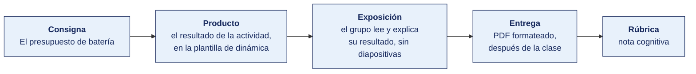

[Semana 07](README.md) · [Teoría](1-TEORIA.md) · **Dinámica de aula** · [Taller de laboratorio](3-TALLER.md)

# Dinámica de aula · El presupuesto de batería

**SI-988 · Soluciones Móviles II** · Semana 07 · Actividad en aula, **dentro de los 100 min de la sesión de teoría** · calificación **cognitiva**

> ¿Un término no le resulta claro? Está definido en el [glosario técnico del curso](../GLOSARIO.md).

---

## Cómo funciona la actividad

## Qué entregas

| | |
|---|---|
| **Archivo** | `SI988-S07-DINAMICA-Grupo<N>.pdf` |
| **Plantilla obligatoria** | [SI988-PLANTILLA-DINAMICA.docx](../PLANTILLAS/SI988-PLANTILLA-DINAMICA.docx) |
| **Formato** | PDF exportado desde la plantilla en Word, con la carátula de la UPT y los apellidos, nombres y códigos de todos los integrantes |
| **Qué va dentro** | Lo que el grupo resolvió en aula. Las tablas de la sección **Producto** van completas, con los textos redactados, y cada decisión va justificada |
| **Dónde se sube** | Aula virtual, tarea «Dinámica · Semana 07» |
| **Cuándo vence** | Hasta 24 h después de la sesión de teoría. La tabla se resuelve en aula; el PDF se formatea y se sube después |
| **Exposición** | En la ronda de cierre de **esta misma sesión**. El grupo **lee y explica su resultado** ante el aula, con el documento a la vista. No se usan diapositivas |

> No se califica un trabajo entregado en `.docx`, sin carátula, sin los códigos de los integrantes o con las tablas del producto vacías.

---

## Consigna

> **«El presupuesto de batería»**
> Cada equipo debe **especificar la estrategia de ubicación de su aplicación** — para cada caso de uso que la requiera, la prioridad, el intervalo, el desplazamiento mínimo y **el consumo estimado de batería**, más el comportamiento ante los cinco escenarios de error.

| | |
|---|---|
| **Su papel** | **Responsable técnico** que responde por las reseñas de una estrella que culpan al consumo de batería |
| **Misión** | Especificar la estrategia de ubicación por caso de uso, con su consumo estimado y los cinco escenarios de error |
| **Restricción** | **La máxima precisión solo se pide donde el caso de uso la exige**, y hay que decir en cuál no se pide y por qué |

## Cómo se desarrolla · 35 minutos

| | Bloque | Quién | Minutos |
|---|---|---|---|
| **1** | **Los casos de uso.** Los que de verdad requieren ubicación, con su prioridad, intervalo y desplazamiento mínimo | Equipo | 9 |
| **2** | **El consumo.** Estimado por caso de uso, con la justificación de por qué ese intervalo y no uno mayor | Equipo | 9 |
| **3** | **Degradación.** Los cinco escenarios de error y qué puede seguir haciendo el usuario en cada uno | Equipo | 9 |
| **4** | **Ronda en aula.** El caso de uso que no cabe en el presupuesto de batería y hay que rediseñar | Todos | 8 |

## Producto

**Producto 1 — Estrategia por caso de uso.**

| Caso de uso | Prioridad | Intervalo | Desplazamiento mínimo | ¿Segundo plano? | **Justificación** | Consumo estimado |
|---|---|---|---|---|---|---|

**Producto 2 — Degradación y errores.**

| Escenario | Qué muestra la app | Qué puede seguir haciendo el usuario |
|---|---|---|
| Ubicación aún no disponible | | |
| Radio de precisión > 500 m | | |
| Servicio de ubicación apagado | | |
| Sin ubicación después de 30 s | | |
| Permiso denegado | | |

> **Dónde va.** Este producto se presenta en la **sección 2 de la [plantilla de dinámica](../PLANTILLAS/SI988-PLANTILLA-DINAMICA.docx)**, «El producto». No se copia la consigna ni la teoría. Solo el resultado y lo que lo sostiene.

## Ejemplo resuelto

*El caso de este ejemplo es distinto del que le toca a tu grupo. Sirve para que veas el nivel de detalle que se espera, no para copiarlo.*

**Una estrategia bien especificada.** El caso de uso del ejemplo es de una app de reparto.

*Estrategia por caso de uso*

| Caso de uso | Prioridad | Intervalo | Desplazamiento mínimo | ¿Segundo plano? | **Justificación** | Consumo estimado |
|---|---|---|---|---|---|---|
| Mostrar los locales cercanos al abrir la app | Equilibrada (precisión de ~100 m) | Una sola lectura | — | No | Para ordenar locales por cercanía basta el barrio. Pedir alta precisión gastaría GNSS para una diferencia que el usuario no percibe | Despreciable: una lectura |
| Seguir al repartidor durante una entrega activa | Alta precisión | 10 s | 25 m | **Sí**, con notificación persistente visible | El cliente ve el avance en el mapa. Con intervalos mayores el punto salta y parece detenido. El desplazamiento mínimo evita emitir cuando el repartidor está detenido en un semáforo | **Alto.** Del orden del 8 al 12 % de batería por hora de entrega activa |
| Detectar la llegada al domicilio del cliente | Geocerca de 80 m | Basada en eventos, no en muestreo | — | Sí, mediante el servicio de geocercas del sistema | El sistema despierta la app solo al cruzar el límite. Muestrear la ubicación para lograr lo mismo consumiría entre 5 y 10 veces más | Bajo el sistema optimiza el monitoreo |

*Degradación y errores*

| Escenario | Qué muestra la app | Qué puede seguir haciendo el usuario |
|---|---|---|
| Ubicación aún no disponible | Esqueleto de carga en la lista de locales, con el texto «Buscando tu ubicación…» y un enlace «Ingresar dirección» visible desde el primer segundo | Ingresar la dirección a mano y ver los locales de esa zona |
| Radio de precisión mayor a 500 m | Círculo de precisión dibujado en el mapa y aviso «Tu ubicación es aproximada. Confirma tu dirección antes de pedir» | Arrastrar el marcador o escribir la dirección |
| Servicio de ubicación apagado | Tarjeta con «Activa la ubicación para ver los locales cercanos» y dos botones: «Abrir ajustes» y «Ingresar dirección» | Ingresar la dirección. La app funciona completa |
| Sin ubicación después de 30 s | Se cancela la espera, se muestra la lista ordenada por popularidad y el aviso «No pudimos ubicarte» con «Reintentar» e «Ingresar dirección» | Pedir con dirección manual |
| Permiso denegado | No se vuelve a pedir el permiso. Tarjeta explicativa con «Ingresar dirección» como acción principal y un enlace discreto a ajustes | Todo, salvo el ordenamiento automático por cercanía |

**La regla que decide la nota.** En los cinco escenarios el usuario puede completar la tarea principal. Una app cuya pantalla queda bloqueada esperando una ubicación que nunca llega no aprueba, por bien especificada que esté la estrategia de precisión.

**La diferencia entre aprobar y no aprobar.**

| Así no | Así sí |
|---|---|
| «Prioridad: alta precisión, porque necesitamos exactitud.» | «Alta precisión, 10 s, 25 m, solo durante una entrega activa. Con intervalos mayores el punto salta y parece detenido.» |
| «Si falla la ubicación, se muestra un error.» | «A los 30 s se cancela, se ordena por popularidad y se ofrece "Ingresar dirección". El usuario puede pedir igual.» |
| «Consumo: moderado.» | «Del orden del 8 al 12 % de batería por hora de entrega activa.» |

## Reglas

- 35 min en aula, dentro de la sesión de teoría.
- **Ningún caso de uso puede declarar máxima precisión sin justificarlo** con la necesidad concreta.
- Todo escenario de error debe ofrecer **una alternativa al usuario**, no solo un mensaje.
- **Obligatorio** especificar si la app requiere ubicación en segundo plano y por qué.
- La exposición es la ronda de cierre de esta misma sesión. El grupo **lee y explica su resultado**. No se usan diapositivas.

## Rúbrica cognitiva (20 puntos)

| Criterio | 5 | 3 | 1 |
|---|---|---|---|
| **Proporcionalidad** | Cada caso usa la prioridad mínima necesaria, justificada | La mayoría justificada | Máxima precisión en todo |
| **Parámetros completos** | Los cuatro parámetros definidos en cada caso | Tres parámetros | Solo la prioridad |
| **Degradación** | Los cinco escenarios con alternativa concreta para el usuario | Tres o cuatro | Solo mensajes de error |
| **Segundo plano** | Declarado y justificado, o descartado con fundamento | Declarado sin justificar | No lo aborda |

---

---

[Semana 07](README.md) · [Teoría](1-TEORIA.md) · **Dinámica de aula** · [Taller de laboratorio](3-TALLER.md)

---

**Docente** · Dr. Oscar Juan Jimenez Flores
[oscarjimenezflores@upt.pe](mailto:oscarjimenezflores@upt.pe) · [LinkedIn](https://www.linkedin.com/in/oscar-jimenez-flores/) · [CTI Vitae — CONCYTEC](https://ctivitae.concytec.gob.pe/appDirectorioCTI/VerDatosInvestigador.do?id_investigador=33398)

Escuela Profesional de Ingeniería de Sistemas · Universidad Privada de Tacna · Tacna, Perú
