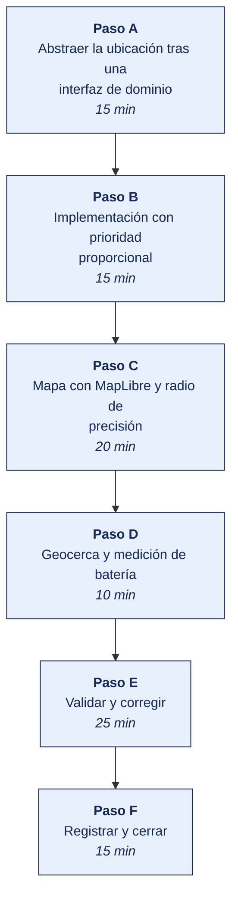

[Semana 07](README.md) · [Teoría](1-TEORIA.md) · [Dinámica de aula](2-DINAMICA.md) · **Taller de laboratorio**

# Taller de laboratorio 07 · Ubicación, mapa y geocercas con herramientas libres

**SI-988 · Soluciones Móviles II** · Semana 07 · Sesión 2 en laboratorio · 100 min · calificación **procedimental**

> ¿Un término no le resulta claro? Está definido en el [glosario técnico del curso](../GLOSARIO.md).

---

## Secuencia del taller



## Qué entregas

| | |
|---|---|
| **Archivo** | `SI988-S07-TALLER-Grupo<N>.pdf` |
| **Plantilla obligatoria** | [SI988-PLANTILLA-TALLER.docx](../PLANTILLAS/SI988-PLANTILLA-TALLER.docx) |
| **Formato** | PDF exportado desde la plantilla en Word, con la carátula de la UPT, el índice actualizado y las capturas numeradas |
| **Qué va dentro** | Las secciones de la plantilla. La **5. Resultados y evidencias** se califica contra la tabla de resultados esperados de esta guía, y **cada resultado necesita la evidencia que lo demuestre**. No se copian de aquí los objetivos, la duración ni los resultados de aprendizaje |
| **Dónde se sube** | Aula virtual, tarea «Taller · Semana 07» |
| **Cuándo vence** | 48 horas después de la sesión de laboratorio |

> No se califica un informe entregado en `.docx`, sin carátula, sin los códigos de los integrantes o con resultados declarados sin evidencia.

---

**La sesión de laboratorio dura 100 minutos.** El avance de Sprint 2 lo ejecuta el equipo fuera de la sesión.

## El reto

| | |
|---|---|
| **Situación** | La ubicación llega tarde, imprecisa o no llega. Una app que asume que siempre habrá GPS deja fuera al usuario en el peor momento. |
| **Misión** | Abstraer la ubicación tras una interfaz de dominio, validar el radio de precisión antes de entregar el dato y ofrecer entrada manual en los cinco escenarios de error. |
| **Criterio de éxito** | El ViewModel se prueba con un doble, sin dispositivo, y el mapa dibuja el círculo de precisión, no solo el punto. |

## 1. Información sobre el evento práctico

### 1.1. Título del evento práctico

Implementación de la capa de ubicación de la aplicación con proveedor fusionado, visualización en mapa con OpenStreetMap y MapLibre, manejo del radio de precisión, degradación ante errores y registro de geocercas.

### 1.2. Objetivos

- Implementar un **servicio de ubicación** abstraído tras una interfaz de dominio.
- Configurar la solicitud con la **prioridad mínima necesaria** por caso de uso.
- **Mostrar el radio de precisión** en el mapa, no solo el punto.
- Implementar la **degradación** ante los cinco escenarios de error, con entrada manual.
- Integrar un mapa con **MapLibre y teselas de OpenStreetMap**, con su atribución.
- Implementar **agrupamiento de marcadores** y carga solo de lo visible.
- Registrar una **geocerca** y verificar su disparo.
- Medir el **consumo de batería** de la estrategia elegida.

### 1.3. Tiempo de duración

**100 minutos.**

### 1.4. Resultados de Aprendizaje (RA)

- **RA1** Desarrolla la geolocalización en una app móvil.
- **RA2** Implementa y gestiona los permisos de geolocalización en una app móvil.

### 1.5. Recursos

| Recurso | Detalle |
|---|---|
| **Android — Location** | https://developer.android.com/develop/sensors-and-location/location |
| **Apple — Core Location** | https://developer.apple.com/documentation/corelocation |
| **MapLibre** | https://maplibre.org/ |
| **OpenStreetMap** y su política de uso de teselas | https://www.openstreetmap.org/ · https://operations.osmfoundation.org/policies/tiles/ |
| **Nominatim** (geocodificación) y su política de uso | https://nominatim.org/release-docs/latest/api/Overview/ |
| Emulador con ubicación simulada | Entorno del laboratorio. Android Studio permite fijar coordenadas y reproducir rutas |
| Herramienta de perfilado de batería | Android Studio Energy Profiler · Xcode Instruments |

### 1.6. Seguridad

> **Dónde se trabaja.** El taller se hace en el **laboratorio de la universidad, sobre el emulador**. Cuando un escenario no se reproduce fielmente en el emulador, la verificación en un teléfono real la hace el equipo **fuera de la sesión** y adjunta el video como anexo. Ningún resultado del taller depende de tener un teléfono en clase.

1. **La ubicación es un dato personal** conforme a la Ley 29733 y su Reglamento D. S. 016-2024-JUS. Su tratamiento requiere base legal, finalidad declarada y medidas de seguridad. Se completa en la Semana 09.
2. **Principio de minimización.** Se solicita la precisión mínima que resuelve el caso de uso, y se conserva el mínimo tiempo necesario.
3. **La ubicación no se registra en el log** ni se envía a servicios de análisis sin consentimiento específico.
4. Si se transmite al backend, se hace **exclusivamente por HTTPS** y se almacena con control de acceso.
5. **Uso responsable de servicios comunitarios.** Nominatim y las teselas públicas de OpenStreetMap tienen políticas de uso. Se respetan los límites de peticiones y se identifica la aplicación en la cabecera. Para uso intensivo se despliega instancia propia o se contrata un proveedor.

---

## 2. Procedimiento o Metodología

### Paso A — Abstraer la ubicación tras una interfaz de dominio

```
// --- DOMINIO: no conoce ninguna API de plataforma ---
data class Ubicacion(
  val latitud: Double,
  val longitud: Double,
  val radioPrecisionM: Float,        // ← SIEMPRE presente
  val momento: Instant,
  val esUltimaConocida: Boolean,     // distingue lectura fresca de caché
)

enum class PrecisionRequerida { ALTA, EQUILIBRADA, BAJA }

sealed class ErrorUbicacion {
  object PermisoDenegado        : ErrorUbicacion()
  object ServicioDesactivado    : ErrorUbicacion()
  object TiempoAgotado          : ErrorUbicacion()
  data class PrecisionInsuficiente(val radioM: Float) : ErrorUbicacion()
  object NoDisponible           : ErrorUbicacion()
}

interface ServicioUbicacion {
  suspend fun obtenerActual(precision: PrecisionRequerida,
                            tiempoMaximo: Duration): Result<Ubicacion>
  fun observar(precision: PrecisionRequerida,
               intervalo: Duration,
               desplazamientoMinimoM: Float): Flow<Ubicacion>
  suspend fun ultimaConocida(): Ubicacion?
  suspend fun servicioActivo(): Boolean
}
```

> **Por qué se abstrae.** El ViewModel depende de `ServicioUbicacion`, no de la API de la plataforma. Eso permite **probarlo con un doble**, sin dispositivo ni permisos, exactamente como el repositorio de la Semana 04.

### Paso B — Implementación con prioridad proporcional

```
class ServicioUbicacionImpl(private val proveedorFusionado: ProveedorPlataforma) : ServicioUbicacion {

  // Se traduce la necesidad del DOMINIO a la prioridad de la PLATAFORMA
  private fun prioridadDe(p: PrecisionRequerida) = when (p) {
    PrecisionRequerida.ALTA         -> PRIORIDAD_MAXIMA_PRECISION   // solo navegación
    PrecisionRequerida.EQUILIBRADA  -> PRIORIDAD_EQUILIBRADA        // caso habitual
    PrecisionRequerida.BAJA         -> PRIORIDAD_BAJO_CONSUMO
  }

  override suspend fun obtenerActual(precision: PrecisionRequerida,
                                     tiempoMaximo: Duration): Result<Ubicacion> {
    if (!servicioActivo()) return Result.failure(ErrorUbicacion.ServicioDesactivado)

    // 1. Se devuelve de inmediato la última conocida si es reciente: evita esperar
    ultimaConocida()?.let { if (it.momento.antiguedad() < 2.minutes) return Result.success(it) }

    // 2. Se solicita una lectura fresca con límite de tiempo
    return withTimeoutOrNull(tiempoMaximo) {
      proveedorFusionado.solicitarUna(prioridadDe(precision))
        .let { l ->
          val u = l.aDominio()
          // 3. Se valida el radio de precisión ANTES de entregarla
          if (u.radioPrecisionM > 500f) Result.failure(ErrorUbicacion.PrecisionInsuficiente(u.radioPrecisionM))
          else Result.success(u)
        }
    } ?: Result.failure(ErrorUbicacion.TiempoAgotado)
  }

  override fun observar(precision, intervalo, desplazamientoMinimoM) = callbackFlow {
    val solicitud = SolicitudUbicacion(
      prioridad            = prioridadDe(precision),
      intervalo            = intervalo,               // el MAYOR que sirva
      intervaloMinimo      = intervalo / 2,
      desplazamientoMinimo = desplazamientoMinimoM,   // no notificar si el usuario está quieto
    )
    val callback = { l -> trySend(l.aDominio()) }
    proveedorFusionado.solicitarActualizaciones(solicitud, callback)
    awaitClose { proveedorFusionado.detener(callback) }   // ← liberar SIEMPRE: si no, la batería se agota
  }
}
```

**Filtro de lecturas erróneas** —descarta las que implican una velocidad imposible:

```
fun esVerosimil(nueva: Ubicacion, anterior: Ubicacion?): Boolean {
  if (anterior == null) return true
  val metros   = distanciaHaversine(anterior, nueva)
  val segundos = (nueva.momento - anterior.momento).inWholeSeconds.coerceAtLeast(1)
  val velocidadMs = metros / segundos
  return velocidadMs < 60          // 216 km/h: por encima, la lectura es errónea
}
```

### Paso C — Mapa con MapLibre y radio de precisión

```
// Estilo del mapa con teselas de OpenStreetMap.
// ATRIBUCIÓN OBLIGATORIA por la licencia de los datos.
val estilo = """{
  "version": 8,
  "sources": {
    "osm": {
      "type": "raster",
      "tiles": ["https://tile.openstreetmap.org/{z}/{x}/{y}.png"],
      "tileSize": 256,
      "attribution": "© Colaboradores de OpenStreetMap"
    }
  },
  "layers": [{ "id": "osm", "type": "raster", "source": "osm" }]
}"""

// NOTA DE USO RESPONSABLE: las teselas públicas de OSM tienen una política de uso.
// Para una app publicada se usa un proveedor de teselas o una instancia propia.
// Se identifica la app en la cabecera User-Agent.
```

**El radio de precisión dibujado** —la regla de interfaz de la sección 1.3:

```
fun dibujarUbicacion(mapa: Mapa, u: Ubicacion) {
  // 1. El CÍRCULO de precisión: la verdad sobre la incertidumbre
  mapa.agregarCirculo(
    centro = LatLng(u.latitud, u.longitud),
    radioMetros = u.radioPrecisionM,
    colorRelleno = azul.conAlfa(0.15f),
    colorBorde   = azul.conAlfa(0.40f),
  )
  // 2. El punto
  mapa.agregarMarcador(LatLng(u.latitud, u.longitud), icono = puntoAzul)

  // 3. Aviso explícito cuando la precisión es pobre
  if (u.radioPrecisionM > 50f) {
    mostrarAviso("Ubicación aproximada (± ${u.radioPrecisionM.toInt()} m). " +
                 "Puedes ajustarla tocando el mapa.")
  }
  // 4. Aviso de antigüedad cuando es una última conocida
  if (u.esUltimaConocida) {
    mostrarAviso("Última ubicación conocida de hace ${u.momento.antiguedadTexto()}.")
  }
}
```

**Rendimiento del mapa.**

| Técnica | Implementación |
|---|---|
| **Agrupamiento** | Activar el agrupamiento de la biblioteca cuando hay más de 50 marcadores |
| **Solo lo visible** | Consultar al repositorio únicamente los elementos dentro de los límites de la vista |
| **Liberar recursos** | Destruir la vista del mapa al salir de la pantalla |
| **Teselas sin conexión** | Descargar únicamente el área de operación de la app, con confirmación del usuario por el tamaño |

**Entrada manual — la degradación indispensable.**

```
// Cuando no hay ubicación utilizable, el usuario NO queda bloqueado
when (val r = servicioUbicacion.obtenerActual(EQUILIBRADA, 30.seconds)) {
  is Success -> mostrarEnMapa(r.value)
  is Failure -> when (r.error) {
    ServicioDesactivado      -> mostrarDialogo("Activa la ubicación",
                                  accionPrimaria = "Ir a ajustes",
                                  accionSecundaria = "Elegir en el mapa" to ::modoSeleccionManual)
    TiempoAgotado,
    NoDisponible             -> modoSeleccionManual("No pudimos ubicarte. Toca tu posición en el mapa.")
    is PrecisionInsuficiente -> modoSeleccionManual(
                                  "Tu ubicación es aproximada (± ${r.error.radioM.toInt()} m). " +
                                  "Confirma tu posición en el mapa.")
    PermisoDenegado          -> flujoDePermisos()      // Semana 08
  }
}
```

### Paso D — Geocerca y medición de batería

```
// Registro de una geocerca — radio mínimo 100 m
geocercas.registrar(
  id = "zona-entrega-01",
  centro = LatLng(lat, lon),
  radioMetros = 150f,                       // ≥ 100 m: evita falsos positivos
  transiciones = ENTRADA or SALIDA,
  duracionMs = 12.hours.inWholeMilliseconds,
  retardoNotificacionMs = 30_000,           // el sistema agrupa eventos para ahorrar batería
)

// IMPORTANTE: al reiniciar el dispositivo las geocercas se pierden.
// Se re-registran al arrancar la app.
```

**Medición del consumo de batería** —protocolo:

| Paso | Acción |
|---|---|
| 1 | Cargar el dispositivo al 100 % y cerrar todas las demás apps |
| 2 | Ejecutar la app con la estrategia elegida durante **30 minutos** de uso realista |
| 3 | Registrar el consumo con el perfilador de energía |
| 4 | Repetir con **prioridad de máxima precisión** durante 30 minutos |
| 5 | Comparar y documentar |

`docs/tecnico/MEDICION_BATERIA.md`:

| Estrategia | Prioridad | Intervalo | Consumo en 30 min | Proyección a 8 h | Veredicto |
|---|---|---|---|---|---|
| Elegida | Equilibrada | 30 s | | | |
| Comparación | Máxima precisión | 5 s | | | |

> **El resultado esperado** es que la máxima precisión consuma varias veces más. Ese dato es el que justifica la decisión ante la gerencia del producto, y el que evita la desinstalación por consumo de batería.

### Trabajo del equipo fuera de la sesión — Sprint 2

> Lo que no alcance a completarse en la sesión lo ejecuta el equipo durante la semana, y llega al siguiente taller con el incremento listo. El docente lo revisa en el repositorio y en el tablero, no en clase.

**Sprint 2 Planning** al inicio — Sprint Goal, selección de historias —incluida la acción de mejora de la retrospectiva— y plan de entrega. Luego, el equipo continúa el desarrollo fuera de la sesión.

---

### Paso E — Validar y corregir (25 min)

El resultado no vale por estar hecho, sino por resistir una comprobación. Se ejecutan estas tres y **se corrige lo que falle antes de cerrar la sesión**.

1. Ejecutar la prueba del ViewModel **sin emulador** y comprobar que pasa con el doble del servicio.
2. Verificar en el mapa que se dibuja el círculo de precisión y que la atribución de OpenStreetMap está visible.
3. Comprobar que los recursos se liberan al dejar de observar, porque de ahí sale el consumo de batería que se mide después.

> Lo que no se pueda corregir hoy se anota en la sección **Problemas y mejoras** de la evidencia, con lo que faltó y por qué. Un resultado parcial documentado con honestidad vale más que uno declarado sin prueba.

### Paso F — Registrar la evidencia y cerrar (15 min)

Se versiona lo producido, se anota la URL de cada resultado y se responde en dos frases la pregunta de transferencia — **qué riesgo correría una organización real si esto se hiciera mal**.

---

## 3. Resultados

> **Evidencia obligatoria en GitHub.** Todo resultado de este taller se versiona en el repositorio del equipo. El informe **no consigna capturas sueltas**. Consigna la **URL** del artefacto en GitHub. Una captura no permite verificar autoría, fecha ni contenido; un enlace sí.
>
> | Qué se entrega | Dónde vive | Qué se escribe en el informe |
> |---|---|---|
> | Código y archivos de configuración | Rama del taller, fusionada a `develop` vía Pull Request | URL del Pull Request |
> | Documentos y matrices | `docs/`, en formato de texto versionable | URL del archivo en la rama |
> | Capturas y videos que el taller exija | `docs/evidencias/S07/` | URL del archivo |
> | Salida de comandos | `docs/evidencias/S07/salidas/*.txt` | URL del archivo |
>
> **Etiqueta del taller.** Al cerrar el taller se crea la etiqueta `taller-07` sobre el commit entregado:
>
> ```bash
> git tag -a taller-07 -m "Taller 07 · SI988"
> git push origin taller-07
> ```
>
> La URL que se consigna en el informe apunta a esa etiqueta:
> `https://github.com/<organizacion>/<repositorio>/tree/taller-07`
>
> **El informe es lo que se califica; el repositorio es lo que lo prueba.** Cada resultado de la sección 3 del informe lleva la URL con la que se verifica, y **un resultado sin su URL se califica como no logrado**, por bien redactado que esté. Lo que no se puede abrir no se puede dar por hecho.

### 3.1. Los tres resultados que se califican

Son los que la rúbrica evalúa. El resto de la lista tiene que existir, pero no se califica fila por fila.

| Resultado | Qué demuestra | Dónde está |
|---|---|---|
| **La interfaz de dominio** | El servicio de ubicación sin dependencias de plataforma, probado con dobles | Código y prueba en verde |
| **La precisión tratada como dato** | Radio validado antes de entregar, círculo dibujado y aviso de lectura antigua | Código y capturas |
| **La medición de batería** | Las dos estrategias medidas, con el veredicto escrito | `MEDICION_BATERIA.md` |

### 3.2. Lista de comprobación del taller

Todo esto debe existir al cerrar la sesión.

| # | Resultado esperado | Verificación |
|---|---|---|
| 1 | `ServicioUbicacion` como **interfaz de dominio**, sin dependencias de plataforma | Código |
| 2 | ViewModel probado con un **doble del servicio**, sin dispositivo | Prueba en verde |
| 3 | Prioridad **proporcional** al caso de uso, justificada por escrito | Código y documentación |
| 4 | Última conocida devuelta de inmediato cuando es reciente | Código y demostración |
| 5 | **Radio de precisión validado** antes de entregar la ubicación | Código |
| 6 | Filtro de lecturas inverosímiles implementado | Código y prueba |
| 7 | **Liberación de recursos** al dejar de observar | Código |
| 8 | Mapa con MapLibre y OpenStreetMap, con **atribución visible** | Captura |
| 9 | **Círculo de precisión dibujado** en el mapa, no solo el punto | Captura |
| 10 | Aviso de precisión pobre y de antigüedad de la lectura | Captura |
| 11 | **Entrada manual disponible** en los cinco escenarios de error | Demostración |
| 12 | Agrupamiento de marcadores y carga solo de lo visible | Demostración con ≥ 100 marcadores |
| 13 | Geocerca registrada, con radio ≥ 100 m, y su disparo verificado en dispositivo | Video |
| 14 | **Medición de batería** de ambas estrategias, con el veredicto | `MEDICION_BATERIA.md` |
| 15 | Sprint 2 planificado, con la acción de mejora incorporada | Tablero |

## Rúbrica procedimental (20 puntos)

Se aplica sobre el informe entregado y la evidencia enlazada en el repositorio. **Cada criterio se califica de forma independiente.**

| Criterio | 4 — Logrado | 2 — En proceso | 0 — Insuficiente |
|---|---|---|---|
| **Abstraer la ubicación tras una interfaz de dominio** | Completo y correcto, con la evidencia que lo respalda | Completo con errores menores, o correcto pero sin toda la evidencia | Incompleto, o entregado sin ejecutar |
| **Mapa con MapLibre y radio de precisión** | Completo y correcto, con la evidencia que lo respalda | Completo con errores menores, o correcto pero sin toda la evidencia | Incompleto, o entregado sin ejecutar |
| **Evidencia verificable en el repositorio** | Cada resultado tiene su URL sobre la etiqueta `taller-NN`, y el enlace abre lo que dice | La mayoría tiene URL; alguna evidencia es una captura suelta | Se declaran resultados sin enlace, o el enlace no corresponde |
| **Rigor técnico de la implementación** | El código compila, las pruebas pasan y el análisis estático sale limpio | Compila y funciona, con avisos del análisis sin resolver | No compila, o se entregó sin ejecutar |
| **La evidencia entregada** | Las secciones de la plantilla completas; los resultados se sustentan con la evidencia enlazada | Secciones completas con sustento parcial | Faltan secciones o los resultados se afirman sin evidencia |

| Puntaje | Equivalencia |
|---|---|
| 18 – 20 | Destacado |
| 14 – 17 | Logrado |
| 6 – 13 | En proceso |
| 0 – 5 | Insuficiente |

> **Un resultado declarado sin evidencia enlazada no se califica**, aunque el trabajo se haya hecho. La tabla de la sección 3.1 es la lista de cotejo; esta rúbrica es lo que determina la nota.

## 4. Conclusiones

Mínimo tres. Líneas argumentales esperadas:

1. La ubicación es siempre una estimación con incertidumbre; dibujar el círculo de precisión en lugar de un punto exacto es una decisión de honestidad con el usuario que evita decisiones equivocadas sobre datos imprecisos.
2. Solicitar la máxima precisión «por si acaso» es la causa más frecuente de desinstalación por consumo de batería, y la medición comparativa es lo que permite defender la elección de una prioridad menor.
3. La app que no ofrece entrada manual de ubicación deja de funcionar en subsuelos, interiores y zonas rurales; la degradación con alternativa concreta es lo que separa una app de laboratorio de una que funciona en la vida real.

## 5. Referencias Bibliográficas

- Google. *Build location-aware apps* y *Location strategies*. https://developer.android.com/develop/sensors-and-location/location
- Google. *Create and monitor geofences*. https://developer.android.com/develop/sensors-and-location/location/geofencing
- Apple. *Core Location*. https://developer.apple.com/documentation/corelocation
- Apple. *Monitoring the user's proximity to geographic regions*. https://developer.apple.com/documentation/corelocation/monitoring-the-user-s-proximity-to-geographic-regions
- MapLibre. *MapLibre Native documentation*. https://maplibre.org/maplibre-native/
- OpenStreetMap Foundation. *Tile Usage Policy*. https://operations.osmfoundation.org/policies/tiles/
- OpenStreetMap. *Copyright and License*. https://www.openstreetmap.org/copyright
- Nominatim. *Usage Policy*. https://operations.osmfoundation.org/policies/nominatim/
- Ley 29733 y D. S. 016-2024-JUS — la ubicación como dato personal. https://www.gob.pe/institucion/anpd
- OWASP (*Open Worldwide Application Security Project*) Foundation. *MASVS-PRIVACY*. https://mas.owasp.org/MASVS/
- Nolasco Valenzuela, J. S. (2019). *Desarrollo de aplicaciones con Android*. Ra-Ma.

## 6. Anexos

- `anexo_A_mapa_precision.png` — círculo de precisión visible
- `anexo_B_degradacion.mp4` — los cinco escenarios de error
- `anexo_C_geocerca.mp4` — disparo verificado en dispositivo
- `anexo_D_medicion_bateria.pdf`
- `anexo_E_sprint2_planning.pdf`

---

---

[Semana 07](README.md) · [Teoría](1-TEORIA.md) · [Dinámica de aula](2-DINAMICA.md) · **Taller de laboratorio**

---

**Docente** · Dr. Oscar Juan Jimenez Flores
[oscarjimenezflores@upt.pe](mailto:oscarjimenezflores@upt.pe) · [LinkedIn](https://www.linkedin.com/in/oscar-jimenez-flores/) · [CTI Vitae — CONCYTEC](https://ctivitae.concytec.gob.pe/appDirectorioCTI/VerDatosInvestigador.do?id_investigador=33398)

Escuela Profesional de Ingeniería de Sistemas · Universidad Privada de Tacna · Tacna, Perú
