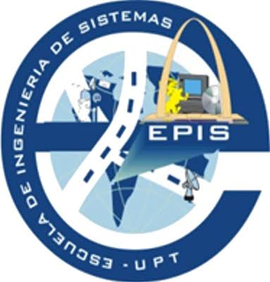
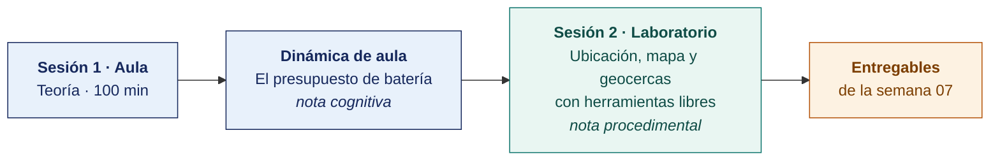

  
  &nbsp;&nbsp;&nbsp;&nbsp;&nbsp;&nbsp;
  

  <strong>Universidad Privada de Tacna</strong> 
  Facultad de Ingeniería · Escuela Profesional de Ingeniería de Sistemas

<h1 align="center">Semana 07 · Geolocalización en Aplicaciones Móviles</h1>

  <strong>SI-988 · Soluciones Móviles II</strong> 
  4 horas académicas de 50 min · 100 min de teoría con la dinámica incluida en aula · 100 min de taller en laboratorio

---

## Datos de la asignatura

| | |
|---|---|
| **Asignatura** | SI-988 · Soluciones Móviles II |
| **Escuela** | Escuela Profesional de Ingeniería de Sistemas |
| **Ciclo** | IX · 04 horas semanales · 04 créditos · Electivo |
| **Prerrequisito** | SI-883 Soluciones Móviles I |
| **Unidad** | II — Geolocalización, seguridad y permisos |
| **Semana** | 07 de 17 |
| **Duración** | 4 horas académicas de 50 min · 100 min de teoría con la dinámica incluida en aula · 100 min de taller en laboratorio |
| **Resultados de aprendizaje** | **RA1** Desarrolla la geolocalización en una app móvil · **RA2** Implementa y gestiona los permisos de geolocalización en una app móvil |
| **Artefacto del proyecto** | **Sprint 2 Planning** · Incremento con ubicación y mapa |

### Lo que indica el sílabo

**Contenido conceptual.** Geolocalización en aplicaciones móviles.

**Contenido procedimental.** Implementa geolocalización en una app móvil utilizando APIs de mapas.

## Materiales de esta semana

| | Documento | Qué encontrarás | Dónde y cuánto dura |
|---|---|---|---|
| 1 | **[Teoría](1-TEORIA.md)** | Cómo sabe un teléfono dónde está · Precisión, error y lo que hay que mostrar al usuario · Mapas y geocercas | Aula · 100 min |
| 2 | **[Dinámica de aula](2-DINAMICA.md)** | El presupuesto de batería, con su material, su ejemplo resuelto y su rúbrica | Aula · dentro de los 100 min de la sesión de teoría |
| 3 | **[Taller de laboratorio](3-TALLER.md)** | Ubicación, mapa y geocercas con herramientas libres | Laboratorio · 100 min |

## Ruta de la semana

## Entregables

| Entregable | Formato y nombre del archivo | Vence |
|---|---|---|
| **Dinámica de aula** · El presupuesto de batería | PDF desde la [plantilla de dinámica](../PLANTILLAS/SI988-PLANTILLA-DINAMICA.docx) · `SI988-S07-DINAMICA-Grupo<N>.pdf` | Antes de cerrar la sesión de teoría |
| **Informe del taller de laboratorio N.º 07** | PDF en formato EPIS desde la [plantilla de taller](../PLANTILLAS/SI988-PLANTILLA-TALLER.docx) · `SI988-S07-TALLER-Grupo<N>.pdf` | 48 h después del taller |
| Incremento con ubicación y mapa | Commit, CI en verde | 48 h después del taller |

> Ambos se entregan en **PDF**, con la carátula de la UPT y los códigos de todos los integrantes. Las plantillas obligatorias están en [`PLANTILLAS/`](../PLANTILLAS/).

## Cómo se evalúa

| Criterio | Instrumento | Peso |
|---|---|---|
| Cognitivo | Rúbrica del presupuesto de batería + exposición de 10 min en la Semana 08 | 25 % |
| Procedimental | Lista de cotejo de los 15 resultados del laboratorio | 35 % |
| Actitudinal | Uso responsable de los servicios comunitarios de OpenStreetMap y minimización del dato de ubicación | 15 % |

## Preparación para la Semana 08

- **Leer.** [Permisos en Android](https://developer.android.com/guide/topics/permissions/overview) y [Solicitar autorización de ubicación en iOS](https://developer.apple.com/documentation/corelocation/requesting-authorization-to-usa-location-services).
- Revisar las **políticas de las tiendas sobre permisos de ubicación**. Ambas exigen justificación del uso, especialmente en segundo plano.
- Continuar el **Sprint 2**.

---

**Docente** · Dr. Oscar Juan Jimenez Flores
[oscarjimenezflores@upt.pe](mailto:oscarjimenezflores@upt.pe) · [LinkedIn](https://www.linkedin.com/in/oscar-jimenez-flores/) · [CTI Vitae — CONCYTEC](https://ctivitae.concytec.gob.pe/appDirectorioCTI/VerDatosInvestigador.do?id_investigador=33398)

Escuela Profesional de Ingeniería de Sistemas · Universidad Privada de Tacna · Tacna, Perú
