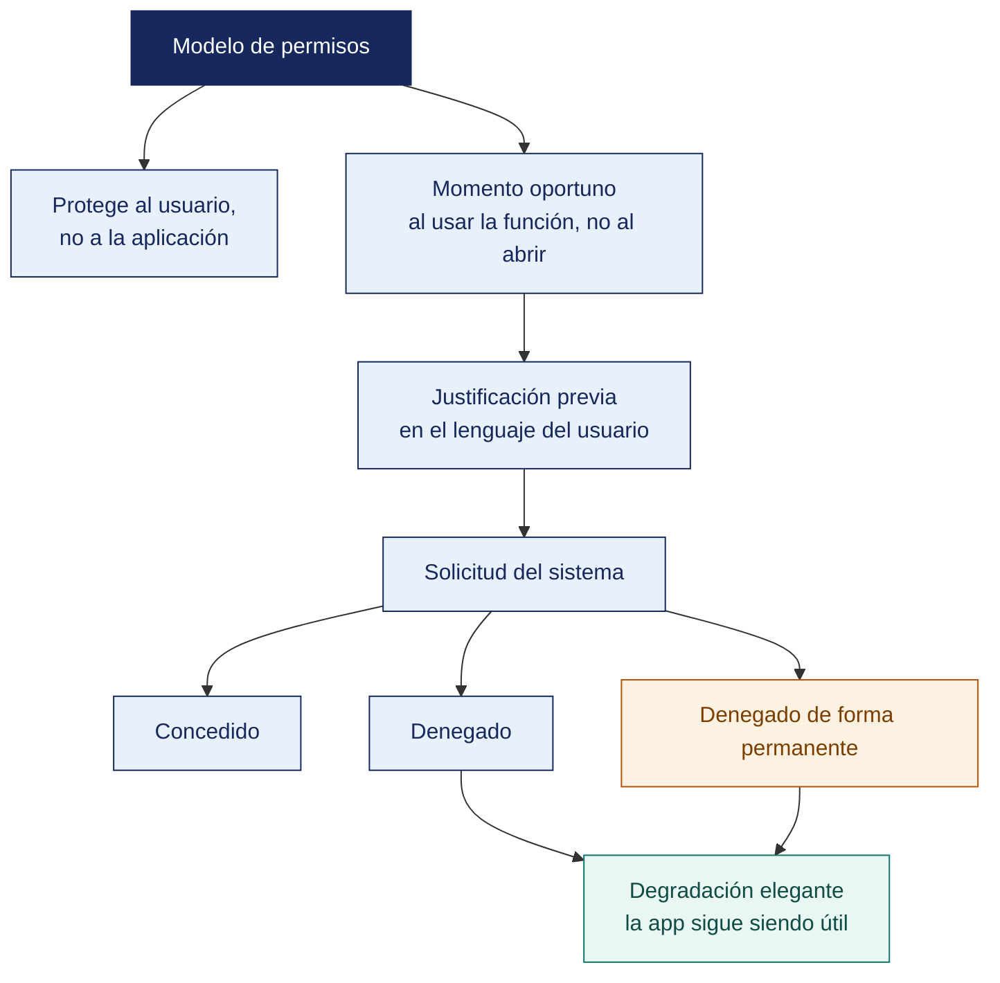

[Semana 08](README.md) · **Teoría** · [Dinámica de aula](2-DINAMICA.md) · [Taller de laboratorio](3-TALLER.md)

# Teoría · Permisos en Aplicaciones Móviles

**SI-988 · Soluciones Móviles II** · Semana 08 · Sesión 1 en aula · 2 horas académicas, 100 min, con la dinámica incluida

> ¿Un término no le resulta claro? Está definido en el [glosario técnico del curso](../GLOSARIO.md).

---

## La pregunta de esta sesión

Una app pide, en la primera pantalla y sin explicar nada, ubicación precisa y ubicación en segundo plano. El usuario deniega.

La app no vuelve a mostrar el diálogo, porque el sistema ya no lo permite. La funcionalidad principal queda inutilizable, el usuario no encuentra cómo arreglarlo y desinstala. El equipo pidió más y obtuvo menos.

> **La pregunta que ordena esta sesión.** *¿Cuántas oportunidades tiene una app de pedir un permiso?*

## Antes de empezar

| Lo que necesita traer | De dónde sale |
|---|---|
| La ubicación, su precisión y su costo energético | Semana 07 |
| La decisión que la ubicación alimenta en la app propia | Semana 07 |
| El flujo de pantallas del incremento actual | Trabajo del equipo |
| Las políticas de las tiendas vistas en el encuadre | Semana 01 |

> **Exploración (5 min), antes de cualquier definición.** El aula responde antes de la teoría y se anota. *¿Qué hizo mal esa app? ¿Cuándo se pide un permiso? ¿Qué debería pasar si el usuario dice que no?* No se corrige nada todavía.

## Distribución del tiempo

| Momento | Minutos |
|---|---|
| El caso del permiso denegado y la exploración inicial | 8 |
| **Bloque 1.** El modelo de permisos y qué protege | 18 |
| **Bloque 2.** Cómo se pide un permiso sin perder al usuario · con su microaplicación | 22 |
| **Bloque 3.** Degradación de funciones cuando falta el permiso | 12 |
| Cierre, respuesta a la pregunta de la sesión y puente a la dinámica | 5 |
| **Total de la sesión de aula** | **65** |

## Mapa de la sesión



---

## Bloque 1 · El modelo de permisos y qué protege

> **La pregunta del bloque.** *¿A quién protege el permiso, al sistema o al usuario?*

**El permiso no protege al sistema. Protege al usuario.** Cada permiso otorga acceso a un dato o a una capacidad que puede afectar la privacidad o la seguridad de la persona.

**Clasificación en Android.**

| Tipo | Ejemplos | Cómo se otorga |
|---|---|---|
| **Normal** | Internet, vibración, red disponible | Automático al instalar; no se pregunta |
| **Peligroso** *(en tiempo de ejecución)* | Ubicación, cámara, micrófono, contactos, almacenamiento, notificaciones | **El usuario decide en un diálogo del sistema** |
| **De firma** | Reservados a apps del sistema o firmadas con la misma clave | No disponible para apps de terceros |
| **Acceso especial** | Superposición sobre otras apps, uso de estadísticas, alarmas exactas | El usuario los concede en una pantalla de ajustes |

**En iOS** no existe la categoría «normal». **Todo acceso a datos sensibles requiere autorización del usuario en el momento**, y la app debe declarar en su configuración un **texto de propósito de uso** que el sistema muestra. **Sin ese texto, la app se rechaza en revisión.**

**Los estados del permiso** —el modelo mental que debe manejar el desarrollador:

```
    NO SOLICITADO
         │  la app solicita
         ▼
   ┌─── DIÁLOGO DEL SISTEMA ───┐
   │                           │
   ▼                           ▼
CONCEDIDO                  DENEGADO
   │                           │  la app vuelve a solicitar
   │                           ▼
   │                    ┌─── DIÁLOGO ───┐
   │                    ▼               ▼
   │              CONCEDIDO      DENEGADO PERMANENTEMENTE
   │                                     │
   │                              El sistema YA NO muestra el diálogo.
   │                              Solo se cambia desde los AJUSTES.
   ▼
El usuario puede REVOCARLO en cualquier momento desde ajustes,
incluso mientras la app está en ejecución.
```

> **La regla que casi todos olvidan.** El permiso concedido ayer **puede no estarlo hoy**. El usuario pudo revocarlo desde los ajustes. **Se verifica antes de cada uso**, no solo al iniciar la app.

**Los niveles de ubicación** —el permiso más regulado:

| Nivel | Qué otorga | Cuándo pedirlo |
|---|---|---|
| **Aproximada** | Precisión de aproximadamente 3 km | Contenido por ciudad o zona |
| **Precisa** | Precisión de metros | Navegación, elementos cercanos, registro de recorrido |
| **En primer plano** | Solo mientras la app está visible | **La mayoría de los casos** |
| **En segundo plano** | También con la app cerrada | Seguimiento continuo, geocercas |

**En Android**, el usuario puede conceder **solo la ubicación aproximada** aunque la app pida la precisa. **La app debe funcionar con lo que reciba.** Y el permiso de **segundo plano se solicita por separado**, después de haber obtenido el de primer plano, en una interacción distinta.

**En iOS**, el usuario elige entre «permitir una vez», «permitir mientras se usa la app» o «permitir siempre», y puede activar o desactivar la **ubicación precisa** de forma independiente.

> **El error frecuente del bloque.** Comprobar el permiso solo al iniciar la app. **El permiso concedido ayer puede no estarlo hoy**, porque el usuario pudo revocarlo desde los ajustes del sistema. Se verifica antes de cada uso, y la app debe funcionar con lo que reciba, incluso con una ubicación aproximada cuando pidió la precisa.

## Bloque 2 · Cómo se pide un permiso sin perder al usuario

> **La pregunta del bloque.** *¿Qué convierte una solicitud en una concesión?*

**El dato que ordena el diseño.** Un usuario que deniega un permiso **rara vez lo vuelve a conceder**, porque el sistema deja de mostrar el diálogo. **La primera solicitud es casi la única oportunidad.**

**El patrón profesional — cuatro momentos.**

```
 ① CONTEXTO       El usuario realiza una acción que EVIDENTEMENTE requiere el permiso.
                  Nunca se pide al abrir la app por primera vez.

 ② EXPLICACIÓN    Pantalla propia de la app —no el diálogo del sistema— que explica
    PREVIA        qué se pedirá, para qué, y qué gana el usuario. Con un botón
                  «Continuar» y otro «Ahora no».

 ③ SOLICITUD      Recién ahora se invoca el diálogo del sistema.
    DEL SISTEMA

 ④ RESULTADO      Concedido  → continuar con la acción
                  Denegado   → degradar con alternativa, sin bloquear
                  Denegado   → explicar y ofrecer ir a ajustes, UNA sola vez
                  permanente
```

**Por qué la explicación previa funciona.** El diálogo del sistema es escueto e igual para todas las apps. La pantalla previa permite decir *«necesitamos tu ubicación para mostrarte los puntos de entrega cercanos; no la guardamos ni la compartimos»*. Un usuario que entiende **por qué**, concede; uno sorprendido por un diálogo, deniega.

**Los errores que garantizan la denegación.**

| Error | Por qué falla |
|---|---|
| Pedir todos los permisos al abrir la app | El usuario no sabe para qué; deniega por precaución |
| Pedir sin contexto ni explicación | Sorpresa |
| Insistir tras la denegación | Genera rechazo, y el sistema deja de mostrar el diálogo |
| Bloquear la app si se deniega | El usuario la desinstala. **Las tiendas lo prohíben** salvo que el permiso sea esencial a la función |
| Pedir el segundo plano junto con el primer plano | Ambas plataformas lo penalizan y las tiendas lo revisan con lupa |
| Explicaciones vagas: «para mejorar tu experiencia» | No convence a nadie |

**La política de las tiendas.** Ambas exigen que el permiso solicitado sea **necesario para una función que el usuario percibe**, que su propósito se declare, y que la app **funcione razonablemente sin los permisos opcionales**. Los permisos de ubicación en segundo plano reciben revisión adicional. Se exige demostrar el caso de uso.

**Ejemplo trabajado — dos formas de pedir la ubicación, y lo que le ocurre al usuario en cada una.**

| | **Así no** | **Así sí** |
|---|---|---|
| **①** Cuándo | Al abrir la app por primera vez, antes de ver una sola pantalla | Cuando el usuario toca **«Locales cerca de mí»** |
| **②** Explicación previa | Ninguna. Aparece el diálogo del sistema de golpe | Pantalla propia: «Usamos tu ubicación **solo mientras la app está abierta**, para ordenar los locales por cercanía. No la guardamos ni la compartimos.» · Botones: **Continuar** · **Ahora no** |
| **③** Solicitud | Ubicación **precisa y en segundo plano**, juntas | Ubicación **precisa, en primer plano**. El segundo plano no se pide. No hace falta |
| **④ Si concede** | Sigue sin saber para qué | Vuelve directamente a la lista, ya ordenada por cercanía |
| **④ Si deniega** | La app muestra «Se requiere ubicación para continuar» y no deja avanzar | Se muestra el selector de dirección; la función sigue disponible |
| **④ Si deniega dos veces** | El sistema ya no muestra el diálogo. **La app queda inservible para ese usuario, para siempre** | Se ofrece una vez el acceso a ajustes, y no se vuelve a insistir |

**Qué ocurre además con «Ahora no».** No es una derrota — **el diálogo del sistema nunca se llegó a mostrar**, así que el usuario puede aceptar más adelante, cuando el valor de la función le resulte evidente. Ese es el motivo real de la pantalla previa. **Protege el único intento que el sistema concede.**

> **La columna de la izquierda pide más y obtiene menos.** Pide precisa y segundo plano de golpe —lo que además atrae revisión adicional de las tiendas—, sin decir para qué, y a la primera negativa deja al usuario sin app. La derecha pide lo mínimo, en el momento en que la razón es obvia, **y sigue funcionando aunque le digan que no**. Un permiso no se gana insistiendo. Se gana pidiéndolo cuando el usuario ya quería lo que el permiso habilita.

> **Microaplicación (6 min) · el momento exacto de la solicitud.** Cada equipo señala **en qué pantalla de su app pedirá cada permiso** y escribe la frase de la explicación previa. Si la razón no cabe en una línea, el momento elegido es el equivocado.

| Caso | Qué debe contener una buena respuesta |
|---|---|
| ¿Por qué verificar el permiso antes de cada uso y no al iniciar? | Porque el usuario puede revocarlo desde ajustes mientras la app corre. Un permiso concedido ayer no está garantizado hoy |
| El usuario concedió solo ubicación aproximada. ¿Se le vuelve a pedir la precisa? | No de inmediato. La app funciona con lo que recibe; si una función concreta exige precisión, se explica ahí y se ofrece la mejora en ese punto |
| ¿Se puede bloquear la app si deniega el permiso? | Solo si es esencial a la función principal, y con una pantalla que explique y lleve a ajustes. Bloquear por un permiso opcional infringe las políticas de ambas tiendas |

> **El error frecuente del bloque.** Pedir el permiso en la primera pantalla y sin explicación previa. Un usuario que deniega **rara vez vuelve a conceder**, porque el sistema deja de mostrar el diálogo. La pantalla previa existe para proteger ese único intento, y su «Ahora no» no es una derrota — el diálogo del sistema ni siquiera llegó a gastarse.

## Bloque 3 · Degradación de funciones cuando falta el permiso

> **La pregunta del bloque.** *¿Qué puede seguir haciendo el usuario si deniega?*

**La pregunta de diseño.** *¿Qué puede seguir haciendo el usuario si deniega?*

| Permiso | Con el permiso | **Sin el permiso — degradación** |
|---|---|---|
| Ubicación precisa | Muestra lo cercano automáticamente | El usuario escribe su dirección o la elige en el mapa |
| Ubicación aproximada | Contenido por ciudad | Selector manual de ciudad |
| Cámara | Toma la foto en la app | Selecciona una imagen de la galería |
| Galería | Elige cualquier imagen | Usa el selector del sistema, que no requiere permiso |
| Notificaciones | Avisos push | Estado visible dentro de la app; recordatorio al abrir |
| Contactos | Sugiere contactos | Escribe el dato manualmente |
| Micrófono | Nota de voz | Escribe el texto |

> **El selector de imágenes del sistema no requiere permiso de galería** en las versiones recientes de ambas plataformas. El usuario elige y el sistema entrega solo ese archivo. **Pedir acceso a toda la galería cuando basta el selector es un permiso innecesario**, y ambas tiendas lo señalan.

**Matriz de decisión de la degradación** que cada equipo construye:

| Permiso | ¿Es **esencial** para la función principal? | Si se deniega, ¿qué ofrece la app? | ¿Se puede volver a pedir? |
|---|---|---|---|

Si un permiso es **esencial** —una app de navegación sin ubicación—, la app puede explicar que no puede funcionar, pero debe hacerlo **con una pantalla clara y un camino a ajustes**, nunca con un cierre abrupto.

## Cierre · qué se lleva de aquí

**La respuesta a la pregunta con la que abrimos.** Prácticamente una. El sistema deja de mostrar el diálogo tras la denegación, así que **la primera solicitud es casi la única oportunidad**. Por eso se pide lo mínimo, en el momento en que la razón resulta obvia, detrás de una explicación propia, y la app sigue funcionando aunque le digan que no. Un permiso no se gana insistiendo.

**Las tres ideas que deben quedar.**

| Idea | Por qué importa en el ejercicio profesional |
|---|---|
| El permiso protege al usuario, no al sistema | Y ambas tiendas exigen que responda a una función que el usuario percibe |
| El estado del permiso se verifica antes de cada uso | Lo concedido ayer puede haberse revocado desde los ajustes esta mañana |
| La degradación se diseña antes que la solicitud | El selector de imágenes del sistema, que no requiere permiso, es el ejemplo de que muchas veces sobra pedirlo |

**Volviendo a la exploración del inicio.** Se releen las respuestas del inicio. La tercera pregunta suele responderse con un mensaje de error. Lo correcto es que **la app haga lo que pueda sin el permiso**, y ambas tiendas lo exigen para los permisos opcionales.

**Lo que sigue.** La [dinámica de esta sesión](2-DINAMICA.md) diseña el flujo completo de un permiso real de la app, con sus estados y su degradación. El taller lo implementa después sobre el incremento del sprint.


**Pregunta de cierre.** *si el 40 % de los usuarios deniega el permiso de ubicación, ¿su app sigue siendo útil para ellos?* Si la respuesta es no, el producto depende de una decisión que no controla.
---

---

[Semana 08](README.md) · **Teoría** · [Dinámica de aula](2-DINAMICA.md) · [Taller de laboratorio](3-TALLER.md)

---

**Docente** · Dr. Oscar Juan Jimenez Flores
[oscarjimenezflores@upt.pe](mailto:oscarjimenezflores@upt.pe) · [LinkedIn](https://www.linkedin.com/in/oscar-jimenez-flores/) · [CTI Vitae — CONCYTEC](https://ctivitae.concytec.gob.pe/appDirectorioCTI/VerDatosInvestigador.do?id_investigador=33398)

Escuela Profesional de Ingeniería de Sistemas · Universidad Privada de Tacna · Tacna, Perú
