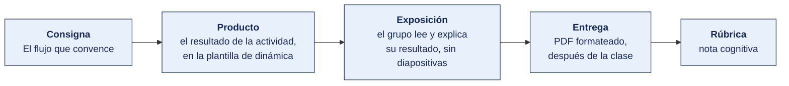

[Semana 08](README.md) · [Teoría](1-TEORIA.md) · **Dinámica de aula** · [Taller de laboratorio](3-TALLER.md)

# Dinámica de aula · El flujo que convence

**SI-988 · Soluciones Móviles II** · Semana 08 · Actividad en aula, **dentro de los 100 min de la sesión de teoría** · calificación **cognitiva**

> ¿Un término no le resulta claro? Está definido en el [glosario técnico del curso](../GLOSARIO.md).

---

## Cómo funciona la actividad



## Qué entregas

| | |
|---|---|
| **Archivo** | `SI988-S08-DINAMICA-Grupo<N>.pdf` |
| **Plantilla obligatoria** | [SI988-PLANTILLA-DINAMICA.docx](../PLANTILLAS/SI988-PLANTILLA-DINAMICA.docx) |
| **Formato** | PDF exportado desde la plantilla en Word, con la carátula de la UPT y los apellidos, nombres y códigos de todos los integrantes |
| **Qué va dentro** | Lo que el grupo resolvió en aula. Las tablas de la sección **Producto** van completas, con los textos redactados, y cada decisión va justificada |
| **Dónde se sube** | Aula virtual, tarea «Dinámica · Semana 08» |
| **Cuándo vence** | Hasta 24 h después de la sesión de teoría. La tabla se resuelve en aula; el PDF se formatea y se sube después |
| **Exposición** | En la ronda de cierre de **esta misma sesión**. El grupo **lee y explica su resultado** ante el aula, con el documento a la vista. No se usan diapositivas |

> No se califica un trabajo entregado en `.docx`, sin carátula, sin los códigos de los integrantes o con las tablas del producto vacías.

---

## Consigna

> **«El flujo que convence»**
> Cada equipo diseña el **flujo completo de solicitud de cada permiso** de su aplicación — el momento contextual, el texto de la explicación previa, el texto de propósito de uso para iOS, y la **degradación completa** para cada estado de denegación.

| | |
|---|---|
| **Su papel** | **Diseñador del flujo de permisos** ante un usuario que la primera vez ya dijo que no |
| **Misión** | Diseñar los cuatro momentos y la degradación completa para cada estado de denegación |
| **Restricción** | **Ningún permiso se pide al abrir la app.** Y toda denegación deja una alternativa que permite seguir usándola |

## Cómo se desarrolla · 35 minutos

| | Bloque | Quién | Minutos |
|---|---|---|---|
| **1** | **El permiso más importante.** Los cuatro momentos, con **los textos reales redactados**, no descritos | Equipo | 10 |
| **2** | **La matriz.** Cada permiso con su momento contextual y su texto de propósito para iOS | Equipo | 9 |
| **3** | **La degradación.** Qué hace la app en cada estado de denegación, incluida la denegación permanente | Equipo | 8 |
| **4** | **Ronda en aula.** Se lee un texto de explicación previa. El aula decide si aceptaría el permiso | Todos | 8 |

## Producto

**Producto 1 — El flujo de un permiso.** El diagrama de los cuatro momentos aplicado al permiso más importante de la app, con **los textos reales redactados**, no descritos.

**Producto 2 — Matriz de permisos y degradación.**

| Permiso | ¿Esencial? | Momento contextual en que se pide | Texto de la explicación previa | Texto de propósito (iOS) | **Degradación si se deniega** | ¿Reintento? |
|---|---|---|---|---|---|---|

> **Dónde va.** Este producto se presenta en la **sección 2 de la [plantilla de dinámica](../PLANTILLAS/SI988-PLANTILLA-DINAMICA.docx)**, «El producto». No se copia la consigna ni la teoría. Solo el resultado y lo que lo sostiene.

## Ejemplo resuelto

*El caso de este ejemplo es distinto del que le toca a tu grupo. Sirve para que veas el nivel de detalle que se espera, no para copiarlo.*

**Un flujo bien redactado.** El permiso del ejemplo es la cámara, no el que te toca.

*El flujo de los cuatro momentos*

| Momento | Qué ocurre | **Texto real** |
|---|---|---|
| 1 · Momento contextual | El usuario toca «Adjuntar foto del comprobante» dentro del registro de un gasto. **No** se pide al abrir la app ni al crear la cuenta | — |
| 2 · Justificación previa, en pantalla propia | Se muestra antes del diálogo del sistema, con dos botones | **«Para adjuntar el comprobante necesitamos usar tu cámara.** La foto se guarda solo en tu dispositivo y se envía cifrada al registrar el gasto. No accedemos a tu galería ni a otras fotos.» Botones: «Usar la cámara» y «Elegir de mis archivos» |
| 3 · Solicitud del sistema | Se dispara solo si el usuario tocó «Usar la cámara» | *(texto del sistema)* |
| 4 · Resultado | Concedido, denegado o denegado permanentemente | Ver la matriz |

*Texto de propósito de uso para iOS*

```
NSCameraUsageDescription
«Usamos la cámara para que puedas fotografiar el comprobante de un gasto y adjuntarlo al registro. La foto se guarda en tu dispositivo y se envía cifrada.»
```

*Por qué este texto pasa la revisión.* Dice **para qué función concreta**, no «para mejorar tu experiencia». Un texto genérico es motivo de rechazo documentado en las directrices de revisión de la App Store.

*Matriz de permisos y degradación*

| Permiso | ¿Esencial? | Momento contextual | Texto de la explicación previa | Texto de propósito (iOS) | **Degradación si se deniega** | ¿Reintento? |
|---|---|---|---|---|---|---|
| Cámara | No | Al tocar «Adjuntar foto del comprobante» | El de arriba | El de arriba | Se oculta «Usar la cámara» y queda «Elegir de mis archivos». El gasto se registra igual, sin adjunto. **La app no pierde ninguna función principal** | Solo si el usuario vuelve a tocar «Usar la cámara». Si fue denegado permanentemente, no se pide más: se muestra un enlace discreto a ajustes |
| Notificaciones | No | Después de que el usuario registra su tercer gasto, cuando ya obtuvo valor de la app | «¿Te avisamos cuando se acerque el cierre de mes? Un aviso al mes, nada más.» | — | No se envían avisos. El usuario ve el cierre al abrir la app | Una vez, tras 30 días, si el usuario sigue activo |

**La regla que decide la nota.** Los textos van **redactados**, no descritos. «Explicar al usuario por qué necesitamos la cámara» no es un texto. Es una intención. El texto es la frase exacta que el usuario leerá.

**La diferencia entre aprobar y no aprobar.**

| Así no | Así sí |
|---|---|
| «Se muestra una explicación antes de pedir el permiso.» | «"Para adjuntar el comprobante necesitamos usar tu cámara. La foto se guarda solo en tu dispositivo…"» |
| `NSCameraUsageDescription`: «Esta app necesita la cámara.» | «Usamos la cámara para que puedas fotografiar el comprobante de un gasto y adjuntarlo al registro.» |
| «Si se deniega, se muestra un mensaje de error.» | «Se oculta "Usar la cámara" y queda "Elegir de mis archivos". El gasto se registra igual, sin adjunto.» |
| Pedir el permiso al abrir la app. | Pedirlo al tocar «Adjuntar foto», que es cuando el usuario entiende para qué sirve. |

## Reglas

- 35 min en aula, dentro de la sesión de teoría.
- Los textos deben estar **redactados**, no descritos. «Explicar el uso» no se califica.
- El texto de propósito de iOS debe ser **específico**. Los genéricos son motivo de rechazo en revisión.
- **Ningún permiso puede pedirse al abrir la app**, salvo que el equipo justifique la excepción.
- **Obligatorio** definir la degradación de cada permiso, incluidos los esenciales.
- La exposición es la ronda de cierre de esta misma sesión. El grupo **lee y explica su resultado**. No se usan diapositivas.

## Rúbrica cognitiva (20 puntos)

| Criterio | 5 | 3 | 1 |
|---|---|---|---|
| **Momento contextual** | Cada permiso se pide en la acción que evidentemente lo requiere | La mayoría | Al abrir la app |
| **Calidad de los textos** | Específicos, dicen qué se pide, para qué y qué gana el usuario | Claros pero genéricos | «Para mejorar tu experiencia» |
| **Degradación** | Alternativa concreta y usable para cada permiso denegado | Alternativa en la mayoría | Bloquea la app |
| **Estados cubiertos** | Contempla denegado, denegado permanente y revocado después | Dos estados | Solo concedido y denegado |

---

---

[Semana 08](README.md) · [Teoría](1-TEORIA.md) · **Dinámica de aula** · [Taller de laboratorio](3-TALLER.md)

---

**Docente** · Dr. Oscar Juan Jimenez Flores
[oscarjimenezflores@upt.pe](mailto:oscarjimenezflores@upt.pe) · [LinkedIn](https://www.linkedin.com/in/oscar-jimenez-flores/) · [CTI Vitae — CONCYTEC](https://ctivitae.concytec.gob.pe/appDirectorioCTI/VerDatosInvestigador.do?id_investigador=33398)

Escuela Profesional de Ingeniería de Sistemas · Universidad Privada de Tacna · Tacna, Perú
