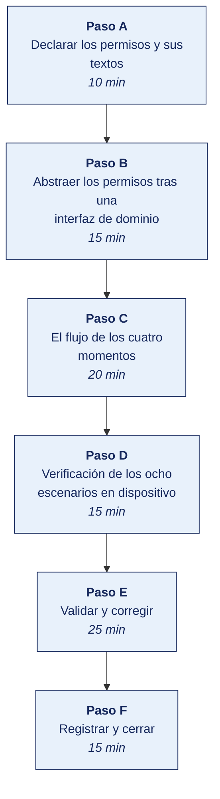

[Semana 08](README.md) · [Teoría](1-TEORIA.md) · [Dinámica de aula](2-DINAMICA.md) · **Taller de laboratorio**

# Taller de laboratorio 08 · Flujo completo de permisos con degradación elegante

**SI-988 · Soluciones Móviles II** · Semana 08 · Sesión 2 en laboratorio · 100 min · calificación **procedimental**

> ¿Un término no le resulta claro? Está definido en el [glosario técnico del curso](../GLOSARIO.md).

---

## Secuencia del taller



## Qué entregas

| | |
|---|---|
| **Archivo** | `SI988-S08-TALLER-Grupo<N>.pdf` |
| **Plantilla obligatoria** | [SI988-PLANTILLA-TALLER.docx](../PLANTILLAS/SI988-PLANTILLA-TALLER.docx) |
| **Formato** | PDF exportado desde la plantilla en Word, con la carátula de la UPT, el índice actualizado y las capturas numeradas |
| **Qué va dentro** | Las secciones de la plantilla. La **5. Resultados y evidencias** se califica contra la tabla de resultados esperados de esta guía, y **cada resultado necesita la evidencia que lo demuestre**. No se copian de aquí los objetivos, la duración ni los resultados de aprendizaje |
| **Dónde se sube** | Aula virtual, tarea «Taller · Semana 08» |
| **Cuándo vence** | 48 horas después de la sesión de laboratorio |

> No se califica un informe entregado en `.docx`, sin carátula, sin los códigos de los integrantes o con resultados declarados sin evidencia.

---

**La sesión de laboratorio dura 100 minutos.** El avance de Sprint 2 lo ejecuta el equipo fuera de la sesión.

## El reto

| | |
|---|---|
| **Situación** | La app pide todos los permisos al abrirse y el usuario dice que no. A partir de ahí, o la app funciona degradada o no funciona. |
| **Misión** | Construir el flujo de los cuatro momentos, con explicación previa, degradación con alternativa concreta y una sola insistencia tras la denegación. |
| **Criterio de éxito** | Ningún permiso se solicita al abrir la app, y cada denegación ofrece una alternativa que permite seguir usándola. |

## 1. Información sobre el evento práctico

### 1.1. Título del evento práctico

Implementación del flujo profesional de solicitud de permisos con explicación previa contextual, manejo de todos los estados posibles, degradación funcional ante la denegación y verificación de los ocho escenarios, cinco en el emulador del laboratorio y tres en un teléfono real fuera de la sesión.

### 1.2. Objetivos

- Declarar los permisos en la configuración de ambas plataformas, con **textos de propósito específicos**.
- Abstraer la gestión de permisos tras una **interfaz de dominio** probable con dobles.
- Implementar la **explicación previa contextual** antes del diálogo del sistema.
- Manejar **los cinco estados** — no solicitado, concedido, denegado, denegado permanentemente y revocado durante el uso.
- Manejar la **ubicación aproximada concedida** cuando se pidió la precisa.
- Implementar la **degradación funcional** de cada permiso.
- Solicitar el **permiso de segundo plano** en una interacción separada, si aplica.
- Verificar en el emulador los **cinco escenarios que reproduce**, y dejar planificados los tres restantes para la verificación en teléfono real fuera de la sesión.

### 1.3. Tiempo de duración

**100 minutos.**

### 1.4. Resultados de Aprendizaje (RA)

- **RA1** Desarrolla la geolocalización en una app móvil.
- **RA2** Implementa y gestiona los permisos de geolocalización en una app móvil.

### 1.5. Recursos

| Recurso | Detalle |
|---|---|
| **Android — Permissions overview** | https://developer.android.com/guide/topics/permissions/overview |
| **Android — Request location permissions** | https://developer.android.com/develop/sensors-and-location/location/permissions |
| **Apple — Requesting authorization to use location services** | https://developer.apple.com/documentation/corelocation/requesting-authorization-to-use-location-services |
| **Apple — Protecting the user's privacy** | https://developer.apple.com/documentation/uikit/protecting-the-user-s-privacy |
| **Google Play — Location permissions policy** | https://support.google.com/googleplay/android-developer/answer/9799150 |
| Emulador de Android | Entorno del laboratorio. Reproduce cinco de los ocho escenarios de permiso |
| Biblioteca de permisos del stack | permission_handler · react-native-permissions · Accompanist Permissions |

### 1.6. Seguridad

> **Dónde se trabaja.** El taller se hace en el **laboratorio de la universidad, sobre el emulador**. Cuando un escenario no se reproduce fielmente en el emulador, la verificación en un teléfono real la hace el equipo **fuera de la sesión** y adjunta el video como anexo. Ningún resultado del taller depende de tener un teléfono en clase.

1. **Principio del privilegio mínimo.** Se declara únicamente el permiso indispensable. Un permiso declarado y no usado es un hallazgo en la revisión de la tienda y una alerta para el usuario.
2. Si basta la **ubicación aproximada**, no se solicita la precisa. Si basta el **selector de imágenes**, no se solicita acceso a la galería.
3. **El permiso de segundo plano se solicita solo si existe un caso de uso demostrable** y se declara en la ficha de la tienda. Es el que más rechazos produce en revisión.
4. Los textos de propósito de iOS son **públicos**. El usuario los ve. Deben ser veraces; una discrepancia entre lo declarado y lo que la app hace es causa de retiro.
5. La denegación **no se registra con identificadores del usuario**. Es un dato de comportamiento.

---

## 2. Procedimiento o Metodología

### Paso A — Declarar los permisos y sus textos

**Android** — en el manifiesto:

```xml
<!-- Ubicación: se declaran los dos niveles; el usuario puede conceder solo el aproximado -->
<uses-permission android:name="android.permission.ACCESS_COARSE_LOCATION" />
<uses-permission android:name="android.permission.ACCESS_FINE_LOCATION" />

<!-- Segundo plano: SOLO si hay caso de uso demostrable.
     Se solicita en una interacción SEPARADA, después del de primer plano. -->
<!-- <uses-permission android:name="android.permission.ACCESS_BACKGROUND_LOCATION" /> -->

<!-- Cámara: si se usa. Se declara opcional para no excluir dispositivos sin cámara -->
<uses-permission android:name="android.permission.CAMERA" />
<uses-feature android:name="android.hardware.camera" android:required="false" />

<!-- Notificaciones: requiere permiso en tiempo de ejecución en las versiones recientes -->
<uses-permission android:name="android.permission.POST_NOTIFICATIONS" />
```

**iOS** — textos de propósito. **Específicos, veraces y en español.**

| Clave | Texto — **así se redacta** | Así **no** |
|---|---|---|
| Uso de ubicación mientras se usa la app | «Usamos tu ubicación para mostrarte los puntos de entrega más cercanos y calcular el tiempo de llegada. No la guardamos ni la compartimos con terceros.» | «Esta app necesita tu ubicación.» |
| Uso de ubicación siempre | «Usamos tu ubicación en segundo plano solo para avisarte cuando tu pedido esté por llegar. Puedes desactivarlo en cualquier momento desde Ajustes.» | «Para mejorar tu experiencia.» |
| Uso de la cámara | «Usamos la cámara para que tomes la foto del comprobante de entrega. La imagen se envía solo a tu cuenta.» | «Acceso a la cámara.» |

> **Los textos genéricos son causa de rechazo en revisión.** El revisor evalúa si el texto explica realmente el uso.

### Paso B — Abstraer los permisos tras una interfaz de dominio

```
// --- DOMINIO ---
enum class Permiso { UBICACION_APROXIMADA, UBICACION_PRECISA, UBICACION_SEGUNDO_PLANO,
                     CAMARA, NOTIFICACIONES }

enum class EstadoPermiso {
  NO_SOLICITADO,
  CONCEDIDO,
  CONCEDIDO_PARCIAL,        // ← Android: se pidió precisa y se concedió aproximada
  DENEGADO,                 // se puede volver a pedir
  DENEGADO_PERMANENTE,      // solo desde ajustes
  NO_DISPONIBLE,            // el dispositivo no tiene la capacidad
}

interface GestorPermisos {
  suspend fun estado(p: Permiso): EstadoPermiso
  suspend fun solicitar(p: Permiso): EstadoPermiso
  suspend fun debeExplicar(p: Permiso): Boolean     // el sistema sugiere explicar
  fun abrirAjustes()
}
```

> Igual que con la ubicación — el ViewModel depende de la interfaz, y **se prueba con un doble que simula cada estado**, sin dispositivo.

### Paso C — El flujo de los cuatro momentos

```
// El flujo COMPLETO, invocado desde la ACCIÓN del usuario, no desde el arranque
suspend fun flujoDeUbicacion(accion: () -> Unit) {

  when (val estado = permisos.estado(UBICACION_PRECISA)) {

    // ── Ya concedido: se verifica SIEMPRE, pudo revocarse desde ajustes ──
    CONCEDIDO -> accion()

    // ── Android: se concedió solo la aproximada ──
    CONCEDIDO_PARCIAL -> {
      // LA APP DEBE FUNCIONAR CON LO QUE RECIBIÓ
      mostrarAviso("Estás usando ubicación aproximada. Los resultados serán menos exactos.",
                   accion = "Mejorar precisión" to { permisos.abrirAjustes() })
      accion()                                        // ← se continúa igualmente
    }

    // ── Primera vez ──
    NO_SOLICITADO -> {
      // ② EXPLICACIÓN PREVIA — pantalla propia, no el diálogo del sistema
      val continuar = mostrarExplicacionPrevia(
        titulo  = "Encuentra lo que está cerca de ti",
        cuerpo  = "Con tu ubicación te mostramos los puntos de entrega más cercanos y "
                + "calculamos cuánto demora llegar. No guardamos tu ubicación ni la "
                + "compartimos con terceros.",
        imagen  = ilustracionMapa,
        primario   = "Continuar",
        secundario = "Ahora no",
      )
      if (!continuar) { modoSeleccionManual(); return }   // ← el usuario NO queda bloqueado

      // ③ SOLICITUD DEL SISTEMA
      when (permisos.solicitar(UBICACION_PRECISA)) {
        CONCEDIDO, CONCEDIDO_PARCIAL -> accion()
        else                          -> modoSeleccionManual()
      }
    }

    // ── Denegado antes: se puede volver a pedir, UNA sola vez y con más contexto ──
    DENEGADO -> {
      if (permisos.debeExplicar(UBICACION_PRECISA) && !yaSeInsistio) {
        val reintentar = mostrarExplicacionPrevia(
          titulo = "Sin tu ubicación tendrás que escribir tu dirección cada vez",
          cuerpo = "Si prefieres, puedes seguir eligiendo tu dirección manualmente.",
          primario = "Permitir ubicación", secundario = "Seguir manualmente",
        )
        yaSeInsistio = true
        if (reintentar && permisos.solicitar(UBICACION_PRECISA) in setOf(CONCEDIDO, CONCEDIDO_PARCIAL)) {
          accion(); return
        }
      }
      modoSeleccionManual()
    }

    // ── Denegado permanentemente: el sistema ya no muestra el diálogo ──
    DENEGADO_PERMANENTE -> {
      mostrarDialogo(
        titulo = "La ubicación está desactivada para esta app",
        cuerpo = "Puedes activarla en Ajustes, o seguir eligiendo tu dirección en el mapa.",
        primario   = "Ir a Ajustes"     to { permisos.abrirAjustes() },
        secundario = "Elegir en el mapa" to { modoSeleccionManual() },
      )
    }

    NO_DISPONIBLE -> modoSeleccionManual()
  }
}
```

**El permiso de segundo plano** —interacción separada, solo si aplica:

```
// NUNCA junto con el de primer plano. Se pide DESPUÉS, y solo cuando el usuario
// activa la funcionalidad que lo requiere.
suspend fun activarAvisosDeLlegada() {
  if (permisos.estado(UBICACION_PRECISA) != CONCEDIDO) { pedirPrimerPlanoPrimero(); return }

  val continuar = mostrarExplicacionPrevia(
    titulo = "Avísame cuando mi pedido esté cerca",
    cuerpo = "Para avisarte necesitamos consultar tu ubicación aunque la app esté cerrada. "
           + "Solo la usamos para este aviso y puedes desactivarlo cuando quieras.",
    primario = "Permitir siempre", secundario = "No, gracias",
  )
  if (!continuar) return                     // la funcionalidad simplemente no se activa

  if (permisos.solicitar(UBICACION_SEGUNDO_PLANO) != CONCEDIDO) {
    mostrarAviso("Los avisos de llegada requieren permiso permanente. "
               + "Puedes activarlo luego desde Ajustes.")
  }
}
```

### Paso D — Verificación de los ocho escenarios en dispositivo

**Protocolo de prueba**, grabado. Los escenarios 1, 2, 3, 7 y 8 se verifican en el emulador durante la sesión; los escenarios 4, 5 y 6 se verifican en un teléfono real fuera de la sesión:

| # | Escenario | Cómo se reproduce | Resultado esperado |
|---|---|---|---|
| 1 | Primera solicitud, concedido | Instalación limpia → acción | Explicación previa → diálogo → funciona |
| 2 | Primera solicitud, denegado | Instalación limpia → denegar | Modo manual disponible; sin bloqueo |
| 3 | Segunda solicitud tras denegar | Repetir la acción | Explicación reforzada, **una sola vez** |
| 4 | **Denegado permanentemente** | Denegar dos veces (Android) / desde ajustes (iOS) | Diálogo con «Ir a Ajustes» **y** alternativa manual |
| 5 | **Concedido solo aproximado** | Android: elegir «Aproximada» | La app **funciona** con aviso de menor precisión |
| 6 | **Revocado durante el uso** | Con la app abierta, revocar desde ajustes y volver | Se detecta al volver; se ofrece el flujo de nuevo |
| 7 | Segundo plano denegado | Activar avisos y denegar | Se explica; el resto de la app sigue funcionando |
| 8 | Servicio de ubicación del sistema apagado | Apagar la ubicación del dispositivo | Se distingue de la falta de permiso; se lleva al ajuste correcto |

> **Los escenarios 4, 5 y 6 son los que el emulador no reproduce fielmente y los que más fallan en producción.** Por eso la verificación en teléfono real, fuera de la sesión, es obligatoria y se entrega en video. La verificación en dispositivo físico es obligatoria.

**Pruebas automatizadas del ViewModel** con el doble del gestor:

```
test('ofrece modo manual cuando el permiso está denegado permanentemente') {
  val permisos = GestorPermisosFalso(estado = DENEGADO_PERMANENTE)
  val vm = UbicacionViewModel(permisos, servicioUbicacion)
  vm.solicitarUbicacion()
  assert(vm.estado is ModoManualDisponible)
  assert(vm.estado.ofreceAjustes)
}

test('continúa funcionando con permiso parcial') {
  val permisos = GestorPermisosFalso(estado = CONCEDIDO_PARCIAL)
  val vm = UbicacionViewModel(permisos, servicioUbicacion)
  vm.solicitarUbicacion()
  assert(vm.estado is Cargando || vm.estado is Exito)   // NO bloquea
  assert(vm.avisos.any { it.contiene("aproximada") })
}

test('no insiste más de una vez tras la denegación') {
  val permisos = GestorPermisosFalso(estado = DENEGADO)
  val vm = UbicacionViewModel(permisos, servicioUbicacion)
  vm.solicitarUbicacion(); vm.solicitarUbicacion(); vm.solicitarUbicacion()
  assert(permisos.vecesSolicitado <= 2)                 // original + un reintento
}
```

### Trabajo del equipo fuera de la sesión — Sprint 2

> Lo que no alcance a completarse en la sesión lo ejecuta el equipo durante la semana, y llega al siguiente taller con el incremento listo. El docente lo revisa en el repositorio y en el tablero, no en clase.

Desarrollo de las historias del Sprint 2. Se sostiene la Daily y se verifica el cumplimiento de la **acción de mejora** comprometida en la retrospectiva del Sprint 1.

---

### Paso E — Validar y corregir (25 min)

El resultado no vale por estar hecho, sino por resistir una comprobación. Se ejecutan estas tres y **se corrige lo que falle antes de cerrar la sesión**.

1. Abrir la app recién instalada y comprobar que **no** solicita ningún permiso antes de que el usuario intente la acción que lo requiere.
2. Verificar que la app funciona con **ubicación aproximada** cuando es lo único concedido, sin bloquearse.
3. Comprobar que se distingue el permiso denegado del servicio del sistema apagado, porque el mensaje al usuario es distinto.

> Lo que no se pueda corregir hoy se anota en la sección **Problemas y mejoras** de la evidencia, con lo que faltó y por qué. Un resultado parcial documentado con honestidad vale más que uno declarado sin prueba.

### Paso F — Registrar la evidencia y cerrar (15 min)

Se versiona lo producido, se anota la URL de cada resultado y se responde en dos frases la pregunta de transferencia — **qué riesgo correría una organización real si esto se hiciera mal**.

---

## 3. Resultados

> **Evidencia obligatoria en GitHub.** Todo resultado de este taller se versiona en el repositorio del equipo. El informe **no consigna capturas sueltas**. Consigna la **URL** del artefacto en GitHub. Una captura no permite verificar autoría, fecha ni contenido; un enlace sí.
>
> | Qué se entrega | Dónde vive | Qué se escribe en el informe |
> |---|---|---|
> | Código y archivos de configuración | Rama del taller, fusionada a `develop` vía Pull Request | URL del Pull Request |
> | Documentos y matrices | `docs/`, en formato de texto versionable | URL del archivo en la rama |
> | Capturas y videos que el taller exija | `docs/evidencias/S08/` | URL del archivo |
> | Salida de comandos | `docs/evidencias/S08/salidas/*.txt` | URL del archivo |
>
> **Etiqueta del taller.** Al cerrar el taller se crea la etiqueta `taller-08` sobre el commit entregado:
>
> ```bash
> git tag -a taller-08 -m "Taller 08 · SI988"
> git push origin taller-08
> ```
>
> La URL que se consigna en el informe apunta a esa etiqueta:
> `https://github.com/<organizacion>/<repositorio>/tree/taller-08`
>
> **El informe es lo que se califica; el repositorio es lo que lo prueba.** Cada resultado de la sección 3 del informe lleva la URL con la que se verifica, y **un resultado sin su URL se califica como no logrado**, por bien redactado que esté. Lo que no se puede abrir no se puede dar por hecho.

### 3.1. Los tres resultados que se califican

Son los que la rúbrica evalúa. El resto de la lista tiene que existir, pero no se califica fila por fila.

| Resultado | Qué demuestra | Dónde está |
|---|---|---|
| **El flujo de los cuatro momentos** | Explicación previa con texto propio antes del diálogo del sistema | Demostración |
| **La degradación elegante** | Alternativa concreta en cada denegación, y funcionamiento con permiso parcial | Escenarios 2, 4, 5 y 7 |
| **Los ocho escenarios verificados** | Cinco en el emulador durante la sesión, tres en teléfono real | Video |

### 3.2. Lista de comprobación del taller

Todo esto debe existir al cerrar la sesión.

| # | Resultado esperado | Verificación |
|---|---|---|
| 1 | Permisos declarados en ambas plataformas, **solo los indispensables** | Manifiesto y configuración |
| 2 | **Textos de propósito específicos y veraces** en iOS, en español | Configuración |
| 3 | `GestorPermisos` como interfaz de dominio, probable con dobles | Código |
| 4 | **Los cinco estados** manejados, incluido el parcial | Código |
| 5 | **Explicación previa** antes del diálogo del sistema, con texto propio | Demostración |
| 6 | **Ningún permiso solicitado al abrir la app** | Revisión del flujo |
| 7 | **La app funciona con ubicación aproximada** cuando es lo concedido | Escenario 5 |
| 8 | Degradación con **alternativa concreta** en cada denegación | Escenarios 2, 4, 7 |
| 9 | **Insistencia limitada a una sola vez** tras la denegación | Prueba en verde |
| 10 | Permiso de segundo plano en **interacción separada**, o descartado con fundamento | Código o ADR (*Architecture Decision Record*, registro de decisión de arquitectura) |
| 11 | Se distingue **permiso denegado** de **servicio del sistema apagado** | Escenario 8 |
| 12 | **Cinco escenarios verificados en el emulador** durante la sesión, y los tres restantes en un teléfono real fuera de ella | Video |
| 13 | Tres pruebas del ViewModel con dobles, en verde | CI |
| 14 | Acción de mejora del Sprint 1 en ejecución | Tablero |

## Rúbrica procedimental (20 puntos)

Se aplica sobre el informe entregado y la evidencia enlazada en el repositorio. **Cada criterio se califica de forma independiente.**

| Criterio | 4 — Logrado | 2 — En proceso | 0 — Insuficiente |
|---|---|---|---|
| **Abstraer los permisos tras una interfaz de dominio** | Completo y correcto, con la evidencia que lo respalda | Completo con errores menores, o correcto pero sin toda la evidencia | Incompleto, o entregado sin ejecutar |
| **El flujo de los cuatro momentos** | Completo y correcto, con la evidencia que lo respalda | Completo con errores menores, o correcto pero sin toda la evidencia | Incompleto, o entregado sin ejecutar |
| **Evidencia verificable en el repositorio** | Cada resultado tiene su URL sobre la etiqueta `taller-NN`, y el enlace abre lo que dice | La mayoría tiene URL; alguna evidencia es una captura suelta | Se declaran resultados sin enlace, o el enlace no corresponde |
| **Rigor técnico de la implementación** | El código compila, las pruebas pasan y el análisis estático sale limpio | Compila y funciona, con avisos del análisis sin resolver | No compila, o se entregó sin ejecutar |
| **La evidencia entregada** | Las secciones de la plantilla completas; los resultados se sustentan con la evidencia enlazada | Secciones completas con sustento parcial | Faltan secciones o los resultados se afirman sin evidencia |

| Puntaje | Equivalencia |
|---|---|
| 18 – 20 | Destacado |
| 14 – 17 | Logrado |
| 6 – 13 | En proceso |
| 0 – 5 | Insuficiente |

> **Un resultado declarado sin evidencia enlazada no se califica**, aunque el trabajo se haya hecho. La tabla de la sección 3.1 es la lista de cotejo; esta rúbrica es lo que determina la nota.

## 4. Conclusiones

Mínimo tres. Líneas argumentales esperadas:

1. La primera solicitud de un permiso es prácticamente la única oportunidad. Tras la denegación el sistema deja de mostrar el diálogo, y por eso la explicación previa contextual no es cortesía sino diseño.
2. Una app que se bloquea cuando el usuario deniega un permiso pierde a ese usuario por completo; la degradación con alternativa concreta conserva la funcionalidad y el usuario puede reconsiderar más adelante.
3. Los estados de denegación permanente, concesión parcial y revocación durante el uso no se reproducen fielmente en el emulador, y son precisamente los que fallan en producción. La verificación en dispositivo físico es la única que da garantía.

## 5. Referencias Bibliográficas

- Google. *Permissions on Android*. https://developer.android.com/guide/topics/permissions/overview
- Google. *Request location permissions*. https://developer.android.com/develop/sensors-and-location/location/permissions
- Google. *Request runtime permissions*. https://developer.android.com/training/permissions/requesting
- Google Play. *Location permissions policy*. https://support.google.com/googleplay/android-developer/answer/9799150
- Apple. *Protecting the user's privacy*. https://developer.apple.com/documentation/uikit/protecting-the-user-s-privacy
- Apple. *Requesting authorization to usa location services*. https://developer.apple.com/documentation/corelocation/requesting-authorization-to-usa-location-services
- Apple. *App Store Review Guidelines* — sección de privacidad. https://developer.apple.com/app-store/review/guidelines/
- OWASP (*Open Worldwide Application Security Project*) Foundation. *MASVS-PLATFORM* — interacción con la plataforma. https://mas.owasp.org/MASVS/
- Ley 29733 y D. S. 016-2024-JUS — consentimiento y finalidad del tratamiento. https://www.gob.pe/institucion/anpd
- Nolasco Valenzuela, J. S. (2019). *Desarrollo de aplicaciones con Android*. Ra-Ma.

## 6. Anexos

- `anexo_A_textos_permisos.pdf` — todos los textos redactados
- `anexo_B_flujo_permisos.png` — diagrama de los cuatro momentos
- `anexo_C_ocho_escenarios.mp4` — cinco escenarios en el emulador y tres en teléfono real
- `anexo_D_pruebas_permisos.png` — CI en verde
- `anexo_E_matriz_degradacion.pdf`

---

---

[Semana 08](README.md) · [Teoría](1-TEORIA.md) · [Dinámica de aula](2-DINAMICA.md) · **Taller de laboratorio**

---

**Docente** · Dr. Oscar Juan Jimenez Flores
[oscarjimenezflores@upt.pe](mailto:oscarjimenezflores@upt.pe) · [LinkedIn](https://www.linkedin.com/in/oscar-jimenez-flores/) · [CTI Vitae — CONCYTEC](https://ctivitae.concytec.gob.pe/appDirectorioCTI/VerDatosInvestigador.do?id_investigador=33398)

Escuela Profesional de Ingeniería de Sistemas · Universidad Privada de Tacna · Tacna, Perú
